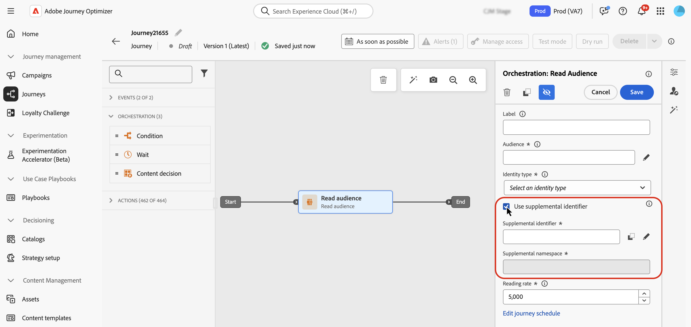

# Använd tilläggsidentifierare under resor {#supplemental-id}

>[!CONTEXTUALHELP]
>id="ajo_journey_parameters_supplemental_identifier"
>title="Använd extra identifierare"
>abstract="Den kompletterande identifieraren är en sekundär identifierare som ger ytterligare kontext för körningen av en resa. Om du vill definiera det markerar du det fält som ska användas som tilläggsidentifierare och väljer ett namnutrymme som ska associeras med det."

<table style="border-collapse: collapse; width: 100%;">
  <tr>
    <td style="vertical-align: top; padding-right: 20px; border: none;">
      <p>Som standard utförs resor i kontexten för ett <b>profil-ID</b>. Detta innebär att så länge profilen är aktiv under en viss resa kan den inte återkomma till en annan resa. För att förhindra detta kan du med Journey Optimizer hämta en ytterligare <b>identifierare</b>, t.ex. ett order-ID, prenumerations-ID eller förskrivnings-ID, utöver profil-ID:t.  
      <p>I det här exemplet har vi lagt till ett <b>boknings-ID</b> som en extra identifierare.</p>
      <p>På så sätt utförs resor i samband med det profil-ID som är kopplat till den kompletterande identifieraren (här boknings-ID). En instans av resan utförs för varje iteration av den kompletterande identifieraren. Detta tillåter flera inmatningar av samma profil-ID på resorna om de har gjort olika bokningar.</p>
      <p>Dessutom kan du med Journey Optimizer använda attribut för den kompletterande identifieraren (t.ex. bokningsnummer, förnyelsedatum för förskrivning, produkttyp) för att anpassa meddelanden, vilket säkerställer mycket relevant kommunikation.</p>
    </td>
    <td style="vertical-align: top; border: none; text-align: center; width: 40%;">
      
    </td>
  </tr>
</table>

➡️ [Upptäck den här funktionen i en video](#video)

## Skyddsritningar och begränsningar {#guardrails}

* **Resor som stöds**: Ytterligare identifierare stöds för **händelseutlösta**- och **läsmålgruppsresor**. De stöds **inte** för Audience-kvalificeringsresor (d.v.s. resor som börjar med en Audience-kvalificeringsaktivitet).

* **Gränser för samtidiga instanser**: Profiler kan inte ha fler än 10 instanser för samtidiga resor.

* **Frekvensregler**: Varje reseinstans som skapas från extra användaridentifierare räknas in i frekvensbegränsning, även om användningen av tilläggsidentifierare resulterar i flera resinstanser.

* **Datatyp och schemastruktur**: Den extra identifieraren måste vara av typen `string`. Det kan vara ett oberoende strängattribut eller ett strängattribut inom en objektmatris. Det oberoende strängattributet resulterar i en enda reseinstans, medan strängattributet inom en objektmatris resulterar i en unik reseinstans per iteration av objektarrayen. Strängmatriser och kartor stöds inte.

* **Reseåterinträde**

  Beteendet vid återinträde på resa med kompletterande identifierare följer den befintliga återinträdesprincipen:

   * Om resan inte är en återkommande person kan inte kombinationen av profil-ID och kompletterande ID returnera resan.
   * Om resan är återkommande i ett tidsfönster kan samma profil-ID + kombination av extra ID:n anges igen efter det definierade tidsfönstret.

* **Etikett och tvång för dataanvändning (DULE)** - Inga DULE-valideringskontroller utförs för det extra ID:t. Detta innebär att detta attribut inte kommer att beaktas när resan söker efter brott mot policyn för datastyrning.

* **Konfiguration av underordnade händelser**

  Om du använder en annan händelse längre fram i kedjan måste den använda samma extra ID och ha samma ID-namnutrymme.

* **Läs målgruppsresor**

   * Kompletterande ID är inaktiverat om du använder en affärshändelse.
   * Kompletterande ID måste vara ett fält från profilen (dvs. inte ett händelse-/kontextfält).
   * För läsmålgruppsresor som använder extra ID:n är läsfrekvensen för läsmålgruppsaktiviteten för varje reseinstans begränsad till högst 500 profiler per sekund.
   * Endast målgrupper med Enhetlig profiltjänst stöds när de använder läs målgruppsresor med extra ID:n.

## Avsluta kriteriebeteende med extra ID:n {#exit-criteria}

Förhandsvillkor: Resan har aktiverats för extra ID (via aktiviteter för enhetshändelser eller läsning)

Tabellen nedan förklarar hur profiler beter sig i en resa med ytterligare ID när avslutningskriterier är konfigurerade:

| Konfiguration av avslutsvillkor | Beteende när avslutningskriterierna är uppfyllda |
| ---------------------------- | ---------------------------------- |
| Baserat på en händelse för icke-kompletterande ID | Alla instanser av motsvarande profil i den resan avslutas. |
| Baserat på en extra ID-händelse <br/>*Obs! Namnområdet för det extra ID:t måste matcha den ursprungliga nodens.* | Endast den matchande profilen + den kompletterande ID-instansen avslutas. |
| Baserat på en publik | Alla instanser av motsvarande profil i den resan avslutas. |

## Lägg till en extra identifierare och utnyttja den i en resa {#add}

>[!BEGINTABS]

>[!TAB Händelseutlöst resa]

Följ de här stegen om du vill använda en extra identifierare i en händelseutlöst resa:

1. **Markera attributet som en identifierare i händelseschemat**

   1. Gå till händelseschemat och leta reda på attributet som du vill använda som en extra identifierare (t.ex. boknings-ID, prenumerations-ID) och markera det som ett ID. [Lär dig arbeta med scheman](../data/get-started-schemas.md)

   1. Markera identifieraren som **[!UICONTROL Identity]**.

      

      >[!IMPORTANT]
      >
      >Se till att du inte markerar attributet som **Primär identitet**.

   1. Markera det namnutrymme som ska associeras med det extra ID:t. Detta måste vara ett namnutrymme för icke-personidentifierare.

      När du har tillämpat identitetsnamnutrymmet på ett schema måste du skapa en ny händelse för att kunna använda den extra identifieraren. Befintliga enheter kan inte uppdateras för att identifiera den nya identifieraren.

1. **Lägg till det extra ID:t i händelsen**

   1. Skapa eller redigera den önskade händelsen. [Lär dig hur du konfigurerar en enhetshändelse](../event/about-creating.md)

   1. Markera alternativet **[!UICONTROL Use supplemental identifier]** på skärmen för händelsekonfiguration.

      

   1. Använd uttrycksredigeraren för att välja det attribut du markerade som tilläggs-ID.

      >[!NOTE]
      >
      >Kontrollera att du använder uttrycksredigeraren i **[!UICONTROL Advanced mode]** för att välja attributet.

   1. När du har valt det extra ID:t visas det tillhörande namnutrymmet i händelsekonfigurationsskärmen som skrivskyddat.

1. **Lägg till aktiviteten på resan**

   Dra den konfigurerade händelsen till arbetsytan för resan. Det kommer att utlösa resepost baserat på både profil-ID och det kompletterande ID:t.

   

>[!TAB Läs målgruppsresan]

Följ de här stegen för att använda en extra identifierare i en läsande målgruppsresa:

1. **Markera attributet som en identifierare i union-/profilschemat**

   1. Gå till union-/profilschemat och leta reda på attributet som du vill använda som en extra identifierare (t.ex. boknings-ID, prenumerations-ID) och markera det som ett ID. [Lär dig arbeta med scheman](../data/get-started-schemas.md)

   1. Markera identifieraren som **[!UICONTROL Identity]**.

      

      >[!IMPORTANT]
      >
      >Se till att du inte markerar attributet som **Primär identitet**.

   1. Markera det namnutrymme som ska associeras med det extra ID:t. Detta måste vara ett namnutrymme för icke-personidentifierare.

      När du har tillämpat identitetsnamnutrymmet på ett schema måste du skapa en ny fältgrupp för att kunna använda den extra identifieraren. Befintliga enheter kan inte uppdateras för att identifiera den nya identifieraren.

<!--1. **Add the supplemental ID field to the data source**

    1. Navigate to the **[!UICONTROL Configuration]** / **[!UICONTROL Data Sources]** menu, then locate the "ExperiencePlatformDataSource" data source.

        

    1. Open the field selector then select the attribute you want to use as a supplemental identifier (e.g., booking ID, subscription ID).-->

1. **Lägg till och konfigurera aktiviteten Läs målgrupp under resan**

   1. Dra en **[!UICONTROL Read audience]**-aktivitet på din resa.

   1. Aktivera alternativet **[!UICONTROL Use supplemental identifier]** i rutan för aktivitetsegenskaper.

      

   1. I fältet **[!UICONTROL Supplement identifier]** använder du uttrycksredigeraren för att välja det attribut du markerade som tilläggs-ID.

      >[!NOTE]
      >
      >Kontrollera att du använder uttrycksredigeraren i **[!UICONTROL Advanced mode]** för att välja attributet.

   1. När du har valt det extra ID:t visas det associerade namnutrymmet i fältet **[!UICONTROL Supplemental namespace]** som skrivskyddat.

>[!ENDTABS]

## Utnyttja ytterligare ID-attribut

Använd uttrycksredigeraren och personaliseringsredigeraren för att referera till attribut för den kompletterande identifieraren för personalisering eller villkorslogik. Attribut är tillgängliga på menyn **[!UICONTROL Contextual attributes]**.


För händelseutlösta resor om du arbetar med matriser (t.ex. flera recept eller policyer) använder du en formel för att extrahera specifika element.

+++ Se exempel

I en objektmatris med det kompletterande ID:t `bookingNum` och ett attribut på samma nivå med namnet `bookingCountry`, itererar resan genom arrayobjektet baserat på bookNum och skapar en reseinstans för varje objekt.

* Följande uttryck i villkorsaktiviteten itererar genom objektarrayen och kontrollerar om värdet för `bookingCountry` är lika med &quot;FR&quot;:

  ```
  @event{<event_name>.<object_path>.<object_array_name>.all(currentEventField.<attribute_path>.bookingNum==${supplementalId}).at(0).<attribute_path>.bookingCountry}=="FR"
  ```

* Följande uttryck i redigeraren för e-postpersonalisering itererar igenom objektarrayen, drar ut den `bookingCountry` som gäller för den aktuella reseinstansen och visar den i innehållet:

  ```
  {{#each context.journey.events.<event_ID>.<object_path>.<object_array_name> as |l|}} 
  
   {{l.<attribute_path>.bookingCountry}}  
  
  {{/each}}
  ```

* Exempel på händelsen som används för att utlösa resan:

  ```
  "bookingList": [
        {
            "bookingInfo": {
                "bookingNum": "x1",
                      "bookingCountry": "US"
            }
        },
        {
            "bookingInfo": {
                "bookingNum": "x2",
                "bookingCountry": "FR"
            }
        }
    ]
  ```

+++

## Exempel på användningsområden

### **Meddelanden om förnyelse av princip**

* **Scenario**: En försäkringsleverantör skickar förnyelsepåminnelser för varje aktiv policy som innehas av en kund.
* **Körning**:
   * Profil:&quot;John&quot;.
   * Ytterligare ID: `"AutoPolicy123", "HomePolicy456"`.
   * Resan körs separat för varje policy, med personaliserade förnyelsedatum, disponeringsinformation och premiuminformation.

### **Prenumerationshantering**

* **Scenario**: En prenumerationstjänst skickar anpassade meddelanden för varje prenumeration när en händelse aktiveras för den prenumerationen.
* **Körning**:
   * Profil: Jane.
   * Ytterligare ID: `"Luma Yoga Program ", "Luma Fitness Program"`.
   * Varje händelse innehåller ett prenumerations-ID och information om den prenumerationen. Resan körs separat för varje händelse/prenumeration, vilket ger personliga förnyelseerbjudanden per prenumeration.

### **Produktrekommendationer**

* **Scenario**: En e-handelsplattform skickar rekommendationer baserade på specifika produkter som köpts av en kund.
* **Körning**:
   * Profil:&quot;Alex&quot;.
   * Ytterligare ID: `"productID1234", "productID5678"`.
   * Resan körs separat för varje produkt, med skräddarsydda merförsäljningsmöjligheter.

## Instruktionsvideo {#video}

Lär dig hur du aktiverar och använder en extra identifierare i [!DNL Adobe Journey Optimizer].

>[!VIDEO](https://video.tv.adobe.com/v/3464796?captions=swe&quality=12)
