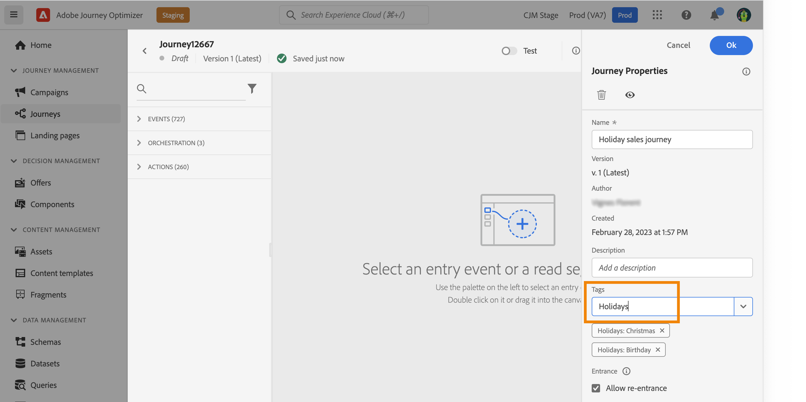

# Hantera taggar under resor {#journey_tags}

Som Journey Optimizer-läkare kan du ordna dina resor med hjälp av taggar. Taggar är ett snabbt och enkelt sätt att klassificera objekt för att förbättra sökningen.

## Lägga till taggar till en resa

I fältet **Taggar** i resans egenskaper kan du definiera taggar för din resa. Du kan antingen markera en befintlig tagg eller skapa en ny. Börja skriva namnet på den önskade taggen och markera den i listan. Om den inte är tillgänglig klickar du på **Skapa** för att skapa en ny och lägga till den på din resa. Du kan definiera så många taggar som behövs.

Listan med definierade taggar visas under fältet **Taggar**.

>[!NOTE]
>
> Taggar är skiftlägeskänsliga
> 
> Om du duplicerar eller skapar en ny version av en resa bevaras taggarna.

## Filtrera på taggar

I reselistan visas en dedikerad kolumn så att du enkelt kan se dina taggar.

Ett filter är också tillgängligt för att endast visa resor med vissa taggar.

Du kan lägga till eller ta bort taggar från alla typer av resor (live, draft, etc.). Klicka på ikonen **Fler åtgärder** bredvid resan och välj **Redigera taggar**.

## Hantera taggar

Administratörer kan ta bort taggar och ordna dem efter kategorier med hjälp av menyn **Taggar** under **ADMINISTRATION**. Läs den här [dokumentationen](https://experienceleague.adobe.com/docs/experience-platform/administrative-tags/overview.html?lang=sv-SE).

>[!NOTE]
>
> Taggar som definieras i resor läggs till i den inbyggda kategorin&quot;Ej kategoriserad&quot;.
