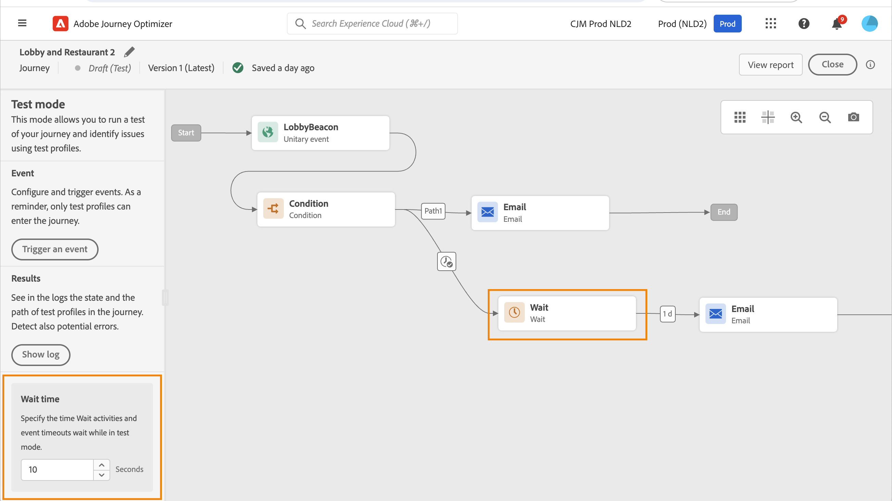

# Testa din resa{#testing_the_journey}

>[!CONTEXTUALHELP]
>id="ajo_journey_test"
>title="Testa din resa"
>abstract="Använd testprofiler för att testa resan innan du publicerar den. På så sätt kan ni analysera hur individer flödar in på resan och felsöka före publicering."

När du har byggt din resa kan du testa den innan du publicerar den. Journey Optimizer erbjuder&quot;testläge&quot; som ett sätt att visa testprofiler under resan och upptäcka eventuella fel före aktiveringen. Genom att köra snabbtester kan ni kontrollera att resorna fungerar korrekt så att ni kan publicera dem med tillförsikt.

Det är bara testprofiler som kan ta sig in på en resa i testläge. Du kan antingen skapa nya testprofiler eller omvandla befintliga profiler till testprofiler. Läs mer om testprofiler i [det här avsnittet](../audience/creating-test-profiles.md).

>[!NOTE]
>
>Innan du testar din resa måste du åtgärda eventuella fel. Lär dig hur du kontrollerar fel innan du testar i [det här avsnittet](../building-journeys/troubleshooting.md).

## Viktiga anteckningar {#important_notes}

### Allmänna begränsningar

* **Testa endast profiler** - Endast individer som markerats som testprofiler i kundprofiltjänsten i realtid kan gå in på en resa i testläge. [Lär dig skapa testprofiler](../audience/creating-test-profiles.md).
* **Namnutrymmeskrav** - Testläget är bara tillgängligt för utkastresor som använder ett namnutrymme. Testläget måste kontrollera om en person som deltar i resan är en testprofil eller inte och därför måste kunna nå Adobe Experience Platform.
* **Profilgräns** - Högst 100 testprofiler kan gå in på en resa under en enda testsession.
* **Händelseutlösare** - Händelser kan bara utlösas från gränssnittet. Det går inte att skicka händelser från externa system med ett API.
* **Anpassad uppladdning av målgrupper** - Resurstestläget stöder inte [anpassad uppladdning av målgrupper](../audience/custom-upload.md).

### Beteende under och efter testning

* **Inaktiverar testläge** - När du inaktiverar testläge tas alla profiler som för närvarande är i eller som tidigare har angetts under resan bort och rapporteringen rensas.
* **Återaktiveringsflexibilitet** - Du kan aktivera och inaktivera testläget så många gånger som behövs.
* **Automatisk inaktivering** - Resor som är inaktiva i testläge i **under en vecka** återgår automatiskt till utkaststatus för att optimera prestanda och förhindra föråldrad resursanvändning.
* **Redigering och publicering** - Du kan inte ändra resan när testläget är aktivt. Du kan dock publicera resan direkt, du behöver inte inaktivera testläget tidigare.

### Körning

* **Delat beteende** - När resan går till en delning markeras alltid den översta grenen. Ändra ordning på grenarna om du vill att en annan sökväg ska testas.
* **Händelsetiming** - Om resan omfattar*flera händelser, utlöser du varje händelse i sekvenser. Om du skickar en händelse för tidigt (innan den första väntenoden avslutas) eller för sent (efter den konfigurerade tidsgränsen) kommer händelsen att ignoreras och profilen skickas till en tidsgräns. Bekräfta alltid att referenser till händelsens nyttolastfält förblir giltiga genom att skicka nyttolasten i det definierade fönstret
* **Aktivt datumfönster** - Se till att transportens konfigurerade fönster väljer [start- och slutdatum/tid](journey-properties.md#dates) och inkluderar aktuell tid när testläget startas. Annars ignoreras utlösta testhändelser.
* **Reaktionshändelser** - För reaktionshändelser med en tidsgräns är den minsta och standardväntetiden 40 sekunder.
* **Testa datamängder** - Händelser som utlöses i testläge lagras i dedikerade datamängder som är märkta så här: `JOtestmode - <schema of your event>`

<!--
* Fields from related entities are hidden from the test mode.
-->

## Aktivera testläget

Så här använder du testläget:

1. Om du vill aktivera testläget klickar du på knappen **[!UICONTROL Test mode]** i det övre högra hörnet.

   

1. Om resan har minst en **Wait**-aktivitet ställer du in parametern **[!UICONTROL Wait time]** så att den anger den tid som varje vänteaktivitet och händelsetimeout ska vara i testläge. Standardtiden är 10 sekunder för timeout för väntetider och händelser. Detta säkerställer att du får testresultaten snabbt.

   

   >[!NOTE]
   >
   >När en reaktionshändelse med en tidsgräns används i en resa är väntetiden som standard och det lägsta värdet 40 sekunder. Se [det här avsnittet](../building-journeys/reaction-events.md).

1. Använd knappen **[!UICONTROL Trigger an event]** för att konfigurera och skicka händelser till resan.

   

1. Konfigurera de olika fälten. I fältet **Profilidentifierare** anger du värdet för fältet som används för att identifiera testprofilen. Det kan till exempel vara e-postadressen. Se till att skicka händelser som rör testprofiler. Se [det här avsnittet](#firing_events).

   

1. När händelserna har tagits emot klickar du på knappen **[!UICONTROL Show log]** för att visa testresultatet och verifiera dem. Se [det här avsnittet](#viewing_logs).

   

1. Om något fel uppstår kan du inaktivera testläget, ändra din resa och testa den igen. När testerna är klara kan du publicera din resa. Läs [den här sidan](../building-journeys/publish-journey.md).

## Utlös dina händelser {#firing_events}

>[!CONTEXTUALHELP]
>id="ajo_journey_test_configuration"
>title="Konfigurera testläget"
>abstract="Om resan innehåller flera händelser använder du listrutan för att välja en händelse. Konfigurera sedan de fält som skickats och körningen av den händelse som skickats för varje händelse."

Använd knappen **[!UICONTROL Trigger an event]** för att konfigurera en händelse som får en person att gå in på resan.

### Förhandskrav {#trigger-events-prerequisites}

Du måste känna till vilka profiler som är flaggade som testprofiler i Adobe Experience Platform. Testläget tillåter bara dessa profiler under resan.

Händelsen måste innehålla ett ID. Det förväntade ID:t beror på händelsekonfigurationen. Det kan till exempel vara ett ECID eller en e-postadress. Värdet för den här nyckeln måste läggas till i fältet **Profilidentifierare**.

Om din resa inte kan aktivera testläge med felet `ERR_MODEL_RULES_16` kontrollerar du att händelsen som används innehåller ett [identitetsnamnutrymme](../audience/get-started-identity.md) när du använder en kanalåtgärd.

Identitetsnamnutrymmet används för att unikt identifiera testprofilerna. Om e-post till exempel används för att identifiera testprofilerna bör identitetsnamnområdet **E-post** markeras. Om den unika identifieraren är telefonnumret bör identitetsnamnområdet **Telefon** väljas.

>[!NOTE]
>
>* När du utlöser en händelse i testläge genereras en verklig händelse, vilket innebär att den även kommer att drabba andra resor som lyssnar på den här händelsen.
>
>* Se till att varje händelse i testläge aktiveras i rätt ordning och i det konfigurerade väntefönstret. Om det till exempel finns en väntetid på 60 sekunder får den andra händelsen bara aktiveras efter att 60-sekundersväntetiden har gått ut och innan tidsgränsen går ut.
>

### Händelsekonfiguration {#trigger-events-configuration}

Om resan innehåller flera händelser använder du listrutan för att välja en händelse. Konfigurera sedan de fält som skickats och körningen av den händelse som skickats för varje händelse. Gränssnittet hjälper dig att skicka rätt information i händelsens nyttolast och kontrollera att informationstypen är korrekt. Testläget sparar de senaste parametrarna som användes i en testsession för senare bruk.

Med gränssnittet kan du skicka enkla händelseparametrar. Om du vill skicka samlingar eller andra avancerade objekt i händelsen kan du markera **[!UICONTROL Code View]** för att se hela koden för nyttolasten och ändra den. Du kan till exempel kopiera och klistra in händelseinformation som har förberetts av en teknisk användare.

En teknisk användare kan också använda det här gränssnittet för att komponera händelsenyttolaster och utlösa händelser utan att behöva använda något tredjepartsverktyg.

När du klickar på knappen **[!UICONTROL Send]** påbörjas testet. Personens förlopp under resan representeras av ett visuellt flöde. Vägen blir progressivt grön allt eftersom personen rör sig över resan. Om ett fel inträffar visas en varningssymbol i motsvarande steg. Du kan placera markören på den för att visa mer information om felet och få tillgång till fullständig information (när den är tillgänglig).

När du väljer en annan testprofil på händelsekonfigurationsskärmen och kör testet igen rensas det visuella flödet och den nya personens sökväg visas.

När du öppnar en resa i ett test motsvarar den visade sökvägen det senaste testet som utfördes.

## Testläge för regelbaserade resor {#test-rule-based}

Testläget är även tillgängligt för resor som använder en regelbaserad händelse. Mer information om regelbaserade händelser finns på [den här sidan](../event/about-events.md).

När du utlöser en händelse kan du på skärmen **Händelsekonfiguration** definiera de händelseparametrar som ska passera i testet. Du kan visa händelse-ID-villkoret genom att klicka på verktygstipsikonen i det övre högra hörnet. Det finns också ett verktygstips bredvid varje fält som ingår i regelutvärderingen.

## Testläge för affärshändelser {#test-business}

När du använder en [affärshändelse](../event/about-events.md) ska du använda testläget för att utlösa en enskild testprofilentré under resan, simulera händelsen och skicka rätt profil-ID. Du måste godkänna händelseparametrarna och identifieraren för den testprofil som ska gå in på resan i testet. I testläge finns det inget kodläge tillgängligt för resor baserat på affärshändelser.

Observera att du inte kan ändra definitionen för affärshändelser i samma testsession när du först utlöser en affärshändelse. Du kan bara göra så att samma person eller en annan person anger resan som går genom samma eller en annan identifierare. Om du vill ändra parametrar för affärshändelser måste du stoppa och starta om testläget.

## Visa loggar {#viewing_logs}

>[!CONTEXTUALHELP]
>id="ajo_journey_test_logs"
>title="Loggar för testläge"
>abstract="Knappen **Visa logg** visar testresultat i JSON-format. Dessa resultat visar antalet individer under resan och deras status."

Med knappen **[!UICONTROL Show log]** kan du visa testresultaten. På den här sidan visas resans aktuella information i JSON-format. Med en knapp kan du kopiera hela noder. Du måste uppdatera sidan manuellt för att uppdatera resans testresultat.

>[!NOTE]
>
>I testloggarna visas felkoden och felsvaret om ett fel uppstår vid anrop till ett tredjepartssystem (datakälla eller åtgärd).

Antalet personer (tekniskt sett kallas de förekomster) som för närvarande befinner sig under resan visas. Här är användbar information som visas för varje individ:

* _ID_: Personens interna ID på resan. Detta kan användas i felsökningssyfte.
* _aktuellt steg_: steget där personen befinner sig på resan. Vi rekommenderar att du lägger till etiketter till dina aktiviteter för att lättare kunna identifiera dem.
* _aktuellt steg_ > fas: status för personens resa (som körs, slutfördes, fel eller timeout). Mer information finns nedan.
* _currentStep_ > _extraInfo_: beskrivning av felet och annan sammanhangsberoende information.
* _currentStep_ > _fetchErrors_: information om att hämta datafel som inträffade under det här steget.
* _externalKeys_: värdet för nyckelformeln som definierats i händelsen.
* _enrichedData_: de data som resan har hämtat om resan använder datakällor.
* _transitionHistory_: listan med steg som den enskilda personen följt. För händelser visas nyttolasten.
* _actionExecutionErrors_ : information om de fel som uppstod.

Här är en persons olika status:

* _Körs_: Personen befinner sig för närvarande på resan.
* _Slutförd_: Personen finns i slutet av resan.
* _Fel_: Personen stoppas på resan på grund av ett fel.
* _Tidsgränsen nåddes_: Personen stoppas på resan på grund av ett steg som tog för mycket tid.

När en händelse aktiveras i testläget genereras en datauppsättning automatiskt med källans namn.

Testläget skapar automatiskt en Experience Event och skickar den till Adobe Experience Platform. Källan för upplevelsehändelsen heter&quot;Journey Orchestration Test Events&quot;.

