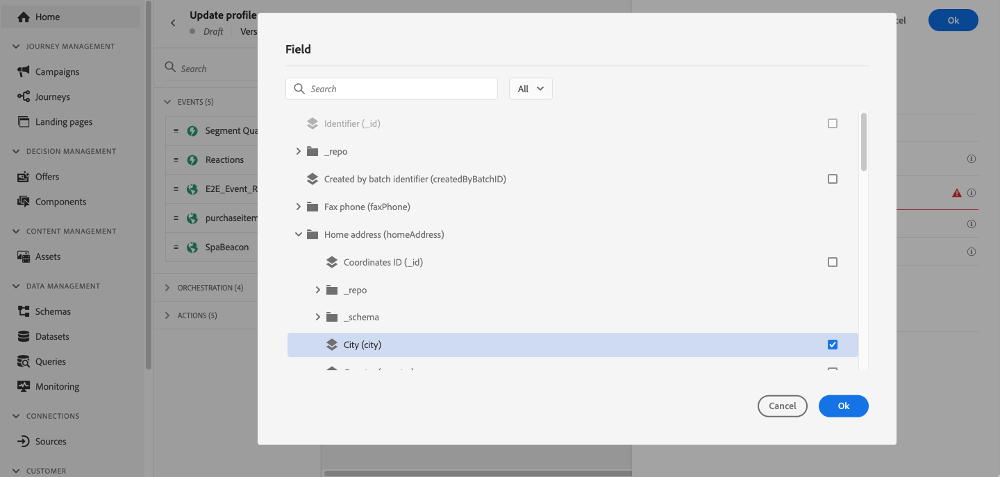

# Uppdatera profil {#update-profile}

>[!CONTEXTUALHELP]
>id="ajo_journey_update_profiles"
>title="Uppdatera profilaktivitet"
>abstract="Med aktiviteten Uppdatera profil kan du uppdatera en befintlig [!DNL Adobe Experience Platform]-profil med information som kommer från händelsen, en datakälla eller med ett specifikt värde."

Använd aktiviteten **[!UICONTROL Update Profile]** för att utöka eller korrigera en befintlig [!DNL Adobe Experience Platform]-profil när en kund går igenom en resa. Du kan ange fältvärden som kommer från en resehändelse, en konfigurerad datakälla eller ett statiskt värde, vilket gör att du kan behålla profildata korrekta och användbara utan att lämna arbetsytan. Granska de [skyddsutkast och begränsningar](#guardrails) som gäller innan du konfigurerar den här aktiviteten.

## Val av datauppsättning {#dataset-selection}

Aktiviteten **[!UICONTROL Update Profile]** kräver en dedikerad datamängd för att lagra uppdateringar. Eftersom den här aktiviteten endast uppdaterar [profilarkivet](https://experienceleague.adobe.com/docs/experience-platform/profile/home.html#profile-data-store){target="_blank"} (inte datakaktionen), bör alla uppdateringar sparas i en [profilaktiverad datamängd](https://experienceleague.adobe.com/en/docs/experience-platform/catalog/datasets/user-guide#enable-profile){target="_blank"} som är specifikt avsedd för **[!UICONTROL Update Profile]**-åtgärder.

>[!CAUTION]
>
>Använd inte en datauppsättning som också används för att gruppera eller strömma inmatning. Andra inmatningskörningar skriver över ändringarna som gjorts av åtgärden **[!UICONTROL Update Profile]**, vilket gör att profilattributen försvinner eller återställs till sina tidigare värden. Om du observerar detta beteende bör du kontrollera i Adobe Experience Platform att inget annat intag skrivs till samma datauppsättning. Felsökningssteg finns i [Lösa profiluppdateringsfel i Adobe Journey Optimizer](https://experienceleague.adobe.com/en/docs/experience-cloud-kcs/kbarticles/ka-26352){target="_blank"}.

Aktivitetskonfigurationen **[!UICONTROL Update Profile]** kräver inte heller något [identitetsnamnutrymme](https://experienceleague.adobe.com/en/docs/experience-platform/identity/features/namespaces){target="_blank"}. Se därför till att den valda datauppsättningen använder samma **[!UICONTROL Identity namespace]** som användes av åtgärden som startade resan som det är namnområdet som dessa uppdateringar kommer att använda. Identitetskartan kan även användas av den valda datauppsättningen. Om du inte väljer en datauppsättning med rätt ID-namnområde eller en som använder identitetskarta kommer aktiviteten **[!UICONTROL Update Profile]** att misslyckas.

## Konfigurera aktiviteten Uppdatera profil {#use-profile-update}

Följ stegen nedan för att konfigurera aktiviteten **[!UICONTROL Update Profile]** under din resa.

1. Börja designa din resa. Läs mer i [Skapa din första resa](../building-journeys/journey-gs.md).

1. Släpp aktiviteten **[!UICONTROL Action]** på arbetsytan i delen **[!UICONTROL Update Profile]** på paletten.

   

1. Välj ett schema i listan.

   >[!NOTE]
   >
   >Endast fält som redan finns i det valda XDM-profilschemat är tillgängliga för markering. Om fältet du behöver inte finns med i listan lägger du till det i schemat i Adobe Experience Platform först.

1. Klicka på **[!UICONTROL Field]** för att markera fältet som du vill uppdatera.

   

1. Välj en datauppsättning i listan.

   >[!NOTE]
   >
   >Åtgärden **[!UICONTROL Update Profile]** uppdaterar profildata i realtid, men uppdaterar inte datauppsättningar. Val av datauppsättning krävs eftersom profilen är en post som är relaterad till en datauppsättning.

1. Klicka på fältet **[!UICONTROL Value]** för att definiera värdet som du vill använda:

   * Med den enkla uttrycksredigeraren kan du välja ett fält från en datakälla eller från den inkommande händelsen.

     

   * Om du vill definiera ett specifikt värde eller utnyttja avancerade funktioner väljer du [**[!UICONTROL Advanced mode]**](expression/expressionadvanced.md).

     

1. Om du vill uppdatera ytterligare profilattribut i samma åtgärd klickar du på **[!UICONTROL Update another field]** och upprepar fältet och värdevalet. Du kan lägga till upp till fem fält-/värdepar i en enda **[!UICONTROL Update Profile]**-åtgärd. Se [Skyddsutkast och begränsningar](#guardrails).

Aktiviteten **[!UICONTROL Update Profile]** har nu konfigurerats.

## Testa profiluppdateringen {#using-the-test-mode}

Observera att i [testläge](testing-the-journey.md) börjar profiluppdateringarna gälla direkt i testprofilen och simuleras inte.

Det är bara testprofiler som kan ta sig in på en resa i testläge. Du kan antingen skapa en ny testprofil eller konvertera en befintlig profil till en testprofil. I [!DNL Adobe Experience Platform] kan profilattribut uppdateras via en CSV-filimport eller API-anrop. Ett snabbare alternativ är att använda en **[!UICONTROL Update Profile]**-aktivitet inom själva resan för att ställa in det booleska fältet för testprofilen på true.

Mer information om hur du omvandlar en befintlig profil till en testprofil finns i det här [avsnittet](../audience/creating-test-profiles.md#create-test-profiles-csv).

## Skyddsritningar och begränsningar {#guardrails}

* Åtgärden **[!UICONTROL Update Profile]** kan bara användas i resor som har ett [namnutrymme](../event/about-creating.md#select-the-namespace).
* Åtgärden uppdaterar bara befintliga fält - inga nya profilfält skapas.
* Åtgärden stöder endast enkla fälttyper (sträng, tal, booleskt). XDM-fält som definieras som uppräkningar, föreslagna värden, objektarrayer eller komplexa samlingar (t.ex. produktlistor) stöds inte.
* Du kan inte använda åtgärden **[!UICONTROL Update Profile]** för att generera [upplevelsehändelser](../event/about-events.md), till exempel ett köp.
* Precis som med andra åtgärder kan du definiera en [alternativ sökväg om ett fel inträffar eller timeout](using-the-journey-designer.md#paths) inträffar. Två åtgärder kan inte placeras parallellt.
* Det är inte säkert att profiluppdateringar är omedelbart tillgängliga längre fram i kedjan. Undvik att placera en åtgärd som läser ett fält direkt efter åtgärden **[!UICONTROL Update Profile]** som skriver det, eftersom det uppdaterade värdet kanske inte återspeglas än.
* Aktiviteten **[!UICONTROL Update profile]** uppdaterar bara [profilarkivet](https://experienceleague.adobe.com/docs/experience-platform/profile/home.html#profile-data-store){target="_blank"}, inte datasjön.
* Upp till fem fält-/värdepar kan uppdateras i en enda **[!UICONTROL Update Profile]**-åtgärd. Använd knappen **[!UICONTROL Update another field]** för att lägga till fler par.
* För bättre prestanda bör du gruppera flera attributuppdateringar i en enda **[!UICONTROL Update Profile]**-åtgärd i stället för att använda en åtgärd per attribut.
