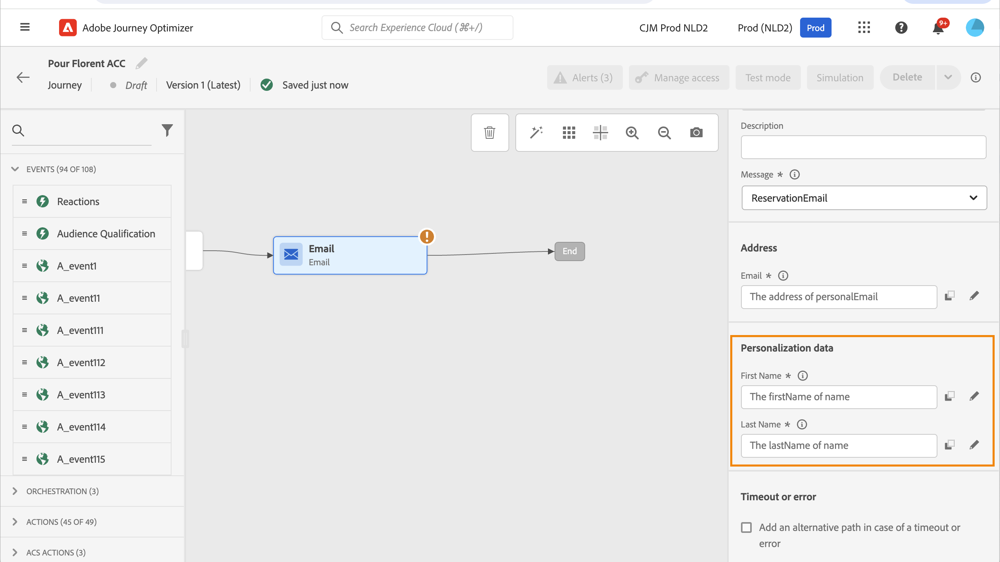
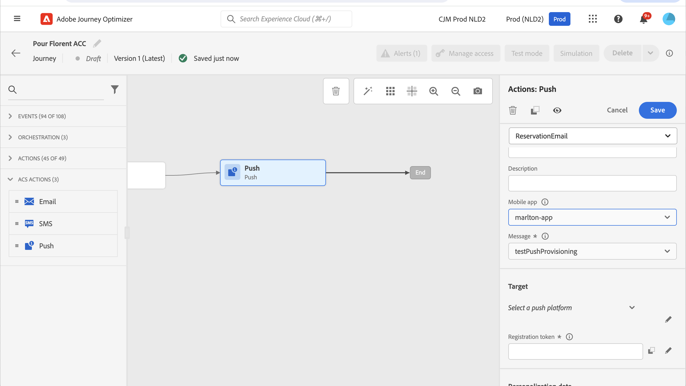

# [!DNL Adobe Campaign] standardåtgärder {#using_campaign_action}

>[!CONTEXTUALHELP]
>id="ajo_journey_action_custom_acs"
>title="Anpassade åtgärder"
>abstract="En integrering är tillgänglig om du har [!DNL Adobe Campaign] Standard. Det gör att du kan skicka e-post, push-meddelanden och SMS med hjälp av funktionerna för transaktionsmeddelanden i [!DNL Adobe Campaign]."

Om du har [!DNL Adobe Campaign] Standard är följande inbyggda åtgärdsaktiviteter tillgängliga: **[!UICONTROL Email]**, **[!UICONTROL Push]** och **[!UICONTROL SMS]**.

>[!NOTE]
>
>Därför måste du konfigurera den inbyggda åtgärden. Se [den här sidan](../action/acs-action.md).

För var och en av dessa kanaler väljer du en [!DNL Adobe Campaign] standardmall för transaktionsmeddelanden **2&rbrace;.** För de inbyggda e-post-, SMS- och push-kanalerna använder vi Transactional Messaging för att skicka meddelanden. Det innebär att om du vill använda en viss meddelandemall under dina resor måste du publicera den i [!DNL Adobe Campaign] Standard. Mer information om hur du använder den här funktionen finns på [den här sidan](https://experienceleague.adobe.com/docs/campaign-standard/using/communication-channels/transactional-messaging/getting-started-with-transactional-msg.html?lang=sv).

>[!NOTE]
>
>Campaign Standard transaktionsmeddelande och tillhörande händelse måste publiceras för att kunna användas i Journey Optimizer. Om händelsen publiceras men meddelandet inte visas, visas den inte i Journey Optimizer-gränssnittet. Om meddelandet publiceras men dess associerade händelse inte är det, visas det i Journey Optimizer-gränssnittet, men det går inte att använda det.

![[!DNL Adobe Campaign] Standardåtgärdskonfiguration under resan &#x200B;](assets/journey59.png)

Du kan använda en händelsemall (kallas även realtid) eller en transaktionsmall för profiler.

>[!NOTE]
>
>När vi skickar transaktionsmeddelanden i realtid (rtEvent) eller när vi dirigerar meddelanden med ett tredjepartssystem tack vare en anpassad åtgärd krävs en särskild konfiguration för hantering av trötthet, blockeringslista eller prenumerationer. Om till exempel attributet &quot;unsubscribe&quot; lagras i [!DNL Adobe Experience Platform] eller i ett tredjepartssystem måste ett villkor läggas till innan meddelandet skickas för att kontrollera det här villkoret.

När du väljer en mall visas alla fält som förväntas i meddelandenyttolasten i aktivitetskonfigurationsrutan under **[!UICONTROL Address]** och **[!UICONTROL Personalization Data]**. Du måste mappa vart och ett av dessa fält till det fält som du vill använda, antingen från händelsen eller från datakällan. Du kan också använda den avancerade uttrycksredigeraren för att skicka ett värde manuellt, utföra databearbetning på hämtad information (t.ex. konvertera en sträng till versaler) eller använda funktioner som &quot;if, then, else&quot;. Läs [den här sidan](expression/expressionadvanced.md).


## E-post och SMS {#section_asc_51g_nhb}

Parametrarna är identiska för **[!UICONTROL Email]** och **[!UICONTROL SMS]**.

>[!NOTE]
>
>När du använder en profils transaktionsmall för e-post hanteras avprenumerationsfunktionen automatiskt av [!DNL Adobe Campaign] Standard.
>Inkludera ett **[!UICONTROL Unsubscription link]**-innehållsblock i [e-postmallen för transaktioner](https://experienceleague.adobe.com/docs/campaign-standard/using/communication-channels/transactional-messaging/getting-started-with-transactional-msg.html?lang=sv).
>Om du använder en händelsebaserad mall (rtEvent) lägger du till en länk i meddelandet som skickar mottagarens e-post som en URL-parameter och dirigerar dem till en startsida som inte är en prenumeration.
>Skapa landningssidan och se till att mottagarens beslut att avbryta prenumerationen skickas till Adobe.

Först måste du välja en transaktionsmall.

Det finns två kategorier: **[!UICONTROL Address]** och **[!UICONTROL Personalization Data]**.

Du kan enkelt definiera var **[!UICONTROL Address]** eller **[!UICONTROL Personalization Data]** ska hämtas via gränssnittet. Du kan bläddra genom händelser och tillgängliga datakällans fält. Du kan också använda den avancerade uttrycksredigeraren för mer avancerade användningsområden, som att använda en datakälla som kräver att parametrar skickas eller att manipulationer utförs. Läs [den här sidan](expression/expressionadvanced.md).

**[!UICONTROL Address]**

>[!NOTE]
>
>Den här kategorin är bara synlig om du väljer ett transaktionsmeddelande av typen &quot;event&quot;. För profilmeddelanden hämtas fältet **[!UICONTROL Address]** automatiskt från [!DNL Adobe Campaign] Standard av systemet.

Det här är de fält som systemet behöver för att kunna skicka meddelandet. För en e-postmall är det e-postadressen. För ett SMS är det mobiltelefonnumret.


**[!UICONTROL Personalization Data]**

>[!NOTE]
>
>Du kan inte skicka en samling med personaliseringsdata. Om transaktionsmeddelandet eller SMS förväntar sig samlingar fungerar det inte. Observera också att personaliseringsdata har ett förväntat format (exempel: sträng, decimal, osv.). Du måste vara försiktig med att ta hänsyn till dessa förväntade format.

Detta är de fält som förväntas av standardmeddelandet [!DNL Adobe Campaign]. Dessa fält kan användas för att anpassa meddelandet, använda villkorsstyrd formatering eller välja en viss meddelandevariant.



## Push {#section_im3_hvf_nhb}

Innan du använder push-aktiviteten måste din mobilapp konfigureras tillsammans med Campaign Standard för att skicka push-meddelanden. Använd den här [artikeln](https://experienceleague.adobe.com/docs/campaign-standard/using/administrating/configuring-mobile/supported-mobile-use-cases.html?lang=sv) om du vill utföra de nödvändiga implementeringsstegen för mobilen.

Först måste du välja en mobilapp i listrutan och ett transaktionsmeddelande.



Det finns två kategorier: **[!UICONTROL Target]** och **[!UICONTROL Personalization Data]**.

**[!UICONTROL Target]**

>[!NOTE]
>
>Den här kategorin visas bara om du väljer ett händelsemeddelande. För profilmeddelanden hämtas fälten **[!UICONTROL Target]** automatiskt av systemet med den avstämning som utförs av [!DNL Adobe Campaign] Standard.

I det här avsnittet måste du definiera **[!UICONTROL Push platform]**. I listrutan kan du välja **[!UICONTROL Apple Push Notification Server]** (iOS) eller **[!UICONTROL Firebase Cloud Messaging]** (Android). Du kan också välja ett specifikt fält från en händelse eller datakälla eller definiera ett avancerat uttryck.

Du måste också definiera **[!UICONTROL Registration Token]**. Uttrycket beror på hur token definieras i händelsenyttolasten eller i annan [!DNL Journey Optimizer]-information. Det kan vara ett enkelt fält eller ett mer komplext uttryck om token definieras i en samling, till exempel:

```
@event{Event_push._experience.campaign.message.profileSnapshot.pushNotificationTokens.first().token}
```

**[!UICONTROL Personalization Data]**

>[!NOTE]
>
>Du kan inte skicka en samling med personaliseringsdata. Om transaktionspush förväntar sig samlingar fungerar den inte. Observera också att personaliseringsdata har ett förväntat format (exempel: sträng, decimal, osv.). Du måste vara försiktig med att ta hänsyn till dessa förväntade format.

Detta är de fält som förväntas av transaktionsmallen som används i standardmeddelandet för [!DNL Adobe Campaign]. Dessa fält kan användas för att anpassa ditt meddelande, använda villkorsstyrd formatering eller välja en viss meddelandevariant.
