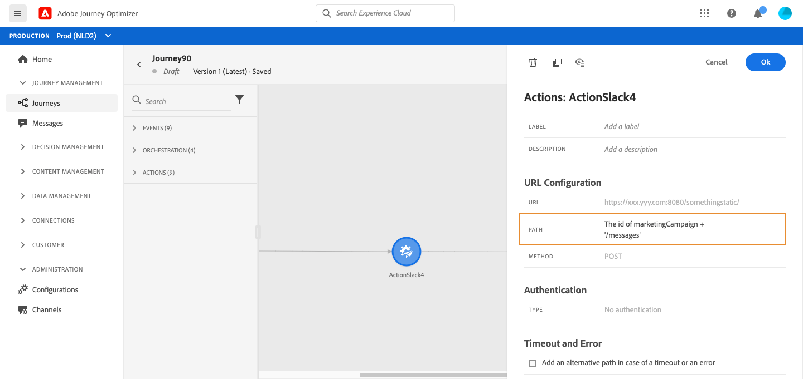

# Använd anpassade åtgärder {#section_f2c_hbg_nhb}

I aktivitetskonfigurationsrutan visas URL-konfigurationsparametrarna och autentiseringsparametrarna som har konfigurerats för den anpassade åtgärden. [Läs mer](../action/about-custom-action-configuration.md).

>[!NOTE]
>
>Du kan inte skicka en enkel samling i anpassade åtgärdsparametrar. Mer komplexa samlingsfält (arrayer med objekt) stöds inte.  Observera också att parametrarna har ett förväntat format (exempel: sträng, decimal osv.). Du måste vara försiktig med att ta hänsyn till dessa förväntade format.

## URL-konfiguration

### Dynamisk sökväg

Om URL:en innehåller en dynamisk sökväg anger du sökvägen i fältet **[!UICONTROL Path]**.

>[!NOTE]
>
>Du kan inte konfigurera den statiska delen av URL-adressen i resan, utan i den globala konfigurationen för den anpassade åtgärden. [Läs mer](../action/about-custom-action-configuration.md).

Om du vill sammanfoga fält och enkla textsträngar använder du strängfunktionerna eller plustecknet (+) i den avancerade uttrycksredigeraren. Omsluter enkla textsträngar med enkla citattecken (&#39;) eller inom dubbla citattecken (&quot;). [Läs mer](https://experienceleague.adobe.com/docs/journeys/using/building-advanced-conditions-journeys/expressionadvanced.html){target=&quot;_blank&quot;}.

I den här tabellen visas ett exempel på konfiguration:

| Fält | Värde |
| --- | --- |
| URL | `https://xxx.yyy.com:8080/somethingstatic/` |
| Bana | `The id of marketingCampaign + '/messages'` |

Den sammanfogade URL:en har följande format:

`https://xxx.yyy.com:8080/somethingstatic/`\&lt;campaign ID=&quot;&quot;>`/messages`

### Sidhuvuden

Avsnittet **[!UICONTROL URL Configuration]** visar de dynamiska rubrikfälten, men inte de konstanta rubrikfälten. Dynamiska rubrikfält är HTTP-rubrikfält vars värde är konfigurerat som en variabel. [Läs mer](../action/about-custom-action-configuration.md).

Ange vid behov värdet för dynamiska rubrikfält:

1. Välj den anpassade åtgärden under resan.
1. Klicka på pennikonen bredvid rubrikfältet i **[!UICONTROL URL Configuration]**-avsnittet i konfigurationsfönstret.

   

1. Markera ett fält och klicka på **[!UICONTROL OK]**.

## Åtgärdsparametrar

I avsnittet **[!UICONTROL Action parameters]** ser du meddelandeparametrarna som är definierade som _&quot;Variabel&quot;_. För de här parametrarna kan du definiera var informationen ska hämtas (exempel: händelser, datakällor), skicka värden manuellt eller använd den avancerade uttrycksredigeraren för avancerade användningsområden. Avancerade användningsområden kan vara datahantering och annan funktionsanvändning. Mer information finns i [Adobe Journey Orchestration-dokumentation](https://experienceleague.adobe.com/docs/journeys/using/building-advanced-conditions-journeys/expressionadvanced.html){target=&quot;_blank&quot;}.

**Relaterade ämnen**

[Konfigurera en åtgärd](../action/about-custom-action-configuration.md)
