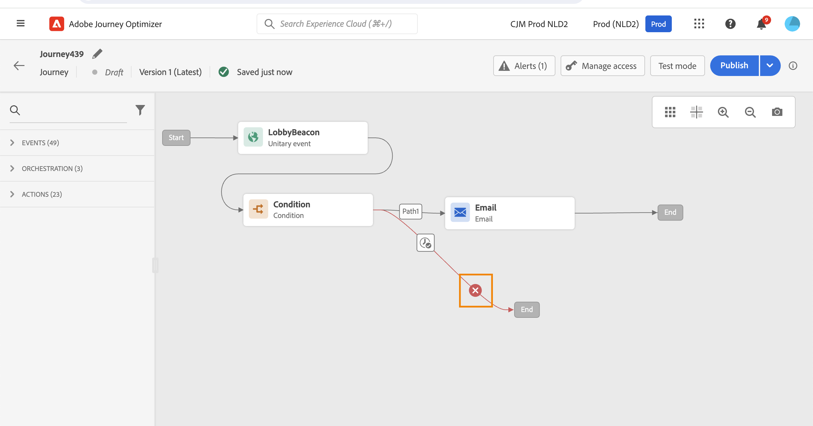
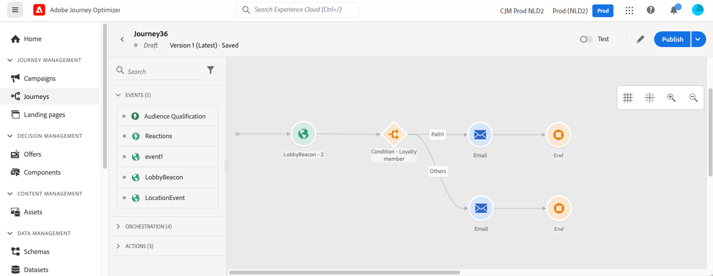

# Designa din resa {#design-your-journey}

>[!CONTEXTUALHELP]
>id="ajo_journey_canvas"
>title="Designa din resa"
>abstract="Med resegränssnittet kan du enkelt dra och släppa aktiviteter från paletten till arbetsytan. Du kan också dubbelklicka på en aktivitet för att lägga till den på arbetsytan i nästa steg som är tillgängligt."

Adobe Journey Optimizer har en flerkanalig orkestreringsyta som gör att marknadsförarna kan harmonisera marknadsföringen med ett-till-ett-kundengagemang. Med användargränssnittet kan du enkelt dra och släppa aktiviteter från paletten till arbetsytan för att skapa din resa. Observera att du även kan dubbelklicka på en aktivitet för att lägga till den på arbetsytan i nästa tillgängliga steg.

Händelser, samordning och åtgärder har en särskild roll och plats i processen. Aktiviteterna är sekvenserade: när en aktivitet är klar fortsätter flödet och bearbetar nästa aktivitet, och så vidare.

## Kom igång med resedesign {#gs-journey-design}

The **palett** finns till vänster på skärmen. Alla tillgängliga aktiviteter är sorterade i flera kategorier: [Händelser](#jo-event), [Orchestration](#jo-orch) och [Åtgärder](#jo-actions). Du kan expandera/komprimera de olika kategorierna genom att klicka på deras namn. Om du vill använda en aktivitet på din resa drar och släpper du den från paletten till arbetsytan.

När du påbörjar en ny resa döljs element som inte kan släppas på arbetsytan som det första steget. Detta gäller alla åtgärder, villkorsaktiviteten, väntetiden och reaktionen.

The **[!UICONTROL Filter items]** -ikonen i det övre vänstra hörnet kan du visa följande filter:

* **Visa endast tillgängliga objekt**: dölj eller visa otillgängliga element på paletten, t.ex. händelser som använder ett annat namnutrymme än de som används under din resa. Som standard är otillgängliga objekt dolda. Om du väljer att visa dem visas de som nedtonade.

* **Visa endast senaste objekt**: det här filtret gör att du bara kan visa de fem senast använda händelserna och åtgärderna, förutom de som är färdiga. Detta är specifikt för varje användare. Som standard visas alla objekt.

Du kan också använda **[!UICONTROL Search]** fält. Endast händelser och åtgärder filtreras.

The **arbetsyta** är den centrala zonen i resedesignern. Det är i den här zonen som du kan släppa dina aktiviteter och konfigurera dem. Klicka på en aktivitet på arbetsytan för att konfigurera den. Aktivitetskonfigurationsrutan öppnas till höger.

The **verktygsfält**, som finns i det övre högra hörnet av arbetsytan, gör att du kan visa/dölja stödrastret, zooma in/ut och hämta en skärmbild av arbetsytan. Se det här [section](../building-journeys/journey-gs.md#timeout_and_error).

<!--and show/hide timeout and error paths-->

{width="70%" align="left"}

The **aktivitetskonfigurationsruta** visas när du klickar på en aktivitet på paletten. Fyll i obligatoriska fält. Klicka på **[!UICONTROL Delete]** -ikonen för att ta bort aktiviteten. Klicka **[!UICONTROL Cancel]** för att avbryta ändringarna eller **[!UICONTROL Ok]** för att bekräfta. Om du vill ta bort aktiviteter kan du även markera en aktivitet (eller flera) och trycka på backstegstangenten. Om du trycker på Esc-tangenten stängs aktivitetskonfigurationsrutan.

Som standard är skrivskyddade fält dolda. Om du vill visa skrivskyddade fält klickar du på **Visa skrivskyddade fält** ikonen längst upp till vänster i aktivitetskonfigurationsrutan. Denna inställning gäller för alla aktiviteter på alla resor.

Beroende på resans status kan du utföra olika åtgärder under resan med hjälp av knapparna i det övre högra hörnet: **[!UICONTROL Publish]**, **[!UICONTROL Duplicate]**, **[!UICONTROL Delete]**, **[!UICONTROL Journey properties]**, **[!UICONTROL Test]**. De här knapparna visas när ingen aktivitet är markerad. Vissa knappar visas i sitt sammanhang. Loggknappen för testläget visas när testläget aktiveras.

## Påbörja din resa {#start-your-journey}

När du utformar din resa är den första frågan du vill ställa hur profiler kommer in på resan. Det finns två möjligheter:

1. **Börja med en händelse**: när en resa är inställd på att avlyssna händelser, kommer individer in på resan **unitärt** i realtid. Meddelanden som ingår i din resa skickas till den person som för tillfället är på väg in på resan. [Läs mer om evenemang](../event/about-events.md)

1. **Börja med en läspublik**: ni kan göra er resa för att lyssna på Adobe Experience Platform målgrupper. I det här fallet kommer alla personer som tillhör den angivna målgruppen in på resan. Meddelanden som ingår i din resa skickas till personer som tillhör målgruppen. Läs mer om [läs målgrupp](read-audience.md).

## Definiera nästa steg{#define-next-steps}

Efter din första händelse eller Läs publiker kan du kombinera de olika aktiviteterna för att skapa flerstegsscenarier för flera kanaler. Välj de steg du behöver på paletten.

### Händelser{#jo-event}

Det är händelser som utlöser en personaliserad resa, till exempel ett onlineköp. När någon väl går in på en resa förflyttas de som en individ, och inga två personer följer med på samma hastighet eller längs samma väg.

När du påbörjar en resa med en händelse aktiveras resan när händelsen tas emot. Varje person på resan följer sedan, individuellt, de steg som definieras på din resa.

Du kan lägga till **flera händelser** under resan, så länge de använder samma namnutrymme. Händelser konfigureras i förväg. [Läs mer om reseevenemang](about-journey-activities.md#event-activities)

Du kan också lägga till en **Reaktion** händelse efter ett meddelande om att reagera på spårningsdata som är relaterade till meddelandet. Detta gör att du till exempel kan skicka ett till meddelande om personen öppnade det föregående meddelandet eller klickade i det. [Läs mer om reaktionshändelser](reaction-events.md).

Använd **Målgruppskvalifikation** Evenemangsaktiviteter som får enskilda att komma in på eller gå framåt i en resa baserat på Adobe Experience Platform entréer och utgångar. Ni kan få alla nya silverkunder att delta i en resa och skicka personaliserade meddelanden. Läs mer om detta [section](audience-qualification-events.md).

### Orchestration{#jo-orch}

Orchestration-aktiviteter är olika villkor som hjälper till att bestämma nästa steg i resan.

I orkestreringsaktiviteterna använder du **Läs målgrupp** för att få din resa att lyssna på en Adobe Experience Platform-publik. [Läs mer om aktiviteten Läs målgrupp](read-audience.md).

Med de andra aktiviteterna kan du lägga till villkor för din resa för att definiera flera olika vägar, ange en väntetid innan nästa aktivitet utförs eller avsluta din resa. [Läs mer om orkestreringsaktiviteter](about-journey-activities.md#orchestration-activities).

### Instruktioner{#jo-actions}

Åtgärder är vad du vill ska hända som ett resultat av någon typ av utlösare, som att skicka ett meddelande. Det är den del av resan som kundupplevelsen innebär. Det kan vara ett e-postmeddelande, SMS eller push-meddelande eller en åtgärd från tredje part, som ett Slack-meddelande.

Med kanalåtgärdsaktiviteterna kan du inkludera ett meddelande som är utformat i [!DNL Journey Optimizer]. [Läs mer om kanalaktiviteter](journeys-message.md)

Använd anpassade åtgärder från åtgärdsaktiviteterna för att skicka meddelanden med tredjepartssystem. [Läs mer om anpassade åtgärder](about-journey-activities.md#action-activities).

## Lägg till alternativa banor{#paths}

Du kan definiera en reservåtgärd om ett fel uppstår eller tidsgränsen överskrids för följande reseaktiviteter: **[!UICONTROL Condition]** och **[!UICONTROL Action]**.

Om du vill lägga till en reservåtgärd för en aktivitet väljer du **[!UICONTROL Add an alternative path in case of a timeout or an error]** i aktivitetsegenskaperna: en annan sökväg läggs till efter aktiviteten. Tidsgränsen definieras av administratörsanvändare i [egenskaper för resa](../building-journeys/journey-gs.md#change-properties). Om det t.ex. tar för lång tid att skicka ett e-postmeddelande eller om ett fel uppstår, kan du välja att skicka ett push-meddelande.

Med olika aktiviteter (händelse, åtgärd, vänta) kan du lägga till flera sökvägar efter dem. Placera markören på aktiviteten och klicka på plustecknet (+). Endast händelse- och vänteaktiviteter kan anges parallellt. Om flera händelser anges parallellt är den valda sökvägen den första händelsen som inträffar.

När du lyssnar på en händelse rekommenderar vi att du inte väntar på händelsen i oändlighet. Det är inte obligatoriskt, bara en god praxis. Om du bara vill lyssna på en eller flera händelser under en viss tid, placerar du en eller flera händelser och en vänteaktivitet parallellt. Se [det här avsnittet](../building-journeys/general-events.md#events-specific-time).

Om du vill ta bort banan placerar du markören på den och klickar på **[!UICONTROL Delete path]** -ikon.

När två aktiviteter inte är kopplade till arbetsytan visas en varning. Placera markören på varningsikonen för att visa felmeddelandet. Åtgärda problemet genom att flytta den frånkopplade aktiviteten och koppla den till föregående aktivitet.

## Kopiera och klistra in aktiviteter {#copy-paste}

Du kan kopiera en eller flera aktiviteter under en resa och klistra in dem antingen under samma resa eller under en annan. På så sätt kan du spara tid om du vill återanvända flera aktiviteter som redan har konfigurerats under en tidigare resa.

**Viktiga anteckningar**

* Du kan kopiera/klistra in mellan olika flikar och webbläsare. Du kan bara kopiera/klistra in aktiviteter i samma instans.
* Du kan inte kopiera/klistra in en händelse om målresan innehåller en händelse som använder ett annat namnutrymme.
* Inklistrade aktiviteter kan referera till data som inte finns i målresan, till exempel om du kopierar/klistrar in mellan olika sandlådor. Sök alltid efter fel och gör nödvändiga justeringar.
* Observera att du inte kan ångra en åtgärd. Om du vill ta bort inklistrade aktiviteter måste du markera och ta bort dem. Se därför till att du bara väljer de aktiviteter du behöver innan du kopierar dem.
* Du kan kopiera aktiviteter från vilken resa som helst, även de som är skrivskyddade.
* Du kan välja vilken aktivitet som helst, även en aktivitet som inte är länkad. Länkade aktiviteter förblir länkade när de har klistrats in.

Så här kopierar/klistrar du in aktiviteter:

1. Öppna en resa.
1. Välj de aktiviteter du vill kopiera genom att flytta musen medan du klickar. Du kan också klicka på varje aktivitet samtidigt som du trycker på **Ctrl/Kommando** -tangenten. Använd **Ctrl/Kommando + A** om du vill markera alla aktiviteter.
   
1. Tryck **Ctrl/Kommando + C**.
Om du bara vill kopiera en aktivitet kan du klicka på den och använda **Kopiera** ikonen i det övre vänstra hörnet i aktivitetskonfigurationsfönstret.
   
1. Under alla resor, tryck **Ctrl/Kommando + V** om du vill klistra in aktiviteterna utan att länka dem till en befintlig nod. Inklistrade aktiviteter placeras i samma ordning. När du har klistrat in aktiviteter förblir de markerade så att du enkelt kan flytta dem. Du kan också placera markören på en tom platshållare och trycka på **Ctrl/Kommando + V**. Inklistrade aktiviteter länkas till noden.
   
