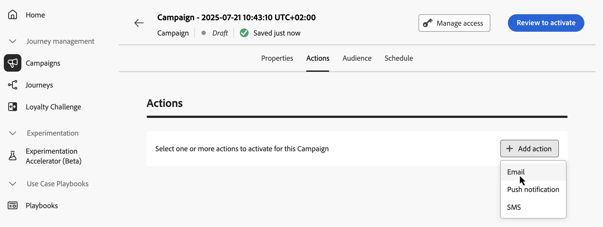
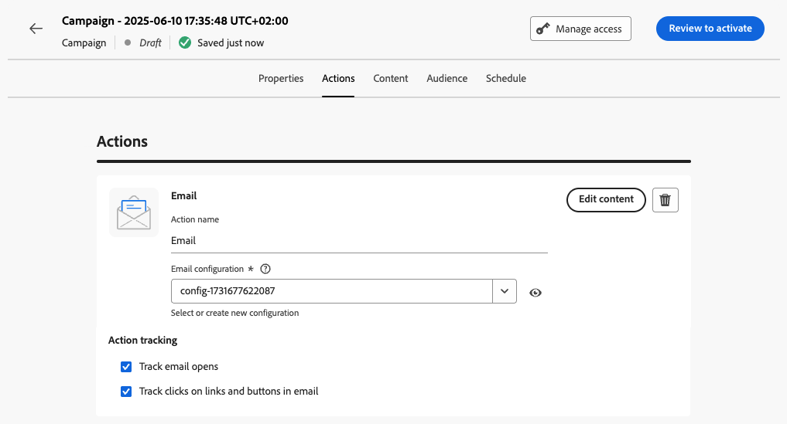

# Konfigurera den API-utlösta kampanjåtgärden {#api-action}

Använd fliken **[!UICONTROL Actions]** för att välja en kanalkonfiguration för meddelandet och konfigurera ytterligare inställningar som spårning, innehållsexperiment eller flerspråkigt innehåll.

1. **Välj kanal**.

   Navigera till fliken **[!UICONTROL Actions]**, klicka på knappen **[!UICONTROL Add action]** och markera kommunikationskanalen.

   

   >[!NOTE]
   >
   >Mer information om vilka kanaler som stöds finns i tabellen i det här avsnittet: [Kanaler i resor och kampanjer](../channels/gs-channels.md#channels). Vilka kanaler som är tillgängliga varierar beroende på licensmodell och tillägg.
   >
   >Kampanjer som utlösts av API:t för högflöde stöder för närvarande endast e-postkanalen.

1. **Välj en kanalkonfiguration**

   En konfiguration definieras av en [systemadministratör](../start/path/administrator.md). Den innehåller alla tekniska parametrar för att skicka meddelandet, som rubrikparametrar, underdomän, mobilappar osv. [Lär dig hur du konfigurerar kanalkonfigurationer](../configuration/channel-surfaces.md)

   

1. **Utnyttjandeoptimering**

   Använd avsnittet **[!UICONTROL Message Optimization]** för att köra innehållsexperiment, utnyttja målinriktningsregler eller använda avancerade kombinationer av både experiment och målinriktning. De här olika alternativen och stegen som ska följas beskrivs i det här avsnittet: [Optimering i kampanjer](campaigns-message-optimization.md).
<!--
1. **Create a content experiment**

    Use the **[!UICONTROL Content experiment]** section to define multiple delivery treatments in order to measure which one performs best for your target audience. Click the **[!UICONTROL Create experiment]** button then follow the steps detailed in this section: [Create a content experiment](../content-management/content-experiment.md).-->

1. **Lägg till flerspråkigt innehåll**

   Använd avsnittet **[!UICONTROL Languages]** för att skapa innehåll på flera språk i kampanjen. Om du vill göra det klickar du på knappen **[!UICONTROL Add languages]** och väljer önskad **[!UICONTROL Language settings]**. Detaljerad information om hur du konfigurerar och använder flerspråkiga funktioner finns i det här avsnittet: [Kom igång med flerspråkigt innehåll](../content-management/multilingual-gs.md)

Ytterligare inställningar är tillgängliga beroende på den valda kommunikationskanalen. Expandera avsnitten nedan om du vill ha mer information.

+++**Använd regler för begränsning** (e-post, push, SMS)

I listrutan **[!UICONTROL Business rules]** väljer du en regeluppsättning för att tillämpa regler för appning på kampanjen. Genom att utnyttja kanalregeluppsättningar kan ni ange frekvensbegränsning efter kommunikationstyp för att förhindra att kunder med liknande meddelanden överbelastas. [Lär dig arbeta med regeluppsättningar](../conflict-prioritization/rule-sets.md)

+++

+++**Spåra engagemang** (e-post, SMS).

Använd avsnittet **[!UICONTROL Action tracking]** för att spåra hur dina mottagare svarar på dina e-post- eller SMS-leveranser. Spåra resultat kan nås från kampanjrapporten när kampanjen har genomförts. [Läs mer om kampanjrapporter](../reports/campaign-global-report-cja.md)

+++

+++**Aktivera läget Snabb leverans** (push).

Snabb leverans är ett [!DNL Journey Optimizer]-tillägg som tillåter mycket snabba push-meddelanden som skickas i stora volymer via kampanjer. Snabba leveranser används när fördröjningar i meddelandeleverans är affärskritiska när du vill skicka en snabb push-varning på mobiltelefoner, till exempel nyheter till användare som har installerat din nyhetskanalapp. Lär dig hur du aktiverar läget Snabb leverans för push-meddelanden [på den här sidan](../push/create-push.md#rapid-delivery).

Mer information om prestanda när du använder läget Snabb leverans finns i [Adobe Journey Optimizer produktbeskrivning](https://helpx.adobe.com/legal/product-descriptions/adobe-journey-optimizer.html){target="_blank"}.

+++

## Nästa steg {#next}

När kampanjens konfiguration och innehåll är klart kan ni utforma dess innehåll. [Läs mer](api-triggered-campaign-content.md)
