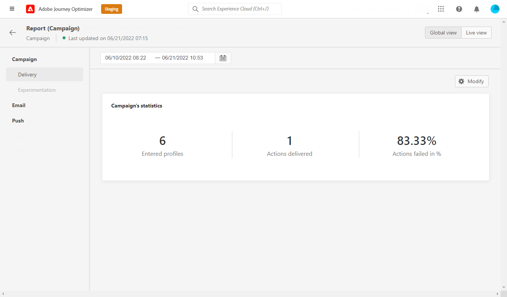

# Global kampanjrapport {#campaign-global-report}

Kampanjens globala rapport kan nås direkt från er Campaign via **[!UICONTROL Global view]** -knappen.

Kampanjen **[!UICONTROL Global report]** visas med följande flikar:

* [Campaign](#campaign-global)
* [E-post](#email-global)
* [Push](#push-global)

Kampanjen **[!UICONTROL Global report]** är uppdelat i olika widgetar som detaljerat beskriver kampanjens framgångar och fel. Varje widget kan storleksändras och tas bort vid behov. Mer information finns i [section](../reports/global-report.md#modify-dashboard).

## Fliken Kampanj {#campaign-global}

### Leverans {#delivery-global}

The **[!UICONTROL Campaign's Statistics]** widgetinformation om huvudinformationen i förhållande till kampanjen:

* **[!UICONTROL Entered profiles]**: Antal profiler som påbörjade resan.

* **[!UICONTROL Actions delivered]**: Totalt antal unika gånger som en åtgärd i resan har utförts.

* **[!UICONTROL Actions failed in %]**: Totalt antal unika gånger en åtgärd misslyckades under resan jämfört med det totala antalet unika gånger en åtgärd har levererats.

<!--
### Experimentation tab (#experimentation-global)

From your Campaign **[!UICONTROL Global report]**, the **[!UICONTROL Experimentation]** tab details the main information relative to how each variant is performing and if there is was winner during the test.
-->

## Fliken E-post {#email-global}

Från er kampanj **[!UICONTROL Global report]**, **[!UICONTROL Email]** -fliken innehåller huvudinformationen om de e-postleveranser som skickas i din kampanj.

The **[!UICONTROL Email Sending Statistics]** diagram visar hur framgångsrik leveransen är:

* **[!UICONTROL Targeted]**: Totalt antal meddelanden som bearbetats under leveransanalysen.

* **[!UICONTROL Sent]**: Totalt antal försändelser för leveransen.

* **[!UICONTROL Delivered]**: Antal meddelanden som har skickats, i relation till det totala antalet skickade meddelanden.

* **[!UICONTROL Delivery Rate]**: Procentandel meddelanden som har skickats.

* **[!UICONTROL Bounces]**: Totalt antal fel som sammanställts under leverans och automatisk returbehandling i relation till totalt antal skickade meddelanden.

* **[!UICONTROL Bounce Rate]**: Procentandel e-postmeddelanden som studsade jämfört med skickade e-postmeddelanden.

* **[!UICONTROL Errors]**: Totalt antal fel som uppstod under en leverans och som förhindrar att den skickas till profiler.

* **[!UICONTROL Error Rate]**: Procentandel fel som uppstod under en leverans och som förhindrar att den skickas jämfört med skickade e-postmeddelanden.

* **[!UICONTROL Retries]**: Antal e-postmeddelanden i kön för återförsök.

* **[!UICONTROL Excluded]**: Antal profiler som har uteslutits av Adobe Journey Optimizer.

The **[!UICONTROL Email - Tracking statistics]** innehåller tillgängliga data för mottagaraktivitet för leveransen:

* **[!UICONTROL Opens]**: Antal gånger som leveransen öppnades i en leverans.

* **[!UICONTROL Unique Opens]**: Procent av öppnade leveranser.

* **[!UICONTROL Open Rate]**: Totalt antal öppnade e-postmeddelanden jämfört med antalet levererade e-postmeddelanden.

* **[!UICONTROL Clicks]**: Antal gånger ett innehåll klickades i ett e-postmeddelande.

* **[!UICONTROL Unique Clicks]**:Antal mottagare som klickat på ett innehåll i ett e-postmeddelande.

* **[!UICONTROL Unique Click Rate]**: Procentandel användare som interagerade med leveransen.

* **[!UICONTROL Unsubscriptions]**: Antal klick på länken för att avbryta prenumerationen.

* **[!UICONTROL Spam complaints]**: Antal gånger ett meddelande har deklarerats som skräppost eller skräppost.

The **[!UICONTROL Sending Statistics]** diagrammet innehåller de data som är tillgängliga för skickade e-postmeddelanden, som:

* **[!UICONTROL Delivered]**: Antal meddelanden som har skickats, i relation till det totala antalet skickade meddelanden.

* **[!UICONTROL Bounces]**: Totalt antal fel som sammanställts under leverans och automatisk returbehandling i relation till totalt antal skickade meddelanden.

* **[!UICONTROL Retries]**: Antal e-postmeddelanden i kön för återförsök.

* **[!UICONTROL Errors]**: Totalt antal fel som uppstod under en leverans och som förhindrar att den skickas till profiler.

The **[!UICONTROL Bounce Reasons]** och **[!UICONTROL Bounce categories]** widgetar innehåller tillgängliga data som är relaterade till studsade meddelanden, som:

* **[!UICONTROL Hard bounce]**: Det totala antalet permanenta fel, t.ex. fel e-postadress. Detta inbegriper ett felmeddelande som uttryckligen anger att adressen är ogiltig, till exempel Okänd användare.

* **[!UICONTROL Soft bounce]**: Det totala antalet tillfälliga fel, t.ex. en fullständig inkorg.

* **[!UICONTROL Ignored]**: Det totala antalet tillfälliga, t.ex. frånvaro, eller ett tekniskt fel, t.ex. om avsändartypen är postmaster.

Mer information om studsar finns i [Undertryckningslista](../reports/suppression-list.md) sida.

The **[!UICONTROL Error Reasons]** Med diagram och tabeller kan du se vilket fel som inträffade under leveransen.

The **[!UICONTROL Excluded reasons]** I diagram och tabeller visas de olika anledningar som gjorde att användarprofiler som inte ingår i målprofilerna inte kunde ta emot meddelandet.

The **[!UICONTROL Email - Top Url]** diagram- och tabellinformation om vilka URL:er från leveransen som är mest besökta.

The **[!UICONTROL Email - Top recipient domain]** diagram och tabeller visar vilka domäner som är de mest använda av mottagarna för att öppna e-postmeddelandet.

>[!NOTE]
>
>The **[!UICONTROL Optimized vs non optimized]** och **[!UICONTROL Send time optimization]**  widgetar är bara tillgängliga om alternativet för optimering av sändningstid är aktiverat för leverans. Mer information om optimering av sändningstid finns i [den här sidan](../messages/send-time-optimization.md).

The **[!UICONTROL Optimized vs non optimized]** diagram anger huvudinformationen i förhållande till meddelandet, oavsett om de är optimerade eller inte:

* **[!UICONTROL Sent]**: Totalt antal försändelser för leveransen.
* **[!UICONTROL Opens]**: Antal gånger som leveransen öppnades i en leverans.
* **[!UICONTROL Clicks]**: Antal gånger ett innehåll klickades i ett e-postmeddelande.

The **[!UICONTROL Send time optimization]** information om leveransens framgångar beroende på sändningsmetod: optimerad eller normal.

* **[!UICONTROL Delivered]**: Antal meddelanden som har skickats, i relation till det totala antalet skickade meddelanden.
* **[!UICONTROL Bounces]**: Totalt antal fel som sammanställts under leverans och automatisk returbehandling i relation till totalt antal skickade meddelanden.

## Push-flik {#push-global}

Från er kampanj **[!UICONTROL Global report]**, **[!UICONTROL Push]** -fliken innehåller huvudinformationen i förhållande till push-leveranser som skickas i kampanjen.

The **[!UICONTROL Push notification - Sending statistics]** tabellen visar huvudinformationen i förhållande till push-meddelanden med diagram och KPI:er:

* **[!UICONTROL Targeted]**: Totalt antal meddelanden som bearbetats under leveransanalysen.

* **[!UICONTROL Sent]**: Totalt antal försändelser för leveransen.

* **[!UICONTROL Delivered]**: Antal meddelanden som har skickats, i relation till det totala antalet skickade meddelanden.

* **[!UICONTROL Delivery Rate]**: Procentandel meddelanden som har skickats.

* **[!UICONTROL Bounces]**: Totalt antal fel som sammanställts under leverans och automatisk returbehandling i relation till totalt antal skickade meddelanden.

* **[!UICONTROL Bounce Rate]**: Procentandel push-meddelanden som studsade jämfört med skickade push-meddelanden.

* **[!UICONTROL Errors]**: Totalt antal fel som uppstod under en leverans och som förhindrar att den skickas till profiler.

* **[!UICONTROL Error Rate]**: Procentandel fel som uppstod under en leverans och som förhindrar att den skickas jämfört med push-meddelanden som skickas.

* **[!UICONTROL Excluded]**: Antal profiler som har uteslutits av Adobe Journey Optimizer.

The **[!UICONTROL Push - Tracking statistics]** innehåller tillgängliga data för mottagaraktivitet för leveransen:

* **[!UICONTROL Opens]**: Antal gånger ett meddelande öppnades i en leverans.

* **[!UICONTROL Open Rate]**: Procentandel öppnade push-meddelanden.

* **[!UICONTROL Actions]**: Totalt antal åtgärder för push-meddelandet som levererats, t.ex. knappklickning eller avbruten.

* **[!UICONTROL Engagements]**: Totalt antal öppningar och åtgärder för det här push-meddelandet, dvs om profilen öppnade push-meddelandet eller om någon klickade på en knapp.

* **[!UICONTROL Engagement Rate]**: Procentandel öppningar och åtgärder för det här push-meddelandet, dvs. om profilen öppnade push-meddelandet eller om någon klickade på en knapp.

The **[!UICONTROL Push notification summary]** diagrammet innehåller data som är tillgängliga för skickade push-meddelanden, som:

* **[!UICONTROL Opens]**: Antal gånger ett meddelande öppnades i en leverans.

* **[!UICONTROL Actions]**: Totalt antal åtgärder för push-meddelandet som levererats, t.ex. knappklickning eller avbruten.

* **[!UICONTROL Bounces]**: Totalt antal fel som sammanställts under leverans och automatisk returbehandling i relation till totalt antal skickade meddelanden.

* **[!UICONTROL Delivered]**: Antal meddelanden som har skickats, i relation till det totala antalet skickade meddelanden.

* **[!UICONTROL Errors]**: Totalt antal fel som uppstod under en leverans och som förhindrar att den skickas till profiler.

>[!NOTE]
>
>The **[!UICONTROL Optimized vs non optimized]** och **[!UICONTROL Send time optimization]**  widgetar är bara tillgängliga om alternativet för optimering av sändningstid är aktiverat för leverans. Mer information om optimering av sändningstid finns i [den här sidan](../messages/send-time-optimization.md).

The **[!UICONTROL Optimized vs non optimized]** diagram anger huvudinformationen i förhållande till meddelandet, oavsett om de är optimerade eller inte:

* **[!UICONTROL Delivered]**: Antal meddelanden som har skickats, i relation till det totala antalet skickade meddelanden.
* **[!UICONTROL Opens]**: Antal gånger som leveransen öppnades i en leverans.
* **[!UICONTROL Actions]**: Totalt antal åtgärder för push-meddelandet som levererats, t.ex. knappklickning eller avbruten.

The **[!UICONTROL Send time optimization]** information om leveransens framgångar beroende på sändningsmetod: optimerad eller normal.

* **[!UICONTROL Delivered]**: Antal meddelanden som har skickats, i relation till det totala antalet skickade meddelanden.
* **[!UICONTROL Bounces]**: Totalt antal fel som sammanställts under leverans och automatisk returbehandling i relation till totalt antal skickade meddelanden.

The **[!UICONTROL Error Reasons]** Med diagram och tabeller kan du se vilket fel som inträffade under leveransen.

The **[!UICONTROL Excluded reasons]** I diagram och tabeller visas de olika anledningar som gjorde att användarprofiler som inte ingår i målprofilerna inte kunde ta emot meddelandet.

The **[!UICONTROL Tracking by platform]**, **[!UICONTROL Sending by platform]** och **[!UICONTROL Breakdown by platform]** diagram och tabeller visar hur bra push-meddelandena är beroende på mottagarens operativsystem.

## Ytterligare resurser

* [Kom igång med kampanjer](get-started-with-campaigns.md)
* [Skapa en kampanj](create-campaign.md)
* [Skapa API-utlösta kampanjer](api-triggered-campaigns.md)
* [Ändra eller stoppa en kampanj](modify-stop-campaign.md)
* [Kampanjrapport](campaign-live-report.md)
