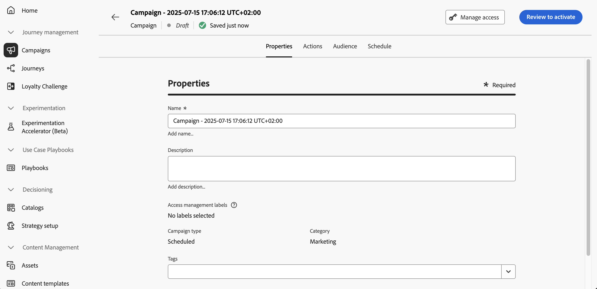

# Definiera egenskaperna för åtgärdskampanjen {#action-campaign-properties}

Så här skapar du en åtgärdskampanj och definierar dess egenskaper:

1. Bläddra till menyn **[!UICONTROL Campaigns]** och välj fliken **[!UICONTROL Action]**.

1. Klicka på knappen **[!UICONTROL Create campaign]** och välj kampanjtypen **[!UICONTROL Scheduled - Marketing]**.

   

1. Ange ett namn och en beskrivning för kampanjen på fliken **[!UICONTROL Properties]**.

   

1. Använd fältet **Taggar** för att tilldela enhetliga Adobe Experience Platform-taggar till kampanjen. På så sätt kan ni enkelt klassificera dem och förbättra sökningen från kampanjlistan. [Lär dig arbeta med taggar](../start/search-filter-categorize.md#tags).

1. Du kan begränsa åtkomsten till den här kampanjen baserat på åtkomstetiketter. Om du vill lägga till en åtkomstbegränsning bläddrar du till knappen **[!UICONTROL Manage access]** högst upp på sidan. Se till att endast markera etiketter som du har behörighet för. [Läs mer om åtkomstkontroll på objektnivå](../administration/object-based-access.md).

## Nästa steg {#next}

När åtgärdskampanjen har skapats och konfigurerats kan du konfigurera dess åtgärd. [Läs mer](campaign-action.md)
