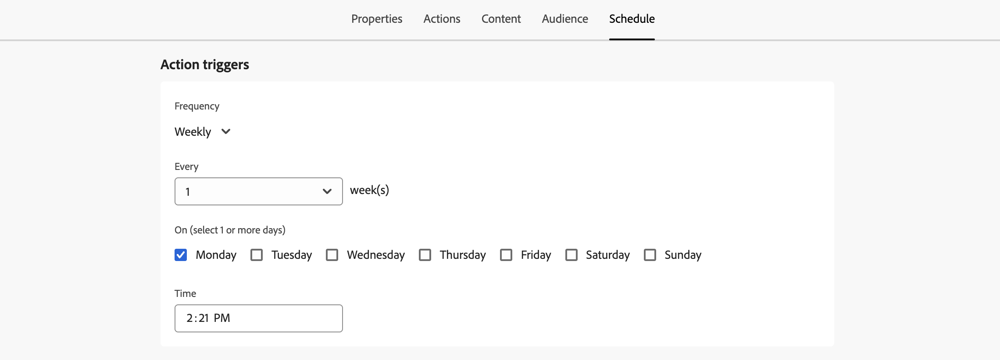

# Schemalägg åtgärdskampanjen {#action-campaign-schedule}

Använd fliken **[!UICONTROL Schedule]** för att definiera kampanjschemat.

## Ange startdatum för kampanj

Åtgärdskampanjer startar som standard när de aktiveras manuellt och avslutas så snart meddelandet har skickats en gång. Om du inte vill köra kampanjen direkt efter aktiveringen kan du ange ett datum och en tidpunkt då meddelandet ska skickas i avsnittet **[!UICONTROL Campaign start]**.

När du schemalägger kampanjer i [!DNL Adobe Journey Optimizer] måste du se till att startdatumet/starttiden är i linje med den önskade första leveransen. Om den initiala schemalagda tiden redan har passerat för återkommande kampanjer kommer kampanjerna att föras över till nästa tillgängliga tidsrymd enligt reglerna för återkommande kampanjer.

## Skicka vid mottagarens lokala tid {#profile-timezone}

>[!CONTEXTUALHELP]
>id="ajo_campaigns_schedule_profile_timezone"
>title="Använd profilens tidszon"
>abstract="Skicka meddelanden baserat på varje mottagares tidszon. Alla mottagare får meddelandet vid samma lokala tidpunkt, oavsett geografisk plats. Systemet använder fältet&quot;timeZone&quot; från Adobe Experience Platform-profiler, med kampanjskaparens tidszon som reserv."

När du schemalägger en kampanj för ett visst datum och en viss tid kan du välja att skicka meddelanden baserat på varje mottagares profiltidszon. Detta garanterar att alla mottagare får meddelandet på samma lokala tid, oavsett geografisk plats.

Om du t.ex. schemalägger en kampanj att skickas kl. 9.00 med tidszon för profiler, får mottagarna i New York (ET) den kl. 9.00 ET, medan mottagarna i Los Angeles (PT) får den kl. 9.00 PT.

>[!AVAILABILITY]
>
>Schemaläggning med tidszoner för profiler är endast tillgängligt för dessa utgående kanaler: Email, Push, SMS, WhatsApp och LINE.

Så här aktiverar du tidszonsplanering för profiler:

1. I avsnittet **[!UICONTROL Campaign start]** anger du datum och tid när meddelandet ska skickas.

1. Aktivera alternativet **[!UICONTROL Use profile timezone]**.

   

**Så här fungerar det:**

Systemet använder fältet `profile.timeZone` från varje mottagares Adobe Experience Platform-profil för att fastställa den lokala tidszonen. Om en profil inte har något tidszonsvärde används den tidszon som kampanjen skapades i som reserv.

Kampanjen behåller statusen **Live** medan meddelanden levereras över alla tidszoner. När alla tidszoner har bearbetats ändras kampanjstatusen till **Slutförd**.

**Tidszonsidentifierare som stöds:**

Formatet `profile.timeZone` kan vara antingen IANA-namn eller definierat som UTC-förskjutningar. IANA-namngivning är det format som du föredrar, eftersom det automatiskt justeras för regler som sparar dagsljus.

För IANA-namngivning är identifierarna skiftlägeskänsliga och måste matcha det officiella IANA-namnet. Förskjutningar kan ändras över tid på grund av sommarregler och historiska uppdateringar. I [IANA-tidszonsdatabasen](https://www.iana.org/time-zones){_blank} finns en officiell lista över identifierare.

## Ange en körningsfrekvens

För åtgärderna **E-post**, **SMS** och **push-meddelanden** kan du definiera en frekvens som kampanjens meddelande ska skickas med. Det gör du genom att använda alternativen **[!UICONTROL Action triggers]** på skärmen för att skapa kampanjer för att ange om kampanjen ska köras varje dag, varje vecka eller varje månad.

>[!NOTE]
>
>För **e-post**-åtgärder kan du skapa specifika aktiveringskampanjer för IP-uppvärmningsplan. Kampanjschemat styrs av IP-värmeringsplanen som det är kopplat till, vilket innebär att schemat inte längre definieras i själva kampanjen. [Lär dig hur du skapar IP-värmeringskampanjer](../configuration/ip-warmup-campaign.md).

## Ange ett slutdatum

I avsnittet **[!UICONTROL Campaign end]** kan du ange när en kampanj ska sluta köras. Utanför de angivna datumen kommer kampanjen inte att köras.

## Ange hastighetskontroll

Med [!DNL Journey Optimizer] kan du aktivera hastighetskontroll för utgående åtgärder (e-post, SMS, push-meddelanden).

Den här funktionen är särskilt användbar för att förhindra överbelastning i system längre fram i kedjan, som landningssidor eller kundtjänstplattformar. Du kan till exempel ange en hastighetsgräns på 165 meddelanden per sekund för att säkerställa stabil leverans utan överväldigande system i efterföljande led.

Om du vill ange hastighetskontroll aktiverar du alternativet **[!UICONTROL Throttle delivery]** i avsnittet **[!UICONTROL Delivery settings]** och anger önskad **[!UICONTROL Delivery rate]** per sekund.

* Lägsta tillåtna leveransfrekvens: 1 per sekund.
* Högsta leveransfrekvens som stöds: 2 000 per sekund när alternativet Begränsad leverans är aktiverat.

>[!IMPORTANT]
>
>När du anger en leveransfrekvens är den maximala tidsram som kampanjens målgrupp kan genomföra 12 timmar. Om leveransfrekvensen är inställd på ett värde som inte tillåter att alla målgrupper får meddelandet inom 12-timmars tidsram, kommer de återstående profilerna att uteslutas från kampanjen. Du kan se antalet uteslutna profiler i kampanjrapporten.

## Skicka med vågor

Om ni vill leverera kampanjmeddelanden gruppvis i stället för alla samtidigt kan ni använda vågutskick. Detta bidrar till att balansera belastning, leveransförmåga och undvika överväldigande system i efterföljande led (till exempel callcenters eller landningssidor). Du definierar antalet vågor, deras storlek (i procent eller absolut antal) och schemat för varje våg.

[Lär dig hur du skickar med vågor](send-using-waves.md).

## Nästa steg {#next}

När kampanjschemat är klart kan ni granska och aktivera kampanjen. [Läs mer](review-activate-campaign.md)
