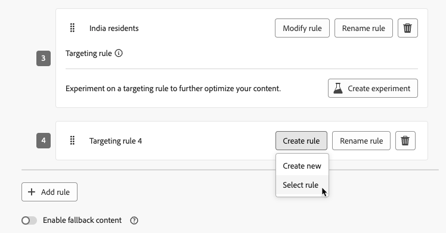

# Optimering av kampanjer och resor {#message-optimization}

Optimeringen ger er de verktyg ni behöver för att leverera personaliserat och optimerat innehåll till er målgrupp, <!--based on marketer-defined advanced decision configurations. This ensures that the right message reaches the right audience at the right time in order to maximize the effectiveness of your campaigns. (Removed for now as Decisioning is not yet supported)-->vilket ger maximal interaktion och framgång för att skapa <!--customized and -->effektiva resor och kampanjer.

Med optimering kan man

* Utnyttja reglerna för [målinriktning](#targeting)
* Kör [innehållsexperiment](#experimentation)
* Använd [avancerade kombinationer](#combination) av både experiment och målinriktning i en enda kampanj

När resan eller kampanjen är live utvärderas profiler mot de definierade kriterierna, och baserat på matchningskriterier levereras de med lämplig erfarenhet eller innehåll från resan/kampanjen.

Skillnaden mellan experiment och målinriktning kan beskrivas på följande sätt:

* Experimentationen består av en slumpmässig delning av innehållet baserat på &#x200B;.
* Riktad marknadsföring använder deterministiska tekniker för att leverera innehåll baserat på användarprofil, målgruppsmedlemskap eller kontextbaserade regler.

{width="110%" zoomable="yes"}

➡️ [Läs mer om optimering i en kampanj i den här videon](#video)

## Utnyttja målgruppsanpassning {#targeting}

>[!CONTEXTUALHELP]
>id="ajo_content_targeting_fallback"
>title="Vad är reservinnehåll?"
>abstract="Reservinnehåll gör att målgruppen kan få ett standardinnehåll när ingen målinriktningsregel är kvalificerad. Om du inte väljer det här alternativet kommer ingen målgrupp som inte är kvalificerad för en målregel som definieras ovan inte att få något innehåll."

Målinriktning levererar personaliserat innehåll till specifika målgruppssegment baserat på användarprofilattribut eller sammanhangsbaserade attribut.

Till skillnad från experiment, som är en slumpmässig tilldelning av ett budskap, är målinriktning avgörande när det gäller att leverera innehållet till rätt målgrupp.

Med målinriktning kan specifika regler definieras baserat på:

* **Användarprofilattribut**, t.ex. plats (t.ex. geoanpassning), ålder eller önskemål. Användare i USA kan till exempel se en kampanj för&quot;Golden Gate&quot;, medan användare i Frankrike ser en kampanj för&quot;Eiffeltornet&quot;.

* **Sammanhangsberoende data**, t.ex. enhetstyp (t.ex. målgruppsanpassning), tid på dygnet eller sessionsinformation. Datoranvändare får till exempel datoroptimerat innehåll, medan mobilanvändare får mobiloptimerat innehåll.

* **Publiker** som kan användas för att inkludera eller exkludera profiler som har ett visst målgruppsmedlemskap.

Följ stegen nedan för att konfigurera målinriktning.

1. Skapa en [resa](../building-journeys/journey-gs.md#jo-build) eller en [kampanj](../campaigns/create-campaign.md).

   >[!NOTE]
   >
   >Om du befinner dig på en resa lägger du till en **[!UICONTROL Action]**-aktivitet, väljer en kanalaktivitet och sedan **[!UICONTROL Configure action]**. [Läs mer](../building-journeys/journey-action.md#add-action)

1. Välj minst en åtgärd på fliken **[!UICONTROL Actions]**.

1. Välj **[!UICONTROL Optimization]** i avsnittet **[!UICONTROL Create targeting rule]**.

   {width=85%}

1. Klicka på **[!UICONTROL Create rule]** > **[!UICONTROL Create new]** och använd regelbyggaren för att definiera dina villkor oavsett var du är.

   {width=100%}

   Definiera t.ex. en regel för amerikanska medborgare, en regel för franska medborgare och en regel för indiska medborgare.

   {width=85%}

1. Du kan också klicka på **[!UICONTROL Create rule]** > **[!UICONTROL Select rule]** för att välja en befintlig målinriktningsregel som har skapats på menyn **[!UICONTROL Rules]**. [Läs mer](../experience-decisioning/rules.md)

   {width=70%}

   I det här fallet kopieras formeln som utgör regeln helt enkelt till resan eller kampanjen. Eventuella senare ändringar av den regeln från menyn **[!UICONTROL Rules]** påverkar inte resan eller kampanjens kopia.

   >[!AVAILABILITY]
   >
   >[Det går för närvarande att skapa målgruppsregler](../experience-decisioning/rules.md#create) från den dedikerade [!DNL Journey Optimizer]-menyn för organisationer som har köpt erbjudandet om tillägg till beslut, och de är tillgängliga på begäran för andra organisationer (begränsad tillgänglighet).
   >
   >Denna kapacitet kommer att successivt lanseras för alla kunder. Under tiden kontaktar du Adobe för att få åtkomst.

1. När du har lagt till en regel kan du fortfarande ändra den. Välj **[!UICONTROL Edit inline]** om du vill uppdatera den när du är i farten med regelverktyget eller **[!UICONTROL Select rule]** om du vill hämta en annan befintlig regel.

   {width=100%}

   >[!NOTE]
   >
   >När du redigerar en infogad regel påverkas inte den befintliga regel som den härstammar från.

1. Välj alternativet **[!UICONTROL Enable fallback content]** efter behov. Reservinnehåll gör att målgruppen kan få ett standardinnehåll när inga målinriktningsregler är kvalificerade.

   >[!NOTE]
   >
   >Om du inte väljer det här alternativet kommer ingen målgrupp som inte är berättigad till en målgruppsregel som definieras ovan inte att få något innehåll.

1. Spara målinriktningsregelinställningarna.

1. Gå tillbaka till fliken **[!UICONTROL Actions]** och välj **[!UICONTROL Edit content]**.

1. Utforma lämpligt innehåll för varje grupp som definieras av målregelinställningarna.

   {width=85%}

   I det här exemplet utformar du ett specifikt innehåll för amerikanska medborgare, ett annat innehåll för franska medborgare och ett annat innehåll för indiska medborgare.

1. [Aktivera](review-activate-campaign.md) din resa eller kampanj.

När resan/kampanjen är live skickas innehåll som är skräddarsytt för varje mål så att amerikanska medborgare får ett specifikt meddelande, Frankrike har ett annat budskap och så vidare.

<!--Default content:

* If no targeting rules match, default content can be delivered.

* If default content is not enabled, passthrough behavior ensures lower-priority campaigns are evaluated.-->

## Använd experimenterande {#experimentation}

Experimentation gör att du kan testa flera versioner av innehåll för att avgöra vilken som fungerar bäst baserat på fördefinierade framgångsmått.

Följ stegen nedan när du vill konfigurera experimenterande.

Säg att du vill testa följande kampanjmeddelanden i en kampanj:

* **Behandling A**:&quot;20 % rabatt på ditt nästa köp&quot;
* **Behandling B**:&quot;Fri frakt för beställningar över 50 USD&quot;
* **Behandling C**: &quot;Hämta ditt presentkort på 10 USD&quot;

Följ stegen nedan om du vill konfigurera experimenterande och avgöra vilket meddelande som ger flest inköp.

1. Skapa en [resa](../building-journeys/journey-gs.md#jo-build) eller en [kampanj](../campaigns/create-campaign.md).

   >[!NOTE]
   >
   >Om du befinner dig på en resa lägger du till en **[!UICONTROL Action]**-aktivitet, väljer en kanalaktivitet och sedan **[!UICONTROL Configure action]**. [Läs mer](../building-journeys/journey-action.md#add-action)

1. På fliken **[!UICONTROL Actions]** väljer du två inkommande åtgärder, till exempel [kodbaserad upplevelse](../code-based/get-started-code-based.md) och [I appen](../../rp_landing_pages/in-app-landing-page.md).

1. Välj **[!UICONTROL Optimization]** i avsnittet **[!UICONTROL Create experiment]**.

   {width=85%}

1. Designa och konfigurera ditt innehållsexperiment som du vill. [Lär dig hur](../content-management/content-experiment.md)

   {width=85%}

   När experimentet har definierats gäller det alla åtgärder som har infogats i kampanjen eller genom **[!UICONTROL Action]**-aktiviteten, vilket innebär att samma kunder ser samma erbjudanden på alla ytor.

   >[!NOTE]
   >
   >Du kan välja andra åtgärder: experimentet gäller för alla åtgärder som läggs till i kampanjen eller i åtgärden för resan.

1. [Aktivera](review-activate-campaign.md) din resa eller kampanj.

När resan/kampanjen är live tilldelas användarna slumpvis olika innehållsvariationer. [!DNL Journey Optimizer] spårar vilka varianter som driver fler inköp och ger åtgärdbara insikter.

Följ kampanjens framgångar med rapporterna om [kundresan](../reports/journey-global-report-cja.md) och [kampanjen](../reports/campaign-global-report-cja-experimentation.md). <!--Link to Experimentation journey reportis missing-->

## Kombinera målinriktning och experimenterande {#combination}

Med Journey Optimizer kan ni också kombinera målgruppsanpassning och experiment i en enda resa eller kampanj för att skapa mer sofistikerade strategier.

Ni kan faktiskt använda målinriktning för att skapa flera olika varianter, och för varje variant kan ni använda experiment för att optimera varje innehåll ytterligare. Detta garanterar att experimenten är specifika för varje målinriktningsregel och inte sträcker sig över flera varianter.

Du kan till exempel testa&quot;50 % rabatt&quot; jämfört med ett presentkort på&quot;$50&quot; för kunder i USA och göra ett annat test för kunder i Europa, till exempel&quot;fri frakt på beställningar över €&quot; jämfört med&quot;20 % rabatt på nästa köp&quot;.

Följ stegen nedan om du vill kombinera både målinriktning och experiment i en resa eller kampanj.

1. Skapa en resa eller en kampanj där ni definierar flera målinriktningsregler. [Lär dig hur](#targeting)

   {width=85%}

1. Skapa ett experiment för den första målinriktningsregeln.

1. Designa och konfigurera ditt innehållsexperiment som du vill. [Lär dig hur](../content-management/content-experiment.md)

   {width=85%}

   När experimentet har definierats gäller det bara den första målgruppsregeln.

1. Gå tillbaka till fliken **[!UICONTROL Actions]** och välj **[!UICONTROL Edit content]**.

1. För den grupp som definieras av din första målinriktningsregel kan du definiera ett specifikt innehåll för varje variant av ditt experiment.

   Om ni har lagt till mer än en inkommande åtgärd till er resa eller kampanj gäller samma kombination av målinriktning och experiment för varje åtgärd. Du måste dock definiera ett specifikt innehåll för varje variant av varje åtgärd.

   {width=85%}

1. Fortsätt på samma sätt med de andra målinriktningsreglerna och utforma motsvarande innehåll för varje variant.

1. Spara ändringarna och [aktivera](review-activate-campaign.md) din resa eller kampanj.

När resan/kampanjen är live tilldelas användare från varje målgrupp slumpvis de olika innehållsvariationerna som definierats för den grupp de tillhör.

<!--
## Reporting on Message optimization

E.g. explaining how a marketer can look at the report to determine which treatment (e.g. which message content) is performing the best for the targeting audience
-->

## Instruktionsvideo{#video}

Lär dig hur ni utnyttjar meddelandeoptimering i praktiken eller API-utlösta kampanjer. Ni får se hur ni kan rikta in er på undergrupper, skapa meddelandevarianter efter plats, aktivera reservinnehåll och köra flera experiment inom en och samma kampanj. Den här självstudiekursen handlar också om hur du hanterar flerkanalskampanjer samtidigt som du bibehåller meddelandets enhetlighet.

>[!VIDEO](https://video.tv.adobe.com/v/3470372?captions=swe&quality=12)