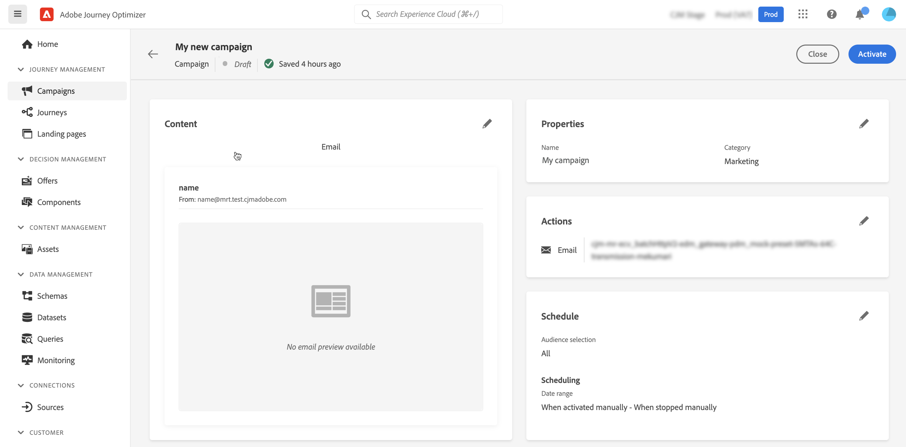

# Skapa en kampanj {#create-campaign}

>[!NOTE]
>
>Innan du skapar en ny kampanj måste du se till att du har en meddelandeförinställning och ett Adobe Experience Platform-segment klart att användas. Läs mer i följande avsnitt:
>
>* [Skapa meddelandeförinställningar](../configuration/message-presets.md)
>* [Kom igång med segment](../segment/about-segments.md)

## Konfigurera en kampanj {#configure}

Så här skapar du en kampanj:

1. Öppna **[!UICONTROL Campaigns]** menyn och klicka sedan på **[!UICONTROL Create campaign]**.

   

1. I **[!UICONTROL Properties]** anger du när kampanjen ska köras:

   * **[!UICONTROL Scheduled]**: köra kampanjen direkt eller på ett angivet datum. Schemalagda kampanjer syftar till att skicka **marknadsföring** typmeddelanden.
   * **[!UICONTROL API-triggered]**: köra kampanjen med ett API-anrop. API-utlösta kampanjer är avsedda att skicka **transaktionsbaserad** meddelanden, dvs. meddelanden som skickas ut efter en åtgärd som utförts av en individ: lösenordsåterställning, övergivna kort osv. [Lär dig hur du utlöser en kampanj med API:er](api-triggered-campaigns.md)

1. I **[!UICONTROL Actions]** väljer du kanal och meddelandeyta (d.v.s. meddelandeförinställning) som ska användas för att skicka meddelandet. Klicka sedan på **[!UICONTROL Create]**.

   

   >[!NOTE]
   >
   >Endast meddelandeytor som är kompatibla med kampanjtypen (marknadsföring eller transaktion) visas i listrutan.

1. Ange en titel och en beskrivning för kampanjen.

   <!--To test the content of your message, toggle the **[!UICONTROL Content experiment]** option on. This allows you to test multiple variables of a delivery on populations samples, in order to define which treatment has the biggest impact on the targeted population.[Learn more about content experiment](../campaigns/content-experiment.md).-->

1. I **[!UICONTROL Actions]** konfigurerar du meddelandet som ska skickas med kampanjen:

   1. Klicka på **[!UICONTROL Edit content]** och sedan konfigurera och utforma meddelandet. [Lär dig hur du konfigurerar meddelanden](../messages/get-started-content.md).

      När innehållet är klart klickar du på pilen för att gå tillbaka till skärmen för att skapa kampanjer.

      

   1. I **[!UICONTROL Actions tracking]** anger du om du vill spåra hur mottagarna svarar på leveransen.

      Spåra resultat kan nås från kampanjrapporten när kampanjen har genomförts. [Läs mer om kampanjrapporter](campaign-global-report.md)

1. Definiera målgruppen. Om du vill göra det klickar du på **[!UICONTROL Select audience]** om du vill visa en lista över tillgängliga Adobe Experience Platform-segment. [Läs mer om segment](../segment/about-segments.md)

   >[!NOTE]
   >
   >För API-utlösta kampanjer måste målgruppen anges via API-anrop. [Läs mer](api-triggered-campaigns.md)

   I **[!UICONTROL Identity namespace]** väljer du det namnutrymme som ska användas för att identifiera individerna från det valda segmentet. [Läs mer om namnutrymmen](../event/about-creating.md#select-the-namespace)

   

   >[!NOTE]
   >
   >Individer som tillhör ett segment som inte har den valda identiteten (namnutrymmet) bland sina olika identiteter kommer inte att omfattas av kampanjen.

1. Konfigurera kampanjens start- och slutdatum. Som standard är kampanjer konfigurerade att starta när de har aktiverats manuellt och att sluta så fort meddelandet har skickats.

1. Dessutom kan du ange en frekvens för körningen av åtgärden som konfigurerats i kampanjen.

   >[!NOTE]
   >
   >För API-utlösta kampanjer är schemaläggning vid ett visst datum och en viss tid med upprepning inte tillgängligt eftersom åtgärden utlöses via API. Start- och slutdatumet är dock relevanta för att säkerställa att API-anrop som görs före efter fönstret felskickas.

   

1. Om du skapar en API-utlöst kampanj kan **[!UICONTROL cURL request]** kan du hämta **[!UICONTROL Campaign ID]** som ska användas i API-anropet. [Läs mer](api-triggered-campaigns.md)

När kampanjen är klar kan du granska och publicera den (se [Granska och aktivera en kampanj](#review-activate)).

## Granska och aktivera en kampanj {#review-activate}

När kampanjen har konfigurerats måste du granska dess parameter och innehåll innan du aktiverar den. Följ dessa steg för att göra detta:

1. Klicka på **[!UICONTROL Review to activate]** för att visa en sammanfattning av kampanjen.

   Sammanfattningen gör att du kan ändra kampanjen om det behövs och kontrollera om någon parameter är felaktig eller saknas.

   >[!IMPORTANT]
   >
   >Om fel uppstår kan du inte aktivera kampanjen. Åtgärda felen innan du fortsätter.

   

1. Kontrollera att kampanjen är korrekt konfigurerad och klicka sedan på **[!UICONTROL Activate]**.

   

1. Kampanjen är nu aktiverad och har **[!UICONTROL Live]** status (eller **[!UICONTROL Scheduled]**  om du angav ett startdatum). [Läs mer om kampanjstatus](get-started-with-campaigns.md#statuses)

   Meddelandet som konfigurerats i kampanjen körs omedelbart eller på det angivna datumet.

   >[!NOTE]
   >
   >När en kampanj har aktiverats behåller den statusen&quot;Live&quot; även efter att meddelandet har körts. Om du vill ändra dess status måste du stoppa den manuellt. [Lär dig stoppa en kampanj](modify-stop-campaign.md)

1. När en kampanj har aktiverats kan du när som helst kontrollera dess information genom att öppna den. Sammanfattningen gör att du kan få statistik om antalet målprofiler och levererade och misslyckade åtgärder.

   Du kan även få ytterligare statistik i dedikerade rapporter genom att klicka på **[!UICONTROL Reports]** -knappen. [Läs mer](campaign-global-report.md)

   

   >[!IMPORTANT]
   >
   >Meddelanden som skapas i kampanjer är specifika för [!DNL Journey Optimizer] kampanjfunktioner. När de har skapats är de tillgängliga endast för kampanjer, och visas inte i **[!UICONTROL Messages]** -menyn.

## Ytterligare resurser

* [Kom igång med kampanjer](get-started-with-campaigns.md)
* [Skapa API-utlösta kampanjer](api-triggered-campaigns.md)
* [Ändra eller stoppa en kampanj](modify-stop-campaign.md)
* [Kampanjrapport](campaign-live-report.md)
* [Global kampanjrapport](campaign-global-report.md)
