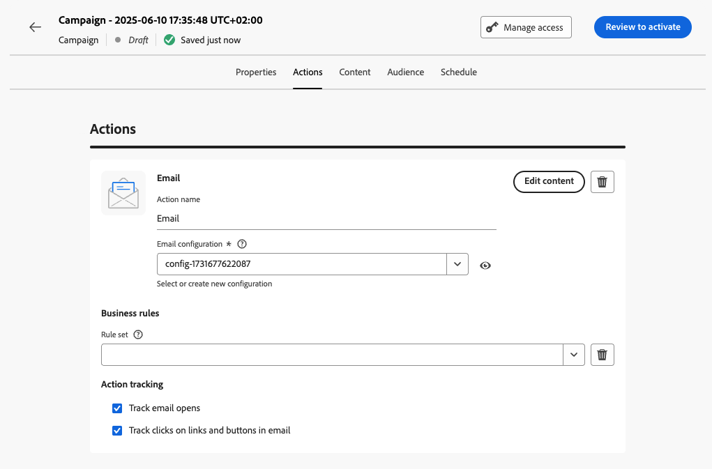

# Skapa en kampanj {#create-campaign}

>[!NOTE]
>
>Innan du skapar en ny kampanj måste du se till att du har en kanalkonfiguration (dvs. meddelandeyta) och en Adobe Experience Platform-målgrupp klar att använda. Läs mer i följande avsnitt:
>
>* [Skapa kanalkonfigurationer](../configuration/channel-surfaces.md)
>* [Kom igång med målgrupper](../audience/about-audiences.md)

Om du vill skapa en ny kampanj öppnar du menyn **[!UICONTROL Campaigns]** och klickar sedan på **[!UICONTROL Create campaign]**. Du kan också duplicera en befintlig livekampanj och skapa en ny. [Läs mer](modify-stop-campaign.md#duplicate)

## Välj kampanjtyp {#campaigntype}

>[!CONTEXTUALHELP]
>id="ajo_campaigns_campaign_type"
>title="Kampanjtyp"
>abstract="**Schemalagda kampanjer** körs omedelbart eller på ett angivet datum och är avsedda att skicka meddelanden av marknadsföringstyp. **API-utlösta** kampanjer körs med ett API-anrop. Syftet är att skicka antingen marknadsföringsmeddelanden (reklammeddelanden som kräver användarens samtycke) eller transaktionsmeddelanden (icke-kommersiella meddelanden, som också kan skickas till profiler som inte längre prenumererar i specifika sammanhang)."

>[!CONTEXTUALHELP]
>id="ajo_campaigns_campaign_category"
>title="Kampanjkategori"
>abstract="Om du skapar en schemalagd kampanj väljs typen **marketing** automatiskt. För API-utlösta kampanjer väljer du om du vill skicka ett **marknadsföringsmeddelande** (kampanjmeddelande som kräver användarens samtycke) eller **transaktionsmeddelande** (icke-kommersiellt meddelande, som också kan skickas till profiler som inte har prenumererats i specifika sammanhang)."

1. Välj den typ av kampanj som du vill köra

   * **[!UICONTROL Scheduled - Marketing]**: Kör kampanjen direkt eller på ett angivet datum. Schemalagda kampanjer syftar till att skicka **marknadsföringsmeddelanden**. De konfigureras och körs från användargränssnittet.

   * **[!UICONTROL API-triggered - Marketing/Transactional]**: Kör kampanjen med ett API-anrop. API-utlösta kampanjer syftar till att skicka antingen **marketing** - eller **transactional** -meddelanden, d.v.s. meddelanden som skickas ut efter en åtgärd som utförts av en individ: lösenordsåterställning, kundvagn osv. [Lär dig hur du utlöser en kampanj med API:er](api-triggered-campaigns.md)

   

1. Klicka på **[!UICONTROL Create]** för att skapa kampanjen.

## Definiera kampanjegenskaperna {#create}

1. I avsnittet **[!UICONTROL Properties]** anger du ett namn och en beskrivning för kampanjen.

   <!--To test the content of your message, toggle the **[!UICONTROL Content experiment]** option on. This allows you to test multiple variables of a delivery on populations samples, in order to define which treatment has the biggest impact on the targeted population.[Learn more about content experiment](../content-management/content-experiment.md).-->

1. I fältet **Taggar** kan du tilldela enhetliga Adobe Experience Platform-taggar till kampanjen. På så sätt kan ni enkelt klassificera dem och förbättra sökningen från kampanjlistan. [Lär dig arbeta med taggar](../start/search-filter-categorize.md#tags)

1. Klicka på knappen **[!UICONTROL Manage access]** om du vill tilldela etiketter för anpassad eller viktig dataanvändning till kampanjen. [Läs mer om OLA (Object Level Access Control)](../administration/object-based-access.md)

## Definiera kampanjmålgruppen {#audience}

Definiera målgruppen för kampanjen genom att följa dessa steg:

>[!IMPORTANT]
>
>Användning av målgrupper och attribut från [målgruppskomposition](../audience/get-started-audience-orchestration.md) är för närvarande inte tillgängligt för användning med hälso- och sjukvårdsskölden eller skölden för skydd av privatlivet och säkerheten.
>
>För API-utlösta kampanjer måste målgruppen anges via API-anrop.

1. Klicka på knappen **[!UICONTROL Select audience]** i avsnittet **Målgrupp** för att visa en lista över tillgängliga Adobe Experience Platform-målgrupper. [Läs mer om målgrupper](../audience/about-audiences.md)

1. I fältet **[!UICONTROL Identity namespace]** väljer du det namnutrymme som ska användas för att identifiera individerna från det valda segmentet.

   Individer som tillhör ett segment som inte har den valda identiteten (namnutrymmet) bland sina olika identiteter kommer inte att omfattas av kampanjen. [Läs mer om namnutrymmen](../event/about-creating.md#select-the-namespace)

   

   <!--If you are are creating an API-triggered campaign, the **[!UICONTROL cURL request]** section allows you to retrieve the **[!UICONTROL Campaign ID]** to use in the API call. [Learn more](api-triggered-campaigns.md)-->

## Skapa meddelandet och konfigurera spårning {#content}

1. I avsnittet **[!UICONTROL Actions]** väljer eller skapar du en ny konfiguration.

   En konfiguration definieras av en [systemadministratör](../start/path/administrator.md). Den innehåller alla tekniska parametrar för att skicka meddelandet, som rubrikparametrar, underdomän, mobilappar osv. [Läs mer](../configuration/channel-surfaces.md).

   Endast kanalkonfigurationer som är kompatibla med marknadsföringskampanjtypen visas i listrutan.

   

   >[!NOTE]
   >
   >Om du skapar en kampanj för push-meddelanden kan du aktivera **[!UICONTROL Rapid delivery mode]**, som är ett Journey Optimizer-tillägg som tillåter mycket snabba push-meddelanden som skickas i stora volymer. [Läs mer](../push/create-push.md#rapid-delivery)

1. Klicka på knappen **[!UICONTROL Edit content]** för att skapa och utforma meddelandet. Lär dig detaljerade steg för att skapa meddelandeinnehåll på följande sidor:

   <table style="table-layout:fixed">
    <tr style="border: 0;">
    <td>
    
    
<a href="../email/create-email.md"><strong>Skapa e-post</strong>
    

    

    </td>
    <td>
    
    

    <a href="../push/create-push.md"><strong>Skapa push-meddelanden</strong></a>
    

    

    </td>
    <td>
    
    

    <a href="../sms/create-sms.md"><strong>Skapa SMS-meddelanden</strong></a>
    

    

    </td>
    </tr>
    </table>

1. När innehållet har definierats kan du använda knappen **[!UICONTROL Simulate content]** för att förhandsgranska och testa innehållet med testprofiler. [Läs mer](../content-management/preview-test.md).

1. Klicka på pilen för att gå tillbaka till skärmen för att skapa kampanjer.

   

1. I avsnittet **[!UICONTROL Actions tracking]** anger du om du vill spåra hur mottagarna svarar på leveransen: du kan spåra klick och/eller öppningar.

   Spåra resultat kan nås från kampanjrapporten när kampanjen har genomförts. [Läs mer om kampanjrapporter](../reports/campaign-global-report.md)

## Schemalägg kampanjen {#schedule}

>[!CONTEXTUALHELP]
>id="ajo_campaigns_schedule"
>title="Kampanjschema"
>abstract="Som standard börjar kampanjer vid manuell aktivering och avslutas omedelbart efter att meddelandet har skickats en gång. Du kan dock ange ett specifikt datum och en viss tid för när meddelandet ska skickas. Dessutom kan du ange ett slutdatum för återkommande eller API-utlösta kampanjer. I åtgärdsutlösarna kan du även konfigurera meddelandets sändningsfrekvens så att den passar dina inställningar."

>[!CONTEXTUALHELP]
>id="ajo_campaigns_schedule_start"
>title="Kampanjstart"
>abstract="Ange ett datum och en tidpunkt då meddelandet ska skickas."

>[!CONTEXTUALHELP]
>id="ajo_campaigns_schedule_end"
>title="Kampanjslut"
>abstract="Ange när en återkommande kampanj ska sluta köras."

>[!CONTEXTUALHELP]
>id="ajo_campaigns_schedule_triggers"
>title="Kampanjåtgärdsutlösare"
>abstract="Definiera en frekvens som kampanjens meddelande ska skickas med."

Som standard börjar kampanjer när de har aktiverats manuellt och avslutas så snart meddelandet har skickats en gång.

Du kan definiera hur ofta kampanjens meddelande ska skickas. Det gör du genom att använda alternativen **[!UICONTROL Action triggers]** på skärmen för att skapa kampanjer för att ange om kampanjen ska köras varje dag, varje vecka eller varje månad.

Om du inte vill köra kampanjen direkt efter aktiveringen kan du ange ett datum och en tidpunkt då meddelandet ska skickas med alternativet **[!UICONTROL Campaign start]**. Med alternativet **[!UICONTROL Campaign end]** kan du ange när en återkommande kampanj ska sluta köras.

När kampanjen är klar kan ni granska och publicera den. [Läs mer](review-activate-campaign.md)
