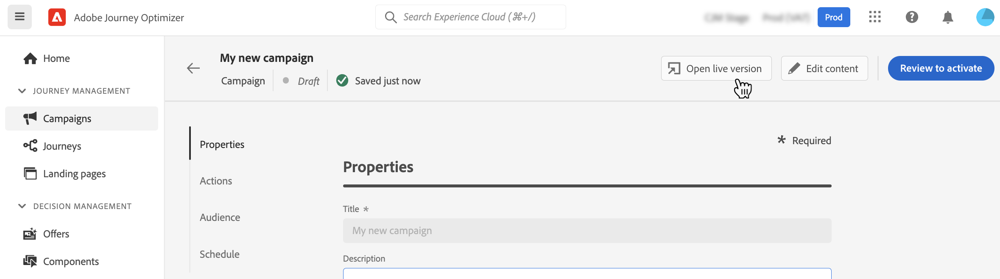
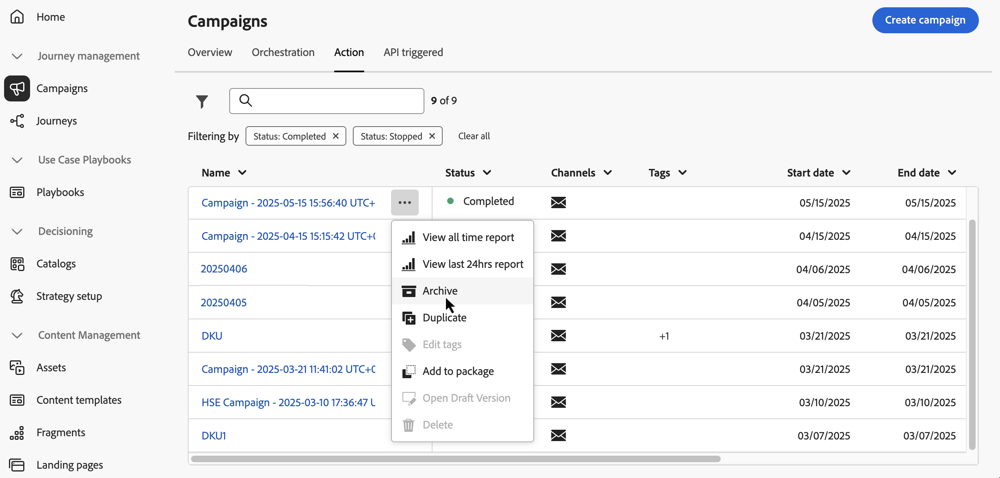
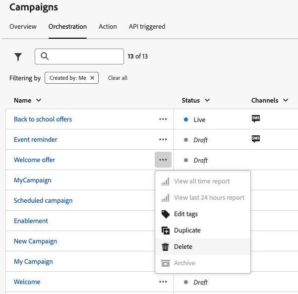

# Få tillgång till och hantera kampanjer {#manage-campaigns}

>[!CONTEXTUALHELP]
>id="ajo_targeting_workflow_list"
>title="Samlad kampanjinventering"
>abstract="På den här skärmen kan du få tillgång till den fullständiga listan över samordnade kampanjer, kontrollera deras aktuella status, sista/nästa körningsdatum och skapa en ny Orchestrated-kampanj."

>[!CONTEXTUALHELP]
>id="ajo_orchestration_campaign_action"
>title="Åtgärd"
>abstract="I det här avsnittet visas alla åtgärder som används i den samordnade kampanjen."

Kampanjer är tillgängliga på menyn **[!UICONTROL Campaigns]**. Använd flikarna för att bläddra bland kampanjer efter typ: **Åtgärd** kampanjer, **API-utlösta** kampanjer och **samordnade** kampanjer. Läs mer om de [olika kampanjtyperna](get-started-with-campaigns.md#get-started-campaigns). Vilka typer som är tillgängliga beror på ditt licensavtal och dina behörigheter.

>[!BEGINTABS]

>[!TAB Åtgärdskampanjer]

Välj fliken **[!UICONTROL Action]** för att få tillgång till listan över åtgärdskampanjer.

Som standard visas alla kampanjer med statusvärdena **[!UICONTROL Draft]**, **[!UICONTROL Scheduled]** och **[!UICONTROL Live]** i listan. Om du vill visa stoppade, slutförda och arkiverade kampanjer måste du rensa filtret.

>[!TAB API-utlösta kampanjer]

Välj fliken **[!UICONTROL API triggered]** för att få åtkomst till listan över API-utlösta kampanjer.

Som standard visas alla kampanjer med statusvärdena **[!UICONTROL Draft]**, **[!UICONTROL Scheduled]** och **[!UICONTROL Live]** i listan. Om du vill visa stoppade, slutförda och arkiverade kampanjer måste du rensa filtret.

>[!TAB Samordnade kampanjer]

Välj fliken **[!UICONTROL Orchestration]** om du vill få åtkomst till listan över Orchestrated-kampanjer.

{zoomable="yes"}{zoomable="yes"}

Varje orkestrerad kampanj i listan visar information som kampanjens aktuella [status](#status), den associerade kanalen och de associerade taggarna eller den senaste gången den ändrades. Du kan anpassa de kolumner som visas genom att klicka på knappen  .

>[!ENDTABS]

Dessutom finns det ett sökfält och filter som gör det enklare att söka i listan. Du kan till exempel filtrera kampanjer så att de bara visas för en viss kanal eller tagg, eller för kampanjer som skapats under ett visst datumintervall.

 i kampanjinventeringen gör att du kan utföra olika åtgärder som beskrivs nedan.

* **[!UICONTROL View all time report]** / **[!UICONTROL View last 24 hours report]** - Få tillgång till rapporter för att mäta och visualisera effekten och resultatet av era kampanjer. Läs mer om [kampanjrapporter](../reports/campaign-global-report-cja.md).
* **[!UICONTROL Edit tags]** - Redigera de taggar som är associerade med kampanjen. Lär dig hur du [använder taggar i dina kampanjer](../start/search-filter-categorize.md#add-tags)
* **[!UICONTROL Duplicate]** - Använd det här alternativet för att duplicera en kampanj, till exempel för att köra en Orchestrated-kampanj som har stoppats. [Läs mer](#duplicate-a-campaign)
* **[!UICONTROL Delete]** - Använd det här alternativet om du vill ta bort en kampanj. [Läs mer](#delete-a-campaign)
* **[!UICONTROL Archive]** - Arkivera kampanjen. Alla arkiverade kampanjer tas bort enligt ett rullande schema 30 dagar efter det att de senast ändrades. Den här åtgärden är tillgänglig för alla kampanjer förutom **[!UICONTROL Draft]** kampanjer. Läs mer om [kampanjarkivering](#archive-a-campaign).

För Action- och API-utlösta kampanjer finns ytterligare åtgärder nedan:

* **[!UICONTROL Add to package]** - Lägg till kampanjen i ett paket för att exportera den till en annan sandlåda. Lär dig hur du [exporterar objekt till en annan sandlåda](../configuration/copy-objects-to-sandbox.md)
* **[!UICONTROL Open draft version]** - Om en ny version av kampanjen har skapats och ännu inte har aktiverats kan du komma åt dess utkastversion med den här åtgärden.

## Kampanjlivscykel {#statuses}

I Adobe Journey Optimizer går varje kampanj igenom en livscykel som återspeglas av dess status i gränssnittet. De tillgängliga statusvärdena varierar beroende på kampanjtypen - Åtgärd, API-utlösta eller Orchestrated. Använd flikarna nedan för att utforska livscykeln och statusvärdena för varje kampanjtyp.

>[!BEGINTABS]

>[!TAB Åtgärdskampanjer]

* **[!UICONTROL Draft]**: Kampanjen redigeras, den har inte aktiverats.
* **[!UICONTROL Scheduled]**: Kampanjen är konfigurerad att aktiveras ett visst startdatum.
* **[!UICONTROL Live]**: Kampanjen har aktiverats.
* **[!UICONTROL In review]**: Kampanjen har skickats in för godkännande för publicering. [Lär dig arbeta med godkännanden](../test-approve/gs-approval.md)
* **[!UICONTROL Stopped]**: Kampanjen har stoppats manuellt. Du kan inte aktivera eller återanvända den längre. [Lär dig stoppa en kampanj](manage-campaigns.md#stop)
* **[!UICONTROL Completed]**: Kampanjen är slutförd. Den här statusen tilldelas automatiskt 3 dagar efter att en kampanj har aktiverats, eller vid kampanjens slutdatum om den har en återkommande körning.
* **[!UICONTROL Failed]**: Kampanjkörningen misslyckades. Kontrollera loggarna för att identifiera problemet.
* **[!UICONTROL Archived]**: Kampanjen har arkiverats. [Lär dig arkivera kampanjer](manage-campaigns.md#archive)

>[!NOTE]
>
>Ikonen Öppna utkast till version bredvid statusen **[!UICONTROL Live]** eller **[!UICONTROL Scheduled]** anger att en ny version av en kampanj som utlösts av en åtgärd eller API har skapats och inte har aktiverats än.

>[!TAB API-utlösta kampanjer]

* **[!UICONTROL Draft]**: Kampanjen redigeras, den har inte aktiverats.
* **[!UICONTROL Scheduled]**: Kampanjen är konfigurerad att aktiveras ett visst startdatum.
* **[!UICONTROL Live]**: Kampanjen har aktiverats.
* **[!UICONTROL In review]**: Kampanjen har skickats in för godkännande för publicering. [Lär dig arbeta med godkännanden](../test-approve/gs-approval.md)
* **[!UICONTROL Stopped]**: Kampanjen har stoppats manuellt. Du kan inte aktivera eller återanvända den längre. [Lär dig stoppa en kampanj](manage-campaigns.md#stop)
* **[!UICONTROL Completed]**: Kampanjen är slutförd. Den här statusen tilldelas automatiskt 3 dagar efter att en kampanj har aktiverats, eller vid kampanjens slutdatum om den har en återkommande körning.
* **[!UICONTROL Failed]**: Kampanjkörningen misslyckades. Kontrollera loggarna för att identifiera problemet.
* **[!UICONTROL Archived]**: Kampanjen har arkiverats. [Lär dig arkivera kampanjer](manage-campaigns.md#archive)

>[!NOTE]
>
>Ikonen Öppna utkast till version bredvid statusen **[!UICONTROL Live]** eller **[!UICONTROL Scheduled]** anger att en ny version av en kampanj som utlösts av en åtgärd eller API har skapats och inte har aktiverats än.

>[!TAB Samordnade kampanjer]

* **[!UICONTROL Draft]**: Den orchestrerade kampanjen har skapats. Den har inte publicerats än.
* **[!UICONTROL Publishing]**: Den Orchestrerade kampanjen publiceras.
* **[!UICONTROL Live]**: Den Orchestrerade kampanjen har publicerats och körs.
* **[!UICONTROL Scheduled]**: Den Orchestrerade kampanjkörningen har schemalagts.
* **[!UICONTROL Completed]**: Den Orchestrerade kampanjkörningen har slutförts. Statusen Slutförd tilldelas automatiskt upp till 3 dagar efter det att en kampanj har slutfört meddelanden som skickas utan fel.
* **[!UICONTROL Closed]**: Den här statusen visas när en återkommande kampanj har stängts. Kampanjen fortsätter att köras tills alla dess aktiviteter har slutförts, men inga fler profiler kan gå in i kampanjen.
* **[!UICONTROL Archived]**: Den orkestrerade kampanjen har arkiverats. Alla arkiverade kampanjer tas bort vid en rullande tidplan 30 dagar efter det senaste ändringsdatumet. Du kan duplicera en arkiverad kampanj om det behövs för att fortsätta arbeta med den.
* **[!UICONTROL Stopped]**: Den Orchestrerade kampanjkörningen har stoppats. Om du vill starta kampanjen igen måste du duplicera den.

>[!ENDTABS]

När ett fel inträffar inom en av era kampanjer visas en varningsikon bredvid kampanjens status. Klicka på den för att visa information om varningen. Dessa varningar kan inträffa i olika situationer, t.ex. när kampanjmeddelandet inte har publicerats eller om den valda konfigurationen är felaktig.

## Kampanjkalender {#calendar}

>[!CONTEXTUALHELP]
>id="ajo_campaigns_view"
>title="Kampanjlista och kalendervyer"
>abstract="Förutom kampanjlistan innehåller [!DNL Journey Optimizer] en kalendervy över dina kampanjer, som ger en tydlig visuell representation av deras scheman. Du kan när som helst växla mellan list- och kalendervyer med dessa knappar."

Förutom kampanjlistan innehåller [!DNL Journey Optimizer] en kalendervy över dina kampanjer, som ger en tydlig visuell representation av deras scheman.

Hur kampanjer presenteras:

* Som standard visar kalenderrutnätet alla aktiva och schemalagda kampanjer för den valda veckan. Ytterligare filteralternativ kan visa slutförda, stoppade och avslutade aktiveringar eller aktiveringar av en viss typ eller kanal.
* Utkastkampanjer visas inte.
* Kampanjer som sträcker sig över flera dagar visas högst upp i kalenderrutnätet.
* Om ingen starttid anges används den närmaste manuella aktiveringstiden för att placera den i kalendern.
* Kampanjer visas som 1-timmars tidsintervall, men detta återspeglar inte den faktiska tiden för sändning eller slutförande.

Så här navigerar du i din kampanjkalender:

1. Klicka på ikonen  för att komma åt din kampanjkalender.

1. Använd pilknapparna eller datumväljaren ovanför kalendern för att flytta mellan veckor.

   I kalendern visas alla kampanjer som är schemalagda för den aktuella veckan.

   

1. Klicka på  för att växla visningen av objekt som sträcker sig över flera dagar eller veckor.

   

1. Klicka på ikonen  för att hantera och lägga till upp till tre externa kalendrar.

   

1. Dra och släpp dina CSV-filer med händelsenamn, startdatum och slutdatum.

   Överförda händelser visas för alla användare i din organisation och visas i både Resekalendrar och Campaign-kalendrar.

   +++CSV-formatet ska vara följande:

   | Kolumn1 | Kolumn2 | Column3 |
   |-|-|-|
   | Händelsenamn | Startdatum i formatet mm/dd/åå | Slutdatum i formatet mm/dd/åå |

   +++

1. Om det behövs kan du dölja, visa eller ta bort tillagda externa kalendrar.

   

1. Om du vill ha mer information om en kampanj klickar du på det synliga blocket för att öppna detaljer om den. En informationsruta öppnas med olika information om kampanjen, t.ex. typ, åtkomst till rapporter eller taggar som har tilldelats.

   

## Ändra och stoppa återkommande åtgärdskampanjer {#modify}

### Ändra en åtgärdskampanj

Följ de här stegen för att ändra och skapa en ny version av en kampanj för återkommande åtgärder:

1. Öppna åtgärdskampanjen och klicka sedan på knappen **[!UICONTROL Modify campaign]**.

1. En ny version av kampanjen skapas. Du kan kontrollera live-versionen genom att klicka på **[!UICONTROL Open live version]**.

   

   I kampanjlistan visas aktiverade kampanjer med en pågående utkastversion med en specifik ikon i kolumnen **[!UICONTROL Status]**. Klicka på den här ikonen för att öppna utkastet till kampanjversionen.

   

1. När ändringarna är klara kan du aktivera den nya versionen av kampanjen (se [Granska och aktivera en kampanj](review-activate-campaign.md)).

   >[!IMPORTANT]
   >
   >När du aktiverar utkastet ersätts kampanjens liveversion.

### Stoppa en Action-kampanj {#stop}

Om du vill stoppa en återkommande kampanj öppnar du den och klickar sedan på knappen **[!UICONTROL Stop campaign]**.

>[!IMPORTANT]
>
>Att stoppa en kampanj kommer inte att stoppa en pågående sändning, men det kommer att stoppa en schemalagd sändning eller nästa förekomst om sändning redan pågår.

## Arkivera en kampanj {#archive}

Med tiden växer listan över kampanjer och blir så småningom svårare att hitta färdiga och stoppade kampanjer.

För att förhindra detta kan ni arkivera slutförda och stoppade kampanjer som ni inte längre behöver. Om du vill göra det klickar du på ellipsknappen och väljer **[!UICONTROL Archive]**.

Arkiverade kampanjer kan sedan hämtas med det dedikerade filtret i listan.

## Ta bort en kampanj {#delete}

Om du vill ta bort en kampanj använder du ellipsen  och väljer **[!UICONTROL Delete]**.

{width="70%" align="left"}

>[!IMPORTANT]
>
>Det här alternativet är endast tillgängligt för **[!UICONTROL Draft]** kampanjer.

## Duplicera en kampanj {#duplicate}

Om du vill duplicera en kampanj, till exempel om den har stoppats, använder du ellipsen  och väljer **[!UICONTROL Duplicate]**.

Ange namnet på kampanjen och bekräfta.

Kampanjen skapas och läggs till i kampanjlistan.
