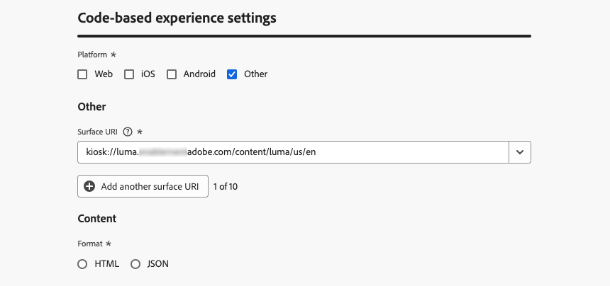

# Konfigurera din kodbaserade upplevelse {#code-based-configuration}

>[!CONTEXTUALHELP]
>id="ajo_code_based_surface"
>title="Definiera en kodbaserad upplevelsekonfiguration"
>abstract="En kodbaserad konfiguration definierar sökvägen och platsen i programmet, som identifieras unikt av en URI i programimplementeringen, där innehållet levereras och förbrukas."

Innan du [skapar din upplevelse](create-code-based.md) måste du skapa en kodbaserad upplevelsekonfiguration där du anger var innehållet ska levereras och användas i programmet.

En kodbaserad upplevelsekonfiguration måste referera till ytan, som i princip är den plats där du vill återge ändringarna. Enligt den valda plattformen måste du ange en plats/sökväg eller en URI för hela ytan. [Läs mer](code-based-surface.md)

>[!NOTE]
>
>När du har flera kodbaserade upplevelseåtgärder som använder samma kanalkonfiguration (och därmed körs på samma yta) avgör kampanjen eller resan **[!UICONTROL Priority score]** vad som skickas till slutanvändaren om de kvalificerar sig för mer än en åtgärd. [Läs mer om prioritetspoäng](../conflict-prioritization/priority-scores.md)

## Skapa en kodbaserad upplevelsekonfiguration {#create-code-based-configuration}

>[!CONTEXTUALHELP]
>id="ajo_admin_location"
>title="Ange den specifika platsen på sidan eller i appen"
>abstract="I det här fältet anges det exakta målet på en sida eller i det program som du vill att användarna ska ha tillgång till. Det kan vara ett visst avsnitt på en webbsida, eller en sida som är djup i programmets navigeringsstruktur."

>[!CONTEXTUALHELP]
>id="ajo_admin_default_mobile_url"
>title="Definiera en URL för att skapa och förhandsgranska innehåll"
>abstract="Det här fältet ser till att sidorna som genereras eller matchas av regeln har en angiven URL-adress, vilket är nödvändigt för att både skapa och förhandsgranska innehåll effektivt."

Så här skapar du en kodbaserad upplevelsekanalkonfiguration:

1. Gå till menyn **[!UICONTROL Channels]** > **[!UICONTROL General settings]** > **[!UICONTROL Channel configurations]** och klicka sedan på **[!UICONTROL Create channel configuration]**.

   

1. Ange ett namn och en beskrivning (valfritt) för konfigurationen.

   >[!NOTE]
   >
   > Namn måste börja med en bokstav (A-Z). Det får bara innehålla alfanumeriska tecken. Du kan också använda understreck `_`, punkt `.` och bindestreck `-`.

1. Om du vill tilldela anpassade eller grundläggande dataanvändningsetiketter till konfigurationen kan du välja **[!UICONTROL Manage access]**. [Läs mer om OLAC (Object Level Access Control)](../administration/object-based-access.md)

1. Välj **[!UICONTROL Marketing action]** om du vill associera medgivandeprinciper till meddelanden som använder den här konfigurationen. Alla policyer för samtycke som är kopplade till marknadsföringsåtgärden utnyttjas för att ta hänsyn till kundernas preferenser. [Läs mer](../action/consent.md#surface-marketing-actions)

1. Välj kanalen **Kodbaserad upplevelse**.

   

1. Välj den plattform som kodbaserad upplevelse ska användas för:

   * [Webb](#web)
   * [iOS och/eller Android](#mobile)
   * [Övriga](#other)

   >[!NOTE]
   >
   >Du kan välja flera plattformar. När du väljer flera plattformar levereras innehållet till alla valda sidor eller appar.

1. Välj det format som programmet förväntar sig för den här platsen. Detta kommer att användas när den kodbaserade upplevelsen skapas i kampanjer och resor.

   

1. Klicka på **[!UICONTROL Submit]** om du vill spara ändringarna.

Du kan nu välja den här konfigurationen när du [skapar en kodbaserad upplevelse](create-code-based.md) i dina kampanjer och resor.

>[!NOTE]
>
>Programimplementeringsteamet ansvarar för att skapa explicita API- eller SDK-anrop för att hämta innehåll för de ytor som definieras i den valda kodbaserade upplevelsekonfigurationen. Läs mer om olika kundimplementeringar i [det här avsnittet](code-based-implementation-samples.md).

### Webbplattformar {#web}

>[!CONTEXTUALHELP]
>id="ajo_admin_default_web_url"
>title="Definiera en URL för redigering och förhandsgranskning av innehåll"
>abstract="Det här fältet ser till att sidorna som genereras eller matchas av regeln har en angiven URL-adress, vilket är nödvändigt för att både skapa och förhandsgranska innehåll effektivt."

Följ stegen nedan för att definiera de kodbaserade inställningarna för upplevelsekonfiguration för webbplattformar.

1. Välj något av följande alternativ:

   * **[!UICONTROL Single page]** - Om du vill använda ändringarna på en enda sida enbart anger du **[!UICONTROL Page URL]**.

     

   * **[!UICONTROL Pages matching rule]** - Om du vill ha flera URL:er som matchar samma regel som mål ska du skapa en eller flera regler. [Läs mer](../web/web-configuration.md#web-page-matching-rule)

     <!--This could be used to apply changes universally across a website, such as updating a hero banner across all pages or adding a top image to display on every product page.-->

     Om du till exempel vill redigera element som visas på alla sidor med produkter för kvinnor på din Luma-webbplats väljer du **[!UICONTROL Domain]** > **[!UICONTROL Starts with]** > `luma` och **[!UICONTROL Page]** > **[!UICONTROL Contains]** > `women`.

     

1. Följande gäller för förhandsvisnings-URL:en:

   * Om du anger en URL för en sida används den URL:en för förhandsgranskningen - du behöver inte ange en annan URL.
   * Om du väljer en [sida som matchar regeln &#x200B;](../web/web-configuration.md#web-page-matching-rule) måste du ange en **[!UICONTROL Default authoring and preview URL]** som ska användas för att förhandsgranska upplevelsen i en webbläsare. [Läs mer](test-code-based.md#preview-on-device)

     

1. Fältet **[!UICONTROL Location on page]** anger det exakta målet på sidan som du vill att användarna ska få åtkomst till. Det kan vara ett visst avsnitt på en sida i webbplatsens navigeringsstruktur, till exempel&quot;hjälte-banner&quot; eller&quot;product-rail&quot;.

   >[!CAUTION]
   >
   >Strängen eller sökvägen som anges i det här fältet måste matcha den som deklarerats i din app- eller sidimplementering. Detta garanterar att innehållet levereras till önskad plats inuti den angivna appen eller sidan. [Läs mer](code-based-surface.md#uri-composition)

   

### Mobila plattformar (iOS och Android) {#mobile}

>[!CONTEXTUALHELP]
>id="ajo_admin_app_id"
>title="Ange ditt program-ID"
>abstract="Ange program-ID:t för korrekt identifiering och konfiguration i programmets driftsmiljö, vilket ger smidig integrering och funktionalitet."

>[!CONTEXTUALHELP]
>id="ajo_admin_mobile_url_preview"
>title="Ange URL-adressen för förhandsgranskning av innehåll"
>abstract="Det här fältet är viktigt för att du ska kunna simulera och förhandsgranska ditt innehåll direkt på enheten i programmet."

Följ stegen nedan för att definiera de kodbaserade upplevelsekonfigurationsinställningarna för mobila plattformar.

1. Ange din **[!UICONTROL App id]**. Detta gör att programmet kan identifieras och konfigureras korrekt i dess operativmiljö och säkerställer smidig integrering och funktionalitet.

1. Ange **[!UICONTROL Location or path inside the app]**. I det här fältet anges det exakta målet i programmet som du vill att användarna ska ha tillgång till. Det kan vara ett visst avsnitt eller en viss sida i programmets navigeringsstruktur, till exempel&quot;hero-banner&quot; eller&quot;product-rail&quot;.

   

1. Fyll i fältet **[!UICONTROL Preview URL]** om du vill aktivera förhandsvisningar på enheten. Den här URL:en informerar förhandsgranskningstjänsten om den specifika URL:en som ska användas när förhandsgranskning aktiveras på enheten. [Läs mer](test-code-based.md#preview-on-device)

   Förhandsgransknings-URL:en är en djup länk som konfigureras av apputvecklaren i din app. Detta garanterar att alla URL:er som matchar djuplänksschemat öppnas i appen i stället för i en mobilwebbläsare. Kontakta din apputvecklare för att få tillgång till det djuplänksschema som konfigurerats för din app.

+++  Följande resurser kan hjälpa dig att konfigurera djupa länkar för appimplementeringen

   * För Android:

      * [Skapa djupa länkar till appkontext](https://developer.android.com/training/app-links/deep-linking)

   * För iOS:

      * [Definiera ett anpassat URL-schema för din app](https://developer.apple.com/documentation/xcode/defining-a-custom-url-scheme-for-your-app)

      * [Supporting Universal Links in your app](https://developer.apple.com/documentation/xcode/supporting-universal-links-in-your-app)

+++

   >[!NOTE]
   >
   >Om du stöter på problem när du förhandsgranskar upplevelsen kan du läsa [den här dokumentationen](https://experienceleague.adobe.com/sv/docs/experience-platform/assurance/troubleshooting#app-does-not-open-link).

### Andra plattformar {#other}

Följ stegen nedan för att definiera de kodbaserade inställningarna för upplevelsekonfiguration för andra plattformar (t.ex. videokonsoler, tv-anslutna enheter, smarta tv-apparater, kioskdatorer, ATM-enheter, röstassistenter, IoT-enheter).

1. Välj **[!UICONTROL Other]** som plattform om din implementering inte är för webben, iOS eller Android, eller om du behöver ange specifika URI:er som mål.

1. Ange **[!UICONTROL Surface URI]**. En yt-URI är en unik identifierare som motsvarar den enhet där du vill leverera din upplevelse. [Läs mer](code-based-surface.md#surface-uri)

   

   >[!CAUTION]
   >
   >Se till att du anger en yt-URI som matchar den som används i din egen implementering. Annars kan ändringarna inte levereras. [Läs mer](code-based-surface.md#uri-composition)

1. **[!UICONTROL Add another surface URI]** om det behövs. Du kan lägga till upp till 10 URI:er.

   >[!NOTE]
   >
   >När du lägger till flera URI:er levereras innehållet till alla de angivna komponenterna.
