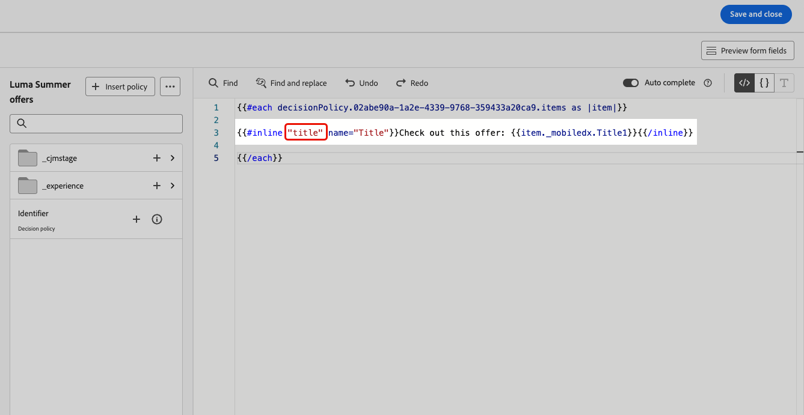
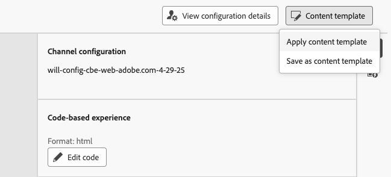

# Använd redigerbara formulärfält i kodbaserad upplevelse {#code-based-form-fields}

För både större flexibilitet och kontroll över de kodbaserade upplevelserna kan ditt utvecklingsteam i [!DNL Journey Optimizer] skapa JSON- eller HTML-innehållsmallar som innehåller specifika fördefinierade redigerbara fält.

När marknadsförarna skapar en kodbaserad upplevelse kan de icke-tekniska marknadsförarna sedan redigera dessa fält direkt i gränssnittet utan att behöva öppna personaliseringsredigeraren eller ta kontakt med andra kodelement under resan eller kampanjen.

Den här funktionen ger en förenklad upplevelse för marknadsföringsanvändare samtidigt som utvecklarna får bättre kontroll över kodinnehållet, vilket ger mindre utrymme för fel.

## Förstå formulärfältets syntax {#form-field-syntax}

Om du vill göra delar av en HTML- eller JSON-kodnyttolast redigerbara måste du använda en specifik syntax i uttrycksredigeraren. Detta innebär att deklarera en **variabel** med ett standardvärde som användare kan åsidosätta efter att ha använt innehållsmallen på sin kodbaserade upplevelse.

Anta till exempel att du vill skapa en innehållsmall som kan användas för dina kodbaserade upplevelser, och tillåta användare att anpassa en viss färg som används på olika platser, till exempel ramar eller knappar, för bakgrundsfärger.

När du skapar din innehållsmall måste du deklarera en variabel med ett **unikt ID**, till exempel *color*, och anropa den på önskade platser i innehållet där du vill använda den här färgen.

När du använder innehållsmallen på innehållet kan användarna anpassa färgen som används där variabeln refereras.

## Lägga till redigerbara fält i HTML- eller JSON-innehållsmallar {#add-editable-fields}

>[!CONTEXTUALHELP]
>id="ajo_cbe_preview_form_fields"
>title="Kontrollera formulärfältens återgivning"
>abstract="I JSON- eller HTML-innehållsmallar kan du definiera specifika redigerbara fält som gör att icke-tekniska användare enkelt kan redigera innehåll i kodbaserade upplevelser utan att behöva ändra kod. Skapa fälten med den dedikerade syntaxen och förhandsgranska dem med den här knappen."

Om du vill göra en del av din JSON- eller HTML-kod redigerbar börjar du med att skapa en kodbaserad upplevelse, [innehållsmall](../content-management/content-templates.md), där du kan definiera specifika formulärfält.

>[!NOTE]
>
>Det här steget utförs vanligtvis av en utvecklarprofil.

➡️ [Lär dig hur du lägger till redigerbara fält i kodbaserade upplevelsemallar i den här videon](#video)

1. Skapa en innehållsmall och välj kanalen **[!UICONTROL Code-based experience]**. [Lär dig skapa mallar](../content-management/create-content-templates.md)

1. Välj redigeringsläge: HTML eller JSON.

   >[!CAUTION]
   >
   >Om du ändrar redigeringsläget förlorar du all aktuell kod. De kodbaserade upplevelserna som bygger på den här mallen måste använda samma redigeringsläge.

1. Öppna [anpassningsredigeraren](../personalization/personalization-build-expressions.md) om du vill redigera kodinnehållet.

1. Om du vill definiera ett redigerbart formulärfält <!--To declare the variable you want users to edit--> går du till menyn **[!UICONTROL Helper functions]** i den vänstra navigeringsrutan och lägger till attributet **inline**. Syntaxen för att deklarera och anropa variabeln läggs automatiskt till i innehållet.

   {width="85%"}

1. Ersätt `"name"` med ett unikt ID för att identifiera det redigerbara fältet. Ange till exempel &quot;imgURL&quot;.

   >[!NOTE]
   >
   >Fält-ID måste vara unikt och får inte innehålla blanksteg. Detta ID bör användas överallt i ditt innehåll där du vill visa variabelns värde.

1. Anpassa syntaxen efter dina behov genom att lägga till parametrar som beskrivs i tabellen nedan:

   | Åtgärd | Parameter | Exempel |
   | ------- | ------- | ------- |
   | Deklarera ett redigerbart fält med ett **standardvärde**. När du lägger till mallen i innehållet används det här standardvärdet om du inte anpassar den. | Lägg till standardvärdet mellan de infogade taggarna. | `{{#inline "editableFieldID"}}default_value{{/inline}}` |
   | Definiera en **etikett** för det redigerbara fältet. Den här etiketten visas i kodredigeraren när du redigerar mallens fält. | `name="title"` | `{{#inline "editableFieldID" name="title"}}default_value{{/inline}}` |

   <!--
    | Action | Parameter| Example |
    | ------- | ------- | ------- |
    |Declare an editable field containing an **image source** that needs to be published.|`assetType="image"`|`{{#inline "editableFieldID" assetType="image"}}default_value{{/inline}}`|
    |Declare an editable field containing an **URL** that needs to be tracked.br/>Note that out-of-the-box "Mirror page URL" and "Unsubscribe link" predefined blocks cannot become editable fields.>|`assetType="url"`|`{{#inline "editableFieldID" assetType="url"}}default_value{{/inline}}`|
    -->

1. Klicka på **[!UICONTROL Preview form fields]** för att kontrollera hur de redigerbara formulärfälten visas i de kodbaserade upplevelser som använder den här mallen.

   {width="85%"}

1. Använd syntaxen `{{{name}}}` i koden på alla ställen där du vill visa värdet för det redigerbara fältet. Ersätt `name` med det unika ID:t för fältet som definierats tidigare.

   {width="85%"}

1. Fortsätt på samma sätt om du vill lägga till andra redigerbara fält, så att vart och ett av dem omsluts av taggarna `{{#inline}}` och `{{/inline}}`.

1. Redigera resten av koden efter behov, inklusive ID:n för de redigerbara fälten som du har definierat. [Lär dig hur](create-code-based.md#edit-code)

   

1. Spara mallen.

### Använd beslutsprofiler i redigerbara fältformulär {#decision-policy-in-form-fields}

När du skapar en kodbaserad innehållsmall för upplevelser kan du använda en beslutsprincip för att utnyttja erbjudanden i dina redigerbara formulärfält.

1. Skapa en kodbaserad upplevelsemall enligt beskrivningen [ovan](#add-editable-fields).

1. Klicka på **[!UICONTROL Add decision policy]** med ikonen **[!UICONTROL Show Decisioning]** i den högra listen på skärmen eller i uttrycksredigeraren i avsnittet **[!UICONTROL Decision policy]** på den vänstra menyn.

   Lär dig hur du skapar en beslutsprincip i [det här avsnittet](../experience-decisioning/create-decision.md#add-decision).

1. Klicka på knappen **[!UICONTROL Insert policy]**. Koden som motsvarar beslutspolicyn läggs till.

   

1. Efter taggen `{{#each}}` infogar du koden som motsvarar de redigerbara formulärfält som du vill lägga till med syntaxen **inline** som beskrivs [&#x200B; ovan](#add-editable-fields). Ersätt `"name"` med ett unikt ID för att identifiera det redigerbara fältet. I det här exemplet använder du &quot;title&quot;.

   {width="90%"}

1. Klicka på **[!UICONTROL Preview form fields]** för att kontrollera hur de redigerbara formulärfälten visas i de kodbaserade upplevelser som använder den här mallen.

   {width="70%"}

1. Infoga resten av koden ovanför taggen `{{/each}}`. Använd syntaxen `{{{name}}}` i koden på alla ställen där du vill visa värdet för det redigerbara fältet. I det här exemplet ersätter du `name` med&quot;title&quot;.

   {width="85%"}

1. Spara mallen.

### Exempel på koder {#code-examples}

Nedan finns några exempel på JSON- och HTML-mallar, varav några innehåller beslutspolicyer.

**JSON-mall:**

```
{{#inline "title" name="Title"}}Best gear for winter is here for you!{{/inline}} 
{{#inline "description" name="Description"}}Add description{{/inline}} 
{{#inline "imgURL" name="Image Link"}}Add link{{/inline}} 
{{#inline "number_of_items" name="Number of items"}}23{{/inline}}

{
  "title": "{{{title}}}",
  "description": "{{{description}}}",
  "imageUrl": "{{{imgURL}}}",
  "number_of_items": {{{number_of_items}}}, 
  "code": "DEFAULT"
}
```

>[!NOTE]
>
>När de textbundna fälten i JSON-nyttolasten refereras:
>
>* Strängtypsfält måste omslutas av citattecken.
>* Heltal eller booleska tecken får INTE omslutas av dubbla citattecken. (Se fältet `number_of_items` i exemplet ovan.)

**JSON-mall med beslut:**

```
{ 
"offer": [ 
{{#each decisionPolicy.fff709b7-7fef-4e4e-83d7-594fbcf196c1.items as |item|}} 
{{#inline "title" name="Title"}}{{item._mobiledx.Title1}}{{/inline}} {{#inline "description" name="Description"}}{{item._mobiledx.Title2}}{{/inline}} {{#inline "imgURL" name="Image Link"}}https://luma.enablementadobe.com/content/luma/us/en/experience/warming-up/_jcr_content/root/hero_image.coreimg.jpeg{{/inline}} 

{ 
"title": "{{{title}}}", 
"description": "{{{description}}}", 
"imageUrl": "{{{imgURL}}}", 
"link": "https://lumaenablement.adobe.com/web/luma/home", "code": "DEFAULT" 
}, 
{{/each}}
] 
}
```

>[!NOTE]
>
>Textbundna fält som du vill använda beslutsobjekt för måste placeras inuti beslutsprincipblocket - mellan taggarna `{{#each}}` och `{{/each}}`.

**HTML-mall:**

```
{{#inline "title" name="Title"}}Please enter title here{{/inline}} 
{{#inline "imgSrc" name="Image link"}}{{/inline}} 

<div class="TopRibbon__content">{{{title}}}</div> 
<style> .theme-luma .TopRibbon { background-color: #200098; }</style>
```

**HTML-mall med beslut:**

```
{{#each decisionPolicy.f112884a-5654-43ad-9d6d-dbd32ae23ee6.items as |item|}} 
{{#inline "title" name="Title"}}Title is: {{item._mobiledx.Title1}}{{/inline}} 

<div class="TopRibbon__content">{{{title}}}</div> 
<style> .theme-luma .TopRibbon { background-color: #200098; }</style> 

{{/each}}
```

## Redigera formulärfält i en kodbaserad upplevelse {#edit-form-fields}

>[!CONTEXTUALHELP]
>id="ajo_code_based_form_fields"
>title="Vad är formulärfält?"
>abstract="Den här kodbaserade upplevelsen innehåller formulärfält som du enkelt kan redigera utan att behöva ändra kod i personaliseringsredigeraren."

Nu när innehållsmallen som innehåller fördefinierade redigerbara formulärfält har skapats kan du skapa en kodbaserad upplevelse med den här innehållsmallen.

Du kan enkelt redigera formulärfälten från en kodbaserad upplevelseresa eller kampanj, utan att öppna personaliseringsredigeraren.

>[!NOTE]
>
>Det här steget utförs vanligtvis av en marknadsförare.

1. Välj innehållsmallen som innehåller redigerbara formulärfält från reseaktiviteten eller kampanjversionen. [Lär dig använda innehållsmallar](../content-management/use-content-templates.md)

   {width="60%"}

   >[!CAUTION]
   >
   >De mallar som är tillgängliga att välja omfattar antingen HTML eller JSON baserat på den kanalkonfiguration som valts tidigare. Endast kompatibla mallar visas.

1. De fält som har fördefinierats i den valda innehållsmallen är tillgängliga i den högra rutan. <!--The code preview is displayed with the rest of the code.-->

   

1. I avsnittet **[!UICONTROL Editable form fields]** kan du:

   * Redigera varje värde direkt i de redigerbara fälten, utan att öppna kodredigeraren.

   {width="60%"}

   * Klicka på personaliseringsikonen för att redigera varje fält med [kodredigeraren](../personalization/personalization-build-expressions.md).

   {width="70%"}

   >[!NOTE]
   >
   >I båda fallen kan du bara redigera ett fält i taget och du kan inte redigera resten av det kodbaserade upplevelseinnehållet.

1. Om en [beslutsprincip lades till](#decision-policy-in-form-fields) i innehållsmallen, kommer den med alla attribut som är tillgängliga i [erbjudandekatalogschemat](../experience-decisioning/catalogs.md). Du kan redigera beslutsobjektet textbundet eller använda uttrycksredigeraren.

1. Om du vill redigera resten av koden klickar du på knappen **[!UICONTROL Edit code]** och uppdaterar det fullständiga kodbaserade upplevelseinnehållet, inklusive redigerbara formulärfält. [Läs mer](create-code-based.md#edit-code)

## Instruktionsvideo {#video}

Lär dig hur du lägger till redigerbara fält i kodbaserade innehållsmallar för upplevelsekanaler.

>[!VIDEO](https://video.tv.adobe.com/v/3463995/?learn=on&#x26;enablevpops&captions=swe)
