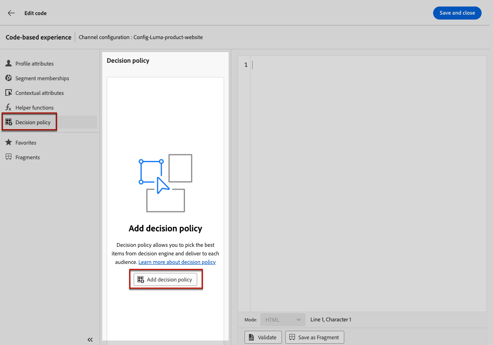

# Skapa kodbaserade upplevelser {#create-code-based}

I [!DNL Journey Optimizer] kan du skapa kodbaserade upplevelser under en resa eller en kampanj.

## Lägg till en kodbaserad upplevelse genom en resa eller en kampanj {#create-code-based-experience}

Följ stegen nedan för att börja bygga upp din kodbaserade upplevelse genom en resa eller en kampanj.

>[!BEGINTABS]

>[!TAB Lägg till en kodbaserad upplevelse på en resa]

Så här lägger du till en **kodbaserad upplevelse**-aktivitet på en resa:

1. [Skapa en resa](../building-journeys/journey-gs.md).

1. Starta din resa med en [Event](../building-journeys/general-events.md)- eller [Read Audience](../building-journeys/read-audience.md)-aktivitet.

1. Dra och släpp en **[!UICONTROL Action]**-aktivitet från **[!UICONTROL Actions]**-delen av paletten. Läs mer om [Åtgärdsaktiviteten](../building-journeys/journey-action.md).

   >[!IMPORTANT]
   >
   >Alla inbyggda kanaler som nu är tillgängliga via aktiviteten Åtgärd kommer äldre inbyggda kanalaktiviteter att bli inaktuella i mars-versionen. Befintliga resor med äldre åtgärder kommer att fortsätta att fungera som de är - ingen migrering krävs.

1. Välj **[!UICONTROL Code-based experience]** som åtgärdstyp.

   

   >[!NOTE]
   >
   >Eftersom **den kodbaserade upplevelsen** är en inkommande upplevelseaktivitet har den en **Wait**-aktivitet på 3 dagar. [Läs mer](../building-journeys/wait-activity.md#auto-wait-node)

1. Ange en **[!UICONTROL Label]** för att identifiera din åtgärd på arbetsytan för resan.

1. Klicka på knappen **[!UICONTROL Configure action]**.

1. Du dirigeras till fliken **[!UICONTROL Actions]**. Därifrån väljer eller skapar du den kodbaserade upplevelsekonfiguration som ska användas. [Läs mer](code-based-configuration.md)

   

   >[!NOTE]
   >
   >När du har flera kodbaserade funktionsåtgärder som använder samma kanalkonfiguration, avgör resan **[!UICONTROL Priority score]** vad som levereras till slutanvändaren om de kvalificerar sig för mer än en åtgärd. [Läs mer om prioritetspoäng](../conflict-prioritization/priority-scores.md)

1. Markera knappen **[!UICONTROL Edit content]** och redigera ditt innehåll efter behov med hjälp av anpassningsredigeraren. [Läs mer](#edit-code)

   Du kan också använda en befintlig innehållsmall som bas för kodinnehållet. Observera att mallarna som är tillgängliga att välja omfattar antingen HTML eller JSON baserat på den kanalkonfiguration som har valts tidigare. [Lär dig använda innehållsmallar](../content-management/use-content-templates.md)

1. Du kan lägga till en eller flera inkommande åtgärder i den kodbaserade upplevelsen genom att klicka på knappen **[!UICONTROL Add action]**. [Läs mer](../building-journeys/journey-action.md#multi-action)

1. Gå tillbaka till arbetsytan. Slutför vid behov kundresan genom att dra och släppa ytterligare åtgärder eller händelser. [Läs mer](../building-journeys/about-journey-activities.md)

Mer information om hur du skapar, konfigurerar och publicerar en resa finns på [den här sidan](../building-journeys/journey-gs.md).

>[!TAB Skapa en kodbaserad upplevelsekampanj]

Följ stegen nedan för att börja skapa din **kodbaserade**-upplevelse via en kampanj.

1. Skapa en kampanj. [Läs mer](../campaigns/create-campaign.md)

1. Välj kampanjtypen **Schemalagd - marknadsföring**.

1. Slutför stegen för att skapa en kampanj, till exempel kampanjegenskaperna, [målgrupp](../audience/about-audiences.md) och [schema](../campaigns/create-campaign.md#schedule). Mer information om hur du konfigurerar en kampanj finns på [den här sidan](../campaigns/get-started-with-campaigns.md).

1. Välj åtgärden **[!UICONTROL Code-based experience]**.

1. Välj eller skapa den kodbaserade upplevelsekonfiguration som ska användas. [Läs mer](code-based-configuration.md)

   

   >[!NOTE]
   >
   >När du har flera kodbaserade funktionsåtgärder som använder samma kanalkonfiguration avgör kampanjens **[!UICONTROL Priority score]** vad som levereras till slutanvändaren om de kvalificerar sig för mer än en åtgärd. [Läs mer om prioritetspoäng](../conflict-prioritization/priority-scores.md)

1. Redigera ditt innehåll med personaliseringsredigeraren. [Läs mer](#edit-code)

   Du kan också använda en befintlig innehållsmall som bas för kodinnehållet. Observera att mallarna som är tillgängliga att välja omfattar antingen HTML eller JSON baserat på den kanalkonfiguration som har valts tidigare. [Lär dig använda innehållsmallar](../content-management/use-content-templates.md)

   <!---->

Mer information om hur du skapar, konfigurerar och aktiverar en kampanj finns på [den här sidan](../campaigns/get-started-with-campaigns.md).

➡️ [Lär dig skapa en kodbaserad upplevelsekampanj i den här videon](#video)

>[!ENDTABS]

## Redigera kodinnehållet {#edit-code}

>[!CONTEXTUALHELP]
>id="ajo_code_based_experience"
>title="Använda personaliseringsredigeraren"
>abstract="Infoga och redigera koden som du vill leverera som en del av den här kodbaserade upplevelseåtgärden."
>additional-url="https://experienceleague.adobe.com/sv/docs/journey-optimizer/using/content-management/personalization/personalization-build-expressions" text="Arbeta med personaliseringsredigeraren"

Följ stegen nedan för att redigera innehållet i din kodbaserade upplevelse.

1. Välj **[!UICONTROL Edit code]** från reseaktiviteten eller kampanjversionen.

   

   >[!NOTE]
   >
   >Om du använder en kodbaserad innehållsmall för upplevelser med fördefinierade redigerbara formulärfält kan du hantera innehållet i dessa fält utan att öppna redigeraren för personalisering. [Läs mer](code-based-form-fields.md)

1. [Anpassningsredigeraren](../personalization/personalization-build-expressions.md) öppnas. Det är ett gränssnitt för att skapa icke-visuella upplevelser som gör att du kan skapa koden.

1. Du kan växla mellan redigeringsläget i HTML och JSON, och vice versa.

   

   >[!CAUTION]
   >
   >Om du ändrar redigeringsläget förlorar du all aktuell kod, så se till att växla läge innan du börjar redigera.

1. Ange koden efter behov. Du kan utnyttja personaliseringsredigeraren [!DNL Journey Optimizer] med alla dess funktioner för personalisering och redigering. [Läs mer](../personalization/personalization-build-expressions.md)

1. Du kan lägga till HTML- eller JSON-uttrycksfragment om det behövs. [Lär dig hur](../personalization/use-expression-fragments.md)

   Du kan också spara en del av kodinnehållet som fragment. [Lär dig hur](../content-management/fragments.md#visual-expression)

1. Med kodbaserade upplevelser kan ni använda beslutsfunktionen. Välj ikonen **[!UICONTROL Decision policy]** i det vänstra fältet och klicka på **[!UICONTROL Add decision policy]**. [Läs mer](../experience-decisioning/create-decision.md#create-decision)

   

   <!---->

   Från kundresan eller kampanjversionen kan ni också lägga till en beslutspolicy direkt utan att behöva öppna personaliseringsredigeraren. Använd den dedikerade ikonen till höger för att visa avsnittet **[!UICONTROL Decisioning]**.

   <!---->

   De detaljerade stegen för att skapa en beslutsprincip visas i [det här avsnittet](../experience-decisioning/create-decision.md#create-decision).

1. Klicka på **[!UICONTROL Save and close]** för att bekräfta ändringarna.

När utvecklaren gör ett API- eller SDK-anrop för att hämta innehåll för den yta som definieras i kanalkonfigurationen, tillämpas ändringarna på webbsidan eller appen.

## Instruktionsvideo{#video}

I videon nedan visas hur du skapar en kodbaserad upplevelsekampanj, konfigurerar dess egenskaper, testar och publicerar den.

>[!VIDEO](https://video.tv.adobe.com/v/3449457/?captions=swe&quality=12&learn=on)
