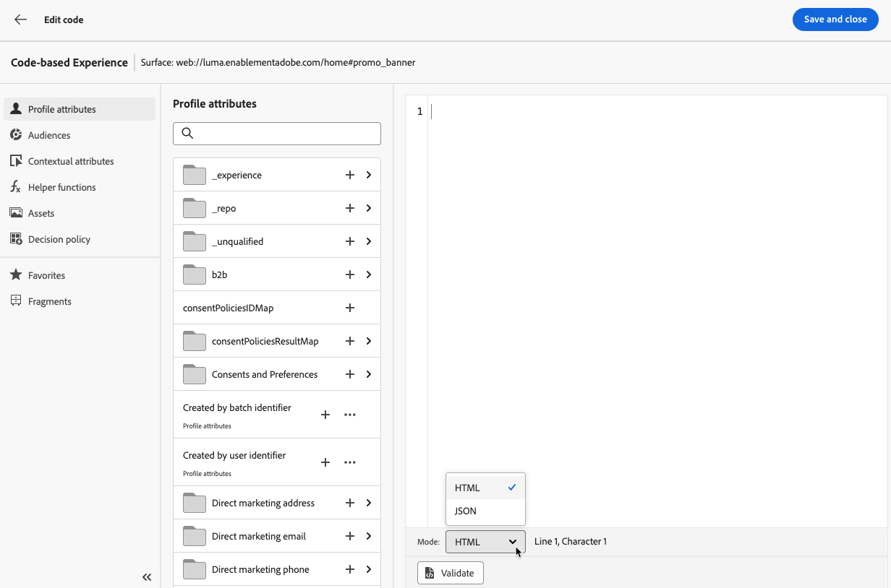

# Skapa kodbaserade upplevelser {#create-code-based}

I [!DNL Journey Optimizer] kan du för närvarande bara skapa kodbaserade upplevelser i **kampanjer**.

Specifika skyddsutkast och rekommendationer för kodbaserade upplevelser finns på [den här sidan](code-based-prerequisites.md).

## Skapa en kodbaserad kampanj {#create-code-based-campaign}

Följ stegen nedan för att börja skapa en kodbaserad upplevelse genom en kampanj.

1. Skapa en kampanj. [Läs mer](../campaigns/create-campaign.md)

1. Välj åtgärden **[!UICONTROL Code-based experience]**.

1. Ange den kodbaserade upplevelseytan. [Läs mer](#surface-definition)

   

   >[!CAUTION]
   >
   >Kontrollera att den yt-URI som används i din kodbaserade kampanj matchar den som används i din egen implementering. Annars levereras inte ändringarna.

1. Välj **[!UICONTROL Create]**.

1. Slutför stegen för att skapa en kampanj, till exempel kampanjegenskaperna, [målgrupp](../audience/about-audiences.md) och [schema](../campaigns/create-campaign.md#schedule). Mer information om hur du konfigurerar en kampanj finns på [den här sidan](../campaigns/get-started-with-campaigns.md).

1. Redigera ditt innehåll med personaliseringsredigeraren. [Läs mer](#edit-code)

   

## Redigera kodinnehållet {#edit-code}

>[!CONTEXTUALHELP]
>id="ajo_code_based_experience"
>title="Använda personaliseringsredigeraren"
>abstract="Infoga och redigera koden som du vill leverera som en del av den här kodbaserade upplevelseåtgärden."
>additional-url="https://experienceleague.adobe.com/docs/journey-optimizer/using/content-management/personalization/expression-editor/personalization-build-expressions.html" text="Kom igång med personaliseringsredigeraren"

1. Välj **[!UICONTROL Edit code]** på skärmen för kampanjversionen.

   

1. [Anpassningsredigeraren](../personalization/personalization-build-expressions.md) öppnas. Det är ett gränssnitt för att skapa icke-visuella upplevelser som gör att du kan skapa koden.

1. Du kan växla mellan redigeringsläget HTML och JSON, och vice versa.

   

   >[!CAUTION]
   >
   >Om du ändrar redigeringsläget förlorar du all aktuell kod, så se till att växla läge innan du börjar redigera.

1. Ange koden efter behov. Du kan utnyttja personaliseringsredigeraren [!DNL Journey Optimizer] med alla dess funktioner för personalisering och redigering. [Läs mer](../personalization/personalization-build-expressions.md)

1. Du kan lägga till HTML eller JSON-uttrycksfragment om det behövs. [Lär dig hur](../personalization/use-expression-fragments.md)

   Du kan också spara en del av kodinnehållet som fragment. [Lär dig hur](../content-management/fragments.md#save-as-expression-fragment)

1. I kodbaserade kampanjer kan ni använda funktionen för upplevelsebeslut. Välj ikonen **[!UICONTROL Decisions]** i det vänstra fältet och klicka på **[!UICONTROL Create decision]**. [Läs mer](../experience-decisioning/create-decision.md)

   

   >[!NOTE]
   >
   >Experience Decision är för närvarande bara tillgängligt för en uppsättning organisationer (begränsad tillgänglighet). Kontakta din Adobe-representant för att få åtkomst.

1. Klicka på **[!UICONTROL Save and close]** för att bekräfta ändringarna.

Så snart utvecklaren gör ett API- eller SDK-anrop för att hämta innehåll för den valda ytan tillämpas ändringarna på din webbsida eller app.

## Testa den kodbaserade kampanjen {#test-code-based-campaign}

>[!CONTEXTUALHELP]
>id="ajo_code_based_preview"
>title="Förgranska din kodbaserade upplevelse"
>abstract="Få en simulering av hur er kodbaserade upplevelse kommer att se ut."

Följ stegen nedan för att visa en förhandsgranskning av din ändrade kodbaserade upplevelse. Detaljerad information om hur du väljer testprofiler och förhandsgranskar ditt innehåll finns på [Förhandsgranska och testa din innehållssida](../content-management/preview-test.md).

>[!CAUTION]
>
>Du måste ha testprofiler tillgängliga för att simulera vilka erbjudanden som ska levereras till dem. Lär dig hur du [skapar testprofiler](../audience/creating-test-profiles.md).

1. Välj **[!UICONTROL Simulate content]** i anpassningsredigeraren eller på skärmen för att redigera innehåll.

   

1. Klicka på **[!UICONTROL Manage test profiles]** för att välja en eller flera testprofiler.

1. En förhandsgranskning av den ändrade kodbaserade upplevelsen visas.

<!--
    

    You can also open it in the default browser, or copy the test URI to paste it in any browser. This allows you to share the link with your team and stakeholders who will be able to preview the new web experience in any browser before the campaign goes live.

    When copying the test URI, the content displayed is the one personalized for the test profile used when the content simulation was generated in [!DNL Journey Optimizer].-->

## Aktivera den kodbaserade kampanjen {#activate-code-based-campaign}

När du har definierat din kodbaserade kampanj och redigerat innehållet som du vill med den [kodbaserade redigeraren](#edit-code) kan du granska och aktivera den. Följ stegen nedan.

>[!NOTE]
>
>Du kan också förhandsgranska kampanjinnehållet innan du aktiverar det. [Läs mer](#test-code-based-campaign)

1. Välj **[!UICONTROL Review to activate]** från din kodbaserade kampanj.

   

1. Kontrollera och redigera vid behov innehåll, egenskaper, yta, målgrupp och schema.

1. Välj **[!UICONTROL Activate]**.

   

   >[!NOTE]
   >
   >När du har klickat på **[!UICONTROL Activate]** kan det ta upp till en minut innan kodbaserade kampanjändringar är tillgängliga direkt på din plats.

Din kodbaserade kampanj har statusen **[!UICONTROL Live]** och är nu synlig för den valda målgruppen. Alla mottagare av kampanjen kan se dina ändringar.

>[!NOTE]
>
>Om du har definierat ett schema för den kodbaserade kampanjen har den statusen **[!UICONTROL Scheduled]** tills startdatumet och starttiden nås.
>
>Om du aktiverar en kodbaserad kampanj som påverkar samma platser som en annan kampanj som redan är aktiv, tillämpas alla ändringar på dina platser.

Läs mer om hur du aktiverar kampanjer i [det här avsnittet](../campaigns/review-activate-campaign.md).

## Stoppa en kodbaserad kampanj {#stop-code-based-campaign}

När en kodbaserad kampanj är aktiv kan ni stoppa den för att hindra publiken från att se ändringarna. Följ stegen nedan.

1. Välj en livekampanj i listan.

1. Välj **[!UICONTROL Stop campaign]** på den översta menyn.

   

1. De ändringar du har lagt till visas inte längre för den målgrupp du har definierat.

>[!NOTE]
>
>När en kodbaserad kampanj har stoppats kan du inte redigera eller aktivera den igen. Du kan bara duplicera den och aktivera den duplicerade kampanjen.

## Kodbaserade kampanjrapporter

Du kan få tillgång till kodbaserade kampanjrapporter från kampanjsammanfattningsskärmen.

Globala rapporter visar händelser som inträffade för minst två timmar sedan och täcker händelser under en vald tidsperiod. Live-rapporter fokuserar på händelser som har inträffat under de senaste 24 timmarna, med ett tidsintervall på minst två minuter från händelseförekomsten.

### Kodbaserad live-rapport {#live-report-code-based}

Från din kampanj **[!UICONTROL Live report]** anger fliken **[!UICONTROL Code-based experience]** huvudinformationen i förhållande till dina appar eller webbsidor. [Läs mer i live-rapporten](../reports/campaign-live-report.md)

+++Läs mer om de olika mätvärden och widgetar som är tillgängliga för den kodbaserade upplevelserapporten.

KPI:erna för **[!UICONTROL Code-based experience performance]** detaljerar huvudinformationen i relation till besökarnas engagemang med dina kodbaserade upplevelser, som:

* **[!UICONTROL Impressions]**: Totalt antal upplevelser som levereras till alla användare.

* **[!UICONTROL Interactions]**: totalt antal ärenden för din app/sida. Detta inkluderar alla åtgärder som användaren utför, t.ex. klickningar eller andra interaktioner.

Diagrammet **[!UICONTROL Code-based experience summary]** visar hur dina upplevelser har utvecklats (visningar, unika visningar och interaktioner) de senaste 24 timmarna.

<!--The **[!UICONTROL Interactions by element]** table details the main information relative to your visitors' engagement with the various elements on your app/pages.-->
+++

### Kodbaserad global rapport {#global-report-code-based}

Kodbaserad global kampanjrapport kan nås direkt från din kampanj med knappen **[!UICONTROL View report]**. [Läs mer om global rapport](../reports/campaign-global-report.md)

Från din kampanj **[!UICONTROL Global report]** anger fliken **[!UICONTROL Code-based experience]** huvudinformationen i förhållande till dina appar eller webbsidor.

<!--image-->

+++Läs mer om de olika mätvärden och widgetar som är tillgängliga för den kodbaserade upplevelserapporten.

KPI:erna för **[!UICONTROL Code-based experience performance]** detaljerar huvudinformationen i relation till besökarnas engagemang med dina upplevelser, som:

* **[!UICONTROL Unique impressions]**: antal unika användare som upplevelsen har levererats till.

* **[!UICONTROL Impressions]**: Totalt antal upplevelser som levereras till alla användare.

* **[!UICONTROL Interactions]**: procentandel av engagemang med din app/sida. Detta inkluderar alla åtgärder som användaren utför, t.ex. klickningar eller andra interaktioner.

Diagrammet **[!UICONTROL Code-based experience summary]** visar hur dina upplevelser har utvecklats (unika intryck, visningar och interaktioner) under den aktuella perioden.

<!--The **[!UICONTROL Interactions by element]** table details the main information relative to your visitors' engagement with the various elements on your apps/pages.-->
+++

<!--
## How-to video{#video}

The video below shows how to create a code-based campaign, configure its properties, review, and publish it.

>[!VIDEO]()

-->
