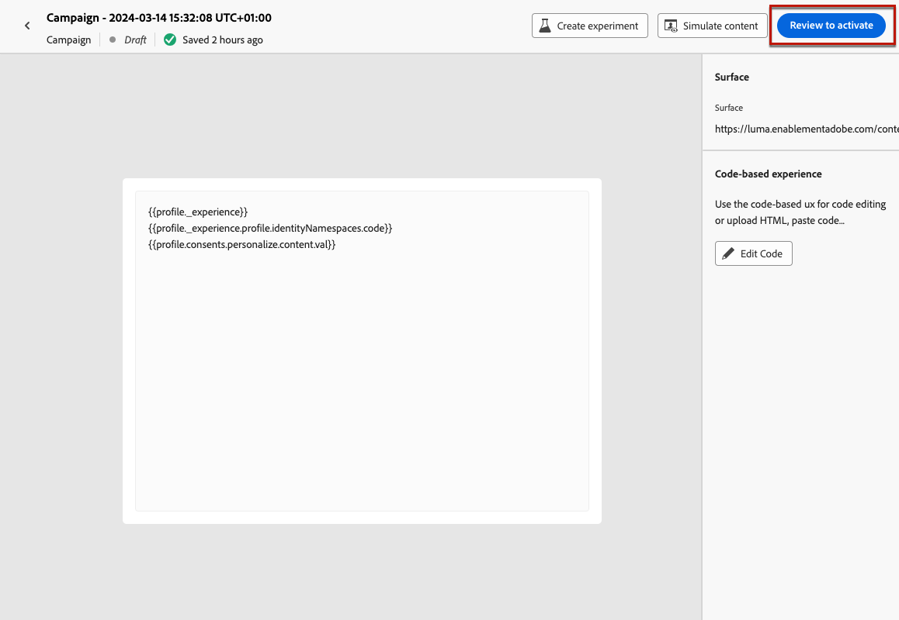

# Skapa kodbaserade upplevelser {#create-code-based}

I [!DNL Journey Optimizer] kan du skapa kodbaserade upplevelser under en resa eller en kampanj.

Specifika skyddsutkast och rekommendationer för kodbaserade upplevelser finns på [den här sidan](code-based-prerequisites.md).

## Lägg till en kodbaserad upplevelse genom en resa eller en kampanj {#create-code-based-experience}

Följ stegen nedan för att börja bygga upp din kodbaserade upplevelse genom en resa eller en kampanj.

>[!BEGINTABS]

>[!TAB Lägg till en kodbaserad upplevelse på en resa]

Så här lägger du till en **kodbaserad upplevelse**-aktivitet på en resa:

1. [Skapa en resa](../building-journeys/journey-gs.md).

1. Starta din resa med en [Event](../building-journeys/general-events.md)- eller [Read Audience](../building-journeys/read-audience.md)-aktivitet.

1. Dra och släpp en **[!UICONTROL Code-based experience]**-aktivitet från **[!UICONTROL Actions]**-delen av paletten.

   

   >[!NOTE]
   >
   >Eftersom **Kodbaserad upplevelse** är en inkommande meddelandeaktivitet levereras den med en 3-dagars **Wait**-aktivitet. [Läs mer](../building-journeys/wait-activity.md#auto-wait-node)

1. Ange **[!UICONTROL Label]** och **[!UICONTROL Description]** för meddelandet.

1. Välj eller skapa den [kodbaserade upplevelsekonfigurationen](code-based-configuration.md) som ska användas.

   

1. Markera knappen **[!UICONTROL Edit content]** och redigera ditt innehåll efter behov med hjälp av anpassningsredigeraren. [Läs mer](#edit-code)

1. Slutför vid behov kundresan genom att dra och släppa ytterligare åtgärder eller händelser. [Läs mer](../building-journeys/about-journey-activities.md)

1. När kodbasupplevelsen är klar kan du slutföra konfigurationen och publicera resan för att aktivera den. [Läs mer](../building-journeys/publishing-the-journey.md)

Mer information om hur du konfigurerar en resa finns på [den här sidan](../building-journeys/journey-gs.md).

>[!TAB Skapa en kodbaserad upplevelsekampanj]

Följ stegen nedan för att börja skapa din **kodbaserade**-upplevelse via en kampanj.

1. Skapa en kampanj. [Läs mer](../campaigns/create-campaign.md)

1. Välj den typ av kampanj som du vill köra

   * **[!UICONTROL Scheduled - Marketing]**: Kör kampanjen direkt eller på ett angivet datum. Schemalagda kampanjer syftar till att skicka **marknadsföringsmeddelanden**. De konfigureras och körs från användargränssnittet.

   * **[!UICONTROL API-triggered - Marketing/Transactional]**: Kör kampanjen med ett API-anrop. API-utlösta kampanjer syftar till att skicka antingen **marketing** - eller **transactional** -meddelanden, d.v.s. meddelanden som skickas ut efter en åtgärd som utförts av en individ: lösenordsåterställning, kundvagn osv. [Lär dig hur du utlöser en kampanj med API:er](../campaigns/api-triggered-campaigns.md)

1. Slutför stegen för att skapa en kampanj, till exempel kampanjegenskaperna, [målgrupp](../audience/about-audiences.md) och [schema](../campaigns/create-campaign.md#schedule). Mer information om hur du konfigurerar en kampanj finns på [den här sidan](../campaigns/get-started-with-campaigns.md).

1. Välj åtgärden **[!UICONTROL Code-based experience]**.

1. Välj eller skapa den kodbaserade upplevelsekonfigurationen. [Läs mer](code-based-configuration.md)

   

1. Redigera ditt innehåll med personaliseringsredigeraren. [Läs mer](#edit-code)

   <!---->

Mer information om hur du konfigurerar en kampanj finns på [den här sidan](../campaigns/get-started-with-campaigns.md).

>[!ENDTABS]

## Redigera kodinnehållet {#edit-code}

>[!CONTEXTUALHELP]
>id="ajo_code_based_experience"
>title="Använda personaliseringsredigeraren"
>abstract="Infoga och redigera koden som du vill leverera som en del av den här kodbaserade upplevelseåtgärden."
>additional-url="https://experienceleague.adobe.com/docs/journey-optimizer/using/content-management/personalization/expression-editor/personalization-build-expressions.html" text="Kom igång med personaliseringsredigeraren"

1. Välj **[!UICONTROL Edit code]** från reseaktiviteten eller kampanjversionen.

   

1. [Anpassningsredigeraren](../personalization/personalization-build-expressions.md) öppnas. Det är ett gränssnitt för att skapa icke-visuella upplevelser som gör att du kan skapa koden.

1. Du kan växla mellan redigeringsläget HTML och JSON, och vice versa.

   

   >[!CAUTION]
   >
   >Om du ändrar redigeringsläget förlorar du all aktuell kod, så se till att växla läge innan du börjar redigera.

1. Ange koden efter behov. Du kan utnyttja personaliseringsredigeraren [!DNL Journey Optimizer] med alla dess funktioner för personalisering och redigering. [Läs mer](../personalization/personalization-build-expressions.md)

1. Du kan lägga till HTML eller JSON-uttrycksfragment om det behövs. [Lär dig hur](../personalization/use-expression-fragments.md)

   Du kan också spara en del av kodinnehållet som fragment. [Lär dig hur](../content-management/fragments.md#save-as-expression-fragment)

1. Med kodbaserade upplevelser kan ni använda funktionen för upplevelsebeslut. Välj ikonen **[!UICONTROL Decision policy]** i det vänstra fältet och klicka på **[!UICONTROL Add decision policy]**. [Läs mer](../experience-decisioning/create-decision.md)

   

   >[!NOTE]
   >
   >Experience Decision är för närvarande bara tillgängligt för en uppsättning organisationer (begränsad tillgänglighet). Kontakta din Adobe-representant för att få åtkomst.

1. Klicka på **[!UICONTROL Save and close]** för att bekräfta ändringarna.

Så snart utvecklaren gör ett API- eller SDK-anrop för att hämta innehåll för den yta som definieras i kanalkonfigurationen tillämpas ändringarna på webbsidan eller appen.

## Testa den kodbaserade upplevelsen {#test-code-based-experience}

>[!CONTEXTUALHELP]
>id="ajo_code_based_preview"
>title="Förgranska din kodbaserade upplevelse"
>abstract="Få en simulering av hur er kodbaserade upplevelse kommer att se ut."

Följ stegen nedan för att visa en förhandsgranskning av din ändrade kodbaserade upplevelse.

>[!CAUTION]
>
>Du måste ha testprofiler tillgängliga för att simulera vilka erbjudanden som ska levereras till dem. Lär dig hur du [skapar testprofiler](../audience/creating-test-profiles.md).

1. Välj **[!UICONTROL Simulate content]** på resan eller i kampanjen, antingen från personaliseringsredigeraren eller från redigeringsfönstret för innehåll.

   

1. Klicka på **[!UICONTROL Manage test profiles]** för att välja en eller flera testprofiler.

1. En förhandsgranskning av den ändrade kodbaserade upplevelsen visas.

Detaljerad information om hur du väljer testprofiler och förhandsgranskar ditt innehåll finns i [det här avsnittet](../content-management/preview.md).

### Förhandsgranska på enhet {#preview-on-device}

>[!CONTEXTUALHELP]
>id="ajo_code_based_preview_device"
>title="Förgranska din kodbaserade upplevelse på en riktig enhet"
>abstract="Få en förgranskning av era personaliserade upplevelser direkt i webbläsaren eller på era mobila enheter för att se hur de ser ut på riktiga enheter."

>[!CONTEXTUALHELP]
>id="ajo_code_based_preview_device_web"
>title="Förhandsgranska din kodbaserade webbupplevelse på enheten"
>abstract="Skanna QR-koden eller kopiera länken för att förhandsgranska på enheten."

>[!CONTEXTUALHELP]
>id="ajo_code_based_preview_device_mobile"
>title="Förgranska din kodbaserade mobilupplevelse på enheten"
>abstract="Skanna QR-koden eller kopiera länken för att förhandsgranska på enheten. När du är ansluten anger du stiftet på enheten. Du kan behöva starta om appen för att se ändringarna varje gång du uppdaterar förhandsgranskningslänkarna."

>[!CONTEXTUALHELP]
>id="ajo_code_based_preview_device_refresh"
>title="Uppdatera förhandsgranskningslänken så att den återspeglar den aktuella vyn"
>abstract="Förhandsvisningen på enheten visar innehållet när du skapade eller uppdaterade förhandsgranskningslänken. Om du har ändrat innehållet eller valt en annan testprofil eller behandling, uppdaterar du förhandsvisningen så att den återspeglar den aktuella vyn."

När ni skapar kodbaserade upplevelser för webbsidor eller mobilappar kan ni förhandsgranska era personaliserade upplevelser direkt i webbläsaren eller på era mobila enheter för att se hur upplevelserna ser ut på riktiga enheter.

>[!WARNING]
>
>Förhandsgranskning på enhet är inte tillgängligt när kontextattribut för [beslutsprinciper](../experience-decisioning/create-decision.md) eller [personalisering](../personalization/personalization-build-expressions.md) används.

1. Klicka på knappen **[!UICONTROL Open preview options]** på skärmen **[!UICONTROL Simulate]**. Förhandsvisningsalternativen beror på vilken plattform du har valt i den [kodbaserade konfigurationen](code-based-configuration.md#create-code-based-configuration).

1. Om du använder en [webbplattform](code-based-configuration.md#web) i din kodbaserade konfiguration är det **[!UICONTROL Device preview URL]** skrivskyddade fältet ifyllt med den URL som angetts för den aktuella kanalkonfigurationen.

   

   Du kan antingen:

   * Markera knappen **[!UICONTROL Copy link]** och klistra in länken på en webbläsarflik. Du kan också dela länken med ditt team och intressenter, som kan förhandsgranska den nya upplevelsen i vilken webbläsare som helst innan ändringarna publiceras.

   * Klicka på **[!UICONTROL Open in new tab]** för att öppna länken i din webbläsare.

   * Skanna QR-koden med din mobila enhet för att öppna förhandsgranskningslänken i en mobilwebbläsare.

1. Om du använder [Mobila plattformar](code-based-configuration.md#mobile) (iOS/Android) i din kodbaserade konfiguration är det **[!UICONTROL Deeplink]** skrivskyddade fältet förfyllt med det **[!UICONTROL Preview URL]**-värde som anges i kanalkonfigurationen för den valda plattformen.

   Växla mellan flikarna **[!UICONTROL iOS]** och **[!DNL Android]** för att förhandsgranska din upplevelse för den plattform du väljer.

   

   Du kan antingen:

   * Välj knappen **[!UICONTROL Copy link]** och dela länken med ditt team och intressenter, som kan förhandsgranska den nya upplevelsen i vilken mobilwebbläsare som helst innan ändringarna publiceras.

   * Skanna QR-koden med din mobila enhet för att öppna förhandsgranskningslänken direkt i mobilprogrammet. Du måste ange PIN-koden på enheten för att kunna upprätta [Assurance](https://experienceleague.adobe.com/en/docs/experience-platform/assurance/tutorials/implement-assurance){target="_blank"}-sessionen.

     >[!NOTE]
     >
     >**Adobe Experience Platform Assurance** är en produkt från Adobe Experience Cloud som hjälper dig att inspektera, verifiera, simulera och validera hur du samlar in data eller levererar upplevelser i din mobilapp. [Läs mer](https://experienceleague.adobe.com/en/docs/experience-platform/assurance/home){target="_blank"}

1. Länkar för förhandsgranskning genereras för den valda testprofilen och, om du använder [innehållsexperiment](../content-management/content-experiment.md) under din resa eller kampanj, för den valda behandlingen.

   <!--If you have modified the content or selected a different treatment or test profile, scroll down to the bottom of the **[!UICONTROL Preview on device]** pop-up and click **[!UICONTROL Refresh preview link]** to reflect the current state.

   -->

   <!--When creating a content experiment, you need to select a given treatment and click the **[!UICONTROL Simulate content]** button to obtain the link corresponding to that treatment, then select another treatment, click the **[!UICONTROL Simulate content]** button to obtain a new preview link, and so on.-->

   När du uppdaterar innehållet eller väljer en annan testprofil eller behandling uppdateras länken för förhandsgranskning automatiskt. Du kan kopiera länken till olika webbläsarflikar och jämföra upplevelserna.

## Ge liv åt er kodbaserade upplevelse {#code-based-experience-live}

>[!IMPORTANT]
>
>Från och med versionen från september kan ni med en ny kampanjupplevelse och upplevelse av aktivering av resor hantera hela godkännandeprocessen och säkerställa att kampanjer och resor granskas noggrant och godkänns av lämpliga intressenter innan de publiceras. Den här funktionen är tillgänglig med begränsad tillgänglighet. [Läs mer](../test-approve/gs-approval.md)

När du har definierat din kodbaserade upplevelse och redigerat ditt innehåll efter behov med den [kodbaserade redigeraren](#edit-code) kan du aktivera din resa eller kampanj för att göra ändringarna synliga för din målgrupp.

Du kan också förhandsgranska det kodbaserade upplevelseinnehållet innan du publicerar det. [Läs mer](#test-code-based-experience)

>[!NOTE]
>
>Om du aktiverar en kodbaserad resa/kampanj som påverkar samma sidor som en annan resa eller kampanj som redan är aktiv, kommer alla ändringar att tillämpas på innehållet.
>
>Om flera kodbaserade resor eller kampanjer uppdaterar samma element i innehållet prioriteras den högsta prioriterade resan/kampanjen.

När den kodbaserade resan eller kampanjen är live ansvarar ditt programimplementeringsteam för att göra explicita API- eller SDK-anrop för att hämta innehåll för de ytor som definieras i den valda [kodbaserade upplevelsekonfigurationen](code-based-configuration.md). Läs mer om olika kundimplementeringar i [det här avsnittet](code-based-implementation-samples.md).

### Publish är en kodbaserad resa {#publish-code-based-journey}

Följ stegen nedan för att göra din kodbaserade upplevelse levande från en resa.

1. Kontrollera att din resa är giltig och att det inte finns något fel. [Läs mer](../building-journeys/troubleshooting.md#checking-for-errors-before-testing)

1. Välj alternativet **[!UICONTROL Publish]** i den övre högra menyn på resan.

   

   >[!NOTE]
   >
   >Läs mer om publicering av resor i [det här avsnittet](../building-journeys/publishing-the-journey.md).

Din kodbaserade resa har statusen **[!UICONTROL Live]** och är nu synlig för den valda målgruppen. Varje mottagare av resan kan se dina ändringar.

>[!NOTE]
>
>När du har klickat på **[!UICONTROL Publish]** kan det ta upp till 15 minuter innan ändringarna är tillgängliga live.

### Aktivera en kodbaserad kampanj {#activate-code-based-campaign}

1. Välj **[!UICONTROL Review to activate]** från din kodbaserade kampanj.

   

1. Kontrollera och redigera vid behov innehåll, egenskaper, konfiguration, målgrupp och schema.

1. Välj **[!UICONTROL Activate]**.

   

   >[!NOTE]
   >
   >Läs mer om hur du aktiverar kampanjer i [det här avsnittet](../campaigns/review-activate-campaign.md).

Din kodbaserade kampanj har statusen **[!UICONTROL Live]** och är nu synlig för den valda målgruppen. Alla mottagare av kampanjen kan se de ändringar du har lagt till i innehållet.

>[!NOTE]
>
>När du har klickat på **[!UICONTROL Activate]** kan det ta upp till 15 minuter innan dina ändringar är tillgängliga live.
>
>Om du har definierat ett schema för den kodbaserade kampanjen har den statusen **[!UICONTROL Scheduled]** tills startdatumet och starttiden nås.

## Stoppa en kodbaserad resa eller kampanj {#stop-code-based-experience}

När en kodbaserad upplevelse är aktiv kan ni stoppa den för att hindra publiken från att se ändringarna. Följ stegen nedan.

1. Välj en direktresa eller kampanj i respektive lista.

1. Utför lämplig åtgärd utifrån ditt fall:

   * Välj **[!UICONTROL Stop campaign]** på den översta kampanjmenyn.

     

   * Klicka på knappen **[!UICONTROL More]** på den översta menyn på resan och välj **[!UICONTROL Stop]**.

     

1. De ändringar du har lagt till visas inte längre för den målgrupp du har definierat.

>[!NOTE]
>
>När en kodbaserad resa eller kampanj har stoppats kan du inte redigera eller aktivera den igen. Du kan bara duplicera den och aktivera den duplicerade resan/kampanjen.

<!--Reporting TBC

## Check the code-based experience reports {#check-code-based-reports}

Once your code-based experience is live, you can check the **[!UICONTROL Code-based]** tab of the  [Journey report](../reports/journey-global-report-cja.md#web-cja) and [Campaign report](../reports/campaign-global-report-cja.md#web) to compare elements such as the number of experiences delivered to your audience, and the number of engagements with your content.-->

<!--## Code-based reports

You can access code-based journey or campaign reports from the summary screen.

Global reports display events that occurred at least two hours ago and cover events over a selected time period. In comparison, Live reports focus on events that took place within the past 24 hours, with a minimum time interval of two minutes from the event occurrence.

### Code-based live report {#live-report-code-based}

From your campaign **[!UICONTROL Live report]**, the **[!UICONTROL Code-based experience]** tab details the main information relative to your apps or web pages. [Learn more on live report](../reports/campaign-live-report.md)

+++Learn more on the different metrics and widgets available for the Code-based experience report.

The **[!UICONTROL Code-based experience performance]** KPIs detail the main information relative to your visitors' engagement with your code-based experiences, such as:

* **[!UICONTROL Impressions]**: total number of experiences delivered to all users.

* **[!UICONTROL Interactions]**:  total number of engagements with your app/page. This includes any actions taken by the users, such as clicks or any other interactions.

The **[!UICONTROL Code-based experience summary]** graph shows the evolution of your experiences (impressions, unique impressions and interactions) for the last 24 hours.

TBC: The **[!UICONTROL Interactions by element]** table details the main information relative to your visitors' engagement with the various elements on your app/pages.
+++

### Code-based global report {#global-report-code-based}

Code-based campaign global report can be accessed directly from your journey or campaign with the **[!UICONTROL View report]** button. [Learn more on global report](../reports/campaign-global-report.md)

From your Campaign **[!UICONTROL Global report]**, the **[!UICONTROL Code-based experience]** tab details the main information relative to your apps or web pages.

Add image TBC

+++Learn more on the different metrics and widgets available for the Code-based experience report.

The **[!UICONTROL Code-based experience performance]** KPIs detail the main information relative to your visitors' engagement with your experiences, such as:

* **[!UICONTROL Unique impressions]**: number of unique users to whom the experience was delivered.

* **[!UICONTROL Impressions]**: total number of experiences delivered to all users.

* **[!UICONTROL Interactions]**: percentage of engagements with your app/page. This includes any actions taken by the users, such as clicks or any other interactions.

The **[!UICONTROL Code-based experience summary]** graph shows the evolution of your experiences (unique impressions, impressions and interactions) for the concerned period.

TBC: The **[!UICONTROL Interactions by element]** table details the main information relative to your visitors' engagement with the various elements on your apps/pages.
+++

TBC video if existing

## How-to video{#video}

The video below shows how to create a code-based campaign, configure its properties, review, and publish it.

>[!VIDEO]()

-->
