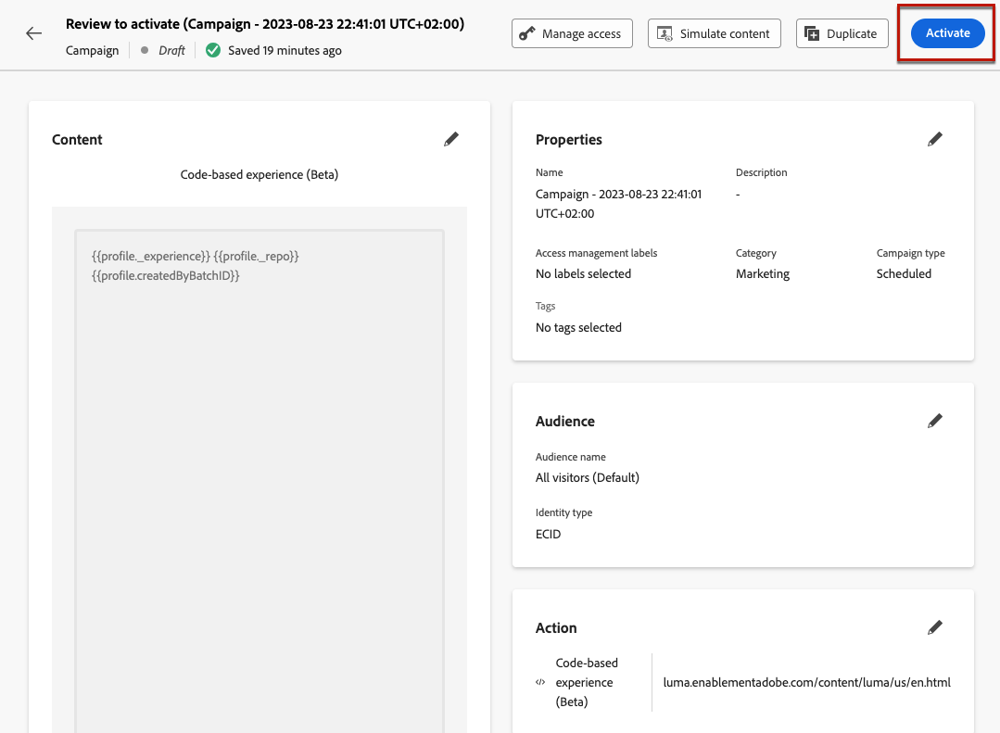

# Hantera kodbaserade upplevelser {#publish-code-based}

## Ge liv åt er kodbaserade upplevelse {#code-based-experience-live}

>[!IMPORTANT]
>
> Om kampanjen omfattas av en policy för godkännande måste ni begära godkännande för att kunna aktivera era kodbaserade upplevelser. [Läs mer](../test-approve/gs-approval.md)

När du har definierat din kodbaserade upplevelse och redigerat ditt innehåll efter behov med den [kodbaserade redigeraren](create-code-based.md#edit-code) kan du aktivera din resa eller kampanj för att göra ändringarna synliga för din målgrupp.

Du kan också förhandsgranska det kodbaserade upplevelseinnehållet innan du publicerar det. [Läs mer](test-code-based.md)

>[!NOTE]
>
>Om du aktiverar en kodbaserad resa/kampanj som påverkar samma sidor som en annan resa eller kampanj som redan är aktiv, kommer alla ändringar att tillämpas på innehållet.
>
>Om flera kodbaserade resor eller kampanjer uppdaterar samma element i innehållet prioriteras den högsta prioriterade resan/kampanjen. [Läs mer om prioritetspoäng](../conflict-prioritization/priority-scores.md)

När den kodbaserade resan eller kampanjen är live ansvarar ditt programimplementeringsteam för att skapa explicita API- eller SDK-anrop för att hämta innehåll för de ytor som definieras i den valda [kodbaserade upplevelsekonfigurationen](code-based-configuration.md). Läs mer om olika kundimplementeringar i [det här avsnittet](code-based-implementation-samples.md).

### Publicera en kodbaserad resa {#publish-code-based-journey}

Följ stegen nedan för att göra din kodbaserade upplevelse levande från en resa.

1. Kontrollera att din resa är giltig och att det inte finns något fel. [Läs mer](../building-journeys/troubleshooting.md#checking-for-errors-before-testing)

1. Välj alternativet **[!UICONTROL Publish]** i den övre högra menyn på resan.

   

   >[!NOTE]
   >
   >Läs mer om att publicera resor i [det här avsnittet](../building-journeys/publish-journey.md).

Din kodbaserade resa har statusen **[!UICONTROL Live]** och är nu synlig för den valda målgruppen. Varje mottagare av resan kan se dina ändringar.

>[!NOTE]
>
>När du har klickat på **[!UICONTROL Publish]** kan det ta upp till 15 minuter innan ändringarna är tillgängliga live.

### Aktivera en kodbaserad kampanj {#activate-code-based-campaign}

1. Välj **[!UICONTROL Review to activate]** från din kodbaserade kampanj.

   

1. Kontrollera och redigera vid behov innehåll, egenskaper, konfiguration, målgrupp och schema.

1. Välj **[!UICONTROL Activate]**.

   

   >[!NOTE]
   >
   >Läs mer om hur du aktiverar kampanjer i [det här avsnittet](../campaigns/review-activate-campaign.md).

Din kodbaserade kampanj har statusen **[!UICONTROL Live]** och är nu synlig för den valda målgruppen. Alla mottagare av kampanjen kan se de ändringar du har lagt till i innehållet.

>[!NOTE]
>
>När du har klickat på **[!UICONTROL Activate]** kan det ta upp till 15 minuter innan dina ändringar är tillgängliga live.
>
>Om du har definierat ett schema för den kodbaserade kampanjen har den statusen **[!UICONTROL Scheduled]** tills startdatumet och starttiden nås.

## Stoppa en kodbaserad resa eller kampanj {#stop-code-based-experience}

När en kodbaserad upplevelse är aktiv kan ni stoppa den för att hindra publiken från att se ändringarna. Följ stegen nedan.

1. Välj en direktresa eller kampanj i respektive lista.

1. Utför lämplig åtgärd utifrån ditt fall:

   * Välj **[!UICONTROL Stop campaign]** på den översta kampanjmenyn.

     

   * Klicka på knappen **[!UICONTROL More]** på den översta menyn på resan och välj **[!UICONTROL Stop]**.

     

1. De ändringar du har lagt till visas inte längre för den målgrupp du har definierat.

>[!NOTE]
>
>När en kodbaserad resa eller kampanj har stoppats kan du inte redigera eller aktivera den igen. Du kan bara duplicera den och aktivera den duplicerade resan/kampanjen.

<!--Reporting TBC

## Check the code-based experience reports {#check-code-based-reports}

Once your code-based experience is live, you can check the **[!UICONTROL Code-based]** tab of the  [Journey report](../reports/journey-global-report-cja.md#web-cja) and [Campaign report](../reports/campaign-global-report-cja.md#web) to compare elements such as the number of experiences delivered to your audience, and the number of engagements with your content.-->

<!--## Code-based reports

You can access code-based journey or campaign reports from the summary screen.

Global reports display events that occurred at least two hours ago and cover events over a selected time period. In comparison, Live reports focus on events that took place within the past 24 hours, with a minimum time interval of two minutes from the event occurrence.

### Code-based live report {#live-report-code-based}

From your campaign **[!UICONTROL Live report]**, the **[!UICONTROL Code-based experience]** tab details the main information relative to your apps or web pages. [Learn more about live report](../reports/campaign-live-report.md)

+++Learn more about the different metrics and widgets available for the Code-based experience report.

The **[!UICONTROL Code-based experience performance]** KPIs detail the main information relative to your visitors' engagement with your code-based experiences, such as:

* **[!UICONTROL Impressions]**: total number of experiences delivered to all users.

* **[!UICONTROL Interactions]**:  total number of engagements with your app/page. This includes any actions taken by the users, such as clicks or any other interactions.

The **[!UICONTROL Code-based experience summary]** graph shows the evolution of your experiences (impressions, unique impressions and interactions) for the last 24 hours.

TBC: The **[!UICONTROL Interactions by element]** table details the main information relative to your visitors' engagement with the various elements on your app/pages.
+++

### Code-based global report {#global-report-code-based}

Code-based campaign global report can be accessed directly from your journey or campaign with the **[!UICONTROL View report]** button. [Learn more about global report](../reports/campaign-global-report-cja.md)

From your Campaign **[!UICONTROL Global report]**, the **[!UICONTROL Code-based experience]** tab details the main information relative to your apps or web pages.

Add image TBC

+++Learn more about the different metrics and widgets available for the Code-based experience report.

The **[!UICONTROL Code-based experience performance]** KPIs detail the main information relative to your visitors' engagement with your experiences, such as:

* **[!UICONTROL Unique impressions]**: number of unique users to whom the experience was delivered.

* **[!UICONTROL Impressions]**: total number of experiences delivered to all users.

* **[!UICONTROL Interactions]**: percentage of engagements with your app/page. This includes any actions taken by the users, such as clicks or any other interactions.

The **[!UICONTROL Code-based experience summary]** graph shows the evolution of your experiences (unique impressions, impressions and interactions) for the concerned period.

TBC: The **[!UICONTROL Interactions by element]** table details the main information relative to your visitors' engagement with the various elements on your apps/pages.
+++

-->
