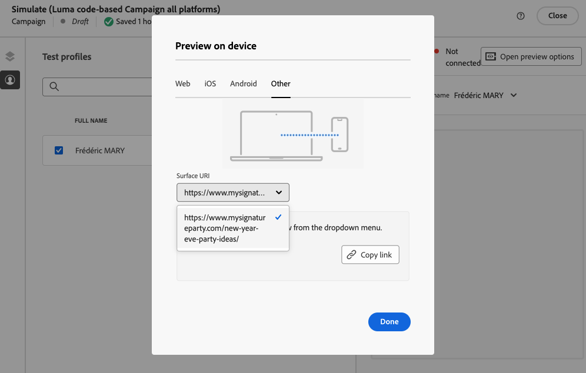

# Testa kodbaserade upplevelser {#test-code-based}

## Förgranska din kodbaserade upplevelse {#preview-code-based}

>[!CONTEXTUALHELP]
>id="ajo_code_based_preview"
>title="Förgranska din kodbaserade upplevelse"
>abstract="Få en simulering av hur er kodbaserade upplevelse kommer att se ut."

Följ stegen nedan för att visa en förhandsgranskning av din ändrade kodbaserade upplevelse.

>[!CAUTION]
>
>Du måste ha testprofiler tillgängliga för att simulera vilka erbjudanden som ska levereras till dem. Lär dig hur du [skapar testprofiler](../audience/creating-test-profiles.md).

1. Välj **[!UICONTROL Simulate content]** på resan eller i kampanjen, antingen från personaliseringsredigeraren eller från redigeringsfönstret för innehåll.

   

1. Klicka på **[!UICONTROL Manage test profiles]** för att välja en eller flera testprofiler.

1. En förhandsgranskning av den ändrade kodbaserade upplevelsen visas.

Detaljerad information om hur du väljer testprofiler och förhandsgranskar ditt innehåll finns i [det här avsnittet](../content-management/preview.md).

>[!NOTE]
>
>För närvarande kan du inte simulera innehåll från användargränssnittet i en kodbaserad upplevelsekampanj eller upplevelseresa med [Beslutsfattning](../experience-decisioning/gs-experience-decisioning.md). Det finns en tillfällig lösning i [det här avsnittet](../experience-decisioning/create-decision.md#test-and-publish).

## Förhandsgranska på enhet {#preview-on-device}

>[!CONTEXTUALHELP]
>id="ajo_code_based_preview_device"
>title="Förgranska din kodbaserade upplevelse på en riktig enhet"
>abstract="Få en förgranskning av era personaliserade upplevelser direkt i webbläsaren eller på era mobila enheter för att se hur de ser ut på riktiga enheter."

>[!CONTEXTUALHELP]
>id="ajo_code_based_preview_device_web"
>title="Förhandsgranska din kodbaserade webbupplevelse på enheten"
>abstract="Skanna QR-koden eller kopiera länken för att förhandsgranska på enheten."

>[!CONTEXTUALHELP]
>id="ajo_code_based_preview_device_mobile"
>title="Förgranska din kodbaserade mobilupplevelse på enheten"
>abstract="Skanna QR-koden eller kopiera länken för att förhandsgranska på enheten. När du är ansluten anger du stiftet på enheten. Du kan behöva starta om appen för att se ändringarna varje gång du uppdaterar förhandsgranskningslänkarna."

>[!CONTEXTUALHELP]
>id="ajo_code_based_preview_device_refresh"
>title="Uppdatera förhandsgranskningslänken så att den återspeglar den aktuella vyn"
>abstract="Förhandsvisningen på enheten visar innehållet när du skapade eller uppdaterade förhandsgranskningslänken. Om du har ändrat innehållet eller valt en annan testprofil eller behandling, uppdaterar du förhandsvisningen så att den återspeglar den aktuella vyn."

När ni skapar kodbaserade upplevelser för webbsidor eller mobilappar kan ni förhandsgranska era personaliserade upplevelser direkt i webbläsaren eller på era mobila enheter för att se hur upplevelserna ser ut på riktiga enheter.

>[!WARNING]
>
>Förhandsgranskning på enhet är inte tillgängligt när kontextattribut för [beslutsprinciper](../experience-decisioning/create-decision.md) eller [personalisering](../personalization/personalization-build-expressions.md) används.

1. Klicka på knappen **[!UICONTROL Simulate]** på skärmen **[!UICONTROL Open preview options]**. Förhandsvisningsalternativen beror på vilken plattform du har valt i den [kodbaserade konfigurationen](code-based-configuration.md#create-code-based-configuration).

1. Om du använder en [webbplattform](code-based-configuration.md#web) i din kodbaserade konfiguration är det **[!UICONTROL Device preview URL]** skrivskyddade fältet ifyllt med den URL som angetts för den aktuella kanalkonfigurationen.

   

   Du kan antingen:

   * Markera knappen **[!UICONTROL Copy link]** och klistra in länken på en webbläsarflik. Du kan också dela länken med ditt team och intressenter, som kan förhandsgranska den nya upplevelsen i vilken webbläsare som helst innan ändringarna publiceras.

   * Klicka på **[!UICONTROL Open in new tab]** för att öppna länken i din webbläsare.

   * Skanna QR-koden med din mobila enhet för att öppna förhandsgranskningslänken i en mobilwebbläsare.

1. Om du använder [Mobila plattformar](code-based-configuration.md#mobile) (iOS/Android) i din kodbaserade konfiguration är det **[!UICONTROL Deeplink]** skrivskyddade fältet förfyllt med det **[!UICONTROL Preview URL]**-värde som anges i kanalkonfigurationen för den valda plattformen.

   Växla mellan flikarna **[!UICONTROL iOS]** och **[!DNL Android]** för att förhandsgranska din upplevelse för den plattform du väljer.

   

   Du kan antingen:

   * Välj knappen **[!UICONTROL Copy link]** och dela länken med ditt team och intressenter, som kan förhandsgranska den nya upplevelsen i vilken mobilwebbläsare som helst innan ändringarna publiceras.

   * Skanna QR-koden med din mobila enhet för att öppna förhandsgranskningslänken direkt i mobilprogrammet. Du måste ange PIN-koden på enheten för att kunna upprätta [Assurance](https://experienceleague.adobe.com/en/docs/experience-platform/assurance/tutorials/implement-assurance){target="_blank"}-sessionen.

     >[!NOTE]
     >
     >**Adobe Experience Platform Assurance** är en produkt från Adobe Experience Cloud som hjälper dig att inspektera, verifiera, simulera och validera hur du samlar in data eller levererar upplevelser i din mobilapp. [Läs mer](https://experienceleague.adobe.com/en/docs/experience-platform/assurance/home){target="_blank"}

1. Om du använder någon [annan plattform](code-based-configuration.md#other) i din kodbaserade konfiguration väljer du den [yt-URI](code-based-surface.md#surface-uri) som du vill förhandsgranska i listrutan.

   

   * Välj knappen **[!UICONTROL Copy link]** om du vill klistra in länken på en webbläsarflik eller dela länken med ditt team och intressenter.

   * Om du har lagt till flera URI:er i konfigurationen (upp till 10) kan du välja vilken som helst av dem för förhandsgranskning.

1. Länkar för förhandsgranskning genereras för den valda testprofilen och, om du använder [innehållsexperiment](../content-management/content-experiment.md) under din resa eller kampanj, för den valda behandlingen.

   <!--If you have modified the content or selected a different treatment or test profile, scroll down to the bottom of the **[!UICONTROL Preview on device]** pop-up and click **[!UICONTROL Refresh preview link]** to reflect the current state.

   -->

   <!--When creating a content experiment, you need to select a given treatment and click the **[!UICONTROL Simulate content]** button to obtain the link corresponding to that treatment, then select another treatment, click the **[!UICONTROL Simulate content]** button to obtain a new preview link, and so on.-->

   När du uppdaterar innehållet eller väljer en annan testprofil eller behandling uppdateras länken för förhandsgranskning automatiskt. Du kan kopiera länken till olika webbläsarflikar och jämföra upplevelserna.
