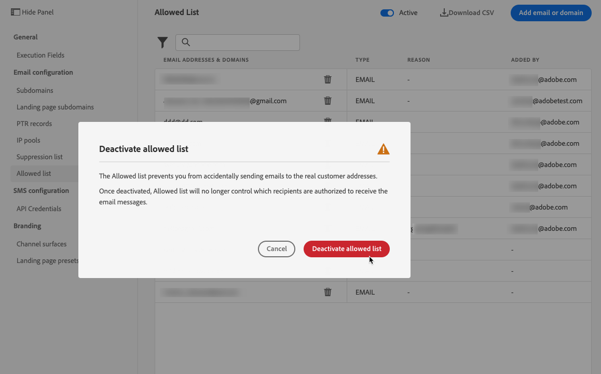

# Konfigurera en tillåtelselista {#allow-list}

Det går att definiera en specifik sändningssäker lista på nivån [sandbox](../administration/sandboxes.md).

Med det här tillåtelselista kan du ange enskilda e-postadresser eller domäner som ska vara de enda mottagarna eller domänerna som har behörighet att ta emot e-postmeddelanden som du skickar från en viss sandlåda.

>[!CAUTION]
>
>Den här funktionen gäller endast för e-postkanalen. Den är tillgänglig i sandlådor för produktion och icke-produktion.

På en icke-produktionsinstans, där fel kan uppstå, ser tillåtelselista till att du inte löper någon risk att skicka ut oönskade meddelanden till riktiga kundadresser, och tillhandahåller därför en säker miljö för testningsändamål.

När tillåtelselista är aktivt men tomt går ingen post ut. Om du råkar ut för något större problem kan du använda den här funktionen för att stoppa all utgående kommunikation från [!DNL Journey Optimizer] tills du åtgärdar problemet. Läs mer om [tillåtelselista-logiken](#logic).

Dessutom kan du använda Journey Optimizer **Suppression REST API** för att styra dina utgående meddelanden med hjälp av suppression och tillåtelselista. [Lär dig hur du arbetar med Suppression REST API](https://developer.adobe.com/journey-optimizer-apis/references/suppression/){target="_blank"}

## Gå till tillåtelselista {#access-allowed-list}

Om du vill få tillgång till en detaljerad lista över tillåtna e-postadresser och domäner går du till **[!UICONTROL Administration]** > **[!UICONTROL Channels]** > **[!UICONTROL Email settings]** och väljer **[!UICONTROL Allowed list]**.


>[!CAUTION]
>
>Behörigheter att visa, exportera och hantera tillåtelselista är begränsade till [reseadministratörer](../administration/ootb-product-profiles.md#journey-administrator). Läs mer om hur du hanterar [!DNL Journey Optimizer] användares åtkomsträttigheter i [det här avsnittet](../administration/permissions-overview.md).

Om du vill exportera tillåtelselista som en CSV-fil väljer du knappen **[!UICONTROL Download CSV]**.

Använd knappen **[!UICONTROL Delete]** om du vill ta bort en post permanent.

Du kan söka efter e-postadresser eller domäner och filtrera på **[!UICONTROL Address type]**. När du har valt det här alternativet kan du rensa filtret som visas högst upp i listan.


## Aktivera tillåtelselista {#enable-allow-list}

Följ stegen nedan för att aktivera tillåtelselista.

1. Gå till menyn **[!UICONTROL Channels]** > **[!UICONTROL Email configuration]** > **[!UICONTROL Allow list]**.

1. Markera växlingsknappen.

   

1. Välj **[!UICONTROL Activate allowed list]**.  Tillåtelselista är nu aktivt.

   

   >[!NOTE]
   >
   >När du har aktiverat tillåtelselista sker en 10-minuters fördröjning innan det börjar gälla under era resor och kampanjer. På samma sätt kan uppdateringar av både tillåtelselista och suppressionslistan ta upp till 10 minuter att reflektera.

Logiken i tillåtelselista gäller när funktionen är aktiv. Läs mer i [det här avsnittet](#logic).

>[!NOTE]
>
>När funktionen tillåtelselista är aktiverad respekteras den när resor körs, men också när meddelanden testas med [korrektur](../content-management/proofs.md) och resor testas med [testläge](../building-journeys/testing-the-journey.md).

## Inaktivera tillåtelselista {#deactivate-allow-list}

Följ stegen nedan för att inaktivera tillåtelselista.

1. Gå till menyn **[!UICONTROL Channels]** > **[!UICONTROL Email configuration]** > **[!UICONTROL Allow list]**.

1. Markera växlingsknappen.

   

1. Välj **[!UICONTROL Deactivate allowed list]**.  Tillåtelselista är inte längre aktivt.

   

   >[!NOTE]
   >
   >När du har inaktiverat tillåtelselista sker en 10-minuters fördröjning innan det börjar gälla under era resor och kampanjer. På samma sätt kan uppdateringar av både tillåtelselista och suppressionslistan ta upp till 10 minuter att reflektera.

Tillåtelselista-logiken gäller inte när funktionen är inaktiverad. Läs mer i [det här avsnittet](#logic).

## Lägg till enheter i tillåtelselista {#add-entities}

Om du vill lägga till nya e-postadresser eller domäner i tillåtelselista för en viss sandlåda kan du antingen [fylla i listan](#manually-populate-list) manuellt eller använda ett [API-anrop](#api-call-allowed-list).

>[!NOTE]
>
>Tillåtelselista kan innehålla upp till 1 000 poster.

### Fyll i tillåtelselista manuellt {#manually-populate-list}

>[!CONTEXTUALHELP]
>id="ajo_admin_allowed_list_add_header"
>title="Lägg till adresser eller domäner i tillåtelselista"
>abstract="Du kan lägga till nya e-postadresser eller domäner manuellt till tillåtelselista genom att markera dem en i taget."

>[!CONTEXTUALHELP]
>id="ajo_admin_allowed_list_add"
>title="Lägg till adresser eller domäner i tillåtelselista"
>abstract="Du kan lägga till nya e-postadresser eller domäner manuellt till tillåtelselista genom att markera dem en i taget."

Du kan fylla i [!DNL Journey Optimizer] tillåtelselista manuellt genom att lägga till en e-postadress eller en domän via användargränssnittet.

>[!NOTE]
>
>Du kan bara lägga till en e-postadress eller domän åt gången.

Följ stegen nedan för att göra detta.

1. Markera knappen **[!UICONTROL Add email or domain]**.

   

1. Välj adresstypen: **[!UICONTROL Email address]** eller **[!UICONTROL Domain address]**.

1. Ange den e-postadress eller domän som du vill skicka e-post till.

   >[!NOTE]
   >
   >Se till att du anger en giltig e-postadress (till exempel abc@company.com) eller domän (till exempel abc.company.com).

1. Ange en orsak om det behövs.

   

   >[!NOTE]
   >
   >Alla ASCII-tecken mellan 32 och 126 tillåts i fältet **[!UICONTROL Reason]**. Den fullständiga listan finns till exempel på [den här sidan](https://en.wikipedia.org/wiki/ASCII#Printable_characters){target="_blank"}.

1. Klicka på **[!UICONTROL Submit]**.

### Lägga till entiteter med ett API-anrop {#api-call-allowed-list}

Om du vill fylla tillåtelselista kan du även anropa API:t för inaktivering med värdet `ALLOWED` för attributet `listType`. Exempel:


Du kan utföra åtgärderna **Lägg till**, **Ta bort** och **Hämta**.

Läs mer om hur du gör API-anrop i referensdokumentationen för [Adobe Experience Platform API:er](https://experienceleague.adobe.com/docs/experience-platform/landing/platform-apis/api-guide.html){target="_blank"}.

## Ladda ned tillåtelselista {#download-allowed-list}

Om du vill exportera tillåtelselista som en CSV-fil följer du stegen nedan:

1. Markera knappen **[!UICONTROL Download CSV]**.

   

1. Vänta tills filen har skapats.

   

   >[!NOTE]
   >
   >Hämtningstiden beror på filstorleken, vilket innebär antalet adresser som finns på tillåtelselista.
   >
   >En nedladdningsbegäran kan bearbetas i taget för en viss sandlåda.

1. När filen har skapats får du ett meddelande. Klicka på klockikonen överst till höger på skärmen för att visa den.

1. Klicka på själva meddelandet för att hämta filen.

   

   >[!NOTE]
   >
   >Länken gäller i 24 timmar.

## Tillåtelselista logik {#logic}

>[!CONTEXTUALHELP]
>id="ajo_admin_allowed_list_logic"
>title="Hantera tillåtelselista"
>abstract="När tillåtelselista är aktiverat kommer endast de mottagare som ingår i tillåtelselista att få e-postmeddelanden från den här sandlådan. När den är inaktiverad får alla mottagare e-post."

När tillåtelselista är [active](#enable-allow-list) gäller följande logik:

* Om tillåtelselista är **tom** skickas inget e-postmeddelande.

* Om en entitet är **på tillåtelselista**, och inte finns med i listan över inaktiveringar, skickas e-postmeddelandet till motsvarande mottagare. Om entiteten också finns med i [undertryckningslistan](../reports/suppression-list.md) kommer motsvarande mottagare inte att få e-postmeddelandet. Orsaken är **[!UICONTROL Suppressed]**.

* Om en entitet **inte finns på tillåtelselista** (och inte i listan över inaktiveringar), kommer motsvarande mottagare inte att få e-postmeddelandet. Orsaken är **[!UICONTROL Not allowed]**.

>[!NOTE]
>
>Profilerna med statusen **[!UICONTROL Not allowed]** har uteslutits under meddelandeöverföringsprocessen. Det innebär att även om **reserapporterna** visar att de här profilerna har flyttats genom resan ([Läs målgrupp](../building-journeys/read-audience.md) och [meddelandeaktiviteter](../building-journeys/journeys-message.md)) så inkluderas de inte i **e-postrapporterna** i **[!UICONTROL Sent]**-måtten eftersom de filtreras ut innan e-postmeddelanden skickas.
>
>Läs mer om [Live-rapporten](../reports/live-report.md) och [Customer Journey Analytics-rapporten](../reports/report-gs-cja.md).

När tillåtelselista är [deaktiverad](#deactivate-allow-list) skickas alla e-postmeddelanden som du skickar från den aktuella sandlådan ut till alla mottagare (förutsatt att de inte finns med i listan över inaktiveringar), inklusive riktiga kundadresser.

## Uteslutningsrapportering {#reporting}

När tillåtelselista är aktivt kan du hämta e-postadresser eller domäner som har uteslutits från en sändning eftersom de inte fanns på tillåtelselista. Det gör du genom att använda [Adobe Experience Platform Query Service](https://experienceleague.adobe.com/docs/experience-platform/query/api/getting-started.html){target="_blank"} för att göra API-anropen nedan.

Använd följande fråga om du vill hämta **antalet e-postmeddelanden** som inte skickades eftersom mottagarna inte var i tillåtelselista:

```sql
SELECT count(distinct _id) from cjm_message_feedback_event_dataset WHERE
_experience.customerJourneyManagement.messageExecution.messageExecutionID = '<MESSAGE_EXECUTION_ID>' AND
_experience.customerJourneyManagement.messageDeliveryfeedback.feedbackStatus = 'exclude' AND
_experience.customerJourneyManagement.messageDeliveryfeedback.messageExclusion.reason = 'EmailNotAllowed'
```

Använd följande fråga om du vill hämta **listan över e-postadresser** som inte skickades eftersom mottagarna inte var i tillåtelselista:

```sql
SELECT distinct(_experience.customerJourneyManagement.emailChannelContext.address) from cjm_message_feedback_event_dataset WHERE
_experience.customerJourneyManagement.messageExecution.messageExecutionID IS NOT NULL AND
_experience.customerJourneyManagement.messageDeliveryfeedback.feedbackStatus = 'exclude' AND
_experience.customerJourneyManagement.messageDeliveryfeedback.messageExclusion.reason = 'EmailNotAllowed'
```
