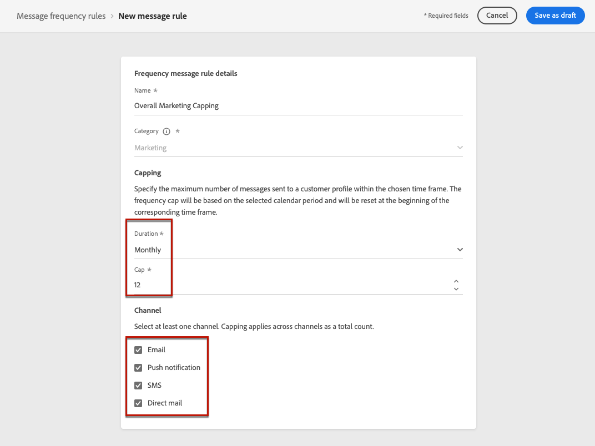

# Affärsregler {#business-rules}

>[!AVAILABILITY]
>
>Affärsreglerna är för närvarande bara tillgängliga som betaversioner för vissa användare.

[!DNL Journey Optimizer] I kan du styra hur ofta användare ska få ett meddelande genom att ställa in flerkanalsregler som automatiskt utesluter överbegärda profiler från meddelanden och åtgärder.

En regel för ett varumärke kan till exempel vara: att skicka högst fyra marknadsföringsmeddelanden per månad till sina kunder. För att göra detta kan du använda en frekvensregel som begränsar antalet meddelanden som skickas baserat på en eller flera kanaler under en månadskalenderperiod.

Genom att skapa olika regeluppsättningar för förbättrad granularitet, [!DNL Journey Optimizer] gör det möjligt att tillämpa frekvensbegränsning för olika typer av marknadsföringsmeddelanden. Du kan till exempel skapa en regeluppsättning som begränsar antalet **kampanjkommunikation** skickas till dina kunder och skapar en annan regeluppsättning för att begränsa antalet **nyhetsbrev** skickas till dem.

>[!NOTE]
>
>Affärsreglerna skiljer sig från avanmälningshantering, som gör det möjligt för användare att avbryta prenumerationen på information från ett varumärke. [Läs mer](../privacy/opt-out.md#opt-out-management)

## Åtkomstregeluppsättningar {#access-rule-sets}

Regeluppsättningar är tillgängliga från **[!UICONTROL Administration]** > **[!UICONTROL Business rules (Beta)]** -menyn. Alla regler visas sorterade efter skapandedatum.

Klicka på ett regeluppsättningsnamn om du vill visa och redigera innehållet. Alla regler i den regeluppsättningen visas.

Med snabbmenyn uppe till höger kan du:

* Redigera regeluppsättningens namn och beskrivning
* Aktivera regeluppsättningen - [läs mer](#activate-rule)
* Ta bort regeluppsättningen

För varje regel i regeluppsättningen **[!UICONTROL More actions]** Med knappen kan du:

* Redigera regeln
* Aktivera regeln [läs mer](#activate-rule)
* Ta bort regeln

<!--### Permissions{#permissions-frequency-rules}

To access, create, edit or delete message frequency rules, you must have the **[!UICONTROL Manage frequency rules]** permission. 

Users with the **[!UICONTROL View frequency rules]** permission are able to view rules, but not to modify or delete them.

Learn more about permissions in [this section](../administration/high-low-permissions.md).-->

## Skapa en regeluppsättning {#create-rule-set}

Följ stegen nedan för att skapa en regeluppsättning.

1. Öppna **[!UICONTROL Rules sets]** lista och klicka sedan på **[!UICONTROL Create rule set]**.

   

1. Definiera regeluppsättningens namn, lägg till en beskrivning om det behövs och klicka på **[!UICONTROL Save]**.

   

   >[!NOTE]
   >
   >Regeluppsättningsnamnet måste vara unikt.

1. Nu kan du [definiera reglerna](#create-new-rule) du vill lägga till i den här regeluppsättningen, och [activate](#activate-rule) den.

   >[!NOTE]
   >
   >Se till att alla regler som du vill tillämpa i dina meddelanden också är aktiverade i regeluppsättningen.

## Skapa en regel {#create-new-rule}

>[!CONTEXTUALHELP]
>id="ajo_rule_sets_category"
>title="Välj meddelanderegelkategori"
>abstract="När det aktiveras och används för ett meddelande, kommer alla frekvensregler som matchar den valda kategorin automatiskt att tillämpas på det här meddelandet. För närvarande är endast marknadsföringskategorin tillgänglig."

>[!CONTEXTUALHELP]
>id="ajo_rule_sets_capping"
>title="Ange begränsning för din regel"
>abstract="Ange det maximala antalet meddelanden som skickas till en kundprofil inom den valda tidsramen. Frekvensgränsen baseras på den valda kalenderperioden och återställs i början av motsvarande tidsram."

>[!CONTEXTUALHELP]
>id="ajo_rule_sets_channel"
>title="Definiera de kanaler som regeln gäller för"
>abstract="Välj minst en kanal. Taket tillämpas över alla kanaler som ett totalt antal."

Följ stegen nedan om du vill lägga till en regel i en regeluppsättning.

1. Från den regeluppsättning du just skapade klickar du på **[!UICONTROL Add rule]**.

   

1. Definiera regelnamnet.

   >[!NOTE]
   >
   >Regeluppsättningsnamnet måste vara unikt.

1. Välj meddelanderegelkategori.

   >[!NOTE]
   >
   >För närvarande bara **[!UICONTROL Marketing]** finns tillgänglig.

1. Från **[!UICONTROL Duration]** i den nedrullningsbara listan väljer du en tidsram för den begränsning som ska användas. [Läs mer](#frequency-cap)

1. Ange begränsningen för din regel, vilket innebär det maximala antalet meddelanden som kan skickas till en enskild användarprofil varje månad, vecka eller dag enligt vad du väljer ovan.

1. Markera kanalen som du vill använda för den här regeln: **[!UICONTROL Email]**, **[!UICONTROL SMS]**, **[!UICONTROL Push notification]** eller **[!UICONTROL Direct mail]**.

   

   >[!NOTE]
   >
   >Du måste välja minst en kanal för att kunna skapa regeln.

1. Markera flera kanaler om du vill tillämpa begränsning för alla markerade kanaler som ett totalt antal.

   Ange till exempel 5 som capping och markera både e-postkanalen och sms-kanalen. Om en profil redan har fått 3 marknadsföringsmeddelanden och 2 marknadsföringsmeddelanden för den valda perioden, kommer profilen att uteslutas från nästa leverans av marknadsföringsmeddelanden eller sms.

1. Klicka **[!UICONTROL Save]** för att bekräfta att regeln har skapats. Meddelandet läggs till i regeluppsättningen med **[!UICONTROL Draft]** status.

   

1. Upprepa stegen ovan om du vill lägga till så många regler som behövs i regeluppsättningen.

Nu måste du aktivera varje regel innan den kan tillämpas på alla meddelanden. [Läs mer](#activate-rule)

>[!NOTE]
>
>Kontrollera att regeluppsättningen också är aktiverad för att kunna markera den i dina meddelanden.

### Frekvenslock {#frequency-cap}

>[!CONTEXTUALHELP]
>id="ajo_rule_sets_duration"
>title="Välj meddelanderegelkategori"
>abstract="När det aktiveras och används för ett meddelande, kommer alla frekvensregler som matchar den valda kategorin automatiskt att tillämpas på det här meddelandet. För närvarande är endast marknadsföringskategorin tillgänglig."

Från **[!UICONTROL Duration]** väljer du om du vill att capping ska användas varje månad, vecka eller dag.

Frekvensgränsen baseras på den valda kalenderperioden. Den återställs i början av motsvarande tidsram.

Räknaren för varje period har följande förfallodatum:

* **[!UICONTROL Monthly]**: Frekvensbegränsningen gäller till den sista dagen i månaden vid 23:59:59 UTC. Månadsförfallodatumet för januari är till exempel 01-31 23:59:59 UTC.

* **[!UICONTROL Weekly]**: Frekvensbegränsningen gäller till lördag 23:59:59 UTC den veckan då kalenderveckan börjar på söndag. Utgångsdatumet är oberoende av hur regeln skapas. Om regeln till exempel skapas på torsdag gäller den till lördag den 23:59:59.

* **[!UICONTROL Daily]**: Den dagliga frekvensen gäller för dagen till 23:59:59 UTC och återställer till 0 i början av nästa dag.

### Daglig frekvensbegränsning {#daily-frequency-cap}

>[!CAUTION]
>
>För att säkerställa exaktheten i de dagliga reglerna för frekvensbegränsning bör man använda [strömningssegmentering](https://experienceleague.adobe.com/docs/experience-platform/segmentation/ui/streaming-segmentation.html){target="_blank"} är obligatoriskt. Läs mer om metoder för målgruppsutvärdering i [det här avsnittet](../audience/about-audiences.md#evaluation-method-in-journey-optimizer).

För alla segmentstorlekar upp till gränsen på 60 miljoner meddelanden per timme<!--not clear-->, se till att era kampanjer hålls med minst två timmars mellanrum.

<!-- Journey example:

* If customer sets a Daily rule under the Global Ruleset for email <= 2/day:
   * Journey 123 (scheduled for noon)
   * Journey 456 (scheduled for noon)
   * Journey 789 (scheduled for 1 pm)

   In this example, the Daily Frequency cap will not guarantee <= 2/day. The rule will only be guaranteed when Journeys are at least 2 hours apart:
   * Journey 123 (scheduled for noon)
   * Journey 456 (scheduled for 2 pm)
   * Journey 789 (scheduled for 4 pm)-->

Om du till exempel anger en daglig regel under en regeluppsättning för e-postkanalen som är mindre än eller lika med 2 dagar, och om du skapar följande kampanjer:
* Kampanj A (planerad till klockan 12.00)
* Kampanj A (schemalagd till 17:00)
* Kampanj B (planeras till 1:00)

Den här installationen fungerar inte av två orsaker:
* Det dagliga frekvensgränsvärdet är inte garanterat eftersom kampanjerna inte har 2 timmars mellanrum.
* Det är inte en god praxis att schemalägga samma kampanj flera gånger om dagen för att utnyttja det dagliga taket.

Exemplet nedan bör följas av ett dagligt frekvenstak:
* Kampanj A (planerad till klockan 12.00)
* Kampanj B (planeras till 2:00)

<!--* To use the Daily Cap with a Journey, customers can use either an Event Triggered Journey or an Audience Qualified Journey. If customers wish to use the Daily Cap with a Read Audience Journey, they should use a Campaign instead and associate a Local Ruleset with the campaign, following the example given above.-->

## Aktivera regler och regeluppsättningar {#activate-rule}

När en regel skapas har den **[!UICONTROL Draft]** status och påverkar ännu inte något meddelande. Om du vill aktivera den klickar du på **[!UICONTROL More actions]** knapp bredvid regeln och markera **[!UICONTROL Activate]**.

Du måste också aktivera regeluppsättningen för att kunna komma åt den i kampanjer/resor och använda den i dina meddelanden.

När du aktiverar en regeluppsättning påverkas alla meddelanden som den gäller för nästa körning. Lär dig hur [använda en regeluppsättning i ett meddelande](#apply-rule-set).

>[!NOTE]
>
>Det kan ta upp till 10 minuter för en regel eller regeluppsättning att aktiveras fullständigt. Du behöver inte ändra meddelanden eller publicera om resor för att en regel ska börja gälla.

<!--Currently, once a rule set is activated, no more rules can be added to that rule set.-->

## Inaktivera regler och regeluppsättningar {#deactivate-rule}

Om du vill inaktivera en regel eller en regeluppsättning klickar du på **[!UICONTROL More actions]** intill önskat objekt och markera **[!UICONTROL Deactivate]**.

Dess status ändras till **[!UICONTROL Inactive]** och regeln gäller inte för framtida meddelandekörningar. Meddelanden som körs just nu påverkas inte.

>[!NOTE]
>
>När du inaktiverar en regel eller regeluppsättning påverkas eller återställs inte antalet enskilda profiler.

## Tillämpa en frekvensregel på ett meddelande {#apply-frequency-rule}

Följ stegen nedan för att tillämpa en frekvensregel på ett meddelande.

1. När en [kampanj](../campaigns/create-campaign.md)markerar du en av de kanaler som du har definierat för regeluppsättningen och redigerar innehållet i meddelandet.

1. På skärmen för innehållsutgåvan klickar du på **[!UICONTROL Add Business Rule]** -knappen.

1. Välj [regeluppsättning som du har skapat](#create-rule-set).

   

   >[!NOTE]
   >
   >Endast [aktiverad](#activate-rule) regeluppsättningar visas i listan.

   <!--Messages where the category selected is **[!UICONTROL Transactional]** will not be evaluated against business rules.-->

1. Du kan visa antalet profiler som har uteslutits från leverans i [Global rapport](../reports/global-report.md)och i [Live-rapport](../reports/live-report.md), där frekvensreglerna listas som en möjlig orsak för användare som inte får leverera.

>[!NOTE]
>
>Flera regler kan gälla för samma kanal, men när den nedre gränsen har nåtts utesluts profilen från nästa leverans.

<!--
## Example: combine several rules {#frequency-rule-example}

You can combine several message frequency rules, such as described in the example below.

1. [Create a rule](#create-new-rule) called *Overall Marketing Capping*:

   * Select all channels.
   * Set capping to 12 monthly.

   

1. To further restrict the number of marketing-based push notifications that a user is sent, create a second rule called *Push Marketing Cap*:

   * Select Push channel.
   * Set capping to 4 monthly.

   

1. Save and [activate](#activate-rule) the rule.

1. [Create a message](../building-journeys/journeys-message.md) for every channel you want to communicate through and select the **[!UICONTROL Marketing]** category for each message. [Learn how to apply a frequency rule](#apply-frequency-rule)

   

In this scenario, an individual profile:
* can receive up to 12 marketing messages per month;
* but will be excluded from marketing push notifications after they have received 4 push notifications.-->

När du testar frekvensregler bör du använda en ny [testprofil](../audience/creating-test-profiles.md)eftersom det inte finns något sätt att återställa räknaren förrän nästa punkt i en profils frekvensbegränsning har nåtts. Om du inaktiverar en regel kan mappade profiler ta emot meddelanden, men inga räknarsteg tas bort eller tas bort.

