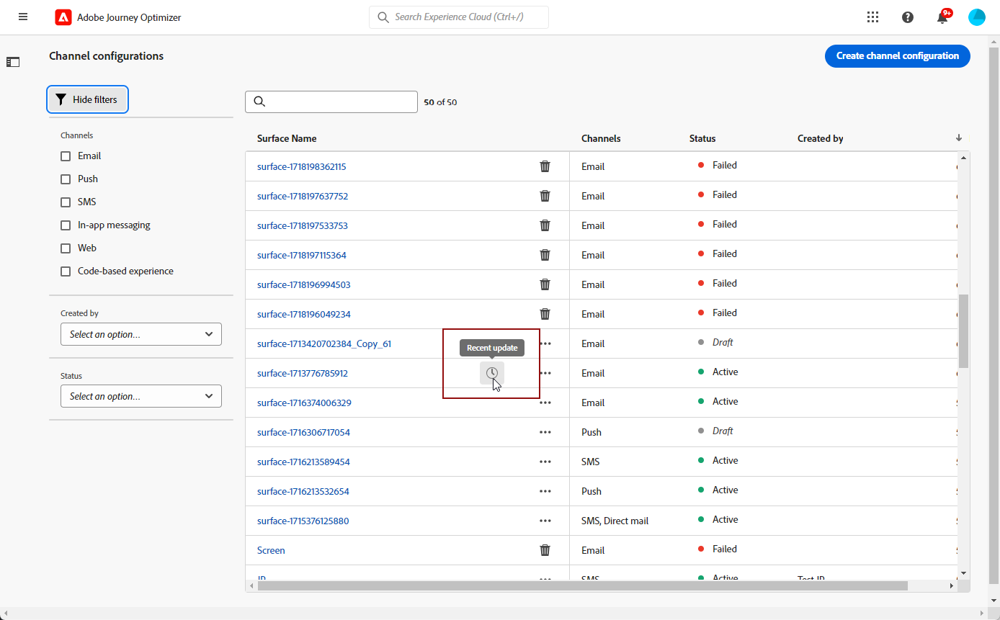

# Konfigurera kanalytor {#set-up-channel-surfaces}

Med [!DNL Journey Optimizer]kan du skapa kanalytor (t.ex. meddelandeförinställningar) som definierar alla tekniska parametrar som krävs för dina meddelanden: e-posttyp, avsändarens e-postadress och namn, mobilappar, SMS-konfiguration med mera.

>[!CAUTION]
>
> * Om du vill skapa, redigera och ta bort kanalytor måste du ha [Hantera kanalyta](../administration/high-low-permissions.md#manage-channel-surface) behörighet.
>
> * Du måste utföra [E-postkonfiguration](#configure-email-settings), [Push-konfiguration](../configuration/push-configuration.md) och [SMS-konfiguration](../configuration/sms-configuration.md) innan du skapar kanalytor.

När kanalytorna har konfigurerats kan du välja dem när du skapar meddelanden från en resa.

<!--
➡️ [Learn how to create and use email surfaces in this video](#video-presets)
-->

## Skapa en kanalyta {#create-channel-surface}

>[!CONTEXTUALHELP]
>id="ajo_admin_message_presets_header"
>title="Kanalytans inställningar"
>abstract="När du konfigurerar en kanalyta väljer du den kanal som den gäller för och definierar alla tekniska parametrar som krävs för dina meddelanden, till exempel e-posttyp, underdomän, avsändarnamn, mobilappar, SMS-konfiguration med mera."

>[!CONTEXTUALHELP]
>id="ajo_admin_message_presets"
>title="Kanalytans inställningar"
>abstract="När du konfigurerar en kanalyta väljer du den kanal som den gäller för och definierar alla tekniska parametrar som krävs för dina meddelanden, till exempel e-posttyp, avsändarnamn, mobilappar, SMS-konfiguration och mycket mer."

<!--New contextual help content for September release: A channel surface defines all the technical parameters required for your messages (email type, sender name, mobile apps, SMS configuration, etc.): once configured, you will be able to select it when creating actions from a journey or a campaign. Note that you must have the Manage channel surface permission to create, edit and delete channel surfaces.

To create a channel surface, follow these steps:

1. Access the **[!UICONTROL Channels]** > **[!UICONTROL Branding]** > **[!UICONTROL Channel surfaces]** menu, then click **[!UICONTROL Create channel surface]**.

    

1. Enter a name and a description (optional) for the surface, then select the channel(s) to configure.

    

    >[!NOTE]
    >
    > Names must begin with a letter (A-Z). It can only contain alpha-numeric characters. You can also use underscore `_`, dot`.` and hyphen `-` characters. 

1. If you selected the **[!UICONTROL Email]** channel, configure your settings as described in [this section](email-settings.md).

    

1. For the **[!UICONTROL Push Notification]** channel, select at least one platform  -  **iOS** and/or **Android** -, and the mobile applications to use for each platform.

    
        
    >[!NOTE]
    >
    >For more on how to configure your environment to send push notifications, refer to [this section](push-gs.md).

1. For the **[!UICONTROL SMS]** channel, define your settings as detailed in [this section](sms-configuration.md#message-preset-sms).

    

    >[!NOTE]
    >
    >For more on how to configure your environment to send SMS messages, refer to [this section](sms-configuration.md).

1. Once all the parameters have been configured, click **[!UICONTROL Submit]** to confirm. You can also save the channel surface as draft and resume its configuration later on.

    

    >[!NOTE]
    >
    >You cannot proceed with surface creation while the selected IP pool is under [edition](ip-pools.md#edit-ip-pool) (**[!UICONTROL Processing]** status), and has never been associated with the selected subdomain. [Learn more](#subdomains-and-ip-pools)
    >
    >Save the surface as draft and wait until the IP pool has the **[!UICONTROL Success]** status to resume surface creation.
    
1. Once the channel surface has been created, it displays in the list with the **[!UICONTROL Processing]** status.

    During this step, several checks will be performed to verify that it has been configured properly. The processing time is around **48h-72h**, and can take up to **7-10 business days**.

    These checks include configuration and technical tests that are performed by the Adobe team:

    * SPF validation
    * DKIM validation
    * MX record validation
    * Check IPs denylisting
    * Helo host check
    * IP pool verification
    * A/PTR record, t/m/res subdomain verification

    >[!NOTE]
    >
    >If the checks are not successful, learn more on the possible failure reasons in [this section](#monitor-channel-surfaces).  

1. Once the checks are successful, the channel surface gets the **[!UICONTROL Active]** status. It is ready to be used to deliver messages.

    

## Monitor channel surfaces {#monitor-channel-surfaces}

All your channel surfaces display in the **[!UICONTROL Channels]** > **[!UICONTROL Channel surfaces]** menu. Filters are available to help you browse through the list (channel, user, status).

Once created, channel surfaces can have the following statuses:

* **[!UICONTROL Draft]**: The channel surface has been saved as a draft and has not been submitted yet. Open it to resume the configuration.
* **[!UICONTROL Processing]**: The channel surface has been submitted and is going through several verifications steps.
* **[!UICONTROL Active]**: The channel surface has been verified and can be selected to create messages.
* **[!UICONTROL Failed]**: One or several checks have failed during the channel surface verification.
* **[!UICONTROL Deactivated]**: The channel surface is deactivated. It cannot be used to create new messages.

In case a channel surface creation fails, the details on each possible failure reason are described below.

If one of these errors occurs, contact [Adobe Customer Care](https://helpx.adobe.com/enterprise/admin-guide.html/enterprise/using/support-for-experience-cloud.ug.html){target="_blank"} to get assistance.

* **SPF validation failed**: SPF (Sender Policy Framework) is an email authentication protocol that allows to specify authorized IPs that can send emails from a given subdomain. SPF validation failure means that the IP addresses in the SPF record do not match the IP addresses used for sending emails to the mailbox providers. 

* **DKIM validation failed**: DKIM (DomainKeys Identified Mail) allows the recipient server to verify that the received message was sent by the genuine sender of the associated domain and that the content of the original message was not altered on its way. DKIM validation failure means that the receiving mail servers are unable to verify the authenticity of the message content and its association with the sending domain.:

* **MX record validation failed**: MX (Mail eXchange) record validation failure means that the mail servers responsible for accepting inbound emails on behalf of a given subdomain are not correctly configured.

* **Deliverability configurations failed**: Deliverability configurations failure can happen due to any of the following reasons:
    * Blocklisting of the allocated IPs
    * Invalid `helo` name
    * Emails being sent from IPs other than the ones specified in the IP pool of the corresponding surface
    * Unable to deliver emails to inboxes of major ISPs like Gmail and Yahoo

## Edit a channel surface {#edit-channel-surface}

To edit a channel surface, follow the steps below.

>[!NOTE]
>
>You cannot edit the **[!UICONTROL Push notification settings]**. If a channel surface is only configured for the Push notification channel, it is not editable.

1. From the list, click a channel surface name to open it.

    

1. Edit its properties as desired.

    >[!NOTE]
    >
    >If a channel surface has the **[!UICONTROL Active]** status, the **[!UICONTROL Name]**, **[!UICONTROL Select channel]** and **[!UICONTROL Subdomain]** fields are greyed out and cannot be edited.

1. Click **[!UICONTROL Submit]** to confirm your changes.

    >[!NOTE]
    >
    >You can also save the channel surface as draft and resume update later on.

Once the changes are submitted, the channel surface will go through a validation cycle similar to the one in place when [creating a channel surface](#create-channel-surface). The edition processing time can take up to **3 hours**.

>[!NOTE]
>
>If you only edit the **[!UICONTROL Description]**, **[!UICONTROL Email type]** and/or **[!UICONTROL Email retry parameters]** fields, the update is instantaneous.

### Update details {#update-details}

For channel surfaces that have the **[!UICONTROL Active]** status, you can check the details of the update. To do so:

Click the **[!UICONTROL Recent update]** icon that is displayed next to the active surface name.

<!--You can also access the update details from an active channel surface while update is in progress.-->

På **[!UICONTROL Recent update]** visas information som uppdateringsstatus och listan över begärda ändringar.

<!---->

### Uppdatera status {#update-statuses}

En uppdatering av en kanalyta kan ha följande status:

* **[!UICONTROL Processing]**: Kanalytans uppdatering har skickats och genomgår flera verifieringssteg.
* **[!UICONTROL Success]**: Den uppdaterade kanalytan har verifierats och kan väljas för att skapa meddelanden.
* **[!UICONTROL Failed]**: En eller flera kontroller misslyckades under verifieringen av kanalytans uppdatering.

Varje status visas nedan.

#### Bearbetar {#surface-processing}

Flera leveranskontroller kommer att utföras för att kontrollera att ytan har uppdaterats på rätt sätt.

>[!NOTE]
>
>Om du bara redigerar **[!UICONTROL Description]**, **[!UICONTROL Email type]** och/eller **[!UICONTROL Email retry parameters]** uppdateras uppdateringen omedelbart.

Bearbetningstiden kan ta upp till **3 timmar**. Läs mer om kontroller som utförts under valideringscykeln i [det här avsnittet](#create-channel-surface).

Om du redigerar en yta som redan var aktiv:

* Dess status kvarstår **[!UICONTROL Active]** när valideringsprocessen pågår.

* The **[!UICONTROL Recent update]** visas bredvid namnet på ytan i kanalens ytlista.

* Under valideringsprocessen används fortfarande den äldre versionen av ytan för meddelanden som konfigurerats med den här ytan.

>[!NOTE]
>
>Du kan inte ändra en kanalyta medan uppdateringen pågår. Du kan fortfarande klicka på namnet, men alla fält är nedtonade. Ändringarna visas inte förrän uppdateringen har slutförts.

#### Lyckades {#success}

När valideringsprocessen har slutförts används den nya versionen av ytan automatiskt i alla meddelanden som använder den här ytan. Du kan dock behöva vänta:
* några minuter innan det konsumeras av enhetsmeddelanden,
* tills nästa omgång för att ytan ska vara effektiv i gruppmeddelanden.

#### Misslyckades {#failed}

Om valideringsprocessen misslyckas kommer den äldre versionen av ytan fortfarande att användas.

Läs mer om möjliga felorsaker i [det här avsnittet](#monitor-channel-surfaces).

När uppdateringen misslyckas blir ytan redigerbar igen. Du kan klicka på dess namn och uppdatera inställningarna som behöver korrigeras.

## Inaktivera en kanalyta {#deactivate-a-surface}

Skapa en **[!UICONTROL Active]** Kanalytan är inte tillgänglig för att skapa nya meddelanden. Du kan inaktivera den. Resebudskap som för närvarande använder denna yta kommer dock inte att påverkas och kommer att fortsätta fungera.

>[!NOTE]
>
>Du kan inte inaktivera en kanalyta medan en uppdatering bearbetas. Du måste vänta tills uppdateringen har slutförts eller misslyckats. Läs mer på [redigera kanalytor](#edit-channel-surface) och [uppdateringsstatus](#update-statuses).

1. Öppna listan över kanalytor.

1. Klicka på **[!UICONTROL More actions]** -knappen.

1. Välj **[!UICONTROL Deactivate]**.

   

>[!NOTE]
>
>Inaktiverade kanalytor kan inte tas bort för att undvika problem i resor som använder dessa ytor för att skicka meddelanden.

Du kan inte redigera en inaktiverad kanalyta direkt. Du kan dock duplicera den och redigera kopian för att skapa en ny version som du använder för att skapa nya meddelanden. Du kan även aktivera den igen och vänta tills uppdateringen har redigerats.

<!--
## How-to video{#video-presets}

Learn how to create channel surfaces, how to use them and how to delegate a subdomain and create an IP pool.

>[!VIDEO](https://video.tv.adobe.com/v/334343?quality=12)
-->
