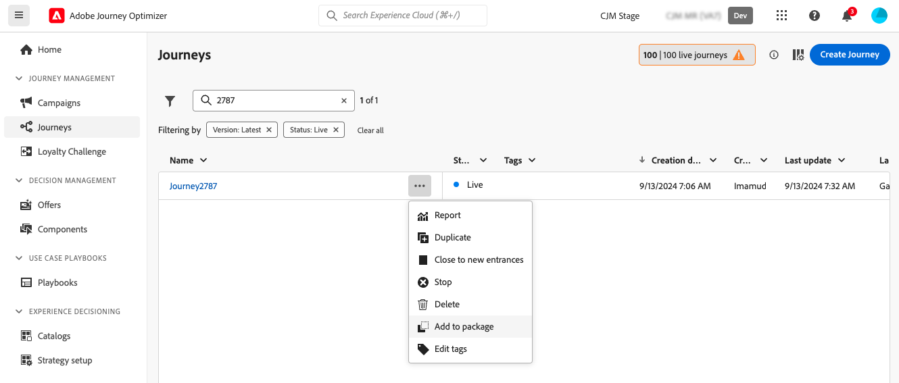
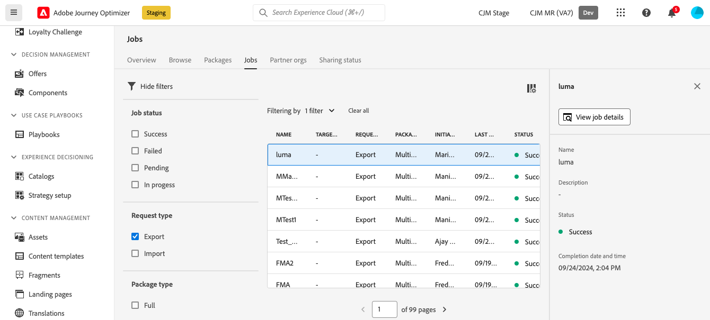
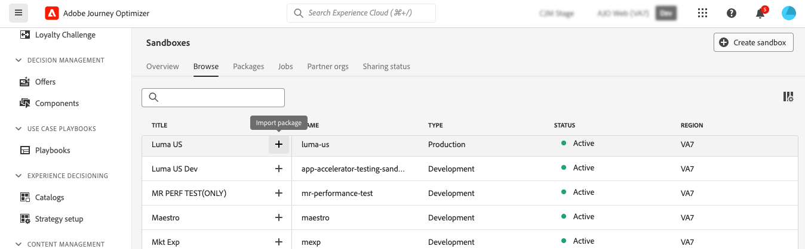
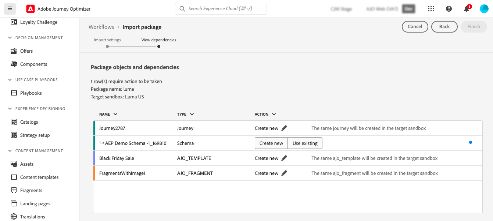

# Exportera objekt till en annan sandlåda {#copy-to-sandbox}

Du kan kopiera objekt som resor, anpassade åtgärder, innehållsmallar eller fragment över flera sandlådor med hjälp av funktioner för paketexport och -import. Ett paket kan bestå av ett eller flera objekt. Alla objekt som ingår i ett paket måste komma från samma sandlåda.

Den här sidan beskriver hur du använder sandlådeverktyg i Journey Optimizer. Mer information om själva funktionen finns i Adobe Experience Platform [Handbok för sandlådeverktyg](https://experienceleague.adobe.com/docs/experience-platform/sandbox/ui/sandbox-tooling.html?lang=sv-SE#abobe-journey-optimizer-objects){target="_blank"}.

>[!NOTE]
>
>Den här funktionen kräver följande behörigheter från funktionen **Sandlådeadministration**: Hantera sandlådor (eller Visa sandlådor) och Hantera paket. [Läs mer](../administration/ootb-permissions.md)

Kopieringsprocessen utförs via en paketexport och import mellan käll- och målsandlådorna. Här är de allmänna stegen för att kopiera en resa från en sandlåda till en annan:

1. [Lägg till objektet som ska exporteras som ett paket i källsandlådan](#export)
1. [Publicera paketet](#publish)
1. [Importera paketet i målsandlådan](#import)

## Exporterade objekt och bästa praxis {#objects}

Journey Optimizer tillåter export av resor, anpassade åtgärder, innehållsmallar, fragment och andra objekt till en annan sandlåda. I följande avsnitt finns information och metodtips för varje typ av objekt.

### Allmän bästa praxis {#global}

* När du kopierar ett objekt uppdateras alla beroenden (till exempel kapslade fragment, målgrupper för resan eller åtgärder) korrekt i det överordnade objektet, vilket garanterar korrekt mappning i målsandlådan.

* Om ett exporterat objekt innehåller profilanpassning kontrollerar du att det finns ett lämpligt schema i målsandlådan för att undvika eventuella personaliseringsproblem.

* Landningssidor stöds för närvarande inte för migrering mellan sandlådor. När du kopierar en resa till en annan sandlåda, kommer alla referenser till landningssidor under resan eller e-postinnehåll fortfarande att peka mot den ursprungliga (källan) sandlådesidans ID. Efter migreringen måste du manuellt uppdatera alla referenser till landningssidor under din resa och e-postinnehåll för att använda rätt ID för landningssidor från målsandlådan. Se [Skapa och publicera landningssidor](../landing-pages/create-lp.md).

+++ Resor

* **Kopierade beroenden** - När du exporterar en resa, förutom själva resan, kopierar Journey Optimizer även de flesta objekt som resan är beroende av: målgrupper, anpassade åtgärder, scheman, händelser och åtgärder. Mer information om kopierade objekt finns i Adobe Experience Platform [verktygsguide för sandlådor](https://experienceleague.adobe.com/docs/experience-platform/sandbox/ui/sandbox-tooling.html?lang=sv-SE#abobe-journey-optimizer-objects){target="_blank"}.

* **Manuell validering rekommenderas** - Vi garanterar inte att alla länkade element kopieras till målsandlådan. Vi rekommenderar att du gör en grundlig kontroll, till exempel innan du publicerar en resa. På så sätt kan du identifiera eventuella saknade objekt.

* **Utkastläge och unikhet** - De kopierade objekten i målsandlådan är unika och det finns ingen risk för att befintliga element skrivs över. Både resan och alla meddelanden under resan överförs i utkastläge. På så sätt kan du utföra en grundlig validering innan den publiceras i målsandlådan.

* **Metadata** - Kopieringsprocessen kopierar bara över metadata om resan och objekten i den resan. Inga profil- eller datauppsättningsdata kopieras som en del av den här processen.

* **Anpassade åtgärder**

   * När du exporterar anpassade åtgärder kopieras URL-konfigurationen och nyttolastparametrarna. Av säkerhetsskäl kopieras inte autentiseringsparametrar över och ersätts istället av INSERT SECRET HERE. Parametervärden för en konstant begäran och frågeparametrar ersätts också med INSERT SECRET HERE.

     Detta inkluderar anpassade specialåtgärder ([!DNL Adobe Campaign Standard], [!DNL Campaign Classic], [!DNL Marketo Engage]).

   * När du kopierar en resa till en annan sandlåda och väljer &quot;använd befintlig&quot; för en anpassad åtgärd under importprocessen, måste den befintliga anpassade åtgärden du väljer vara densamma som den anpassade källåtgärden (d.v.s. samma konfiguration, parametrar osv.). Annars kommer den nya kopian att innehålla fel som inte kan lösas på arbetsytan.

* **Datakällor, fältgrupper och händelser** - Vid kopiering av en resa där händelser, datakällor eller fältgrupper används kontrolleras automatiskt om det redan finns komponenter med samma namn och typ i målsandlådan. En enhetshändelse ersätts till exempel av en enhetshändelse i målsandlådan med samma namn. Detsamma gäller affärshändelser, anpassade datakällor och både API-baserade och schemabaserade fältgrupper som används under resor. Om en enhetshändelse från källsandlådan har samma namn som en mållandlåda för en affärshändelse kopieras eller skapas den inte. Detta gäller även för alla andra komponenter.

+++

+++ Kampanjer

Kampanjer kopieras tillsammans med alla objekt som hör till profilen, målgruppen, schemat, textbundna meddelanden och beroende objekt. Följande objekt kopieras **inte**:

* Flerspråkiga varianter och språkinställningar.
* Affärsregler,
* Taggar,
* DULE-etiketter (Data Usage Labeling and Enforcement).

När du kopierar kampanjer måste du se till att objektet som listas nedan valideras i målsandlådan för att undvika felkonfigurationer:

* **Kanalkonfigurationer**: Kanalkonfigurationer kopieras tillsammans med kampanjer. När kampanjer har kopierats måste kanalkonfigurationer väljas manuellt i målsandlådan.
* **Experimentationsvarianter och inställningar**: Experimentella varianter och inställningar ingår i kampanjkopieringsprocessen. Validera dessa inställningar i målsandlådan efter importen.
* **Enhetligt beslutsfattande**: Beslutsprinciper och beslutsobjekt stöds för export och import. Kontrollera att beslutsrelaterade beroenden mappas korrekt i målsandlådan.

+++

+++ Beslut

* Objekten nedan måste finnas i målsandlådan innan du kopierar beslutsobjekt:

   * Profilattribut som används mellan beslutsobjekt,
   * Fältgruppen med anpassade erbjudandeattribut,
   * Scheman för datastreams som används för kontextattribut i regler, rankning eller appning.

* Sandlådekopiering för rankningsformler med AI-modeller stöds för närvarande inte.

* När du kopierar en kampanj kopieras inte beslutsartiklar (erbjudandeartiklar) automatiskt. Se till att du kopierar dem individuellt med alternativet Lägg till i paket.

* Om en beslutspolicy har en urvalsstrategi måste beslutsposter läggas till separat. Om den har manuella/reservbeslutsobjekt läggs de till automatiskt som direkta beroenden.

* När du kopierar beslutsenheter måste du kopiera beslutsobjekt **före** andra objekt. Om du till exempel kopierar en samling först och det inte finns några erbjudanden i den nya sandlådan, kommer den nya samlingen att förbli tom.

* När du kopierar entiteter med beroenden (t.ex. schema, segment) klickar du på Skapa ny mot entiteten för att avmarkera den och visa alternativet Använd befintlig för beroende artefakter. Ytterligare beroenden kan kräva att du upprepar det här steget längre ned i hierarkin.

  Exempel: Om du vill återanvända ett datastream-schema i en regel när du importerar en kampanj klickar du på&quot;Skapa nytt&quot; mot DeciIONING_STRATEGY och sedan igen på Decision_Rules, för att visa alternativet&quot;Använd befintlig&quot; för datastream-schemat.

* För enheter som är beroende av ett datastream-kontextschema måste du se till att datastream skapas i förväg och välja ett befintligt schema för det datastream-objektet.

* Om du klickar direkt på Slutför när du importerar skapas alla beroenden på nytt.

+++

+++ Innehållsmallar

* När du exporterar en innehållsmall kopieras även alla kapslade fragment tillsammans med den.

* När du exporterar innehållsmallar kan det ibland leda till fragmentduplicering. Om till exempel två mallar delar samma fragment och kopieras i separata paket, måste båda mallarna återanvända samma fragment i målsandlådan. Om du vill undvika duplicering väljer du alternativet &quot;Använd befintlig&quot; under importprocessen. [Lär dig hur du importerar ett paket](#import)

* Du bör exportera innehållsmallar i ett och samma paket för att undvika dubbletter. På så sätt kan systemet hantera borttagning av dubbletter effektivt.

+++

+++ Fragment

* Fragment kan ha flera statusar, till exempel Live, Utkast och Live med pågående utkast. När du exporterar ett fragment kopieras dess senaste utkastläge till målsandlådan.

* När du exporterar ett fragment kopieras även alla kapslade fragment tillsammans med det.

+++

## Lägga till objekt som ett paket {#export}

Om du vill kopiera objekt till en annan sandlåda måste du först lägga till dem som ett paket i källsandlådan. Följ de här stegen:

1. Navigera till lagret där det första objektet som du vill kopiera lagras, till exempel reselistan. Klicka på ikonen **Fler åtgärder** (de tre punkterna bredvid objektnamnet) och klicka på **Lägg till i paket**.

   

1. I fönstret **Lägg till i paket** väljer du om du vill lägga till objektet i ett befintligt paket eller skapa ett nytt paket:

   

   * **Befintligt paket**: välj paketet i listrutan.
   * **Skapa ett nytt paket**: skriv paketnamnet. Du kan också lägga till en beskrivning.

1. Upprepa de här stegen för att lägga till alla objekt som du vill exportera med paketet.

## Publicera paketet som ska exporteras {#publish}

Så här publicerar du paketet:

1. Gå till menyn **[!UICONTROL Administration]** > **[!UICONTROL Sandboxes]** och välj fliken **Paket**.

1. Öppna det paket som du vill exportera, markera de objekt som du vill exportera och klicka på **Publicera**.

   I det här exemplet vill vi exportera en resa, en innehållsmall och ett fragment.

   

1. Om du vill spåra status för paketets publikation från fliken **[!UICONTROL Jobs]**. Om du vill ha mer information om ett jobb markerar du det i listan och klickar på knappen **[!UICONTROL View import details]**.

   

## Importera paketet i målsandlådan {#import}

När paketet har publicerats måste du importera det till målsandlådan. Följ de här stegen:

1. Navigera till menyn **[!UICONTROL Sandboxes]** och välj fliken **[!UICONTROL Browse]**.

1. Sök efter sandlådan där du vill importera paketet och klicka sedan på plusikonen bredvid dess namn.

   

   >[!NOTE]
   >
   >Endast sandlådor i din organisation är tillgängliga.

1. I fältet **Målsandlåda** kontrollerar du att rätt målsandlådor är markerad och väljer det paket som ska importeras från listrutan **[!UICONTROL Package name]**. Klicka på **Nästa**.

   

1. Granska paketobjekten och beroendena. Det här är listan över objekt som har lagts till i paketet, tillsammans med andra objektresor som är beroende av t.ex. målgrupper, scheman, händelser eller åtgärder.

   För varje objekt kan du välja att skapa ett nytt eller använda ett befintligt objekt i målsandlådan. På så sätt kan du till exempel undvika fragmentduplicering som kan inträffa när du importerar innehållsmallar med vanliga fragment.

   

1. Klicka på knappen **Slutför** i det övre högra hörnet för att börja kopiera paketet till målsandlådan. Kopieringsprocessen varierar beroende på hur komplexa objekten är och hur många objekt som behöver kopieras.

1. Klicka på importjobbet för att granska kopieringsresultatet:

   * Klicka på knappen **Visa importerade objekt** om du vill visa varje kopierat objekt.
   * Klicka på knappen **Visa importinformation** för att kontrollera importresultaten för varje objekt.

   

1. Få åtkomst till målsandlådan och kontrollera alla kopierade objekt noggrant.
