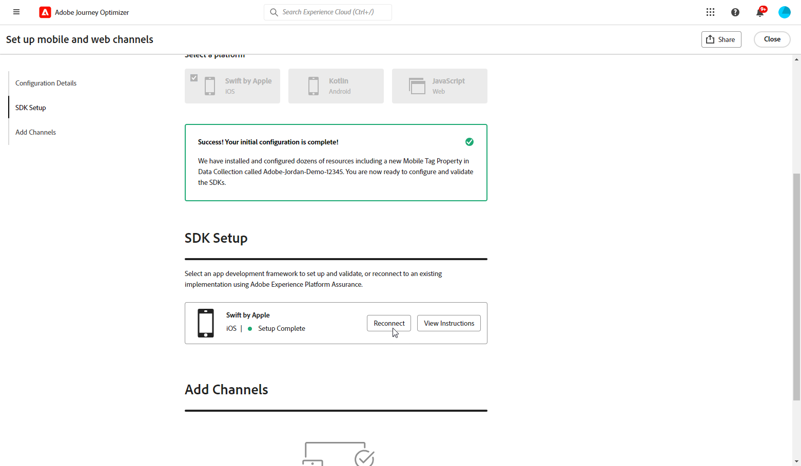

# Skapa en kanalkonfiguration {#set-mobile-ios}

>[!CONTEXTUALHELP]
>id="ajo_mobile_web_setup_javascript_code"
>title="Javascript-kod"
>abstract="Taggen head innehåller viktiga metadata och resurser som läses in före huvudinnehållet på din webbsida. Genom att placera kod i det här avsnittet kan du vara säker på att den initieras korrekt och körs tidigt, så att webbsidan kan läsas in och fungera effektivt. Genom att lägga till kod i head-avsnittet kan du förbättra strukturen, prestandan och den övergripande användarupplevelsen för din webbplats."

>[!CONTEXTUALHELP]
>id="ajo_mobile_web_setup_push_token"
>title="Hämta enhetstoken"
>abstract="För att säkerställa att enhetens push-token är korrekt synkroniserad med din Adobe Experience Platform-profil måste du inkludera följande kod i ditt program. Den här integreringen är nödvändig för att upprätthålla aktuella kommunikationsfunktioner och säkerställa en smidig användarupplevelse."

>[!CONTEXTUALHELP]
>id="ajo_mobile_web_setup_push_xcode"
>title="Starta programmet från Xcode"
>abstract="Starta programmet med Xcode om du vill hämta din push-token. När programmet har startats startar du om det för att kontrollera att valideringsprocessen har slutförts. Adobe kommer sedan att tillhandahålla din push-token som en del av valideringsresultatet. Denna token är väsentlig för att aktivera push-meddelanden och kommer att visas när konfigurationen har validerats."

>[!CONTEXTUALHELP]
>id="ajo_mobile_web_push_certificate_fcm"
>title="Ange ett push-certifikat"
>abstract="Dra och släpp .json-filen för privat nyckel. Den här filen innehåller autentiseringsinformation som krävs för säker integrering och kommunikation mellan programmet och servern."

>[!CONTEXTUALHELP]
>id="ajo_mobile_web_setup_push_certificate"
>title="Ange ett push-certifikat"
>abstract="Nyckelfilen .p8 innehåller en privat nyckel som används för att autentisera din app med Apple-servrar för säkra push-meddelanden. Du kan hämta den här nyckeln från sidan Certifikat, Identifierare och Profiler på ditt utvecklarkonto."

>[!CONTEXTUALHELP]
>id="ajo_mobile_web_setup_push_key_id"
>title="Nyckel-ID"
>abstract="Nyckel-ID, en sträng på 10 tecken som tilldelats när autentiseringsnyckeln p8 skapades, finns på fliken **Tangenter** på sidan Certifikat, Identifierare och Profiler i ditt utvecklarkonto."

>[!CONTEXTUALHELP]
>id="ajo_mobile_web_setup_push_team_id"
>title="Team-ID"
>abstract="Team-ID:t, som är ett strängvärde som används för att identifiera ditt team, finns på fliken **Medlemskap** i ditt utvecklarkonto."

Den här konfigurationen förenklar den snabba konfigurationen av marknadsföringskanaler och gör alla viktiga resurser tillgängliga i Experience Platform-, Journey Optimizer- och Data Collection-apparna. På så sätt kan marknadsföringsteamet snabbt börja skapa kampanjer och resor.

1. På Journey Optimizer hemsida klickar du på **[!UICONTROL Begin]** från **[!UICONTROL Set up mobile and web channels]**-kortet.

   

1. Skapa en **[!UICONTROL New]**-konfiguration.

   Om du redan har befintliga konfigurationer kan du välja en eller skapa en ny konfiguration.

   

1. Ange **[!UICONTROL Name]** som ny konfiguration och välj eller skapa **[!UICONTROL Datastream]**. **[!UICONTROL Name]** kommer att användas för alla automatiskt skapade resurser.

1. Om din organisation har flera datastreams väljer du ett av de befintliga alternativen. Om du inte har någon dataström skapas en automatiskt.

1. Välj plattform och klicka på **[!UICONTROL Auto-create resources]**.

1. För att effektivisera installationsprocessen skapas de resurser som behövs automatiskt så att du kan komma igång. Detta inkluderar skapande av en ny **[!UICONTROL Mobile Tag Property]** och installation av tillägg.

[Läs mer om de automatiskt genererade resurserna](set-mobile-config.md#auto-create-resources)

1. När resursgenereringen är klar följer du instruktionerna i användargränssnittet för att konfigurera och validera dina SDK:er och kanaler.

1. När du är klar med konfigurationen delar du den automatiskt genererade **[!UICONTROL Channel Configuration]** med teammedlemmarna som ansvarar för att skapa resor och kampanjer.

   {zoomable="yes"}

1. Du kan nu referera till **[!UICONTROL Channel Configuration]** i gränssnittet Campaigns eller Journeys, vilket möjliggör en sömlös anslutning mellan konfigurationen och körningen av riktade resor och kampanjer för er målgrupp.

## Ändra en befintlig mobilkonfiguration {#reconnect}

När du har skapat konfigurationen kan du enkelt gå tillbaka till den när som helst och lägga till ytterligare kanaler eller göra ytterligare justeringar som passar dina behov

1. På Journey Optimizer hemsida klickar du på **[!UICONTROL Begin]** från **[!UICONTROL Set up mobile and web channels]**-kortet.

   

1. Välj **[!UICONTROL Existing]** och välj din befintliga **[!UICONTROL Tag property]** i listrutan.

   

1. När du använder din befintliga konfiguration måste du återansluta till Adobe Assurance. Klicka på **[!UICONTROL Reconnect]** på SDK Setup-menyn.

   

1. Välj din enhet i listrutan **[!UICONTROL Available devices]** och klicka på **[!UICONTROL Connect]**.

   {zoomable="yes"}

1. Du kan nu uppdatera konfigurationen efter behov.
