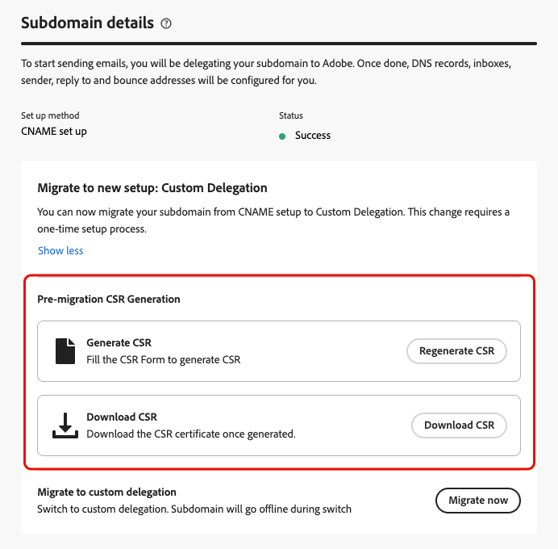
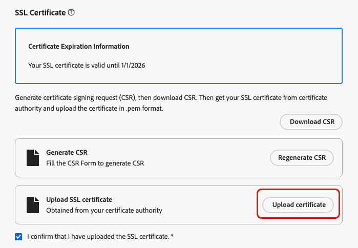
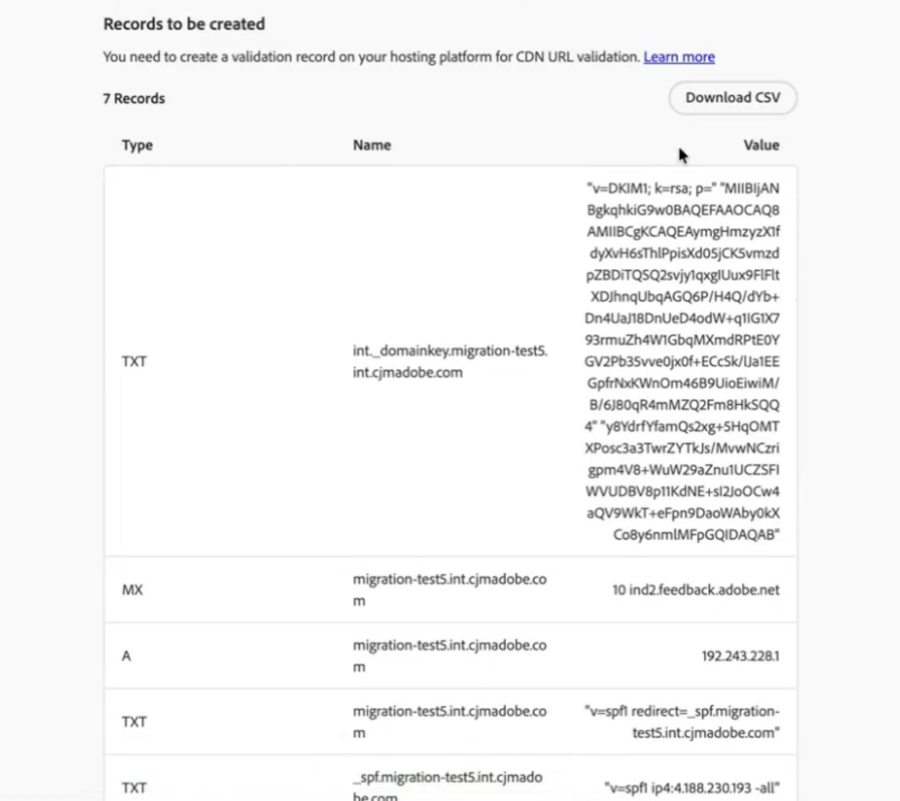

# Migrera en e-postunderdomän från CNAME till anpassad delegering {#migrate-cname-to-custom}

>[!AVAILABILITY]
>
>Den här funktionen är tillgänglig med begränsad tillgänglighet. Kontakta din Adobe-representant för att få åtkomst.

Om din underdomän är konfigurerad med [CNAME](about-subdomain-delegation.md#cname-subdomain-setup) kan du migrera den till metoden **[!UICONTROL Custom delegation]** så att den uppfyller företagets säkerhetsprinciper. Detta ger dig fullständig ägarskap och kontroll över dina underdomäner och certifikat inom [!DNL Journey Optimizer]. [Läs mer om anpassade underdomäner](delegate-custom-subdomain.md)

Som en del av den här processen måste du:

* [Ta bort befintliga DNS-poster](#delete-dns) från din värdlösning
* [Överför SSL-certifikatet](#upload-ssl-certificate) från certifikatutfärdaren
* Slutför [feedbackloop-stegen](#feedback-loop) genom att verifiera domänägarskap och rapportera e-postadress
* [Skapa en ny uppsättning DNS-poster](#create-dns-records) som genererats av Adobe i värdplattformen

Följ stegen nedan för att migrera din underdomän.

## Innan du börjar {#before-you-begin}

Innan du startar migreringsprocessen bör du läsa den viktiga informationen nedan.

>[!IMPORTANT]
>
>Du kan bara migrera en underdomän som har konfigurerats med metoden [CNAME](delegate-subdomain.md#cname-subdomain-setup).

* Kontrollera att metoden **Anpassad delegering är aktiverad** för din organisation (den här funktionen är för närvarande begränsad - kontakta din Adobe-representant för att få åtkomst). [Läs mer](delegate-custom-subdomain.md)
* Kontrollera att inga aktiva kanalkonfigurationer använder den här underdomänen. Migreringsprocessen kommer att avbryta deras funktioner.

  >[!NOTE]
  >
  >Om du inaktiverar en kanalkonfiguration innan du startar migreringen kan du ändra tillbaka den till det aktiva läget när migreringsarbetsflödet har slutförts.

* Se till att inga aktiva kampanjer eller resor använder en kanalkonfiguration som är länkad till den här underdomänen eftersom detta kan orsaka leveransstörningar.
* Tänk på att driftstoppen börjar så fort du går in i migreringsflödet. Underdomänen flyttas till **[!UICONTROL Draft]** under processen och är inte tillgänglig förrän konfigurationen är klar.
* Därför rekommenderar vi att **utför stegen före migrering innan migreringsprocessen startas**, så att SSL-certifikatet är klart och driftstoppen minskar. [Läs mer](#start-migration)

## Starta migreringen {#start-migration}

Följ stegen nedan för att börja migrera en viss underdomän.

1. Gå till **[!UICONTROL Administration]** > **[!UICONTROL Channels]** > **[!UICONTROL Email settings]** > **[!UICONTROL Subdomains]**.

1. Välj en underdomän som har konfigurerats med CNAME och öppna den.

1. Du kan använda avsnittet **[!UICONTROL Pre-migration CSR Generation]** för att generera CSR för att skicka det till certifikatutfärdaren och ha SSL-certifikatet redo när migreringsprocessen startar. [Lär dig hur](#send-csr-to-ca)

   >[!IMPORTANT]
   >
   >Stegen före migrering är valfria i det här skedet, men rekommenderas starkt. Om du slutför dem **innan** migreringen startas minskas driftstoppen och övergången blir smidig.

   {width="70%"}

1. Välj **[!UICONTROL Migrate now]** i det dedikerade avsnittet.

   <!--{width=90%}-->

1. Granska den [information som visas](#before-you-begin).

   >[!WARNING]
   >
   >Nedtiden börjar så snart du går in i migreringsflödet, så se till att den inte påverkar era aktiva kampanjer och resor.

1. Klicka på **[!UICONTROL Yes]**. Underdomänen flyttas till statusen **[!UICONTROL Draft]** och är inte tillgänglig förrän konfigurationen är klar.

## Generera och skicka CSR till certifikatutfärdaren {#send-csr-to-ca}

För att kunna slutföra migreringen behöver du ett SSL-certifikat som har utfärdats av en certifikatutfärdare (CA). Om du vill få det här SSL-certifikatet måste du först generera en CSR-begäran (Certificate Signing Request) och skicka den till certifikatutfärdaren.

Oavsett om du redan har startat migreringsprocessen eller inte följer du stegen nedan för att generera och skicka din nya CSR.

1. Klicka på **[!UICONTROL Regenerate CSR]**.

1. Fyll i formuläret som visas och återskapa CSR (Certificate Signing Request).

   {width="60%"}

   >[!NOTE]
   >
   >Nyckellängden kan vara 2 048 eller 4 096 bitar. Den kan inte ändras efter att underdomänen har skickats.

1. Klicka på **[!UICONTROL Download CSR]** och spara formuläret på den lokala datorn.

1. Skicka det till certifikatutfärdaren (CA) för att hämta ditt SSL-certifikat. Innan du skickar denna CSR till din certifikatutfärdare för signering finns det några viktiga saker att tänka på:

   * Den hämtade CSR-koden från steg 3 är endast avsedd för data.subdomain.com.

   * Certifikatet bör dock omfatta både data.subdomain.com och cdn.subdomain.com som SAN-poster (Subject Alternative Names) i ett enda certifikat. Om du till exempel delegerar example.adobe.com motsvarar data.subdomain.com data.example.adobe.com och cdn.subdomain.com motsvarar cdn.example.adobe.com.

   * Både underdomänerna Data (data.example.adobe.com) och CDN (cdn.example.adobe.com) måste läggas till som peer-poster i samma certifikat. Inga ytterligare underdomäner ska läggas till i det här certifikatet.

   * De flesta certifikatutfärdare tillåter att du lägger till ytterligare SAN-nätverk (till exempel CDN-underdomänen) under signeringsprocessen

      * via CA-portalen (rekommenderas, om sådan finns), eller
      * Genom att begära det manuellt med supportteamet om portalalternativet inte är tillgängligt.

   * När certifikatutfärdaren har signerat kommer den att utfärda ett enda certifikat som omfattar både Data-domänen och CDN-underdomänen.

## Ta bort befintliga DNS-poster {#delete-dns}

När du har startat migreringsprocessen måste du ta bort de befintliga DNS-posterna från din värdlösning. Följ stegen nedan.

1. Listan över poster som för närvarande är konfigurerade på dina DNS-servrar visas.

1. Navigera till din värdlösning för domäner och ta bort befintliga CNAME-poster från din DNS-värdtjänst.

1. Kontrollera att alla DNS-poster har tagits bort. När du är klar markerar du kryssrutan&quot;Jag bekräftar att jag har tagit bort de nödvändiga posterna från värdplatsen&quot;.

   {width="75%"}

## Överför SSL-certifikatet {#upload-ssl-certificate}

I avsnittet **[!UICONTROL SSL Certificate]** måste du överföra ett nytt SSL-certifikat till [!DNL Journey Optimizer].

Innan dess kontrollerar du följande:

* Om du redan har skickat din CSR till certifikatutfärdaren som en del av [stegen före migrering](#start-migration) kontrollerar du att du har fått ditt SSL-certifikat.

* Om du inte redan har gjort det följer du stegen för att [generera, hämta och skicka CSR](#send-csr-to-ca).

<!--
    * Click **[!UICONTROL Regenerate CSR]** and fill the form to generate the Certificate Signing Request.

    * Click **[!UICONTROL Download CSR]** to save the form to your local computer.

    * Send the CSR to the Certificate Authority to get your SSL certificate.-->

1. När du har hämtat ditt SSL-certifikat klickar du på **[!UICONTROL Upload certificate]**.

   {width="75%"}

1. Överför SSL-certifikatet till [!DNL Journey Optimizer] i .pem-format med hela certifikatkedjan. Här följer ett exempel på ett .pem-filformat:

   ```
   -----BEGIN CERTIFICATE-----
   MIIDXTCCAkWgAwIBAgIJALc3... (base64 encoded data)
   -----END CERTIFICATE-----
   ```

1. Markera rutan&quot;Jag bekräftar att jag har överfört SSL-certifikatet&quot;.

## Slinga för fullständig feedback {#feedback-loop}

Slutför sedan feedbackslingstegen för att verifiera domänägarskap och rapportera e-postadress.

{width="75%"}

Processen är densamma som när du konfigurerar en ny anpassad underdomän. Följ stegen som beskrivs på sidan [Konfigurera en anpassad underdomän](delegate-custom-subdomain.md#feedback-loop-steps).


## Skapa en ny uppsättning DNS-poster {#create-dns-records}

Slutför migreringsprocessen genom att skapa en ny uppsättning DNS-poster som genereras av Adobe på värdplattformen.

1. När du är klar med feedback-slingan klickar du på knappen **[!UICONTROL Continue]** längst upp till höger på skärmen.

   Det här steget verifierar att tidigare poster har tagits bort och att SSL-certifikatet har överförts korrekt. Om några fel uppstår kan du läsa [kontrollistan för felsökning](#troubleshooting).

1. Om alla valideringar lyckas visas avsnittet **[!UICONTROL Records to be created]**.

   {width="75%"}

1. Skapa alla poster som krävs på värdplattformen.

1. När alla poster har skapats klickar du på **[!UICONTROL Submit]**.

   >[!NOTE]
   >
   >Om inga poster i listan skapas visas ett fel. Se till att skapa alla nödvändiga poster.

När du har skickat in programmet måste du vänta tills Adobe utför de nödvändiga kontrollerna, som kan ta upp till 3 timmar. [Läs mer](delegate-subdomain.md#submit-subdomain)

När underdomänen är aktiv igen behövs inga ändringar i befintliga kanalkonfigurationer som använder den - de fortsätter att fungera som tidigare.

## Kontrollista för felsökning {#troubleshooting}

Om fel inträffar när du försöker skicka din anpassade underdomän utför du de felsökningsåtgärder som listas nedan.

* _Resursen kunde inte verifieras. DNS finns fortfarande och måste tas bort._ - Se till att ta bort alla poster från din värdlösning. [Lär dig hur](#delete-dns)
* _Resursen kunde inte verifieras. Ladda upp ditt SSL-certifikat och försök igen._ - SSL-certifikatet överfördes inte. Glöm inte att överföra den. [Lär dig hur](#upload-ssl-certificate)
* _Certifikatet innehåller oväntade domäner i dess SAN (Subject Alternative Names)._ - Glöm inte att överföra rätt SSL-certifikat. [Lär dig hur](#upload-ssl-certificate)
* _Certifikatet saknar följande nödvändiga domäner i dess SAN (Subject Alternative Names)._ - Glöm inte att överföra rätt SSL-certifikat. [Lär dig hur](#upload-ssl-certificate)

**Se även**

* [Konfigurera en anpassad underdomän](delegate-custom-subdomain.md)
* [Delegeringsmetoder för underdomäner](about-subdomain-delegation.md#subdomain-delegation-methods)
