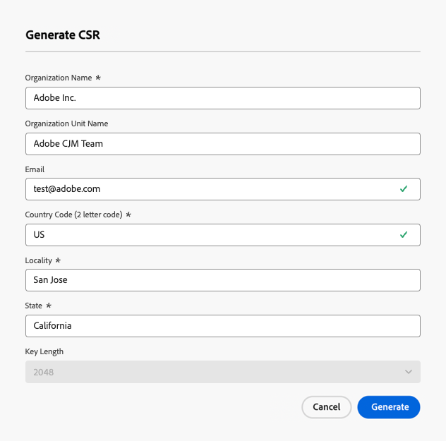

# Konfigurera en anpassad underdomän {#delegate-custom-subdomain}

>[!AVAILABILITY]
>
>Den här funktionen är tillgänglig med begränsad tillgänglighet. Kontakta din Adobe-representant för att få åtkomst.

Som ett alternativ till metoderna [Fullt delegerad](about-subdomain-delegation.md#full-subdomain-delegation) och [CNAME konfigurerad](about-subdomain-delegation.md#cname-subdomain-delegation) kan du med metoden **Anpassad delegering** ta ägarskapet för dina underdomäner inom Journey Optimizer för att få fullständig kontroll över de genererade certifikaten.

Som en del av den här processen måste Adobe se till att din DNS är konfigurerad för att leverera, återge och spåra meddelanden. Det är därför du måste [överföra SSL-certifikatet](#upload-ssl-certificate) från certifikatutfärdaren och slutföra [feedbackloopstegen](#feedback-loop-steps) genom att verifiera domänägarskap och rapportera e-postadressen.

Följ stegen nedan för att konfigurera en anpassad underdomän.

1. Gå till menyn **[!UICONTROL Administration]** > **[!UICONTROL Channels]** > **[!UICONTROL Email settings]** > **[!UICONTROL Subdomains]**.

1. Klicka på **[!UICONTROL Set up subdomain]**.

1. Välj **[!UICONTROL Custom delegation]** i avsnittet **[!UICONTROL Set up method]**.

   {width=90%}

1. Ange namnet på den underdomän som ska delegeras.

   >[!CAUTION]
   >
   >Du kan inte använda samma sändande domän för att skicka ut meddelanden från [!DNL Adobe Journey Optimizer] och från en annan produkt, till exempel [!DNL Adobe Campaign] eller [!DNL Adobe Marketo Engage].

## Skapa DNS-posterna {#create-dns-records}

>[!CONTEXTUALHELP]
>id="ajo_admin_subdomain_custom_dns"
>title="Generera matchande DNS-poster"
>abstract="Om du vill delegera en anpassad underdomän till Adobe måste du kopiera och klistra in den namnserverinformation som visas i Journey Optimizer-gränssnittet i din domänvärdslösning för att generera matchande DNS-poster."

1. Listan med poster som ska placeras på dina DNS-servrar visas. Kopiera dessa poster, antingen en i taget, eller genom att hämta en CSV-fil.

1. Navigera till din värdlösning för domäner för att generera matchande DNS-poster.

1. Kontrollera att alla DNS-poster har skapats i din domänvärdslösning.

1. Om allt är korrekt konfigurerat markerar du rutan &quot;Jag bekräftar ...&quot;.

   {width="75%"}

## Överför SSL-certifikatet {#upload-ssl-certificate}

>[!CONTEXTUALHELP]
>id="ajo_admin_subdomain_custom-ssl"
>title="Generera begäran om certifikatsignering"
>abstract="När du konfigurerar en ny anpassad underdomän måste du generera CSR (Certificate Signing Request), fylla i den och skicka den till certifikatutfärdaren för att få det SSL-certifikat som du behöver överföra till Journey Optimizer."

>[!CONTEXTUALHELP]
>id="ajo_admin_subdomain_key_length"
>title="Välj en nyckellängd"
>abstract="Nyckellängden kan vara 2 048 eller 4 096 bitar. Den kan inte ändras efter att underdomänen har skickats."

1. Klicka på **[!UICONTROL SSL Certificate]** i avsnittet **[!UICONTROL Generate CSR]**.

   {width="85%"}

   >[!NOTE]
   >
   >Ditt SSL-certifikatets förfallodatum visas. När datumet har nåtts måste du överföra ett nytt certifikat.

1. Fyll i formuläret som visas och generera CSR (Certificate Signing Request).

   {width="70%"}

   >[!NOTE]
   >
   >Nyckellängden kan vara 2 048 eller 4 096 bitar. Den kan inte ändras efter att underdomänen har skickats.

1. Klicka på **[!UICONTROL Download CSR]** och spara formuläret på den lokala datorn.

1. Skicka det till certifikatutfärdaren (CA) för att hämta ditt SSL-certifikat. Innan du skickar denna CSR till din certifikatutfärdare för signering finns det några viktiga saker att tänka på:

   * Den hämtade CSR-koden från steg 3 är endast avsedd för data.subdomain.com.

   * Certifikatet bör dock omfatta både data.subdomain.com och cdn.subdomain.com som SAN-poster (Subject Alternative Names) i ett enda certifikat. Om du till exempel delegerar example.adobe.com motsvarar data.subdomain.com data.example.adobe.com och cdn.subdomain.com motsvarar cdn.example.adobe.com.

   * Både underdomänerna Data (data.example.adobe.com) och CDN (cdn.example.adobe.com) måste läggas till som peer-poster i samma certifikat.

   * De flesta certifikatutfärdare tillåter att du lägger till ytterligare SAN-nätverk (till exempel CDN-underdomänen) under signeringsprocessen

      * via CA-portalen (rekommenderas, om sådan finns), eller
      * Genom att begära det manuellt med supportteamet om portalalternativet inte är tillgängligt.

   * När certifikatutfärdaren har signerat kommer den att utfärda ett enda certifikat som omfattar både Data-domänen och CDN-underdomänen.

1. När certifikatet har hämtats klickar du på **[!UICONTROL Upload SSL certificate]** och överför det till [!DNL Journey Optimizer] i .pem-format med hela certifikatkedjan. Här följer ett exempel på ett .pem-filformat:

   ```
   -----BEGIN CERTIFICATE-----
   MIIDXTCCAkWgAwIBAgIJALc3... (base64 encoded data)
   -----END CERTIFICATE-----
   ```

   <!--
    >[!CAUTION]
    >
    >Both Data and CDN subdomains must be included in the same certificate.-->

## Slutför stegen för feedbackslingan {#feedback-loop-steps}

>[!CONTEXTUALHELP]
>id="ajo_admin_subdomain_feedback-loop"
>title="Slutför stegen för feedbackslingan"
>abstract="Gå till Yahoo! Avsändarhubben och fyll i formuläret för att verifiera domänägarskap. Ange den e-postadress för FBL-rapportering som anges nedan och använd den engångslösenord som kommer att tas emot för att verifiera ägarskapet på Yahoo! Avsändarhubb."

1. Gå till [Yahoo! Webbplatsen för avsändarhubben &#x200B;](https://senders.yahooinc.com/) och fyll i det formulär som krävs för att verifiera din domänägarskap.

1. För att verifiera domänägarskapet, Yahoo! Avsändarhubben kräver att du anger en e-postadress. Ange den e-postadress för FBL-rapportering som listas under **[!UICONTROL Value]**. Det här är en e-postadress som ägs av Adobe.

1. När Yahoo! Avsändarhubben genererar ett engångslösenord (OTP) som skickas till den här Adobe-adressen.

1. Kontakta Adobe Deliverability-teamet som kommer att förse dig med denna engångslösenord. <!--Specify how to reach out + any information that customer should share in the request to deliverability team to get access to the right OTP-->

   >[!CAUTION]
   >
   >Engångslösenordet är endast giltigt i 24 timmar, så se till att du kontaktar Adobe så fort engångslösenordet har genererats. <!--TBC?-->
   >
   >En begäran om engångslösenord kan bara göras på vardagar. Det finns inget stöd på helger. <!--Add times + timezone-->

1. Ange engångslösenordet på Yahoo! Avsändarhubb.

1. Se till att du har slutfört alla steg i feedbackloopen.

1. Om allt är korrekt konfigurerat markerar du kryssrutan &quot;Jag har slutfört..&quot;.

   {width="85%"}

1. Klicka på **[!UICONTROL Continue]** och vänta tills Adobe verifierar att posterna genereras utan fel i värdlösningen. Den här processen kan ta upp till 2 minuter.

   >[!NOTE]
   >
   >Kontrollera att alla poster har skapats innan du fortsätter.

1. Adobe genererar en SSL CDN URL-valideringspost. Kopiera den här valideringsposten till din värdplattform. Om du har skapat den här posten på din värdlösning, markerar du rutan &quot;Jag bekräftar...&quot;.

1. Klicka på **[!UICONTROL Submit]** om du vill att Adobe ska utföra de nödvändiga kontrollerna. [Läs mer](delegate-subdomain.md#submit-subdomain)

## Checklista för felsökning {#check-list}

Om fel inträffar när du försöker skicka din anpassade underdomän utför du de felsökningsåtgärder som listas nedan.

* Kontrollera att alla DNS-poster har spridits korrekt med hjälp av DNS-sökningsverktyg.

* Kontrollera att certifikatet uppfyller alla tekniska krav innan du överför det.

* Kontrollera att ditt certifikat har överförts i rätt format.
