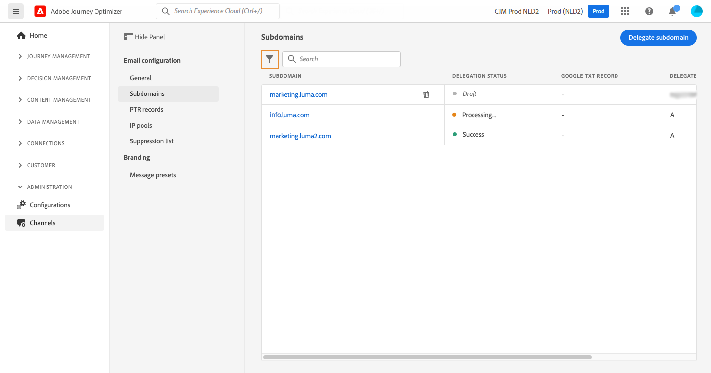
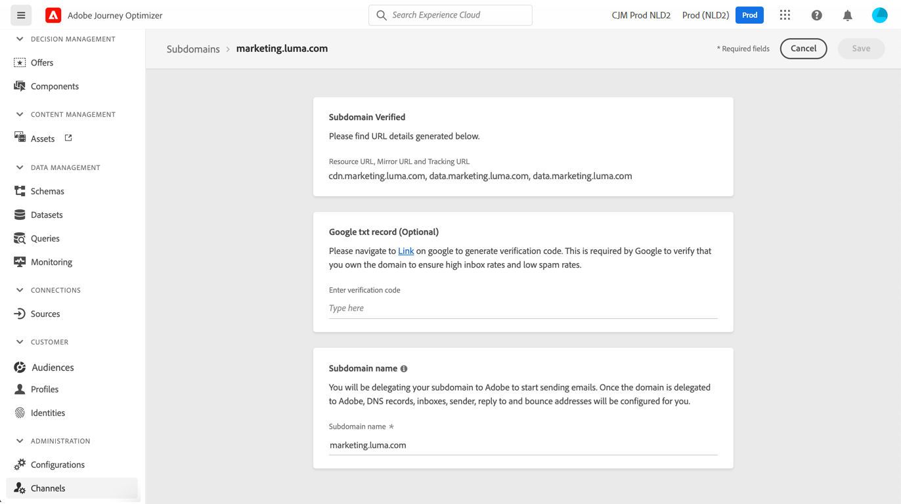

# Delegera en underdomän {#delegate-subdomain}

>[!CONTEXTUALHELP]
>id="ajo_admin_subdomainname"
>title="Delegering av underdomän"
>abstract="Med Journey Optimizer kan du delegera dina underdomäner till Adobe. Du kan delegera en underdomän helt till Adobe, vilket är den rekommenderade metoden.  Du kan också skapa en underdomän med CNAME för att peka på Adobe-specifika poster, men på det här sättet måste du behålla och hantera DNS-poster på egen hand."
>additional-url="https://experienceleague.adobe.com/en/docs/journey-optimizer/using/configuration/delegate-subdomains/about-subdomain-delegation#subdomain-delegation-methods" text="Konfigurationsmetoder för underdomäner"

>[!CONTEXTUALHELP]
>id="ajo_admin_subdomainname_header"
>title="Delegering av underdomän"
>abstract="För att börja skicka e-post delegerar du din underdomän till Adobe. När du är klar konfigureras DNS-poster, inkorgar, avsändare, svar och studsadresser åt dig."

Domännamnsdelegering är en metod som gör att ägaren av ett domännamn (tekniskt: en DNS-zon) kan delegera en underavdelning av den (tekniskt: en DNS-zon under den, som kan kallas en underzon) till en annan enhet. Om du hanterar zonen&quot;example.com&quot; kan du som kund delegera underzonen&quot;marketing.example.com&quot; till Adobe.

>[!NOTE]
>
>Läs mer om delegering av underdomäner och de olika metoder som är tillgängliga med [!DNL Journey Optimizer] i [det här avsnittet](about-subdomain-delegation.md).

Du kan antingen:

* Delegera en underdomän fullständigt - [Lär dig hur](#set-up-subdomain)
* Skapa en underdomän med CNAME för att peka på Adobe-specifika poster - [Lär dig hur](#set-up-subdomain)

Den **fullständiga underdomändelegeringen** rekommenderas. Läs mer om skillnaderna mellan olika konfigurationsmetoder för underdomäner i [det här avsnittet](about-subdomain-delegation.md#subdomain-delegation-methods).

## Guardrails {#guardrails}

När du konfigurerar underdomäner i [!DNL Journey Optimizer] följer du de skyddsutkast och rekommendationer som beskrivs nedan.

* Som standard kan du i [!DNL Journey Optimizer] delegera **högst 10 underdomäner**. Beroende på ditt licensavtal kan du dock delegera upp till 100 underdomäner. Kontakta Adobe och läs mer om hur många underdomäner du har rätt till.

* Parallell överföring av underdomäner stöds inte i [!DNL Journey Optimizer]. Om du försöker skicka en underdomän för delegering när en annan har statusen **[!UICONTROL Processing]** får du ett felmeddelande.

* Det är inte tillåtet att delegera en ogiltig underdomän till Adobe. Se till att du anger en giltig underdomän som ägs av din organisation, till exempel marketing.yourcompany.com.

* Du kan inte använda samma sändande domän för att skicka ut meddelanden från [!DNL Adobe Journey Optimizer] och från en annan produkt, till exempel [!DNL Adobe Campaign] eller [!DNL Adobe Marketo Engage].

* Delegering av både en överordnad och en underdomän stöds inte. Om du till exempel har delegerat subdomain.domain.com kan du inte delegera email.subdomain.domain.com. Om du har delegerat email.subdomain.domain.com kan du inte delegera subdomain.domain.com.

## Åtkomst till delegerade underdomäner {#access-delegated-subdomains}

Alla dina delegerade underdomäner visas på menyn **[!UICONTROL Administration]** > **[!UICONTROL Channels]** > **[!UICONTROL Subdomains]**. Det finns filter som hjälper dig att förfina listan (delegeringsdatum, användare eller status).

<!---->

Kolumnen **[!UICONTROL Status]** innehåller information om delegeringsprocessen för underdomäner:

* **[!UICONTROL Draft]**: Underdomänsdelegeringen har sparats som ett utkast. Klicka på underdomänens namn för att återuppta delegeringsprocessen,
* **[!UICONTROL Processing]**: Underdomänen genomgår flera konfigurationskontroller innan den kan användas,
* **[!UICONTROL Success]**: Underdomänen har gått igenom kontrollerna och kan användas för att leverera meddelanden,
* **[!UICONTROL Failed]**: En eller flera kontroller misslyckades efter att delegeringen av underdomäner skickades.

Om du vill få tillgång till detaljerad information om en underdomän med statusen **[!UICONTROL Success]** öppnar du den i listan.

Du kan:

* Hämta det underdomännamn (skrivskyddat) som konfigurerats under delegeringsprocessen samt de URL:er som genereras (resurser, spegelsidor, spårnings-URL:er),

* Lägg till en TXT-post för webbplatsverifiering från Google i din underdomän för att kontrollera att den är verifierad (se [Lägg till en TXT-post från Google i en underdomän](google-txt.md)).

>[!CAUTION]
>
>Underdomänskonfigurationen är **vanlig i alla miljöer**. Därför kommer alla ändringar av en underdomän också att påverka produktionssandlådorna.

## Konfigurera en underdomän i Journey Optimizer {#set-up-subdomain}

>[!CONTEXTUALHELP]
>id="ajo_admin_subdomain_dns"
>title="Generera matchande DNS-poster"
>abstract="Om du vill delegera en ny underdomän till Adobe måste du kopiera och klistra in informationen om Adobe-namnservern som visas i Journey Optimizer-gränssnittet i din värdlösning för domäner för att generera matchande DNS-poster. Om du vill delegera en underdomän med CNAME måste du också kopiera och klistra in valideringsposten för SSL CDN-URL. När kontrollerna är klara kan underdomänen användas för att leverera meddelanden."

Följ stegen nedan för att konfigurera en ny underdomän i [!DNL Journey Optimizer].
<!--
>[!NOTE]
>
>This section describes how to set up a subdomain using the full delegation. The custom delegation method is detailed in [this section](#setup-custom-subdomain).-->

1. Gå till menyn **[!UICONTROL Administration]** > **[!UICONTROL Channels]** > **[!UICONTROL Email settings]** > **[!UICONTROL Subdomains]** och klicka sedan på **[!UICONTROL Set up subdomain]**.

   <!---->

1. Välj något av följande i avsnittet **[!UICONTROL Set up method]**:

   * Helt delegerad - [Läs mer](about-subdomain-delegation.md#full-subdomain-delegation)
   * CNAME har konfigurerats - [Läs mer](about-subdomain-delegation.md#cname-subdomain-setup)

     Lär dig hur du konfigurerar underdomäner med CNAME i det här [dedikerade avsnittet](#cname-subdomain-setup)

   * Anpassad delegering - [Läs mer](about-subdomain-delegation.md#custom-subdomain-delegation)

     Lär dig hur du konfigurerar anpassade underdomäner i det här [dedikerade avsnittet](delegate-custom-subdomain.md)

   <!---->

1. Ange namnet på den underdomän som ska delegeras.

   

<!-- >[!CAUTION]
    >
    >Delegating an invalid subdomain to Adobe is not allowed. Make sure you enter a valid subdomain which is owned by your organization, such as marketing.yourcompany.com.
    >
    >You cannot use the same sending domain to send out messages from [!DNL Adobe Journey Optimizer] and from another product, such as [!DNL Adobe Campaign] or [!DNL Adobe Marketo Engage].

    Capital letters are not allowed in subdomains. TBC by PM
-->

    >[!NOTE]
    >
    >Efter att du skapat en ny underdomän hos din DNS-leverantör bör du tillåta DNS-spridning under 24-48 timmar innan du försöker delegera till Adobe.

1. Konfigurera **[!UICONTROL DMARC record]** i det dedikerade avsnittet. Om underdomänen har en befintlig [DMARC-post](dmarc-record.md), och om den hämtas av [!DNL Journey Optimizer], kan du använda samma värden eller ändra dem efter behov. Om du inte lägger till några värden används standardvärdena. [Lär dig hantera DMARC-post](dmarc-record.md#set-up-dmarc)

   

1. I avsnittet **[!UICONTROL DNS record]** visas listan med poster som ska placeras i dina DNS-servrar. Kopiera de här posterna, antingen en efter en eller genom att hämta en CSV-fil, och navigera sedan till din värdlösning för domänen för att generera matchande DNS-poster.

1. Kontrollera att alla DNS-poster har skapats i din domänvärdslösning. Om allt är korrekt konfigurerat markerar du rutan &quot;Jag bekräftar ...&quot;.

   

1. Om du konfigurerar en underdomän med **CNAME** går du till [det här avsnittet](#cname-subdomain-setup).

1. Klicka på **[!UICONTROL Submit]** om du vill att Adobe ska utföra de nödvändiga kontrollerna. [Läs mer](#submit-subdomain)

## Konfigurera en underdomän med CNAME {#cname-subdomain-setup}

>[!CONTEXTUALHELP]
>id="ajo_admin_subdomain_dns_cname"
>title="Generera matchande DNS- och valideringsposter"
>abstract="Om du vill delegera en underdomän med CNAME-filer måste du kopiera och klistra in informationen om Adobe-namnserver och den URL-valideringspost för SSL CDN som visas i Journey Optimizer-gränssnittet i värdplattformen. När kontrollerna är klara kan underdomänen användas för att leverera meddelanden."

>[!CONTEXTUALHELP]
>id="ajo_admin_subdomain_cdn_cname"
>title="Kopiera valideringsposten"
>abstract="Adobe genererar en valideringspost. Du måste skapa motsvarande post på värdplattformen för CDN URL-validering."

När du konfigurerar en underdomän kan du använda CNAME för att peka mot Adobe-specifika poster. Med den här konfigurationen delar både du och Adobe ansvaret för att underhålla DNS.

>[!CAUTION]
>
>CNAME-metoden rekommenderas om organisationens principer begränsar den fullständiga delegeringsmetoden för underdomäner. På det här sättet måste du behålla och hantera DNS-poster på egen hand.
>
>Adobe kan inte hjälpa till med att ändra, underhålla eller hantera DNS för en underdomän som konfigurerats med CNAME-metoden.

Följ stegen nedan för att konfigurera en underdomän med CNAME.

1. Utför alla steg som beskrivs i [det här avsnittet](#set-up-subdomain).

1. Innan du skickar in din underdomän har du ett steg till att slutföra. Klicka på **[!UICONTROL Continue]**. Vänta tills Adobe verifierar att posterna genereras utan fel i värdlösningen. Den här processen kan ta upp till 2 minuter.

   >[!NOTE]
   >
   >Kontrollera att alla poster har skapats innan du fortsätter.

1. Adobe genererar en SSL CDN URL-valideringspost. Kopiera den här valideringsposten till din värdplattform. Om du har skapat den här posten på din värdlösning, markerar du rutan &quot;Jag bekräftar...&quot;.

1. Klicka på **[!UICONTROL Submit]** om du vill att Adobe ska utföra de nödvändiga kontrollerna. [Läs mer](#submit-subdomain)

➡️ [Lär dig hur du skapar en underdomän med CNAME för att peka på Adobe-specifika poster i den här videon](#video)

## Skicka in din underdomänsinställning {#submit-subdomain}

Följ stegen nedan för att slutföra din delegering av underdomäner.

1. Klicka på **[!UICONTROL Submit]**.
<!--
    >[!NOTE]
    >
    >If an error occurs while trying to submit a custom subdomain, refer to [this section](delegate-custom-subdomain.md#check-list).-->

1. Du kan skapa posterna och skicka underdomänskonfigurationen senare med knappen **[!UICONTROL Save as draft]**.

   >[!NOTE]
   >
   >Du kan sedan återuppta delegeringen av underdomäner genom att öppna den från listan över underdomäner.

1. Underdomänen visas i listan med statusen **[!UICONTROL Processing]**. Mer information om underdomäners status finns i [det här avsnittet](#access-delegated-subdomains).

   <!---->

1. Innan du kan använda den underdomänen för att skicka meddelanden måste du vänta tills Adobe utför de kontroller som krävs, vilket kan ta upp till 3 timmar. [Läs mer](#subdomain-validation).

   >[!NOTE]
   >
   >Kontrollera att alla poster har skapats innan du fortsätter.

### Underdomänvalidering {#subdomain-validation}

Kontrollerna och åtgärderna nedan utförs tills underdomänen har verifierats och kan användas för att skicka meddelanden.

De här stegen utförs av Adobe och kan ta **upp till 3 timmar**.

1. **Förvalidera**: Adobe kontrollerar om underdomänen har delegerats till Adobe DNS (NS-post, SOA-post, zoninställningar, ägarskapspost). Om steget före valideringen misslyckas returneras ett fel tillsammans med motsvarande orsak, annars fortsätter Adobe till nästa steg.

1. **Konfigurera DNS för domänen**:

   * **MX-post**: E-postpost för e-post för e-postserver som bearbetar inkommande e-post som skickas till underdomänen.
   * **SPF-post**: Post för Sender Policy Framework - Visar IP-adresser för e-postservrar som kan skicka e-post från underdomänen.
   * **DKIM-post**: Standardpost för DomainKeys Identified Mail - Använder kryptering med offentlig-privat nyckel för att autentisera meddelandet för att undvika förfalskning.
   * **A**: IP-standardmappning.
   * **CNAME**: Ett kanoniskt namn eller en CNAME-post är en typ av DNS-post som mappar ett aliasnamn till ett sant eller kanoniskt domännamn.

1. **Skapa spårnings- och spegelspårnings-URL:er**: om domänen är email.example.com kommer spårnings-/spegeldomänen att vara data.email.example.com. Den skyddas genom att SSL-certifikatet installeras.

1. **Etablera CDN CloudFront**: Om CDN inte redan är installerat, etablerar Adobe det för din organisations-ID.

1. **Skapa CDN-domän**: Om domänen är email.example.com blir CDN-domänen cdn.email.example.com.

1. **Skapa och bifoga CDN SSL-certifikat**: Adobe skapar CDN-certifikatet för CDN-domänen och kopplar certifikatet till CDN-domänen.

1. **Skapa framåtriktad DNS**: Om det här är den första underdomänen som du delegerar skapar Adobe den framåtriktade DNS som krävs för att skapa PTR-poster - en för varje IP-adress.

1. **Skapa PTR-post**: PTR-posten, som även kallas omvänd DNS-post, krävs av Internet-leverantörer så att de inte markerar e-postmeddelanden som skräppost. Gmail rekommenderar också att du har PTR-poster för varje IP. Adobe skapar PTR-poster endast när du delegerar en underdomän för första gången, en för varje IP-adress, alla IP-adresser som pekar på den underdomänen. Om IP-adressen till exempel är *192.1.2.1* och underdomänen är *email.example.com* blir PTR-posten: *192.1.2.1PTR r1.email.example.com*. Du kan uppdatera PTR-posten efteråt för att peka på den nya delegerade domänen. [Läs mer om PTR-poster](ptr-records.md)

När kontrollerna har slutförts får underdomänen statusen **[!UICONTROL Success]**. Den är klar att användas för att leverera meddelanden.

Underdomänen markeras som **[!UICONTROL Failed]** om du inte kan skapa valideringsposten i din värdlösning.

När posten valideras skapar Adobe automatiskt PTR-posten för underdomänen. [Läs mer](ptr-records.md)

## Avdelegera en underdomän {#undelegate-subdomain}

Om du vill avdelegera en underdomän kontaktar du Adobe representant.

Du måste dock utföra flera steg i användargränssnittet innan du kommer till Adobe.

>[!NOTE]
>
>Du kan bara avdelegera underdomäner med statusen **[!UICONTROL Success]**. Underdomäner med statusvärdena **[!UICONTROL Draft]** och **[!UICONTROL Failed]** kan bara tas bort från användargränssnittet.

Utför följande steg i [!DNL Journey Optimizer]:

1. Inaktivera alla kanalkonfigurationer som är associerade med underdomänen. [Lär dig hur](../configuration/channel-surfaces.md#deactivate-a-surface)

1. Avdelegera alla underdomäner för landningssidor, SMS-underdomäner och webbunderdomäner som är kopplade till den här underdomänen.

   Du måste skapa en dedikerad begäran för varje [landningssida](../landing-pages/lp-subdomains.md#undelegate-subdomain), [SMS](../sms/sms-subdomains.md#undelegate-subdomain) eller [webbunderdomän](../web/web-delegated-subdomains.md#undelegate-subdomain).

1. Stoppa aktiva kampanjer som är associerade med underdomänerna. [Lär dig hur](../campaigns/manage-campaigns.md#stop)

1. Stoppa de aktiva resorna som är kopplade till underdomänerna. [Lär dig hur](../building-journeys/end-journey.md#stop-journey)

1. Peka på de [PTR-poster](ptr-records.md#edit-ptr-record) som är länkade till underdomänen till en annan underdomän.

   Om det här är den enda delegerade underdomänen kan du hoppa över det här steget.

När du är klar kontaktar du Adobe-representanten med den underdomän du vill avdelegera.

När du har hanterat din begäran av Adobe visas inte längre den odelegerade domänen på underdomänens lagersida.

>[!CAUTION]
>
>När en underdomän inte har delegerats gäller följande:
>
>* Du kan inte återaktivera kanalkonfigurationerna som använder den underdomänen.
>* Du kan inte delegera samma underdomän igen via användargränssnittet. Kontakta Adobe om du vill göra det.

## Instruktionsvideo{#video}

Lär dig hur du skapar en underdomän med CNAME för att peka på Adobe-specifika poster.

>[!VIDEO](https://video.tv.adobe.com/v/339484?quality=12)
