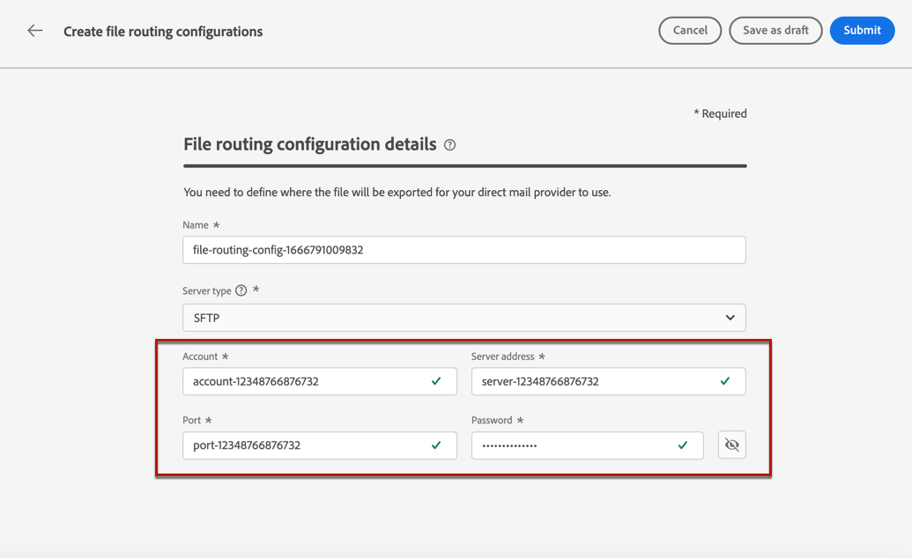
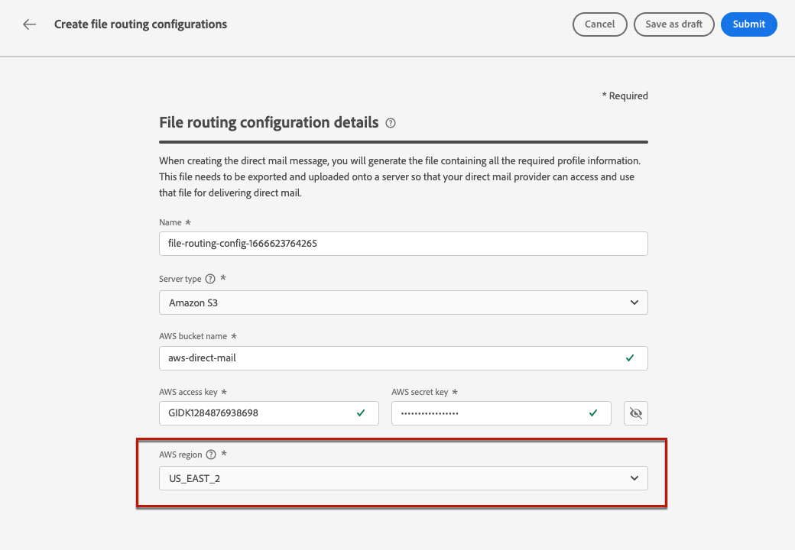

# Konfiguration av direktreklam {#direct-mail-configuration}

[!DNL Journey Optimizer] gör att du kan anpassa och generera de filer som direktreklamleverantörer behöver för att skicka e-post till dina kunder.

När du förbereder en direktleverans, [!DNL Journey Optimizer] genererar en fil som innehåller alla målprofiler och vald kontaktinformation (till exempel postadress). Du kan sedan skicka den här filen till din leverantör för direktmeddelanden som i sin tur tar hand om själva utskicket.

Om du vill skicka ett direktmeddelande måste du skapa en fil och överföra den till en server. Innan du kan göra det måste du skapa en [konfiguration för filroutning](#file-routing-configuration) och [direktreklamyta](#direct-mail-surface) som refererar till filroutningskonfigurationen.

## Konfigurera filroutning {#file-routing-configuration}

>[!CONTEXTUALHELP]
>id="ajo_dm_file_routing_details"
>title="Definiera inställningarna för filroutningskonfigurationen"
>abstract="När du skapar ett direktmeddelande genereras filen som innehåller all nödvändig profilinformation. Den här filen måste exporteras och överföras till en server så att din direktreklamleverantör kan komma åt och använda den filen för att leverera direktreklam."

>[!CONTEXTUALHELP]
>id="ajo_dm_file_routing_details_header"
>title="Definiera inställningarna för filroutningskonfigurationen"
>abstract="Du måste ange var filen ska exporteras och överföras för att din direktmeddelandeleverantör ska kunna använda den."

>[!CONTEXTUALHELP]
>id="ajo_dm_select_file_routing"
>title="Konfiguration av filroutning"
>abstract="Välj valfri konfiguration för filroutning, som anger var filen ska exporteras och överföras så att din direktreklamleverantör kan använda den."

>[!CONTEXTUALHELP]
>id="ajo_dm_file_routing_type"
>title="Välj servertyp för filflödet"
>abstract="Välj vilken server du vill använda för att överföra och lagra direktmeddelandefilerna. För närvarande stöds endast Amazon S3 och SFTP."

>[!CONTEXTUALHELP]
>id="ajo_dm_file_routing_aws_region"
>title="Välj AWS"
>abstract="Välj det geografiska område där du vill exportera och överföra dina direktmeddelandefiler. För optimal användning rekommenderar vi att du väljer den närmaste regionen som värd för din molninfrastruktur."

1. Öppna **[!UICONTROL Administration]** > **[!UICONTROL Channels]** > **[!UICONTROL File routing configuration]** > **[!UICONTROL File Routing]** menyn och klicka sedan på **[!UICONTROL Create routing configuration]**.

   

1. Ange ett namn för konfigurationen.

1. Välj konfigurationen **[!UICONTROL Server type]**, dvs. den server som du vill använda för att överföra och lagra direktmeddelandefiler.

   

   >[!NOTE]
   >
   >För närvarande är endast Amazon S3 och SFTP tillgängliga.

   När du skapar ett direktmeddelande genereras filen som innehåller all nödvändig profilinformation. Den här filen måste exporteras och överföras till en server så att din direktreklamleverantör kan komma åt och använda den filen för att leverera direktreklam.

1. Fyll i information och autentiseringsuppgifter som är specifika för den valda konfigurationstypen, t.ex. serveradress, åtkomstnyckel.

   

1. Om du valde **[!UICONTROL Amazon S3]** väljer du den region i AWS där du vill exportera och överföra dina direktmeddelandefiler.

   

   >[!NOTE]
   >
   >AWS-regionerna är separata geografiska områden som distribueras runt om i världen och som AWS använder för sin infrastruktur. För optimal användning rekommenderar vi att du väljer den närmaste regionen som värd för din molninfrastruktur.

1. Välj **[!UICONTROL Submit]**. Filroutningskonfigurationen skapas med **[!UICONTROL Active]** status. Den kan nu användas i direktreklam för att leverera direktreklam från [!DNL Journey Optimizer].

   >[!NOTE]
   >
   >Du kan också välja **[!UICONTROL Save as draft]** för att skapa filroutningskonfigurationen, men du kan inte markera den på en yta förrän den är **[!UICONTROL Active]**.

## Skapa en yta för direktreklam {#direct-mail-surface}

>[!CONTEXTUALHELP]
>id="ajo_dm_surface_settings"
>title="Definiera inställningar för direktreklam"
>abstract="En yta för direktreklam innehåller inställningar för formatering av filen som innehåller profildata för direktreklam. Du måste också definiera var filen ska exporteras genom att välja filroutningskonfigurationen."

<!--
>[!CONTEXTUALHELP]
>id="ajo_dm_surface_sort"
>title="Define the sort order"
>abstract="If you select this option, the sort will be by profile ID, ascending or descending. If you unselect it, the sorting configuration defined when creating the direct mail message within a journey or a campaign."-->

>[!CONTEXTUALHELP]
>id="ajo_dm_surface_split"
>title="Definiera tröskelvärdet för fildelning"
>abstract="Du måste ange maximalt antal poster för varje fil som innehåller profildata. När det angivna tröskelvärdet har nåtts skapas en annan fil för de återstående posterna."

När filflödet har konfigurerats måste du skapa en kanal för att kunna leverera direktreklam från [!DNL Journey Optimizer]. På varje yta måste du välja en filroutningskonfiguration.

1. Skapa en kanalyta. [Läs mer](channel-surfaces.md)

1. Välj **[!UICONTROL Direct mail]** kanal.

   

1. Definiera inställningarna för direktreklam i det dedikerade avsnittet i kanalytans konfiguration.

   

1. Välj filformat: **[!UICONTROL CSV]** eller **[!UICONTROL Text delimited]**.

1. I **[!UICONTROL Insertion]** kan du välja att automatiskt ta bort dubblettrader.

1. Definiera det maximala antalet poster (t.ex. rader) för varje fil som innehåller profildata. När det angivna tröskelvärdet har nåtts skapas en annan fil för de återstående posterna.

   

   Om det till exempel finns 100 000 poster i filen och tröskelvärdet är 60 000, delas posterna i två filer. Den första filen innehåller 60 000 rader och den andra filen innehåller de återstående 40 000 raderna.

   >[!NOTE]
   >
   >Du kan ange valfritt antal mellan 1 och 200 000 poster, vilket innebär att varje fil måste innehålla minst 1 rad och inte mer än 200 000 rader.

1. Slutligen väljer du **[!UICONTROL File routing configuration]** bland de som du skapade. Detta anger var filen ska exporteras och överföras så att din direktmeddelandeleverantör kan använda den.

   >[!CAUTION]
   >
   >Om du inte har konfigurerat något alternativ för filroutning kan du inte skapa en direktreklamyta. [Läs mer](#file-routing-configuration)

   