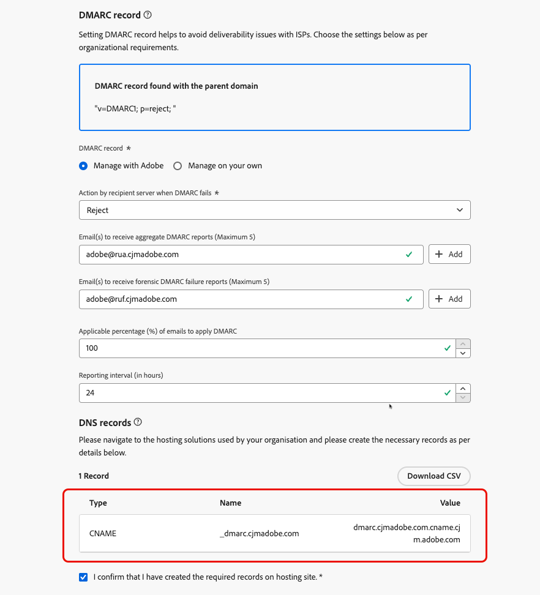
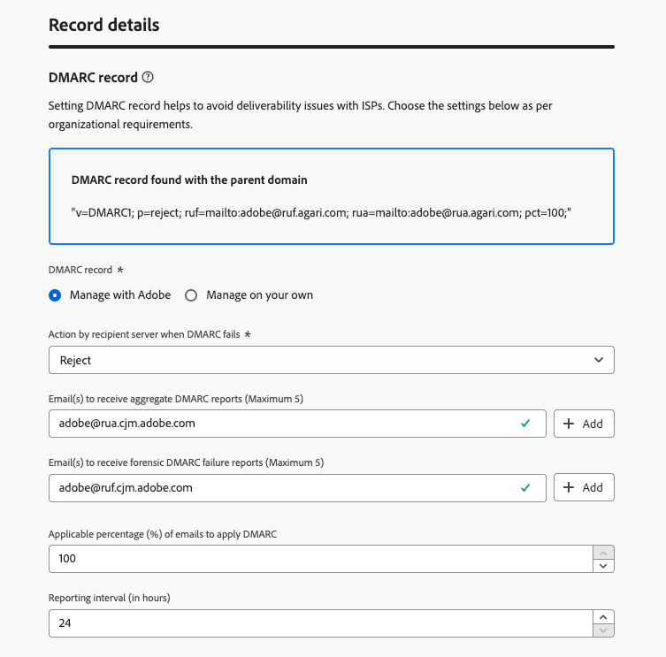

# DMARC record {#dmarc-record}

>[!CONTEXTUALHELP]
>id="ajo_admin_dmarc_record"
>title="Ange DMARC-post"
>abstract="DMARC är en autentiseringsmetod för e-post som gör att domänägare kan skydda sin domän mot obehörig användning och undvika leveransproblem med postlådeprovidrar. Google och Yahoo är en del av deras branschledande praxis. båda kräver att du har en DMARC-post för alla domäner som du använder för att skicka e-post till dem."

## Vad är DMARC? {#what-is-dmarc}

Domänbaserad meddelandeautentisering, rapportering och överensstämmelse (DMARC) är en e-postautentiseringsmetod som gör att domänägare kan skydda sin domän från obehörig användning. Genom att erbjuda en tydlig policy till e-postleverantörer och internetleverantörer hjälper den till att förhindra att skadliga aktörer skickar e-postmeddelanden som hävdar att de kommer från din domän. Implementering av DMARC minskar risken för att legitima e-postmeddelanden markeras som skräppost eller avvisas, och förbättrar e-postleveransen.

DMARC erbjuder också rapporter om meddelanden som inte kan autentiseras, tillsammans med kontroll över hanteringen av e-postmeddelanden som inte godkänns i DMARC-valideringen. Beroende på den implementerade [DMARC-principen](#dmarc-policies) kan dessa e-postmeddelanden övervakas, placeras i karantän eller avvisas. Dessa funktioner gör att du kan vidta åtgärder för att minska och åtgärda potentiella fel.

För att du ska kunna förhindra leveransproblem och få kontroll över e-post som inte kan autentiseras, har [!DNL Journey Optimizer] nu stöd för DMARC-tekniken direkt i administrationsgränssnittet. [Läs mer](#implement-dmarc)

### Hur fungerar DMARC? {#how-dmarc-works}

SPF och DKIM används båda för att associera ett e-postmeddelande med en domän och fungerar tillsammans för att autentisera e-post. DMARC tar detta steg längre och hjälper till att förhindra förfalskning genom att matcha domänen som kontrolleras av DKIM och SPF.

>[!NOTE]
>
>I Journey Optimizer är SPF och DKIM konfigurerade för dig.

För att skicka DMARC måste ett meddelande skicka SPF eller DKIM:

* SPF (Sender Policy Framework) hjälper till att verifiera att e-postmeddelandet kommer från en auktoriserad källa genom att kontrollera den avsändande serverns IP-adress mot en lista över auktoriserade IP-adresser för domänen.
* DKIM (DomainKeys Identified Mail) lägger till en digital signatur i e-postmeddelanden så att mottagaren kan verifiera meddelandets integritet och autenticitet.

Om båda eller någon av dessa inte kan autentiseras, kommer DMARC att misslyckas och e-postmeddelandet levereras enligt din valda DMARC-policy.

<!--DMARC requires alignment between the 'From" and 'Return-Path' address.-->

### DMARC policies {#dmarc-policies}

Om ett e-postmeddelande inte kan autentiseras av DMARC kan du bestämma vilken åtgärd som ska utföras för det meddelandet. DMARC har tre policyalternativ:

* Monitor (p=none): Instruerar postlådeprovidern/ISP att göra vad de normalt skulle göra med meddelandet.
* Karantän (p=karantän): Instruerar postlådeprovidern/ISP att leverera e-post som inte skickar DMARC till mottagarens skräppostmapp.
* Avvisa (p=avvisa): Instruerar postlådeprovidern/ISP att blockera e-post som inte godkänns av DMARC, vilket resulterar i ett studs.

>[!NOTE]
>
>Lär dig hur du ställer in DMARC-principen med [!DNL Journey Optimizer] i [det här avsnittet](#set-up-dmarc).

## Uppdatering av krav för DMARC {#dmarc-update}

Google och Yahoo är en del av deras branschledande arbetsmetoder! båda kräver att du har en **DMARC-post** för alla domäner som du använder för att skicka e-post till dem. Det nya kravet gäller från och med den **1 februari 2024**.

>[!CAUTION]
>
>Misslyckas med att uppfylla det nya kravet från Gmail och Yahoo! förväntas resultera i att e-postmeddelanden landar i skräppostmappen eller blockeras.

Adobe rekommenderar därför att du vidtar följande åtgärder:

* Se till att du har konfigurerat **DMARC-posten** för **alla underdomäner som du redan har delegerat** till Adobe i [!DNL Journey Optimizer]. [Lär dig hur](#check-subdomains-for-dmarc)

* När du **delegerar en ny underdomän** till Adobe kan du **konfigurera DMARC** direkt **i [!DNL Journey Optimizer] administrationsgränssnittet**. [Lär dig hur](#implement-dmarc)

## Implementera DMARC i [!DNL Journey Optimizer] {#implement-dmarc}

Med administrationsgränssnittet [!DNL Journey Optimizer] kan du konfigurera DMARC-posten för alla underdomäner som du redan har delegerat eller delegerar till Adobe. De detaljerade stegen beskrivs nedan.

### Kontrollera dina befintliga underdomäner för DMARC {#check-subdomains-for-dmarc}

Följ stegen nedan för att se till att du har konfigurerat en DMARC-post för alla underdomäner som du har delegerat i [!DNL Journey Optimizer].

1. Gå till menyn **[!UICONTROL Administration]** > **[!UICONTROL Channels]** > **[!UICONTROL Email settings]** > **[!UICONTROL Subdomains]** och klicka sedan på **[!UICONTROL Set up subdomain]**.

1. Kontrollera kolumnen **[!UICONTROL DMARC Record]** för varje delegerad underdomän. Om ingen post hittades för en viss underdomän visas en varning.

   

   >[!CAUTION]
   >
   >För att uppfylla det nya kravet från Gmail och Yahoo! och undvika leveransproblem med de bästa Internet-leverantörerna, rekommenderar vi att du ställer in DMARC-posten för alla delegerade underdomäner. [Läs mer](dmarc-record-update.md)

1. Välj en underdomän utan någon associerad DMARC-post och fyll i avsnittet **[!UICONTROL DMARC record]** efter organisationens behov. Stegen för att fylla i DMARC-postfält beskrivs i [det här avsnittet](#implement-dmarc).

   <!---->

   >[!NOTE]
   >
   >Beroende på om en DMARC-post hittas med den överordnade domänen eller inte kan du välja att använda värdena från den överordnade domänen eller att låta Adobe hantera DMARC-posten. [Läs mer](#implement-dmarc)

1. Om du redigerar en underdomän:

   * [Fullt delegerad](delegate-subdomain.md#set-up-subdomain) till Adobe, ingen ytterligare åtgärd krävs.

   * Konfigurera med [CNAME](delegate-subdomain.md#cname-subdomain-setup), du måste kopiera DNS-posten för DMARC till din värdlösning för att kunna generera matchande DNS-poster.

     

     Kontrollera att DNS-posten har genererats i din domänvärdslösning och markera kryssrutan Jag bekräftar...

1. Spara ändringarna.

### Konfigurera DMARC för nya underdomäner {#set-up-dmarc}

När nya underdomäner delegeras till Adobe i [!DNL Journey Optimizer] skapas en DMARC-post i DNS för din domän. Följ stegen nedan för att implementera DMARC.

>[!CAUTION]
>
>För att uppfylla det nya kravet från Gmail och Yahoo! och undvika leveransproblem med de bästa Internet-leverantörerna, rekommenderar vi att du ställer in DMARC-posten för alla delegerade underdomäner. [Läs mer](dmarc-record-update.md)

<!--If you fail to comply with the new requirement from Gmail and Yahoo! to have DMARC record for all sending domains, your emails are expected to land into the spam folder or to get blocked.-->

1. Konfigurera en ny underdomän. [Lär dig hur](delegate-subdomain.md)

1. Gå till avsnittet **[!UICONTROL DMARC record]**.

1. Om det finns en DMARC-post på den överordnade domänen som är kopplad till din underdomän visas två alternativ:

   

   * **[!UICONTROL Manage with Adobe]**: Adobe kan hantera DMARC-posten för din underdomän. Följ stegen som beskrivs i [det här avsnittet](#manage-dmarc-with-adobe).

   * **[!UICONTROL Manage on your own]**: <!--This option is selected by default.-->Med det här alternativet kan du hantera DMARC-posten utanför [!DNL Journey Optimizer] med värden från den överordnade domänen. Dessa värden visas i gränssnittet, men du kan inte redigera dem.

     {width="80%"}

1. Om ingen DMARC-post hittas på den överordnade domänen är endast alternativet **[!UICONTROL Manage with Adobe]** tillgängligt. Följ stegen [nedan](#manage-dmarc-with-adobe) för att konfigurera DMARC-posten för din underdomän.

   {width="80%"}

### Hantera DMARC-post med Adobe {#manage-dmarc-with-adobe}

Om du vill låta Adobe hantera DMARC-posten åt dig väljer du alternativet **[!UICONTROL Manage with Adobe]** och följer stegen nedan.

>[!NOTE]
>
>Om den hämtas av [!DNL Journey Optimizer] kan du använda samma värden som markeras i gränssnittet, eller ändra dem efter behov.

{width="80%"}

>[!NOTE]
>
>Om du inte lägger till några värden används de förfyllda standardvärdena.

1. Definiera åtgärden som mottagarservern ska utföra om DMARC misslyckas. Beroende på vilken [DMARC-princip](#dmarc-policies) du vill tillämpa väljer du något av följande tre alternativ:

   * **[!UICONTROL None]** (standardvärde): Uppmanar mottagaren att inte utföra några åtgärder mot meddelanden som inte kan autentiseras av DMARC, men ändå skicka e-postrapporter till avsändaren.
   * **[!UICONTROL Quarantine]**: Anger att den mottagande e-postservern ska placera e-post som inte kan autentiseras av DMARC i karantän. Detta innebär vanligtvis att meddelandena placeras i mottagarens skräppostmapp.
   * **[!UICONTROL Reject]**: Be mottagaren att helt neka (studsa) e-post för domänen som inte kan autentiseras. När den här principen är aktiverad har bara e-post som verifieras som 100 % autentiserad av din domän en chans att placeras i inkorgen.

   >[!NOTE]
   >
   >Vi rekommenderar att du långsamt implementerar DMARC-implementering genom att eskalera din DMARC-policy från **Inget** till **Karantän** till **Avvisa** när du får kunskap om hur DMARC kan påverka.

1. Om du vill kan du lägga till en eller flera e-postadresser för att ange var **DMARC rapporterar** om e-postmeddelanden som [inte kan autentiseras](#how-dmarc-works) ska placeras i din organisation. Du kan lägga till upp till fem adresser för varje rapport.

   >[!NOTE]
   >
   >Kontrollera att du har en äkta inkorg (inte Adobe) där du kan ta emot rapporterna.

   Det finns två olika rapporter som genereras av Internet-leverantörer och som avsändare kan få via RUA/RUF-taggarna i sin DMARC-policy:

   * **Aggregerade rapporter** (RUA): De innehåller inga PII-filer (personligt identifierbar information) som kan vara GDPR-känsliga.
   * **Rapporter om tekniska fel** (RUF): De innehåller GDPR-känsliga e-postadresser. Innan du använder programmet bör du kontrollera internt hur man hanterar information som måste vara GDPR-kompatibel.

   >[!NOTE]
   >
   >Dessa mycket tekniska rapporter ger en översikt över e-postmeddelanden som försöker förfalskas. De smälter bäst in via ett verktyg från tredje part.

1. Välj den **tillämpliga procentandelen** av e-postmeddelanden för DMARC.

   Den här procentandelen beror på ditt förtroende för e-postinfrastrukturen och toleransen för falska positiva svar (legitima e-postmeddelanden markeras som bedrägliga). Det är vanligt att organisationer börjar med en DMARC-policy som är inställd på **Ingen**, gradvis ökar procentandelen för DMARC-policyn och noga övervakar effekten på den legitima e-postleveransen.

   >[!NOTE]
   >
   >Samarbeta med e-postadministratörer och IT-team för att gradvis öka procentandelen när ni får förtroende för era rutiner för e-postautentisering.

   Som en god praxis bör du sträva efter en hög efterlevnadsnivå för DMARC, helst nära 100 %, för att maximera säkerhetsfördelarna samtidigt som risken för falskt positiva resultat minimeras.

1. Välj ett **rapporteringsintervall** mellan 24 och 168 timmar. Det gör det möjligt för domänägare att få regelbundna uppdateringar om resultaten av e-postautentiseringen och vidta nödvändiga åtgärder för att förbättra e-postsäkerheten.

### Felsökning {#troubleshooting}

När du konfigurerar en DMARC-post lägger du till en DNS TXT-post i domänens DNS-inställningar. Den här posten anger din DMARC-policy, till exempel om meddelanden som inte kan autentiseras ska sättas i karantän eller inte.

Det tar tid att sprida DNS-ändringar över Internet, vanligtvis mellan några minuter och 48 timmar.

Om du precis har gjort en konfigurationsändring i DMARC och försöker verifiera uppdateringen omedelbart, kan det bero på fel eller att ändringarna inte har identifierats ännu.

Ge DNS-posterna tillräckligt med tid att sprida sig innan du försöker verifiera din DMARC-konfiguration.

<!--The DMARC reporting interval is specified in the DMARC policy published in the DNS (Domain Name System) records for a domain. The reporting interval can be set to daily, weekly, or another specified frequency, depending on the domain owner's preferences.

The default value (24 hours) is generally the email providers' expectation.

**********

Setting up a DMARC record involves adding a DNS TXT record to your domain's DNS settings. This record specifies your DMARC policy, such as whether to quarantine or reject messages that fail authentication. Implementing DMARC is a proactive step towards enhancing email security and protecting both your organization and your recipients from email-based threats.

DMARC helps prevent malicious actors from sending emails that appear to come from your domain. By setting up DMARC, you can specify how email providers should handle messages that fail authentication checks, reducing the likelihood that phishing emails will reach recipients.

DMARC helps improve email deliverability by providing a clear policy for email providers to follow when encountering messages claiming to be from your domain. This can reduce the chances of legitimate emails being marked as spam or rejected.

DMARC helps protect against email spoofing, phishing, and other fraudulent activities.

It allows you to decide how a mailbox provider should handle emails that fail SPF and DKIM checks, providing a way to authenticate the sender's domain and prevent unauthorized use of the domain for malicious purposes.

## What are the benefits of DMARC? {#dmarc-benefits}

The key benefits or DMARC are as folllows:

* DMARC allows email receivers to easily identify the authentication of emails, which could potentially improve delivery.

* It offers reporting on which messages fail SPF and/or DKIM, enabling senders to gain visibility.

* This increased visibility allows for steps to be taken to mitigate further errors. It gives senders a degree of control over what happens with mail that does not pass either of these authentication methods.

-->
