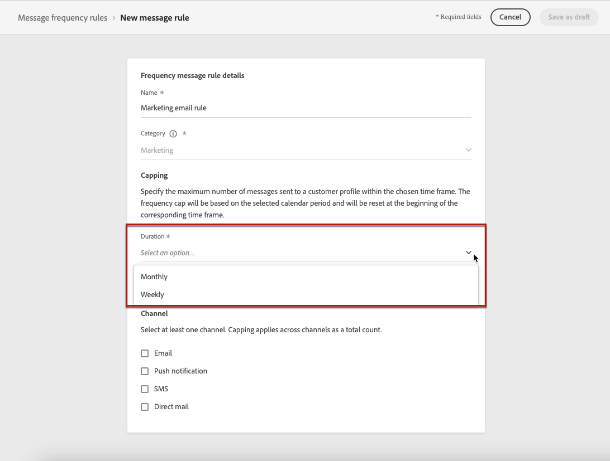

# Konfigurera affärsregler {#frequency-rules}

>[!CONTEXTUALHELP]
>id="ajo_business_rules_message_frequency_rules"
>title="Affärsregler"
>abstract="Regler för meddelandefrekvens är en typ av affärsregel som begränsar antalet gånger som användare får meddelanden eller deltar i resor över en eller flera kanaler. Dessa flerkanalsregler exkluderar automatiskt överbegärda profiler från meddelanden och åtgärder."

Med [!DNL Journey Optimizer] kan du styra hur ofta användare ska få ett meddelande eller delta i en resa över en eller flera kanaler. Regler för meddelandefrekvens som automatiskt exkluderar överbegärda profiler från meddelanden och åtgärder.

För ett varumärke kan till exempel en regel vara att inte skicka mer än fyra marknadsföringsmeddelanden per månad till sina kunder. För att göra detta kan du använda en affärsregel som begränsar antalet meddelanden som skickas baserat på en eller flera kanaler under en månadskalenderperiod.

>[!NOTE]
>
>Affärsreglerna skiljer sig från avanmälningshantering, som gör det möjligt för användare att avbryta prenumerationen på information från ett varumärke. [Läs mer](../privacy/opt-out.md#opt-out-management)

➡️ [Upptäck den här funktionen i videon](#video)

## Åtkomst till affärsregler {#access-rules}

Affärsregler är tillgängliga på menyn **[!UICONTROL Administration]** > **[!UICONTROL Business rules]**. Alla regler visas sorterade efter ändringsdatum. Använd filterikonen för att filtrera efter kategori, status och/eller kanal. Du kan också söka på meddelandeetiketten.

### Behörigheter{#permissions-frequency-rules}

Om du vill komma åt, skapa, redigera eller ta bort affärsregler måste du ha behörigheten **[!UICONTROL Manage frequency rules]**.

Användare med behörigheten **[!UICONTROL View frequency rules]** kan visa regler, men inte ändra eller ta bort dem.

Läs mer om behörigheter i [det här avsnittet](../administration/high-low-permissions.md).

## Skapa en affärsregel {#create-new-rule}

>[!CONTEXTUALHELP]
>id="ajo_rules_category"
>title="Välj meddelanderegelkategori"
>abstract="När det aktiveras och används i ett meddelande, kommer alla affärsregler som matchar den valda kategorin automatiskt att tillämpas på det här meddelandet. För närvarande är endast marknadsföringskategorin tillgänglig."

>[!CONTEXTUALHELP]
>id="ajo_rules_capping"
>title="Ange begränsning för din affärsregel"
>abstract="Ange det maximala antalet meddelanden som skickas till en kundprofil inom den valda tidsramen. Frekvensgränsen baseras på den valda kalenderperioden och återställs i början av motsvarande tidsram."

>[!CONTEXTUALHELP]
>id="ajo_rules_channel"
>title="Definiera de kanaler som affärsregeln gäller för"
>abstract="Välj minst en kanal. Taket tillämpas över alla kanaler som ett totalt antal."

Följ stegen nedan för att skapa en ny affärsregel.

1. Öppna listan **[!UICONTROL Business rules]** och klicka sedan på **[!UICONTROL Create rule]**.

   

1. Definiera regelnamnet och markera meddelanderegelkategorin.

   >[!NOTE]
   >
   >Endast kategorin **[!UICONTROL Marketing]** är tillgänglig.

   

1. I listrutan **[!UICONTROL Duration]** väljer du en tidsram för den begränsning som ska användas. [Läs mer](#frequency-cap)

1. Ange begränsningen för din regel, vilket innebär det maximala antalet meddelanden som kan skickas till en enskild användarprofil varje månad, eller vecka <!--or day-->, enligt ditt val ovan.

   <!---->

1. Markera kanalen som du vill använda för den här regeln: **[!UICONTROL Email]**, **[!UICONTROL Push notification]**, **[!UICONTROL SMS]** eller **[!UICONTROL Direct mail]**.

   

   >[!NOTE]
   >
   >Du måste välja minst en kanal för att kunna skapa regeln.

1. Markera flera kanaler om du vill tillämpa begränsning för alla markerade kanaler som ett totalt antal.

   Ange till exempel 15 som capping och markera både e-post- och push-kanalerna. Om en profil redan har fått 10 marknadsföringsmeddelanden och 5 push-meddelanden för marknadsföring under den valda perioden, kommer den här profilen inte att ingå i nästa leverans av marknadsföringsmeddelanden eller push-meddelanden.

1. Klicka på **[!UICONTROL Save as draft]** för att bekräfta att regeln har skapats. Meddelandet läggs till i regellistan med statusen **[!UICONTROL Draft]**.

   

### Frekvenslock {#frequency-cap}

I listrutan **[!UICONTROL Duration]** väljer du om du vill att capping ska användas månads- eller veckovis.

>[!NOTE]
>
>Daglig frekvens finns också tillgänglig vid behov. [Läs mer](#daily-frequency-cap)

Frekvensgränsen baseras på den valda kalenderperioden. Den återställs i början av motsvarande tidsram.

Räknaren för varje period har följande förfallodatum:

* **[!UICONTROL Monthly]**: Frekvensgränsen gäller till den sista dagen i månaden vid 23:59:59 UTC. Månadsförfallodatumet för januari är till exempel 01-31 23:59:59 UTC.

* **[!UICONTROL Weekly]**: Frekvensgränsen gäller till lördag :59:{59 UTC den veckan när kalenderveckan börjar på söndag. Utgångsdatumet är oberoende av hur regeln skapas. Om regeln till exempel skapas på torsdag gäller den till lördag den 23:59:59.

### Daglig frekvensbegränsning {#daily-frequency-cap}

Förutom månatligt och veckovis finns daglig frekvens tillgänglig vid behov. Kontakta Adobe om du vill ha mer information.

Den dagliga frekvensen gäller för dagen till :59: {59 UTC och återställs till 0 i början av nästa dag.

>[!NOTE]
>
>För att säkerställa noggrannhet för regler för daglig frekvensbegränsning bör [direktuppspelningssegmentering](https://experienceleague.adobe.com/docs/experience-platform/segmentation/ui/streaming-segmentation.html){target="_blank"} användas. Läs mer om metoder för målgruppsutvärdering i [det här avsnittet](../audience/about-audiences.md#evaluation-method-in-journey-optimizer).

## Aktivera en affärsregel {#activate-rule}

När en affärsregel skapas har den statusen **[!UICONTROL Draft]** och påverkar ännu inte något meddelande. Om du vill aktivera den klickar du på ellipsen bredvid regeln och väljer **[!UICONTROL Activate]**.

Om du aktiverar en regel påverkas alla meddelanden som gäller för nästa körning. Lär dig hur du [tillämpar en affärsregel på ett meddelande](#apply-frequency-rule).

>[!NOTE]
>
>Det kan ta upp till 10 minuter innan en regel aktiveras helt. Du behöver inte ändra meddelanden eller publicera om resor för att en regel ska börja gälla.

Om du vill inaktivera en affärsregel klickar du på ellipsen bredvid regeln och väljer **[!UICONTROL Deactivate]**.

Regelens status ändras till **[!UICONTROL Inactive]** och regeln gäller inte för framtida meddelandekörningar. Meddelanden som körs just nu påverkas inte.

>[!NOTE]
>
>När du inaktiverar en regel påverkas eller återställs inte antalet enskilda profiler.

## Tillämpa en affärsregel på ett meddelande {#apply-frequency-rule}

Följ stegen nedan för att tillämpa en affärsregel på ett meddelande.

1. När du skapar en [resa](../building-journeys/journey-gs.md) lägger du till ett meddelande genom att välja någon av de kanaler som du har definierat för regeln.

1. Välj kategorin som du definierade för [regeln som du skapade](#create-new-rule).

   

   >[!NOTE]
   >
   >För närvarande är bara kategorin **[!UICONTROL Marketing]** tillgänglig för affärsregler.

1. Du kan klicka på länken **[!UICONTROL Frequency rule]** om du vill visa skärmen med frekvensregler på en ny flik. [Läs mer](#access-rules)

   Alla regler som matchar den valda kategorin och kanalen/kanalerna tillämpas automatiskt på det här meddelandet.

   >[!NOTE]
   >
   >Meddelanden där den valda kategorin är **[!UICONTROL Transactional]** utvärderas inte mot frekvensregler.

1. Du kan visa antalet profiler som har uteslutits från leverans i [Customer Journey Analytics-rapporten](../reports/report-gs-cja.md) och i [Live-rapporten](../reports/live-report.md), där affärsregler listas som en möjlig orsak för användare som har uteslutits från leverans.

>[!NOTE]
>
>Flera regler kan gälla för samma kanal, men när den nedre gränsen har nåtts utesluts profilen från nästa leverans.

## Exempel: kombinera flera regler {#frequency-rule-example}

Du kan kombinera flera affärsregler, som beskrivs i exemplet nedan.

1. [Skapa en affärsregel](#create-new-rule) med namnet *Total Marketing Capping*:

   * Markera alla kanaler.
   * Ställ in capping på 12 månatliga.

   

1. Om du vill begränsa antalet marknadsföringsbaserade push-meddelanden som en användare skickas ytterligare skapar du en andra regel med namnet *Push Marketing Cap*:

   * Välj Push-kanal.
   * Ställ in capping på 4 månatliga.

   

1. Spara och [aktivera](#activate-rule) regeln.

1. [Skapa ett meddelande](../building-journeys/journeys-message.md) för varje kanal som du vill kommunicera genom och välj kategorin **[!UICONTROL Marketing]** för varje meddelande. [Lär dig hur du tillämpar en affärsregel](#apply-frequency-rule)

   

<!--
Learn how to create a message for the different channels in the following sections:
* [Create an email](../email/create-email.md)
* [Create a push notification](../push/create-push.md)
* [Create an SMS](../sms/create-sms.md)
* [Create a direct mail](../direct-mail/create-direct-mail.md)

Create an email and select the **[!UICONTROL Marketing]** category for that message. [Learn more](../email/create-email.md)

Create a push notification and select the **[!UICONTROL Marketing]** category for that message. [Learn more](../push/create-push.md)

Create an SMS and select the **[!UICONTROL Marketing]** category for that message. [Learn more](../sms/create-sms.md)

Create a direct mail and select the **[!UICONTROL Marketing]** category for that message. [Learn more](../direct-mail/create-direct-mail.md)
-->

I det här scenariot finns en enskild profil:
* kan ta emot upp till 12 marknadsföringsmeddelanden per månad,
* men utesluts från push-meddelanden om marknadsföring när de har fått 4 push-meddelanden.

>[!NOTE]
>
>När du testar affärsregler bör du använda en ny [testprofil](../audience/creating-test-profiles.md) eftersom det inte finns något sätt att återställa räknaren förrän nästa månad när en profils övre gräns för frekvens har nåtts. Om du inaktiverar en regel kan mappade profiler ta emot meddelanden, men inga räknarsteg tas bort eller tas bort.

## Instruktionsvideo {#video}

Lär dig hur du skapar, aktiverar, testar och rapporterar om affärsregler.

>[!VIDEO](https://video.tv.adobe.com/v/344451?quality=12)
