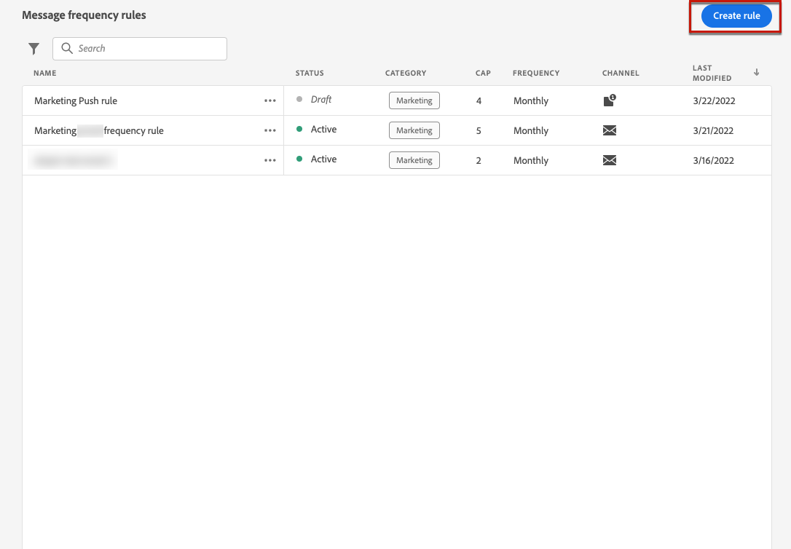
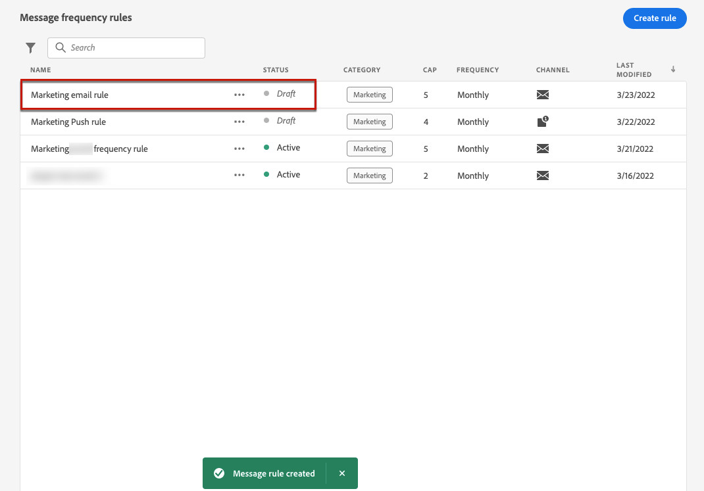

# Regler för meddelandefrekvens {#frequency-rules}

[!DNL Journey Optimizer] Med kan du styra hur ofta användare ska få ett meddelande eller delta i en resa genom att ställa in flerkanalsregler som automatiskt utesluter överbegärda profiler från meddelanden och åtgärder.

En regel för ett varumärke kan till exempel inte vara att skicka mer än tre marknadsföringsmeddelanden per månad till sina kunder. För att göra detta kan du använda en frekvensregel som begränsar antalet meddelanden som skickas baserat på en eller flera kanaler under en månadskalenderperiod.

>[!NOTE]
>
>Reglerna för meddelandefrekvens skiljer sig från reglerna för avanmälningshantering, som gör det möjligt för användare att avbryta prenumerationen på meddelanden från ett varumärke. [Läs mer](../privacy/opt-out.md#opt-out-management)

➡️ [Upptäck den här funktionen i en video](#video)

## Åtkomstregler {#access-rules}

Regler är tillgängliga från **[!UICONTROL Administration]** > **[!UICONTROL Rules]** -menyn. Alla regler visas sorterade efter ändringsdatum.

Använd filterikonen för att filtrera efter kategori, status och/eller kanal. Du kan också söka på meddelandeetiketten.

### Behörigheter{#permissions-frequency-rules}

Om du vill komma åt, skapa, redigera eller ta bort regler för meddelandefrekvens måste du ha **[!UICONTROL Manage frequency rules]** behörighet.

Användare med **[!UICONTROL View frequency rules]** behörighet kan visa regler, men inte ändra eller ta bort dem.

Läs mer om behörigheter i [det här avsnittet](../administration/high-low-permissions.md).

## Skapa en regel {#create-new-rule}

>[!CONTEXTUALHELP]
>id="ajo_rules_category"
>title="Välj meddelanderegelkategori"
>abstract="När det aktiveras och används för ett meddelande, kommer alla frekvensregler som matchar den valda kategorin automatiskt att tillämpas på det här meddelandet. För närvarande är endast marknadsföringskategorin tillgänglig."

>[!CONTEXTUALHELP]
>id="ajo_rules_capping"
>title="Ange begränsning för din regel"
>abstract="Ange det maximala antalet meddelanden som skickas till en kundprofil varje månad. Frekvensgränsen baseras på en månadskalenderperiod och återställs i början av varje månad."

>[!CONTEXTUALHELP]
>id="ajo_rules_channel"
>title="Definiera de kanaler som regeln gäller för"
>abstract="Välj minst en kanal. Taket tillämpas över alla kanaler som ett totalt antal."

Följ stegen nedan för att skapa en ny regel.

1. Öppna **[!UICONTROL Message frequency rules]** lista och klicka sedan på **[!UICONTROL Create rule]**.

   

1. Definiera regelnamnet.

   

1. Välj meddelanderegelkategori.

   >[!NOTE]
   >
   >För närvarande bara **[!UICONTROL Marketing]** finns tillgänglig.

1. Ange begränsningen för regeln, vilket innebär det maximala antalet meddelanden som kan skickas till en enskild användarprofil varje månad.

   

   >[!NOTE]
   >
   >Frekvensgränsen baseras på en månatlig kalenderperiod. Den återställs i början av varje månad.

1. Markera kanalen som du vill använda för den här regeln: **[!UICONTROL Email]** eller **[!UICONTROL Push notification]**.

   

   >[!NOTE]
   >
   >Du måste välja minst en kanal för att kunna skapa regeln.

1. Markera flera kanaler om du vill tillämpa begränsning för alla markerade kanaler som ett totalt antal.

   Ange till exempel 15 som capping och markera både e-post- och push-kanalerna. Om en profil redan har fått 10 marknadsföringsmeddelanden och 5 push-meddelanden om marknadsföring, kommer den här profilen att uteslutas vid nästa leverans av marknadsföringsmeddelanden eller push-meddelanden.

1. Klicka **[!UICONTROL Save as draft]** för att bekräfta att regeln har skapats. Ditt meddelande läggs till i regellistan med **[!UICONTROL Draft]** status.

   

## Aktivera en regel {#activate-rule}

När en regel för meddelandefrekvens skapas har den **[!UICONTROL Draft]** status och påverkar ännu inte något meddelande. Om du vill aktivera den klickar du på ellipsen bredvid regeln och väljer **[!UICONTROL Activate]**.

Om du aktiverar en regel påverkas alla meddelanden som gäller för nästa körning. Lär dig hur [tillämpa en frekvensregel på ett meddelande](#apply-frequency-rule).

>[!NOTE]
>
>Det kan ta upp till 10 minuter innan en regel aktiveras helt. Du behöver inte ändra meddelanden eller publicera om resor för att en regel ska börja gälla.

Om du vill inaktivera en regel för meddelandefrekvens klickar du på ellipsen bredvid regeln och väljer **[!UICONTROL Deactivate]**.

Regelens status ändras till **[!UICONTROL Inactive]** och regeln gäller inte för framtida meddelandekörningar. Meddelanden som körs just nu påverkas inte.

>[!NOTE]
>
>När du inaktiverar en regel påverkas eller återställs inte antalet enskilda profiler.

## Tillämpa en frekvensregel på ett meddelande {#apply-frequency-rule}

Följ stegen nedan för att tillämpa en frekvensregel på ett meddelande.

1. När en [resa](../building-journeys/journey-gs.md)lägger du till ett meddelande genom att välja någon av de kanaler som du har definierat för regeln.

1. Välj den kategori som du har definierat för [regel som du skapade](#create-new-rule).

   

   >[!NOTE]
   >
   >För närvarande bara **[!UICONTROL Marketing]** finns för regler för meddelandefrekvens.

1. Du kan klicka på **[!UICONTROL Frequency rule]** om du vill visa skärmen med frekvensregler på en ny flik. [Läs mer](#access-rules)

   Alla frekvensregler som matchar den valda kategorin och kanalen/kanalerna tillämpas automatiskt på det här meddelandet.

   >[!NOTE]
   >
   >Meddelanden där den valda kategorin är **[!UICONTROL Transactional]** utvärderas inte mot frekvensregler.

1. Du kan visa antalet profiler som har uteslutits från leverans i [Global rapport](../reports/global-report.md)och i [Live-rapport](../reports/live-report.md), där frekvensreglerna listas som en möjlig orsak för användare som inte får leverera.

>[!NOTE]
>
>Flera regler kan gälla för samma kanal, men när den nedre gränsen har nåtts utesluts profilen från nästa leverans.

## Exempel: kombinera flera regler {#frequency-rule-example}

Du kan kombinera flera regler för meddelandefrekvens, som beskrivs i exemplet nedan.

1. [Skapa en regel](#create-new-rule) anropad *Total marknadsföringstak*:

   * Välj E-post- och push-kanaler.
   * Ange begränsning till 12.

   

1. Om du vill begränsa antalet marknadsföringsbaserade push-meddelanden som en användare skickas vidare skapar du en andra regel som kallas *Push Marketing Cap*:

   * Välj Push-kanal.
   * Ställ in capping på 4.

   

1. Spara och [activate](#activate-rule) regeln.

1. Skapa ett e-postmeddelande och välj **[!UICONTROL Marketing]** kategori för det meddelandet. [Läs mer](../email/create-email.md)

1. Skapa ett push-meddelande och välj **[!UICONTROL Marketing]** kategori för det meddelandet. [Läs mer](../push/create-push.md)

I det här scenariot finns en enskild profil:
* kan ta emot upp till 12 marknadsföringsmeddelanden per månad,
* men utesluts från push-meddelanden om marknadsföring när de har fått 4 push-meddelanden.

>[!NOTE]
>
>När du testar frekvensregler bör du använda en ny [testprofil](../audience/creating-test-profiles.md)eftersom det inte finns något sätt att återställa räknaren förrän nästa månad när en profils övre gräns för frekvens har nåtts. Om du inaktiverar en regel kan mappade profiler ta emot meddelanden, men inga räknarsteg tas bort eller tas bort.

## Instruktionsvideo {#video}

Lär dig hur du skapar, aktiverar, testar och rapporterar frekvensregler.

>[!VIDEO](https://video.tv.adobe.com/v/344451?quality=12)
