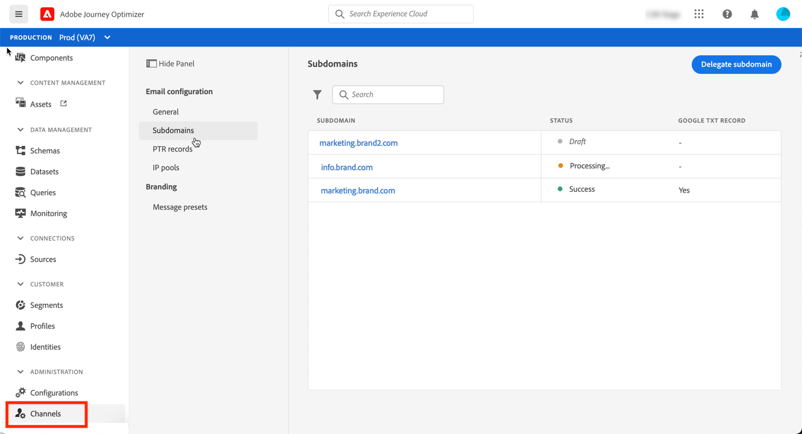

# Kom igång med konfigurationen [!DNL Journey Optimizer]

När du använder [!DNL Journey Optimizer] för första gången tilldelas du en produktionssandlåda och ett visst antal IP-adresser beroende på ditt kontrakt.

För att kunna skapa dina resor och skicka meddelanden måste du gå igenom följande konfigurationssteg:

1. **Konfigurera meddelanden och kanaler**: definiera förinställningar, anpassa och anpassa e-post och push-meddelanden

   * Definiera inställningar för push-meddelanden i både [!DNL Adobe Experience Platform] och [!DNL Adobe Experience Platform Launch]. [Läs mer](../push-configuration.md)

   * Skapa meddelandeförinställningar för att konfigurera alla tekniska parametrar som krävs för e-post och push-meddelanden. [Läs mer](message-presets.md)

   * Avgör vilken e-postadress som ska användas i prioritetsordning för mottagarna när det finns flera tillgängliga adresser i Adobe Experience Platform. [Läs mer](primary-email-addresses.md)

   * Hantera det antal dagar som nya försök utförs innan e-postadresser skickas till listan över inaktiveringar. [Läs mer](manage-suppression-list.md)

<!--
* Understand push notification flow. [Learn more](../push-gs.md)
-->
1. **Delegera underdomäner**: för alla nya underdomäner som ska användas i Journey Optimizer är det första steget att delegera den. [Läs mer](about-subdomain-delegation.md)

   

1. **Skapa IP-pooler**: förbättra e-postleveransen och ditt anseende genom att gruppera IP-adresser som har etablerats med din instans. [Läs mer](ip-pools.md)

   

1. **Konfigurera resor**: för att kunna bygga resor måste ni konfigurera  **[!UICONTROL Data Sources]** och  **[!UICONTROL Events]**  **[!UICONTROL Actions]**. [Läs mer](about-data-sources-events-actions.md)

   

   * Med konfigurationen **Datakälla** kan du definiera en anslutning till ett system för att hämta ytterligare information som ska användas på dina resor. Läs mer om datakällor i det här [avsnittet](../datasource/about-data-sources.md)

   * **Med** händelser kan ni utlösa era resor styckvis för att skicka meddelanden i realtid till den person som flyger in på resan. I händelsekonfigurationen konfigurerar du de händelser som förväntas under resorna. Data för inkommande händelser normaliseras enligt Adobe Experience Data Model (XDM). Händelser kommer från API för strömningsinmatning för autentiserade och ej autentiserade händelser (till exempel händelser i Adobe Mobile SDK). Läs mer om händelser i det här [avsnittet](../event/about-events.md)

   * [!DNL Journey Optimizer] innehåller inbyggda meddelandefunktioner: kan du utforma innehållet och publicera meddelandet. Om du använder ett tredjepartssystem för att skicka meddelanden skapar du en **anpassad åtgärd**. Läs mer om åtgärder i det här [avsnittet](../action/action.md)