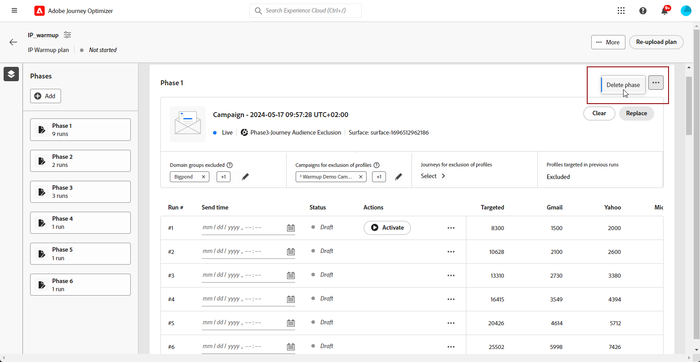

# Kör IP-värmerappen {#ip-warmup-running}

När du har [skapat en IP-uppvärmningsplan](ip-warmup-plan.md) och överfört filen som har förberetts med din leveranskonsult, kan du definiera faserna och körningarna i din plan.

Varje fas består av flera körningar, som ni tilldelar en enda kampanj till.

## Definiera faserna {#define-phases}

>[!CONTEXTUALHELP]
>id="ajo_admin_ip_warmup_campaigns_excluded"
>title="Uteslut kampanjmålgrupper"
>abstract="Välj kampanjer för att exkludera deras målgrupper från den aktuella fasen. Detta förhindrar att tidigare kontaktade profiler målgruppsanpassas igen. Endast de som har fått kommunikation via resan kommer att uteslutas."

>[!CONTEXTUALHELP]
>id="ajo_admin_ip_warmup_domains_excluded"
>title="Uteslut domängrupper"
>abstract="Välj de domäner som du vill utesluta från den aktuella fasen. Domänundantag kräver en icke-körd fas, så du kan behöva dela en pågående fas för att lägga till undantag."
>additional-url="https://experienceleague.adobe.com/docs/journey-optimizer/using/configuration/implement-ip-warmup-plan/ip-warmup-execution.html#split-phase" text="Dela en fas"

>[!CONTEXTUALHELP]
>id="ajo_admin_ip_warmup_phases"
>title="Definiera faserna i din plan"
>abstract="Varje fas består av flera körningar, som ni tilldelar en enda kampanj till."

<!--You need to associate the campaign and audience at phase level and turns on some settings as needed for all runs associated with a single creative/campaign

At phase level, system ensures that previously targeted + new profiles are picked up AND at iteration level, system ensures that each run is having unique profiles and the count matches what is stated in plan-->

<!---->

1. Välj den kampanj som du vill associera med den första fasen i IP-värmningsplanen.

   >[!NOTE]
   >
   >Du kan inte välja en kampanj som redan används i en annan IP-uppvärmningsplan. Men samma kampanj kan användas i en eller flera faser i samma IP-värpportplan.

   

   >[!IMPORTANT]
   >
   >* Det är bara kampanjer med alternativet **[!UICONTROL IP warmup plan activation]** aktiverat som kan väljas. [Läs mer](#create-ip-warmup-campaign)
   >
   >* Det går bara att välja kampanjer som använder samma konfiguration som den valda IP-warmup-planen.

1. När en kampanj har valts för den aktuella fasen visas avsnitten för att utesluta profiler, kampanjmålgrupper och domängrupper.

   >[!NOTE]
   >
   >När en körning har aktiverats kan undantag inte ändras längre om du inte [delar körningen](#split-phase) till en ny fas.

   1. I avsnittet **[!UICONTROL Domain groups excluded]** väljer du de domäner du vill utesluta från den fasen.

      >[!NOTE]
      >
      >Domänundantag kräver en fas som inte har körts, så du kan behöva [dela en pågående fas](#split-phase) för att lägga till undantag.

      

      När du har kört IP-värmning i några dagar inser du att ditt ISP-rykte med en domän (till exempel Adobe) inte är bra och du vill lösa det utan att stoppa IP-värmningsplanen. I så fall kan du utesluta Adobe domängrupp.

      >[!NOTE]
      >
      >Du kan bara utesluta en anpassad domängrupp som har lagts till i mallen [för IP-värmerappen](ip-warmup-plan.md#prepare-file). Om så inte är fallet uppdaterar du mallen med den anpassade domängruppen som du vill utesluta och [överför planen](#re-upload-plan) igen.

      >[!CAUTION]
      >
      >Om du uppdaterar [körningsadressen](../email/email-settings.md#execution-address) i e-postkanalens [konfiguration](channel-surfaces.md) som används i IP-värmarkampanjen kan det hända att domänundantaget inte fungerar när IP-värmersplanen har körts. Redigera inte e-postkanalens konfiguration efter att IP-värmningsplanen har startats.

   1. I avsnittet **[!UICONTROL Campaign for exclusion of profiles]** väljer du de kampanjer som du vill utesluta från den aktuella fasen.

      

      När fas 1 kördes var du till exempel tvungen att [dela &#x200B;](#split-phase) av någon anledning. Därför kan ni utesluta kampanjen som används i fas 1 så att de tidigare kontaktade profilerna från fas 1 inte inkluderas i fas 2. Du kan även utesluta kampanjer från andra IP-värmeringsplaner.

   1. I avsnittet **[!UICONTROL Journeys for exclusion of profiles]** väljer du resor med de målgrupper som du vill utesluta från den aktuella fasen.

      +++ Om du vill använda alternativet Journeys för att exkludera profiler måste du upprätta en relation mellan AJO Message Feedback Event och AJO Entity Record Schemas.

      1. Skapa ett anpassat **namnområde** som fungerar som identitetstyp för stegen nedan.

      1. Gå till Adobe Experience Platform på menyn **Scheman**, markera **AJO Entity Record Schema** och ange fältet **_id** som primär identitet, och markera det namnområde som skapats tidigare som **Identity namespace**.

      1. Välj **AJO Message Feedback Event Schema** på menyn **Scheman** och gå till fältet **_messageID**. Välj **Lägg till relation** och välj **AJO Entity Record Schema** som **Reference schema** och det namnområde du skapade tidigare som **Reference Identity namespace**.
      +++

   1. I avsnittet **[!UICONTROL Profiles targeted in previous runs]** ser du att profilerna från de tidigare körningarna av den fasen alltid är exkluderade. Om en profil i Kör 1 till exempel täcks av de första 4 800 målpersonerna, ser systemet automatiskt till att samma profil inte får e-postmeddelandet i Kör 2.

      >[!NOTE]
      >
      >Det här avsnittet kan inte redigeras.

1. Om det behövs kan du ersätta kampanjen med knappen **[!UICONTROL Replace]**. Du kan också **[!UICONTROL Clear]** den valda kampanjen med knappen **[!UICONTROL Clear]**. Den här åtgärden rensar inte bara kampanjen utan även andra fasnivåegenskaper (domängrupper exkluderar, Campaign, Resursundantag med flera). När ni har rensat kan ni välja en ny kampanj antingen direkt eller vid ett senare tillfälle.

   

   >[!NOTE]
   >
   >Den här åtgärden är bara möjlig innan den första körningen av fasen aktiveras. När en körning har aktiverats kan kampanjen inte ersättas, såvida du inte [delar körningen](#split-phase) till en ny fas.

1. Du kan lägga till en fas om det behövs. Den kommer att läggas till efter den sista fasen.

   

1. Använd knappen **[!UICONTROL Delete phase]** för att ta bort oönskade faser. Den här åtgärden är bara tillgänglig om ingen körning körs i en fas. <!--Once a run is executed, deletion is not allowed.-->

   >[!CAUTION]
   >
   >Du kan inte ångra åtgärden **[!UICONTROL Delete phase]**.

   

   >[!NOTE]
   >
   >Om du tar bort alla faser från IP-beredskapsplanen rekommenderar vi att du överför en plan igen. [Läs mer](#re-upload-plan)

## Definiera körningarna {#define-runs}

>[!CONTEXTUALHELP]
>id="ajo_admin_ip_warmup_run"
>title="Definiera varje körning"
>abstract="Definiera och aktivera varje körning för alla faser."

>[!CONTEXTUALHELP]
>id="ajo_admin_ip_warmup_last_engagement"
>title="Filtrera efter engagemang"
>abstract="Den här kolumnen är till exempel ett filter som endast riktar sig till användare som har interagerat med ert varumärke under de senaste 20 dagarna. Du kan också ändra den här inställningen med alternativet **Redigera körning**."

>[!CONTEXTUALHELP]
>id="ajo_admin_ip_warmup_retry"
>title="Ange ett tidsfönster"
>abstract="Du kan definiera ett tidsfönster under vilket IP-uppvärmningskampanjen kan köras om segmenteringsjobbet försenas."

>[!CONTEXTUALHELP]
>id="ajo_admin_ip_warmup_pause"
>title="Avbryt körs med målgruppsfel"
>abstract="Välj det här alternativet om du vill avbryta en körning om de kvalificerade profilerna är mindre än målprofilerna när målgruppen har utvärderats för den körningen."

>[!CONTEXTUALHELP]
>id="ajo_admin_ip_warmup_qualified"
>title="Visa kvalificerade profiler"
>abstract="I den här kolumnen visas antalet kvalificerade profiler. När målgruppen har utvärderats för en körning körs körningen fortfarande om det finns fler målprofiler än kvalificerade profiler, såvida inte alternativet **Avbryt aktiverat körs om fel** har aktiverats. I det här fallet avbryts körningen."

När du har definierat faserna i din IP-värdplan måste du konfigurera enskilda körningar i varje fas. Varje körning kräver ett schema, och du kan också konfigurera engagemangsfilter, felhantering och försöka köra fönster igen för att säkerställa optimal körning. Följ de här stegen:

1. Välj ett schema för varje körning för att se till att den körs vid den angivna tidpunkten.

   

1. Du kan också definiera ett tidsfönster under vilket IP-warmup-kampanjen kan köras om det uppstår några förseningar i [målgruppsutvärderingen](https://experienceleague.adobe.com/docs/experience-platform/segmentation/home.html#how-segmentation-works){target="_blank"}. Om du vill göra det klickar du på egenskapsikonen uppe till vänster bredvid namnet på planen och använder listrutan **[!UICONTROL Retry run time]** för att välja en varaktighet, upp till 240 minuter (4 timmar).

   >[!NOTE]
   >
   >Försök görs var 30:e minut till slutet av det definierade tidsfönstret.

   

   Om du t.ex. anger en sändningstid på en viss dag kl. 9.00 och väljer 120 minuter som körningstid för nya försök, kan du använda detta för att skapa ett fönster med en tidsrymd på 2 timmar (9.00-11.00) så att körningen kan utföras vid oväntade fördröjningar i målgruppsutvärderingen.

   >[!NOTE]
   >
   >Om inget tidsfönster anges görs ett försök att köra vid sändningstiden och detta misslyckas om målgruppsutvärderingen inte slutförs.

1. Välj **[!UICONTROL Edit run]** från ikonen Fler åtgärder om det behövs. Där kan du uppdatera antalet adresser i varje kolumn. Du kan även uppdatera fältet **[!UICONTROL Last engaged]** så att det endast är avsett för användare som har varit engagerade med ditt varumärke under de senaste 20 dagarna.

   >[!NOTE]
   >
   >Vi rekommenderar att du ändrar numren i samråd med din produktexpert.

   

   >[!NOTE]
   >
   >Om du inte vill använda någon åtagandeperiod för en körning anger du 0 i fältet **[!UICONTROL Last engaged]**.

1. Välj alternativet **[!UICONTROL Cancel activated runs in case of errors]** om du vill avbryta en körning om de kvalificerade profilerna är mindre än målprofilerna när målgruppen har utvärderats för den körningen.

   

   Om antalet kvalificerade profiler inte matchar antalet målprofiler (till exempel 1 500 Gmail-adresser anges som mål i körningen, men det finns bara 700 Gmail-kvalificerade profiler):

   * Om alternativet är aktiverat misslyckas körningen och körningen får statusen **[!UICONTROL Failed]**. <!--You can then either choose to target less profiles in the next run, or to [split the run](#split-phase) to a new phase and select a new campaign for the new phase to target the same profiles again.-->

   * Om alternativet inte är aktiverat körs körningen, men bara det tillgängliga antalet profiler anges.

1. **[!UICONTROL Activate]** körningen. [Läs mer](#activate-run)

1. Status för den här körningen ändras till **[!UICONTROL Live]**, vilket innebär att systemet har accepterat begäran om att schemalägga körningen.

   >[!NOTE]
   >
   >De olika körningsstatusarna visas i [det här avsnittet](#monitor-plan).

1. Om kampanjkörningen inte har startats kan du avbryta en direktkörning. Den här åtgärden avbryter faktiskt körningsschemat - det stoppar inte sändningen.

   

1. Välj **[!UICONTROL Duplicate run]** om du vill duplicera ett utkast, en direktkörning eller en slutförd körning. Vid duplicering visas menyn Redigera körning, vilket gör att användare kan justera **[!UICONTROL Total target profiles]** och **[!UICONTROL Send time]** efter behov.

   

## Aktivera körningar {#activate-run}

Om du vill aktivera en körning väljer du knappen **[!UICONTROL Activate]**. Sedan kan du aktivera nästa körning dagligen.

När du kör flera IP-värdskapsplaner samtidigt, som alla har samma IP-pool och domäner som mål, är det viktigt att förutse de potentiella konsekvenserna. Om en Internet-leverantör till exempel har en daglig gräns på 100 e-postmeddelanden, kan detta tröskelvärde överskridas om flera planer för samma domäner körs.

Se till att du har schemalagt tillräckligt med tid för att [målgruppsutvärderingen](https://experienceleague.adobe.com/docs/experience-platform/segmentation/home.html#how-segmentation-works){target="_blank"} ska kunna köras.

>[!CAUTION]
>
>Varje körning måste aktiveras minst 12 timmar före den faktiska sändningstiden. I annat fall kanske inte målgruppsutvärderingen slutförs.

När du aktiverar en körning skapas flera målgrupper automatiskt.

* Om du aktiverar den första körningen av en fas:

   * En [målgrupp](https://experienceleague.adobe.com/docs/experience-platform/segmentation/ui/segment-builder.html){target="_blank"} skapas för de uteslutna kampanjmålgrupperna (om det finns någon), med följande namnkonvention: `<warmupName>-Phase<phaseNo>-Audience Exclusion`.

   * En målgrupp skapas för de domängrupper som har uteslutits (om sådana finns), med följande namnkonvention: `<warmupName>-Phase<phaseNo>-Domain Exclusion`.

   * En annan målgrupp skapas för de uteslöta målgrupperna (om det finns någon), med följande namnkonvention: `<warmupName>-Phase<phaseNo>-Journey Audience Exclusion`.

  >[!NOTE]
  >
  >Målgrupperna rensas bort efter att vårdsplanen markerats som slutförd.
  >
  >Systemet skapar inte en ny målgrupp om det inte sker någon förändring av de uteslutna kampanjmålgrupperna, exkluderade målgrupper eller domängrupper för efterföljande faser.

* Vid aktivering av körningar:

   * En annan målgrupp skapas för det senaste engagemangsfiltret, med följande namnkonvention: `<warmupName>-Phase<phaseNo>_Run<runNo>-Engagement Filter`.

     >[!NOTE]
     >
     >Publiken städas upp efter att vårmningsplanen markerats som slutförd.
     >
     >Systemet skapar inte en ny målgrupp om det inte sker någon förändring i det senaste interaktionsfiltret för efterföljande faser.

   * En [målgruppskomposition](https://experienceleague.adobe.com/docs/experience-platform/segmentation/ui/audience-composition.html){target="_blank"} skapas som motsvarar målgruppen som kampanjen skickas till, med följande namnkonvention: `<warmupName>-Phase<phaseNo>-Run<runNo>`.

     >[!NOTE]
     >
     >En ny målgruppskomposition skapas för varje omgång. Med en begränsning på 10 måste användare som kör flera kampanjer, resor och IP-uppvärmningsplaner samtidigt och använder publicerade målgruppskompositioner planera i förväg för att hålla sig inom denna gräns för parallella operationer.
     >
     >Publiken (och därmed målgruppen) rensas bort när nästa iteration aktiveras.

   * En målgrupp skapas med följande namnkonvention: `IP Warmup Audience-<warmupName>-Phase<phaseNo>-Run<runNo>`.

<!--How do you know when segmentation is complete? Is there a way to prevent user from scheduling less than 12 hours before the segmentation job?-->

<!--Sart to execute on every day basis by simply clicking the play button > for each run? do you have to come back every day to activate each run? or can you schedule them one after the other?)-->

<!--Upon activation, when the segment evaluation happens, more segments will be created by the IP warmup service and will be leveraged in an audience composition and a new audience will be created for each run splitted into the different selected domains.-->

## Övervaka planen {#monitor-plan}

Om du vill kunna genomföra din IP-värmeringsplan måste du övervaka rapporterna, aktivera körningar och kontrollera deras status dagligen.

### Använda avsnittet Högdagrar {#highlights}

När den första körningen har aktiverats för en fas visas avsnittet **[!UICONTROL Highlights]**.

Den ger en snabb översikt över den aktuella körningen och den kommande körningen. I det här avsnittet kan du också redigera och aktivera nästa körning.

### Kontrollera körningsstatus {#run-statuses}

Själva IP-värmningsplanen fungerar som en konsoliderad rapport på ett enda ställe. Du kan kontrollera element som antalet **[!UICONTROL Live]** eller **[!UICONTROL Completed]** körningar för varje fas och visa hur din IP-värmerappsplan fortskrider.

>[!NOTE]
>
>Det är en god praxis att övervaka din IP-värmningsplan varje dag.

En körning kan ha följande status:

* **[!UICONTROL Draft]** : när en körning skapas, antingen när [en ny plan skapas](ip-warmup-plan.md) eller när [en körning läggs till](#define-runs) från användargränssnittet, får den statusen **[!UICONTROL Draft]**.
* **[!UICONTROL Live]**: När du aktiverar en körning får den statusen **[!UICONTROL Live]**. Det innebär att systemet har accepterat begäran om att schemalägga körningen, inte att sändningen har startats. I det här skedet kan du se live-körningens status genom att klicka på knappen **[!UICONTROL View status]** i tabellen. På så sätt kan ni spåra hur många målprofiler som faktiskt är kvalificerade.
* **[!UICONTROL Completed]**: Kampanjkörningen för den här körningen har slutförts. Du kan komma åt en detaljerad körningsrapport genom att klicka på knappen **[!UICONTROL View report]** i tabellen. Med det här alternativet kan du spåra körningens e-postleveransstatus, inklusive uppdelningar som är specifika för domängrupper för förbättrad övervakning. Observera att den kampanj som är associerad med den kommer att anges som Stoppad.[Läs mer](#reports)
* **[!UICONTROL Cancelled]**: en **[!UICONTROL Live]**-körning avbröts med knappen **[!UICONTROL Cancel]**.[Läs mer](#define-runs)
* **[!UICONTROL Failed]**: Ett fel påträffades av systemet eller så stoppades kampanjen som användes för den aktuella fasen, eller så aktiverade du alternativet **[!UICONTROL Cancel activated runs in case of errors]** och ett fel inträffade. Om en körning misslyckas kan du schemalägga en ny körning för nästa dag.

### Använd rapporter {#reports}

Mer generellt kan du mäta effekten av din plan genom att kontrollera resultatet för dina IP-uppvärmningskampanjer med hjälp av kampanjrapporterna för [!DNL Journey Optimizer]. För varje slutförd körning kan du klicka på knappen **[!UICONTROL View reports]**. Läs mer om kampanjmeddelandet [live report](../reports/campaign-live-report.md#email-live) och [Customer Journey Analytics report](../reports/campaign-global-report-cja-email.md).

Du kan även komma åt rapporterna från [kampanjmenyn](../campaigns/manage-campaigns.md#access) eftersom din plan kan använda olika kampanjer.

## Hantera din plan {#manage-plan}

Om IP-värmningsplanen inte fungerar som förväntat kan du vidta åtgärderna nedan.

### Dela en fas {#split-phase}

Om du vill lägga till en ny fas med början från en viss körning väljer du alternativet **[!UICONTROL Split runs to a new phase]** från ikonen Fler åtgärder.

En ny fas skapas för de återstående körningarna i den aktuella fasen.

Om du t.ex. väljer det här alternativet för Kör #4 flyttas körningarna #4 till #8 till en ny fas precis efter den aktuella fasen.

Följ stegen [&#x200B; ovan](#define-phases) för att definiera den nya fasen.

* Du kan använda alternativen **[!UICONTROL Replace]** eller **[!UICONTROL Clear]** för den nya fasen.

* Du kan också utesluta den tidigare kampanjen eller en domän som inte fungerar som den ska. Lär dig hur i [det här avsnittet](#define-phases).

<!--
You do not have to decide the campaign upfront. You can do a split later. It's a work in progress plan: you activate one run at a time with a campaign and you always have the flexibility to modify it while working on it.

But need to explain in which case you want to modify campaigns, provide examples
-->

### Ladda upp en IP-värdplan igen {#re-upload-plan}

Om din IP-warmup-plan inte fungerar som förväntat (till exempel om du observerar att vissa Internet-leverantörer markerar dina meddelanden som skräppost) kan du be din leveransexpert att ställa in en annan IP-warmup-planfil och överföra den igen med motsvarande knapp.

Alla tidigare körningar är skrivskyddade. Den nya planen visas under den första planen.

Följ stegen [&#x200B; ovan](#define-phases) för att definiera faserna från den nya planen.

>[!NOTE]
>
>Information om IP-värmeringsplanen ändras enligt den nyligen överförda filen. Tidigare körningar (oavsett [status](#monitor-plan)) påverkas inte.

Låt oss ta ett exempel:

* I den initiala IP-värmerappen hade fas 2 nio körningar.

* 4 körningar utfördes (oavsett om de misslyckades, slutfördes eller avbröts <!--as long as a run has been attempted, it is an executed run-->).

* Om du överför en ny plan på nytt kommer fas 2 med de första fyra körningarna att gå in i skrivskyddat läge.

* De återstående 5 körningarna (som är i utkastläge) flyttas till en ny fas (fas 3) som visas enligt den nyligen överförda planen.

### Markera en plan som slutförd {#mark-as-completed}

Om dina IP-adresser har värms upp med önskad volym, om din plan inte fungerar tillräckligt bra eller om du vill släppa den för att skapa en till, kan du markera den som slutförd.

Om du vill göra det klickar du på knappen **[!UICONTROL More]** överst till höger i IP-värmningsplanen och väljer **[!UICONTROL Mark as completed]**.

Det här alternativet är bara tillgängligt om alla körningar i planen har statusen **[!UICONTROL Completed]** eller **[!UICONTROL Draft]**. Om en körning är **[!UICONTROL Live]** är alternativet nedtonat.

De olika körningsstatusarna visas i [det här avsnittet](#monitor-plan).

