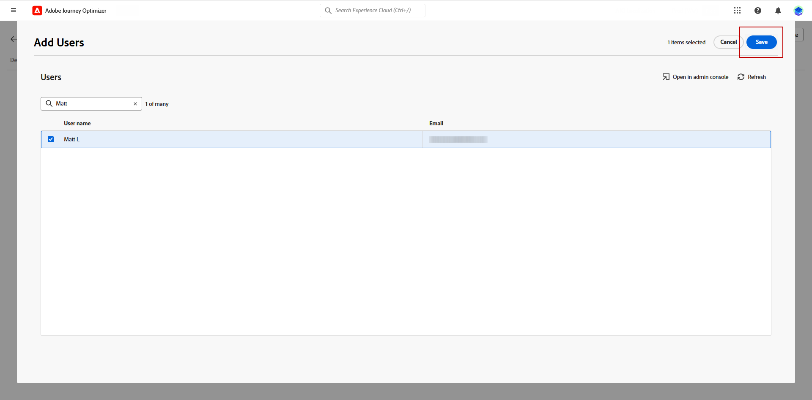

# Skapa en IP-värmeringsplan {#ip-warmup}

När du har skapat en eller flera [IP-värmeringskampanjer](ip-warmup-campaign.md) med en dedikerad konfiguration och motsvarande alternativ aktiverat, kan du börja skapa din IP-värmerplan.

Om du vill få åtkomst till, skapa, redigera och ta bort IP-beredskapsplanerna måste du ha behörighet som är relaterad till rollen **[!UICONTROL Deliverability Consultant]** eller IP-beredningsplanerna.

+++Lär dig hur du tilldelar rollen Deliverability Consultant eller IP Warmup-planer relaterade behörigheter

Åtkomstkontroll på objektnivå gör att du kan skydda data och ge specifik åtkomst för att visa och hantera dina planer. Om ingen etikett har tilldelats din IP-värmerappsplan öppnas den för visning och redigering av alla användare.

Om du ger behörigheten **[!UICONTROL View IP warmup plans]** begränsas åtkomsten till enbart visning och publicering, medan du tilldelar behörigheten **[!UICONTROL Manage IP warmup plans]** kan användare både visa och redigera planen.

Så här tilldelar du motsvarande behörighet till en specifik **[!UICONTROL Role]**:

1. Navigera från produkten [!DNL Permissions] till menyn **[!UICONTROL Roles]** och välj den roll som du vill uppdatera med de nya **[!UICONTROL IP Warmup Configurations]** behörigheterna.

1. Klicka på **[!UICONTROL Role]** på din **[!UICONTROL Edit]**-instrumentpanel.

   

1. Dra och släpp **[!UICONTROL IP Warmup Configurations]**-resursen för att tilldela behörighet.

1. I den nedrullningsbara listan **[!UICONTROL IP Warmup Configurations]**-resurser väljer du vilka behörigheter användaren behöver: **[!UICONTROL View IP Warmup Plans]**, **[!UICONTROL Manage IP Warmup Plans]** och/eller **[!UICONTROL View IP Warmup Reports]**. Du kan markera alla samtidigt om det behövs.

   

1. Klicka på **[!UICONTROL Save]**.

Så här tilldelar du motsvarande roll till en **[!UICONTROL User]**:

1. Navigera från produkten [!DNL Permissions] till menyn **[!UICONTROL Roles]** och välj den inbyggda rollen **[!UICONTROL Deliverability Consultant]**.

1. Gå till fliken **[!UICONTROL Role]** från din **[!UICONTROL Users]**-kontrollpanel.

   

1. Klicka på **[!UICONTROL Add user]** för att tilldela den inbyggda rollen **[!UICONTROL Deliverability Consultant]**.

   

1. Markera **[!UICONTROL User]** och klicka på **[!UICONTROL Save]**.

   

+++

## Förbered filen för IP-warmup-planen {#prepare-file}

Varmning av IP-adresser är en aktivitet som gradvis ökar antalet e-postmeddelanden som går ut från era IP-adresser och domäner till de viktigaste Internetleverantörerna för att etablera ert rykte som en legitim avsändare.

Denna aktivitet utförs vanligtvis med hjälp av en expert på slutprodukter som hjälper till att ta fram en genomtänkt plan baserad på branschens domäner, användningsfall, regioner, Internet-leverantörer och olika andra faktorer.

<!--When working with the [!DNL Journey Optimizer] IP warmup feature, this plan takes the form of an Excel file that must contain a number of predefined columns.-->

Innan du kan skapa en IP-uppvärmningsplan i gränssnittet [!DNL Journey Optimizer] måste du fylla i en Excel-mall med alla data som matar in din plan.

* Från användargränssnittet kan du hämta den tomma mallen [för IP-värmerappen](assets/IPWarmupPlan-Template.xlsx) för Excel för att fylla i den.

* Du kan även hämta ett [exempel på en IP-värmare](assets/IPWarmupPlan-Sample.xlsx) som redan har fyllts i med data som du kan använda som exempel.

<!--
* From the user interface you can download the blank Excel IP warmup plan template to fill in.

* You can also download a sample IP warmup plan already filled in with some data you can use as an example.
-->

>[!CAUTION]
>
>Arbeta med din leveranskonsult för att säkerställa att din IP-värmerappningsfil är korrekt konfigurerad.
>
>Se till att du använder det format som finns i mallen.

Nedan visas ett exempel på en fil som innehåller en IP-värmerapport.

### Fliken Warmup Plan {#ip-warmup-plan-tab}

Om du vill skapa en IP-värdplan fyller du i den första fliken med de data du behöver för att skicka din plan.

* I exemplet ovan har en plan förberetts för att sträcka sig över 17 dagar (kallas **kör**) för att nå en målvolym på över en miljon profiler.

* Den här planerade åtgärden utförs genom sex **faser**, där var och en innehåller minst en körning.

* Du kan ha upp till sex kolumner (fyra kolumner för domängrupper, en för kolumnen **Övriga** och en för kolumnen **Förlovningsdagar**). I det här exemplet är planen uppdelad i sex kolumner:

   * Tre av dessa motsvarar **färdiga domängrupper** som du kan använda i din plan (Gmail, Yahoo och Microsoft). De körklara domängrupperna visas alla på fliken [OTB-domängrupper](#ootb-domain-groups-tab) .
   * En kolumn motsvarar en anpassad domängrupp (som du måste lägga till på fliken [Anpassad domängrupp](#custom-domain-group-tab)).
   * Den femte kolumnen, **Övrigt**, innehåller alla återstående adresser från andra domäner som inte omfattas uttryckligen i planen. Den här kolumnen är valfri: om den utelämnas kommer e-post endast att skickas till de angivna domänerna.
   * I den sista kolumnen, **Förlovningsdagar**, kan du ange hur många dagar som förlovningen ska spåras eller utvärderas.

Tanken är att stegvis öka antalet måladresser i varje körning och samtidigt minska antalet körningar för varje fas.

### Fliken Anpassad domängrupp {#custom-domain-group-tab}

Du kan också lägga till fler kolumner i din plan genom att ta med anpassade domängrupper.

Använd fliken **[!UICONTROL Custom Domain Group]** för att definiera en ny domängrupp. För varje domän kan du lägga till alla underdomäner som den omfattar.

>[!IMPORTANT]
>
>Kontrollera att varje domän är unik för sin domängrupp och inte överlappar andra domängrupper eller [ej ifyllda domängrupper](#ootb-domain-groups-tab).

Om du till exempel lägger till den anpassade domänen Roadrunner vill du att följande underdomäner ska inkluderas, som i exemplet nedan: roadrunner.com, nc.rr.com, tampabay.rr.com, rochester.rr.com osv.

>[!NOTE]
>
>Om du inte behöver anpassade domäner lämnar du fliken **[!UICONTROL Custom Domain Group]** tom.

### Fliken OTB-domängrupper {#ootb-domain-groups-tab}

Fliken **OTB-domängrupper** i programmallen för IP Warmup innehåller alla körklara huvuddomängrupper som du kan lägga till i din plan.

>[!NOTE]
>
>Om en domängrupp inte finns med på den här fliken måste du skapa en anpassad domängrupp på motsvarande flik. [Läs mer](#custom-domain-group-tab)

De körklara huvuddomängrupperna anges också nedan:

+++ Gmail
gmail.com;google.com;googlemail.com;googlemail.co.uk
+++

+++Microsoft
hotmail.com.tr;live.de;live.ru;live.nl;windowslive.com;live.jp;mts.net;xbox.com;hotmail.fr;hotmail.cl;hotmail.jp;live.cl;live.at;live.com.au;live.hk;hotmail.com.au;hotmail.com;live.com.my;hotmail.co.kr;live.ie;dina tjänster;hotmail.dk;din tur;din;din;outlook.ie;live.cn;åligganden;väntande;hotmail.es;live.fr;live.no;live.dk;hotmail.it;dina aktiviteter;live.se;klart.att;live.in;live.in;hotmail.se;din tur;hotmail.ch;dina aktiviteter;din tur;hotmail.gr;livedatmail.ca;dina aktiviteter;live.ca;hotmail.de
+++

+++Yahoo
aol.fi;games.com;cs.com;;yahoo.com.in;y7mail.com;yahoo.co.uk;yahoo.hu;yahoo.co.hu;yahoo.cn;yahoogroups.com.sg;yahoogroups.com.au;aol.es;yahoo.com.au;yahoo.com.vn;yahoo.ca;aol.hk;din;din tur;aolpoland.pl;aolnorge.no;din;yahoo.fi;din;din;din;din;din;din;din;din;på;på;på;på;på;på;på;din;på;på;på;på;på;på;på;på;på;på;på;på;på;på;på;på;på;på;på;på;;;;;;;;;aol.cz;yahoo.ee;aol.be;aolcom.tr;yahoo.si;din tur;aol.it;din tur;yahoo.es;yahoo.dk;yahoogroups.ca;din tur;din;aol.kr;yahoo.ie;aol.jp;din;yahoo.lt;ahoo;ahoo;ahoo.se;ahoo;ahoo.se;ahoo;ahoo;ahoo;ahoo.se;se;ahoo.ahoo;ahoo;aoeaoeahoo.aeaeaeaeaeahoo.se;ahoo.aeaoeaoeaeaeae;aol.nl;åååå.bg;åååå;åååå;åååå;åååå;åååå;åååå;åååå;ååååå;ååååå;ååååå;åahoo.cz;åååååå;ååååå;ååååå;ååååååå;åååååååååååååååå;ååååååååååååååååååå;åååååååååååååååååå;åå;åå;ååååååååååååååååå;åååååååå;åå;åååååahoogroups.de;yahoo.gr;inrapportering;yahoo.ro;inbud;åahoo.at;inrapportering;inrapportering;aol.fr;yahoo.in;aol.in;din inrapportering;yahoo.rs;aol.de;din inrapportering;din inrapportering;inrapportering;inrapportering;infallande;yahoo.se;myahoo.yahoo.se;myaool.jp inrapportering;yahoo.pt;inrapportering;inrapportering;yahoodina.dk;yahoo.fr;inrapportering;inrapportering;aol.pl;inrapportering;aol.ch;yahoo.it;inrapportering;inrapportering;aolpolcka.pl;inrapportering;yahoogruppi.it;inrapportering;inrapportering;inrapportering;inrapportering;inrapportering;inrapportering;inrapportering;inrapportering;inrapportering;inrapportering;inrapportering;inrapportering;inrapportering;inrapportering;inrapportering;inrapportering;inrapportering;inrapportering;inrapportering;inrapportering;inrapportering;inrapportering;inrapportering;inrapportering;inrapportering;inrapportering;inrapportering;inrapportering;inrapportering;inrapportering;inrapportering;inrapportering;inrapportering;inrapportering;inrapportering;inrapportering;inrapportering;inrapportering;yahoo.be;åligganden;åå.tw;åligganden;åligganden;åligganden;åligganden;åååå;åååå;åååå;åååååååå.lv;aolpolska.pl;aol.at;yahoo.pl
+++

+++Apple
mac.com;icloud.com;apple.com;me.com
+++

+++Comcast
comcast.net
+++

+++Orange
voila.com;francetelecom.com;orange.com;orange.fr;wanadoo.fr;voila.fr
+++

+++La Poste
laposte.net
+++

+++Italia Online
inwind.it;blu.it;virgilio.it;giallo.it;iol.it;libero.it
+++

+++WP
wp.pl;o2.pl
+++

+++United Internet
gmx.de;1and1.com;gmx.fr;mail.com;1und1.de;gmx.com;gmx.net;gmx.at;web.de;gmx.ch
+++

+++Bigpond
bigpond.com;bigpond.com.au;bigpond.net;telstra.com;bigpond.net.au
+++

+++Docomo
docomo.ne.jp
+++

+++Softbank
c.vodafone.ne.jp;jp-h.ne.jp;k.vodafone.ne.jp;jp-d.ne.jp;jp-q.ne.jp;jp-c.ne.jp;t.vodafone.ne.jp;h.vodafone.ne.jp;r.vodafone.ne.jp;q.vodafone.ne.jp;jp-t.ne.jp;åligganden;åligganden;åligganden;åligganden;avslutning
+++

+++KDDI
au.com;ezweb.ne.jp;uqmobile.jp
+++

### Exempel {#example}

Säg att du vill ha två anpassade domängrupper:

* En för Hotmail-domäner.
* En för alla andra domäner i domängruppen Microsoft (och utesluter därmed alla Hotmail-domäner).

Domäner utanför Hotmail och från domängruppen Microsoft samlas i kolumnen **[!UICONTROL Others]**.

1. Skapa domängruppen **[!UICONTROL Custom Domain Group]** Hotmail **på fliken**.

1. Lägg till alla Hotmail-domäner på samma rad.

   Du kan [kopiera och klistra in](#copy-paste) alla Hotmail-domäner som listas på fliken [OTB-domängrupper](#ootb-domain-groups-tab).

1. Lägg till en till rad.

1. Skapa domängruppen **Microsoft_X**.

1. Lägg till alla Microsoft-domäner som inte är Hotmail på samma rad. På samma sätt kan du [kopiera och klistra in](#copy-paste) dem från listan ovan.

1. Gå tillbaka till fliken **[!UICONTROL IP Warmup Plan]**.

1. Skapa tre kolumner: en för **Hotmail**, en för **Microsoft_X** och en för **Andra**.

1. Fyll i kolumnerna efter behov.

<!--Only the domain groups listed in the **[!UICONTROL IP Warmup Plan]** tab will be taken into account.-->

### Kopiera och klistra in standarddomäner {#copy-paste}

Om du till exempel vill skapa en anpassad domängrupp som innehåller alla Hotmail-domäner kan du kopiera och klistra in domänerna från fliken **OTB-domängrupper** i [planmallen för IP-värdskap](assets/IPWarmupPlan-Template.xlsx), eller från listan [ovan](#ip-warmup-plan-tab).

Använd sedan Excel-konverteringsverktyget för att konvertera text till kolumner:

1. Välj **[!UICONTROL Data]** > **[!UICONTROL Text to columns...]**, välj **[!UICONTROL Delimited]** och välj **[!UICONTROL Next]**.

1. Välj **[!UICONTROL Semicolon]**, klicka på **[!UICONTROL Next]** och **[!UICONTROL Finish]**.

Varje domän visas nu i en egen kolumn på samma rad.

## Få åtkomst till och hantera IP-värmerelayouter {#manage-ip-warmup-plans}

1. Gå till menyn **[!UICONTROL Administration]** > **[!UICONTROL Channels]** > **[!UICONTROL Email settings]** > **[!UICONTROL IP warmup plans]**. Alla IP-uppvärmningsplaner som har skapats hittills visas.

   

1. Du kan filtrera efter status. De olika statusvärdena är:

   * **Inte igång**: Ingen körning har aktiverats än. [Läs mer](ip-warmup-execution.md#define-runs)
   * **Live**: Planen ändras till den här statusen så snart den första körningen i den första fasen har aktiverats. [Läs mer](ip-warmup-execution.md#define-runs)
   * **Slutförd**: planen har markerats som slutförd. <!--This option is only available if all the runs in the plan are in **[!UICONTROL Completed]** or **[!UICONTROL Draft]** status (no run can be **[!UICONTROL Live]**).--> [Läs mer](ip-warmup-execution.md#mark-as-completed)
     <!--* **Paused**: to check (user action)-->

1. Om du vill ta bort en IP-värdplan markerar du ikonen **[!UICONTROL Delete]** bredvid namnet på en plan och bekräftar borttagningen.

   >[!NOTE]
   >
   >Endast planer med statusen **Inte startad** kan tas bort.

   

   >[!CAUTION]
   >
   >Den valda IP-warmup-planen tas bort permanent.

## Skapa en IP-värmeringsplan {#create-ip-warmup-plan}

>[!CONTEXTUALHELP]
>id="ajo_admin_ip_warmup_upload"
>title="Ange din IP-värmerammanslutning"
>abstract="Fyll i Excel-mallen med alla data som kommer att mata din plan, som IP-värmersfaser och målantal profiler, och överför den här."
>additional-url="https://experienceleague.adobe.com/docs/journey-optimizer/using/configuration/implement-ip-warmup-plan/ip-warmup-plan.html?lang=sv-SE#prepare-file" text="Förbered filen för IP-warmup-planen"

>[!CONTEXTUALHELP]
>id="ajo_admin_ip_warmup_surface"
>title="Välj en marknadsföringskonfiguration"
>abstract="Du måste välja samma konfiguration som den som valts i kampanjen som du vill koppla till din IP-värmeringsplan."
>additional-url="https://experienceleague.adobe.com/docs/journey-optimizer/using/configuration/channel-surfaces.html?lang=sv-SE" text="Konfigurera kanalkonfigurationer"
>additional-url="https://experienceleague.adobe.com/docs/journey-optimizer/using/configuration/channel-surfaces.html?lang=sv-SE" text="Skapa IP-värmningskampanjer"

Följ stegen nedan om du vill skapa en IP-värmeringsplan.

1. Gå till menyn **[!UICONTROL Administration]** > **[!UICONTROL Channels]** > **[!UICONTROL Email settings]**> **[!UICONTROL IP warmup plans]** och klicka sedan på **[!UICONTROL Create IP warmup plan]**.

   

1. Fyll i information om IP-beredskapsplanen: ge den ett namn och en beskrivning.

   

1. Välj den [konfiguration](channel-surfaces.md) som du vill värma upp. Endast marknadsföringskonfigurationer kan väljas. [Läs mer om e-posttyp](../email/email-settings.md#email-type)

   >[!NOTE]
   >
   >De kampanjer som du vill associera med din IP-värdplan måste använda samma konfiguration. [Lär dig hur du skapar en IP-värmerskampanj](ip-warmup-campaign.md)

1. Överför den Excel-fil som innehåller din IP-värmeringsplan. [Läs mer](#prepare-file)

   <!--
    You can also download the Excel template from the [!DNL Journey Optimizer] user interface and upload it after filling it with the IP warmup details.-->

   

   >[!NOTE]
   >
   >Om överföringen misslyckas bör du kontrollera att du använder rätt format (.xls eller .xlsx). Använd [mallen](assets/IPWarmupPlan-Template.xlsx) från Adobe.

1. Klicka på **[!UICONTROL Create]**. Alla faser, körningar, kolumner och deras innehåll som definieras i filen som du överförde visas automatiskt i [!DNL Journey Optimizer]-gränssnittet.

   

   >[!NOTE]
   >
   >Kolumnen **[!UICONTROL Targeted]** visar summan av alla profiler som är avsedda för varje körning, vilket innebär alla profiler från alla domängrupper som du har definierat, inklusive kolumnen **Övriga** om det finns några.

Du är nu redo att genomföra din IP-värmeringsplan. [Läs mer](ip-warmup-execution.md)
