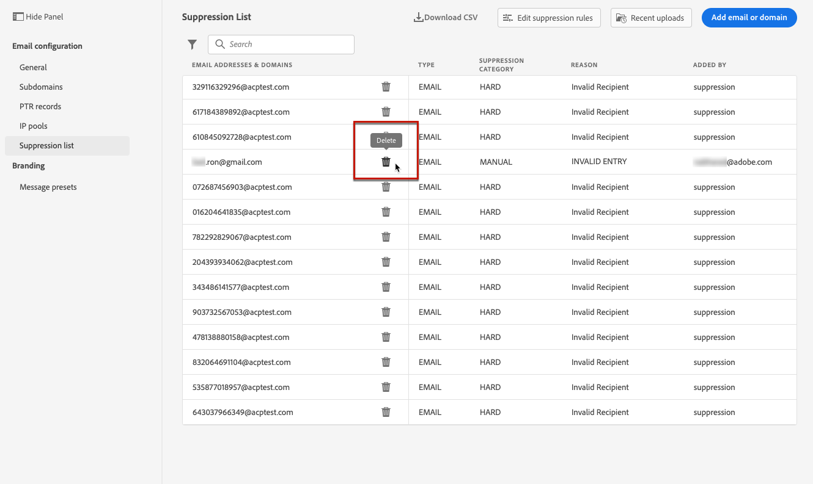

# Hantera listan över inaktiveringar {#manage-suppression-list}

Med [!DNL Journey Optimizer] kan du övervaka alla e-postadresser som automatiskt utesluts från att skickas under en resa, till exempel:

* Adresser som är ogiltiga (hårda studsar).
* Adresserar som konsekvent studsar utan extra kostnad och kan påverka e-postens anseende negativt om du fortsätter att inkludera dem i dina leveranser.
* Mottagare som skickar skräppost av något slag mot ett av dina e-postmeddelanden.

Sådana e-postadresser samlas automatiskt in i Journey Optimizer **listan**. Läs mer om konceptet för inaktiveringslistan och användningen i [det här avsnittet](../suppression-list.md).

## Åtkomst till listan över inaktiveringar {#access-suppression-list}

Om du vill få tillgång till den detaljerade listan över undantagna e-postadresser går du till **[!UICONTROL Administration]** > **[!UICONTROL Channels]** > **[!UICONTROL Email configuration]** och väljer **[!UICONTROL Suppression list]**.

>[!CAUTION]
>
>Behörigheter att visa, exportera och hantera undertryckningslistan är begränsade till [reseadministratörer](../administration/ootb-product-profiles.md#journey-administrator). Läs mer om hur du hanterar [!DNL Journey Optimizer]-användares åtkomsträttigheter i [det här avsnittet](../administration/permissions-overview.md).

<!--

You can also display the suppression list content using the **[!UICONTROL View suppression list]** link through the **[!UICONTROL Channels]** > **[!UICONTROL Email configuration]** > **[!UICONTROL General]** menu, but this view does not allow you to edit the list.-->


Det finns filter som hjälper dig att bläddra igenom listan.

<!---->


Du kan filtrera på **[!UICONTROL Suppression category]**, **[!UICONTROL Address type]** eller **[!UICONTROL Reason]**. Välj alternativ för varje kriterium. När du har valt det här alternativet kan du rensa alla filter eller alla filter som visas ovanpå listan.


Om du lägger till en e-postadress eller en domän manuellt av misstag kan du ta bort posten med knappen **[!UICONTROL Delete]**.

>[!CAUTION]
>
>Använd aldrig knappen **[!UICONTROL Delete]** för att ta bort undertryckta e-postadresser eller domäner.



Om du tar bort en e-postadress eller en domän från listan över inaktiveringar kommer du att börja leverera till den här adressen eller domänen igen. Detta kan få allvarliga konsekvenser för din leveransförmåga och IP-anseende, vilket i slutänden kan leda till att din IP-adress eller sändande domän blockeras. Läs mer om vikten av att undertryckningslistan sparas i [det här avsnittet](../suppression-list.md).

>[!NOTE]
>
>Fortsätt med extra omsorg när du funderar på att ta bort en e-postadress eller domän. Om du är osäker kan du kontakta en expert på slutprodukter.

I vyn **[!UICONTROL Suppression list]** kan du även redigera undertryckningsregler. [Läs mer](retries.md)

Om du vill exportera undertryckningslistan som en CSV-fil väljer du knappen **[!UICONTROL Download CSV]**.


## Undertryckningskategorier och orsaker {#suppression-categories-and-reasons}

När ett meddelande inte kan levereras till en e-postadress avgör [!DNL Journey Optimizer] varför leveransen misslyckades och associerar den med en **[!UICONTROL Suppression category]**.

Undertryckningskategorierna är följande:

* **Hård**: E-postadressen skickas omedelbart till listan över inaktiveringar.

   >[!NOTE]
   >
   >När felet beror på ett skräppostklagomål tillhör det även kategorin **Hård**. E-postadressen till mottagaren som skickade klagomålet skickas omedelbart till suppressionslistan.

* **Mjuk**: Mjuka fel skickar en adress till listan när felräknaren når gränsvärdet. [Läs mer om återförsök](retries.md)

   <!--
    **Ignored**:
    * When the error occurred for a valid email address but is known to be temporary, such as a failed connection attempt or a temporary technical issue, the email address is added to the suppression list once the error counter reaches the limit threshold. [Learn more on retries](retries.md).
    * When the error is the result of a spam complaint, the email address of the recipient who issued the complaint is immediately sent to the suppression list.
    -->

* **Manuell**: Du kan också lägga till en e-postadress eller en domän manuellt i listan över inaktiveringar. [Läs mer](#add-addresses-and-domains)

>[!NOTE]
>
>Läs mer om mjuka studsar och fasta studsar i avsnittet [Leveransfel](../suppression-list.md#delivery-failures).

För varje e-postadress som visas kan du även kontrollera **[!UICONTROL Type]** (e-postadress eller domän), **[!UICONTROL Reason]** för att utesluta den, vem som lagt till den och datumet/tiden som den lades till i listan över inaktiveringar.


Möjliga orsaker till leveransfel är:

| Orsak | Beskrivning | Undertryckningskategori |
| --- | --- | --- |
| **[!UICONTROL Invalid Recipient]** | Mottagaren är ogiltig eller finns inte. | Hård |
| **[!UICONTROL Soft Bounce]** | Meddelandet studsade på ett annat sätt än de mjuka fel som anges i den här tabellen, till exempel när det skickas över den tillåtna hastighet som rekommenderas av en Internet-leverantör. | Mjuk |
| **[!UICONTROL DNS Failure]** | Meddelandet studsade på grund av ett DNS-fel. | Mjuk |
| **[!UICONTROL Mailbox Full]** | Meddelandet studsade eftersom mottagarens postlåda är full och inte kan ta emot fler meddelanden. | Mjuk |
| **[!UICONTROL Relaying Denied]** | Meddelandet blockerades av mottagaren eftersom återutläggning inte tillåts. | Mjuk |
| **[!UICONTROL Challenge-Response]** | Meddelandet är en frågesvarsundersökning. | Mjuk |
| **[!UICONTROL Spam Complaint]** | Meddelandet blockerades eftersom mottagaren har markerat det som skräppost. | Hård |

>[!NOTE]
>
>Användare som avbeställer prenumerationen får inte e-post från [!DNL Journey Optimizer], och deras e-postadresser kan därför inte skickas till listan över inaktiveringar. Deras val hanteras på Experience Platform-nivå. [Läs mer om att avanmäla dig](../consent.md)

<!--
Removed from the table provided by SparkPost/Momentum:
| **[!UICONTROL Undetermined]** | The bounce reason received from the recipient domain Message Transfer Agent (MTA) could not be identified. | Ignored |
| **[!UICONTROL Too Large]** | The message bounced because it was too large for the recipient. [Retries](retries.md) will be performed: you can edit the message size and re-inject it for delivery. | Ignored |
| **[!UICONTROL Timeout]** | The message timed out, meaning it soft bounced and reached the message retry limit (3.5 days). | Ignored |
| **[!UICONTROL Admin Failure]** | The message was failed according to the policies configured by the sending system administrator. ///For example, if emails are blackholed at the global, domain or binding level using the "blackhole" directive, this bounce code is used. | Ignored |
| **[!UICONTROL Generic Bounce: No RCPT]** | No recipient could be determined for the message. | Ignored |
| **[!UICONTROL Generic Bounce]** | The message failed for unspecified reasons. | Ignored |
| **[!UICONTROL Mail Block]** | The message was blocked by the receiver (i.e. recipient MTA). | Ignored |
| **[!UICONTROL Spam Block]** | The message was blocked by the receiver as coming from a known spam source. It could be a sending IP block for example. | Ignored |
| **[!UICONTROL Spam Content]** | The message content was blocked by the receiver (recipient MTA) as spam. | Ignored |
| **[!UICONTROL Prohibited Attachment]** | The message was blocked by the receiver because it contained an attachment. | Ignored |
| **[!UICONTROL Auto-Reply]** | The message is an auto-reply/vacation mail. | Ignored |
| **[!UICONTROL Transient Failure]** | Message transmission has been temporarily delayed. | Ignored |
| **[!UICONTROL Subscribe]** | The message is a subscribe request. | Ignored |
| **[!UICONTROL Unsubscribe]** | The message is an unsubscribe request. | Hard |
-->

<!--Note to add eventually: If a user is subscribed and [!DNL Journey Optimizer] fails to send emails to their subscribed email address, they will get added to the suppression list.-->

## Lägga till adresser och domäner manuellt {#add-addresses-and-domains}

När ett meddelande inte kan levereras till en e-postadress läggs adressen automatiskt till i listan över undertryckningar baserat på den definierade undertryckningsregeln eller avhoppsantalet.

Du kan också fylla i undertryckslistan [!DNL Journey Optimizer] manuellt om du vill utesluta vissa e-postadresser och/eller domäner från sändningen.

Du kan lägga till e-postadresser eller domäner [en åt gången, eller [i gruppläge](#upload-csv-file) genom en CSV-filöverföring.](#add-one-address-or-domain)

Det gör du genom att markera knappen **[!UICONTROL Add email or domain]** och sedan följa en av metoderna nedan.


### Lägg till en adress eller domän {#add-one-address-or-domain}

1. Välj alternativet **[!UICONTROL One by one]**.

   

1. Välj adresstyp: **[!UICONTROL Email address]** eller **[!UICONTROL Domain address]**.

1. Ange den e-postadress eller domän som du vill utesluta från sändningen.

   >[!NOTE]
   >
   >Kontrollera att du anger en giltig e-postadress (till exempel abc@company) eller domän (till exempel abc.company.com).

1. Ange en orsak om det behövs.

1. Klicka på **[!UICONTROL Submit]**.

### Överföra en CSV-fil {#upload-csv-file}

1. Välj alternativet **[!UICONTROL Upload CSV]**.

   

1. Ladda ned CSV-mallen som ska användas, som innehåller kolumnerna och formatet nedan:

   ```
   TYPE,VALUE,COMMENT
   EMAIL,abc@somedomain.com,Comment
   DOMAIN,somedomain.com,Comment
   ```
   Du kan även hämta den här mallen från huvudvyn i **[!UICONTROL Suppression list]**.

   >[!CAUTION]
   >
   >Ändra inte namnen på kolumnerna i CSV-mallen.
   >
   >Filstorleken får inte överstiga 1 MB.

1. Fyll i CSV-mallen med de e-postadresser och/eller domäner som du vill lägga till i listan över inaktiveringar.

1. När du är klar drar och släpper du CSV-filen och klickar sedan på **[!UICONTROL Upload file]**.

   

1. Klicka på **[!UICONTROL Submit]**.

### Kontrollera status för senaste överföringar {#recent-uploads}

Du kan kontrollera listan med de senaste CSV-filerna som du har överfört.

Det gör du genom att klicka på knappen **[!UICONTROL Recent uploads]** i vyn **[!UICONTROL Suppression list]**.


De senaste överföringarna du skickade och deras motsvarande status visas.

Om en felrapport är kopplad till en fil kan du hämta den för att kontrollera de fel som påträffas.


Nedan visas ett exempel på den typ av poster som du kan hitta i felrapporten:

```
type,value,comments,failureReason
Email,examplemail.com,MANUAL,Invalid format for value: examplemail.com
Email,examplemail,MANUAL,Invalid format for value: examplemail
Email,example@mail,MANUAL,Invalid format for value: example@mail
Domain,example,MANUAL,Invalid format for value: example
Domain,example.!com,MANUAL,Invalid format for value: example.!com
Domain,!examplecom,MANUAL,Invalid format for value: !examplecom
```


