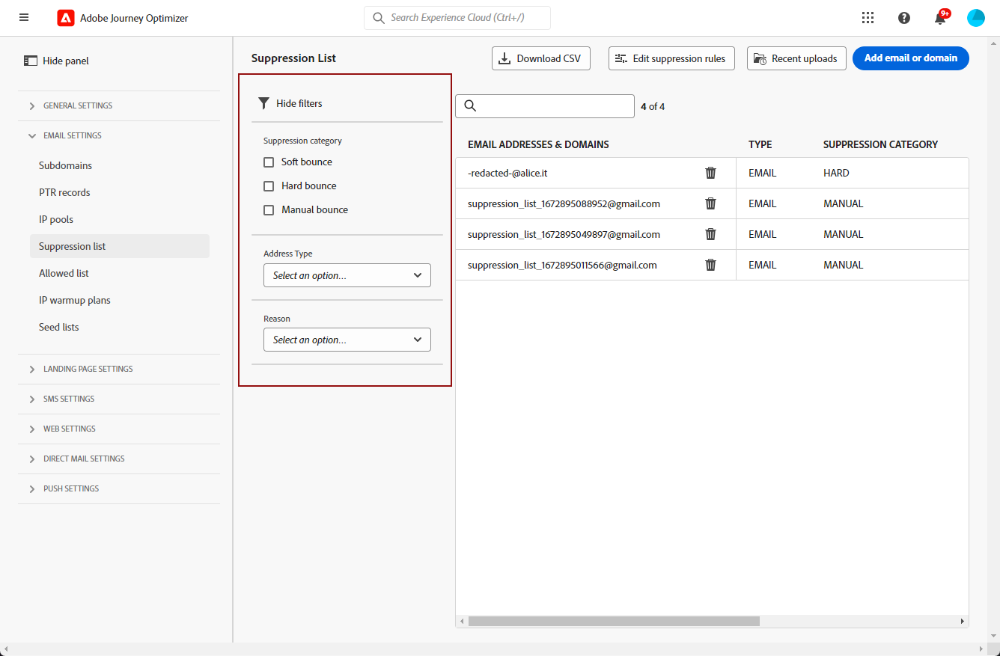

# Hantera listan över inaktiveringar {#manage-suppression-list}

Med [!DNL Journey Optimizer] kan du övervaka alla e-postadresser som automatiskt utesluts från att skickas i en resa eller en kampanj, till exempel hårda studsar, mjuka studsar och skräppostklagomål.

Sådana e-postadresser samlas automatiskt in i Journey Optimizer **undertryckningslista**. En undertryckningslista består av adresser och domäner som ska uteslutas från era målgrupper. Den samlar in e-postadresser och domäner som inte används i alla e-postmeddelanden i en enda klientmiljö, vilket är specifikt för ett organisations-ID som är kopplat till ett sandbox-ID.

Läs mer om konceptet för inaktiveringslistan och användningen i [det här avsnittet](../reports/suppression-list.md).

>[!NOTE]
>
>Adobe håller en uppdaterad lista över kända dåliga adresser som har visat sig vara skadliga för engagemanget och utskickets anseende och ser till att e-post inte skickas till dem. Den här listan hanteras i en global undertryckningslista som är gemensam för alla Adobe-kunder. Adresserna och domännamnen som finns i den globala undertryckningslistan är dolda. Endast antalet uteslutna mottagare anges i leveransrapporterna.

Dessutom kan du använda Journey Optimizer **Suppression REST API** för att styra dina utgående meddelanden med hjälp av suppression och tillåtelselista. [Lär dig hur du arbetar med Suppression REST API](https://developer.adobe.com/journey-optimizer-apis/references/suppression/){target="_blank"}

## Åtkomst till listan över inaktiveringar {#access-suppression-list}

Om du vill få tillgång till en detaljerad lista över utelämnade e-postadresser och domäner går du till **[!UICONTROL Administration]** > **[!UICONTROL Channels]** > **[!UICONTROL Email settings]** och väljer **[!UICONTROL Suppression list]**.


>[!CAUTION]
>
>Behörigheter att visa, exportera och hantera undertryckningslistan är begränsade till [Reseadministratörer](../administration/ootb-product-profiles.md#journey-administrator). Läs mer om hur du hanterar [!DNL Journey Optimizer] användares åtkomsträttigheter i [det här avsnittet](../administration/permissions-overview.md).


Det finns filter som du kan använda för att bläddra igenom listan.



Du kan filtrera på **[!UICONTROL Suppression category]**, **[!UICONTROL Address type]** eller **[!UICONTROL Reason]**. Välj ett eller flera alternativ för varje kriterium. När du har valt det här alternativet kan du rensa alla filter eller alla filter som visas ovanpå listan.


## Förstå orsaker till misslyckanden {#suppression-categories-and-reasons}

När ett meddelande inte kan levereras till en e-postadress avgör [!DNL Journey Optimizer] varför leveransen misslyckades och associerar det med en **[!UICONTROL Suppression category]**.

Undertryckningskategorierna är följande:

* **Hård**: Ett hårt studsande indikerar en ogiltig e-postadress (dvs. en e-postadress som inte finns). Detta innebär ett studsmeddelande från den mottagande e-postservern som uttryckligen anger att adressen är ogiltig. E-postadressen skickas omedelbart till listan över inaktiveringar.

  När felet är resultatet av ett skräppostklagomål hamnar det också i kategorin **Hård** . E-postadressen till mottagaren som skickade klagomålet skickas omedelbart till suppressionslistan.

* **Mjuk**: Ett mjukt studsande är ett tillfälligt e-poststuds som inträffade för en giltig e-postadress. E-postadressen läggs till i listan efter flera försök. Mjuka fel skickar en adress till listan när felräknaren når gränsvärdet. [Läs mer om återförsök](retries.md)

* **Manuell**: Manuella fel har lagts till manuellt i listan över undertryckningar. [Läs mer](#add-addresses-and-domains)

För varje e-postadress som visas kan du även kontrollera **[!UICONTROL Type]** (e-post eller domän), **[!UICONTROL Reason]** för att utesluta den, vem som lagt till den och datumet/tiden som den lades till i listan över utelämnanden.

Möjliga orsaker till leveransfel är:

| Orsak | Beskrivning | Kategori |
| --- | --- | --- |
| **[!UICONTROL Invalid Recipient]** | Mottagaren är ogiltig eller finns inte. | Hård |
| **[!UICONTROL Soft Bounce]** | Meddelandet studsade på ett annat sätt än de mjuka fel som anges i den här tabellen, till exempel när det skickas över den tillåtna hastighet som rekommenderas av en Internet-leverantör. | Mjuk |
| **[!UICONTROL DNS Failure]** | Meddelandet studsade på grund av ett DNS-fel. | Mjuk |
| **[!UICONTROL Mailbox Full]** | Meddelandet studsade eftersom mottagarens postlåda är full och inte kan ta emot fler meddelanden. | Mjuk |
| **[!UICONTROL Relaying Denied]** | Meddelandet blockerades av mottagaren eftersom återutläggning inte tillåts. | Mjuk |
| **[!UICONTROL Challenge-Response]** | Meddelandet är en frågesvarsundersökning. | Mjuk |
| **[!UICONTROL Spam Complaint]** | Meddelandet blockerades eftersom mottagaren har markerat det som skräppost. | Hård |

>[!NOTE]
>
>Användare som avbeställer prenumerationen får inte e-post från [!DNL Journey Optimizer], och deras e-postadresser kan därför inte skickas till listan över inaktiveringar. Deras val hanteras på Experience Platform-nivå. [Läs mer om att avanmäla dig](../privacy/opt-out.md)


### Undertryckningsregler  {#suppression-rules}

I vyn **[!UICONTROL Suppression list]** kan du även redigera den återförsöksparameter som är kopplad till undertryckningsreglerna från knappen **[!UICONTROL Edit suppression rules]** . Använd det här alternativet om du vill uppdatera tröskelvärdet för nya försök för den aktuella sandlådan. [Läs mer om återförsök](retries.md).


## Lägga till adresser och domäner i listan över undertryckningar{#add-addresses-and-domains}

>[!CONTEXTUALHELP]
>id="ajo_admin_suppression_list_header"
>title="Lägg till e-postmeddelanden eller domäner i listan över inaktiveringar"
>abstract="Du kan fylla i listan över Journey Optimizer-undertryckningar manuellt för att utesluta vissa e-postadresser och/eller domäner från din sändning."

>[!CONTEXTUALHELP]
>id="ajo_admin_suppression_list"
>title="Lägg till e-postmeddelanden eller domäner i listan över inaktiveringar"
>abstract="Om du vill fylla i undertryckningslistan kan du manuellt lägga till e-postadresser eller domäner: en i taget eller i gruppläge via en CSV-filöverföring. Dessa specifika e-postadresser och/eller domäner kommer inte att kunna skickas."

När ett meddelande inte kan levereras till en e-postadress läggs adressen automatiskt till i listan över undertryckningar baserat på den definierade undertryckningsregeln eller studsantalet.

Du kan även fylla i listan [!DNL Journey Optimizer] manuellt om du vill utesluta vissa e-postadresser och/eller domäner från sändningen.

>[!NOTE]
>
>Det kan ta upp till 60 minuter för [!DNL Journey Optimizer] att ta hänsyn till inaktiverade adresser i utgående e-postmeddelanden.

Du kan lägga till e-postadresser eller domäner [en i taget](#add-one-address-or-domain), eller [i gruppläge](#upload-csv-file) via en CSV-filöverföring.

### Lägg till en adress eller domän {#add-one-address-or-domain}

>[!CONTEXTUALHELP]
>id="ajo_admin_suppression_list_address"
>title="Lägg till ett objekt i listan över inaktiveringar"
>abstract="Du kan fylla i undertryckningslistan genom att lägga till e-postadresser och/eller domäner en i taget."

Följ stegen nedan om du vill lägga till en e-postadress eller en domän i listan över inaktiveringar:

1. Markera knappen **[!UICONTROL Add email or domain]**.

   

1. Välj alternativet **[!UICONTROL One by one]**.

   

1. Välj adresstypen: **[!UICONTROL Email]** eller **[!UICONTROL Domain]**.

1. Ange den e-postadress eller domän som du vill utesluta från sändningen.

   >[!NOTE]
   >
   >Se till att du anger en giltig e-postadress (till exempel abc@company.com) eller domän (till exempel abc.company.com).

1. (valfritt) Ange en orsak. Alla ASCII-utskrivbara tecken mellan 32 och 126 är tillåtna i det här fältet.

1. Använd knappen **[!UICONTROL Submit]** för att bekräfta.

### Överföra en CSV-fil {#upload-csv-file}

>[!CONTEXTUALHELP]
>id="ajo_admin_suppression_list_csv"
>title="Överför CSV för att lägga till objekt i undertryckningslistan"
>abstract="Du kan fylla i undertryckningslistan genom att överföra en CSV-fil som är ifylld med de e-postadresser/domäner som du vill utesluta."

Följ stegen nedan om du vill lägga till en grupp e-postadresser eller en domän i listan över inaktiveringar:

1. Markera knappen **[!UICONTROL Add email or domain]**.
1. Välj alternativet **[!UICONTROL Upload CSV]**.

   

1. Ladda ned CSV-mallen som ska användas, som innehåller kolumnerna och formatet nedan:

   ```
   TYPE,VALUE,COMMENT
   EMAIL,abc@somedomain.com,Comment
   DOMAIN,somedomain.com,Comment
   ```

1. Fyll i CSV-mallen med de e-postadresser och/eller domäner som ska läggas till i listan över utelämnanden. Alla ASCII-utskrivbara tecken mellan 32 och 126 tillåts i kolumnen **COMMENT**.

   >[!CAUTION]
   >
   >Ändra inte namnet på kolumnerna i CSV-mallen.
   >
   >Filstorleken får inte överstiga 1 MB.
   >

1. När du är klar drar och släpper du CSV-filen och använder knappen **[!UICONTROL Submit]** för att bekräfta.

   

När överföringen är klar kan du kontrollera dess status från knappen [Senaste överföringar](#recent-uploads), vilket beskrivs nedan.

### Kontrollera överföringsstatus {#recent-uploads}

Använd knappen **[!UICONTROL Recent uploads]** för att kontrollera status för de senaste överförda CSV-filerna.


Möjliga statusar är:

* **[!UICONTROL Pending]**: Filöverföringen bearbetas.
* **[!UICONTROL Error]**: Filöverföringen misslyckades på grund av ett tekniskt fel eller ett filformatsfel.
* **[!UICONTROL Complete]**: Filöverföringen har slutförts.

Om vissa adresser inte har rätt format läggs de inte till i listan [!DNL Journey Optimizer] under överföringen.

När överföringen är klar kopplas den då till en rapport. Du kan hämta den för att kontrollera de fel som påträffats <!-- and understand why they were not added to the suppression list-->.


Nedan visas ett exempel på den typ av poster som du kan hitta i felrapporten:

```
type,value,comments,failureReason
Email,examplemail.com,MANUAL,Invalid format for value: examplemail.com
Email,examplemail,MANUAL,Invalid format for value: examplemail
Email,example@mail,MANUAL,Invalid format for value: example@mail
Domain,example,MANUAL,Invalid format for value: example
Domain,example.!com,MANUAL,Invalid format for value: example.!com
Domain,!examplecom,MANUAL,Invalid format for value: !examplecom
```

## Ta bort en adress från listan över inaktiveringar {#remove-from-suppression-list}

Du kan uppdatera listan för inaktivering manuellt. Att ta bort en e-postadress från karantän är en känslig åtgärd som kan påverka IP-anseendet och leveransfrekvensen. Var noga med att fortsätta med försiktighet.

När du tar bort en e-postadress eller en domän från listan över inaktiveringar kan Adobe Journey Optimizer börja leverera till den här adressen eller domänen igen.  Läs mer om levererbarhet i [det här avsnittet](../reports/deliverability.md).

Använd knappen **[!UICONTROL Delete]** om du vill ta bort en adress från listan.


>[!NOTE]
>
>Fortsätt med extra omsorg när du överväger att ta bort en e-postadress eller domän. Om du är osäker kan du kontakta en expert på slutprodukter.

Om en Internet-leverantör till exempel har ett avbrott markeras e-post felaktigt som fasta studsar eftersom de inte kan levereras till mottagaren. Dessa e-postadresser måste tas bort från listan över inaktiveringar.

Om du vill hämta adresserna kör du en specifik fråga med anpassade parametrar, baserat på driftstoppets kontext. [Läs mer i exemplet](../data/datasets-query-examples.md#isp-outage-query).

När de berörda e-postadresserna har identifierats kan du filtrera listan så att de visas. Om ett ISP-avbrott inträffar från 11 nov 2022 till 13 nov 2022 i domänen **test.com** kan du filtrera adresserna som lagts till i listan under tidsramen enligt nedan:

Du kan sedan ta bort e-postadresser i karantän från listan över inaktiveringar med knappen **[!UICONTROL Delete]**.

## Hämta listan över inaktiveringar {#download-suppression-list}

<!--
>[!CONTEXTUALHELP]
>id="ajo_admin_suppression_list_download"
>title="Export the list as a CSV file"
>abstract="To download the suppression list, Qou can either export the current list by generating a new file, or download the file that was previously generated."
-->

Om du vill exportera listan över inaktiveringar som en CSV-fil följer du stegen nedan:

1. Markera knappen **[!UICONTROL Download CSV]**.

   

1. Vänta tills filen har skapats.

   >[!NOTE]
   >
   >Hämtningstiden beror på filstorleken, vilket innebär antalet adresser som finns i listan över inaktiveringar.
   >
   >En nedladdningsbegäran kan bearbetas i taget för en viss sandlåda.

1. När filen har skapats får du ett meddelande. Klicka på klockikonen överst till höger på skärmen för att visa den.

1. Klicka på själva meddelandet för att hämta filen.

   

   >[!NOTE]
   >
   >Länken gäller i 24 timmar.

<!--When downloading the CSV file, you can choose to either:

* Download the file that was previously generated by another user or yourself.

* Generate a new file in order to export the current suppression list.-->