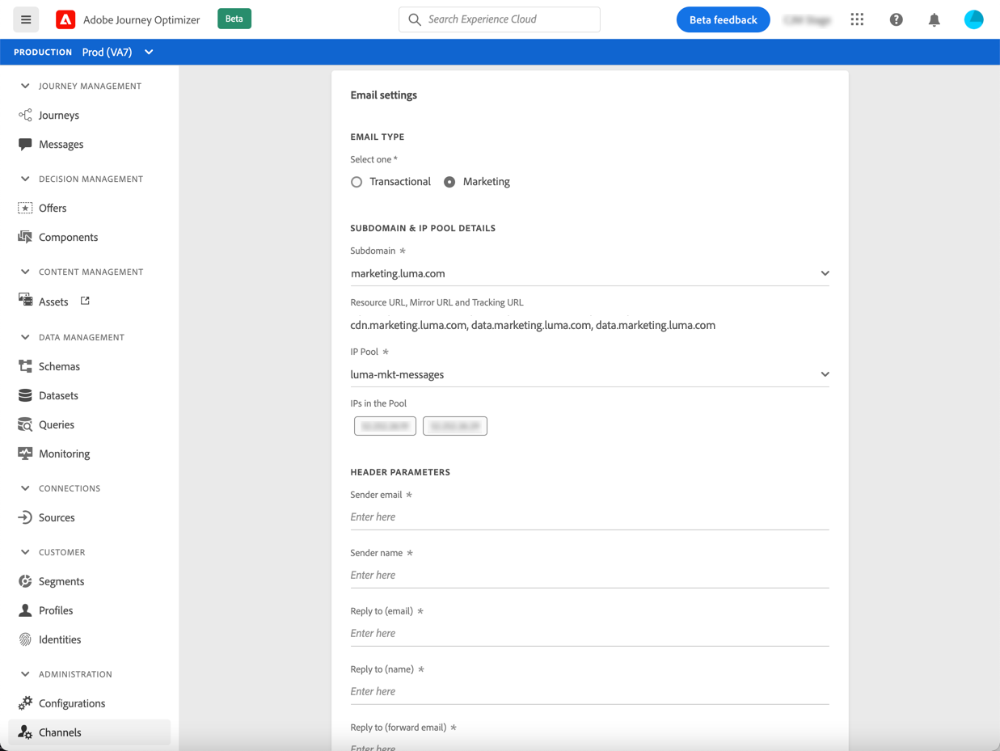
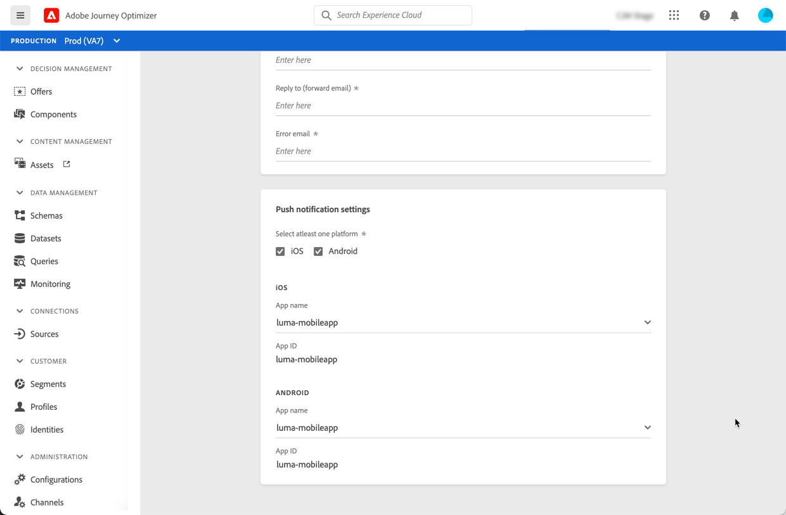
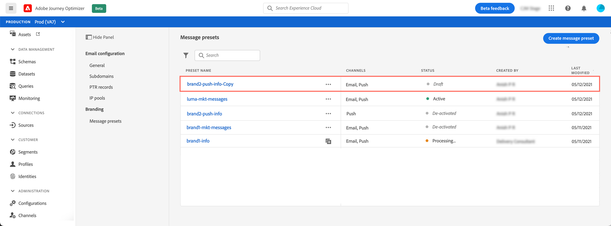

# Skapa meddelandeförinställningar

Med [!DNL Journey Optimizer]kan du konfigurera meddelandeförinställningar som definierar alla tekniska parametrar som krävs för e-post och push-meddelanden: e-posttyp, avsändarens e-postadress och namn, mobilappar med mera.

>[!CAUTION]
>
> * Konfigurationen av meddelandeförinställningar är begränsad till Reseadministratörer. [Läs mer](../administration/ootb-product-profiles.md#journey-administrator)
>
> * Du måste konfigurera e-post och [Push-konfiguration](../push-configuration.md) steg innan du skapar meddelandeförinställningar.

När meddelandeförinställningarna har konfigurerats kan du välja dem när du skapar meddelanden från **[!UICONTROL Presets]** lista.

➡️ [Lär dig hur du skapar och använder e-postförinställningar i den här videon](#video-presets)

## Skapa en meddelandeförinställning {#create-message-preset}

Så här skapar du en meddelandeförinställning:

1. Öppna **[!UICONTROL Channels]** > **[!UICONTROL Branding]** > **[!UICONTROL Message presets]** menyn och klicka sedan på **[!UICONTROL Create Message preset]**.

   

1. Ange ett namn och en beskrivning (valfritt) för förinställningen och välj sedan de kanaler som ska konfigureras.

   

   >[!NOTE]
   >
   > Namn måste börja med en bokstav (A-Z). Det får bara innehålla alfanumeriska tecken. Du kan också använda understreck `_`, punkt`.` och bindestreck `-` tecken.

1. Konfigurera **e-post** inställningar.

   

   * Välj den typ av meddelande som ska skickas med förinställningen: **Transactional** eller **Marknadsföring**

      >[!CAUTION]
      >
      > **Transactional** meddelanden kan skickas till profiler som avbeställer marknadskommunikation. Dessa meddelanden kan bara skickas i särskilda sammanhang, t.ex. lösenordsåterställning, orderstatus eller leveransmeddelande.

   * Välj den underdomän som ska användas för att skicka e-postmeddelanden. [Läs mer](about-subdomain-delegation.md)
   * Välj den IP-pool som ska associeras med förinställningen. [Läs mer](ip-pools.md)
   * Ange rubrikparametrarna för e-postmeddelanden som skickas med den förinställningen.

      >[!CAUTION]
      >
      >E-postadresser måste använda den aktuella valda [delegerad underdomän](about-subdomain-delegation.md).

      <!--CAUTION: Except for the **Reply to (forward email)** field-->

      * **[!UICONTROL Sender name]**: Avsändarens namn, till exempel ditt varumärkes namn.

      * **[!UICONTROL Sender email]**: E-postadressen som du vill använda för din kommunikation. Om den delegerade underdomänen till exempel är *marketing.luma.com* kan du använda *contact@marketing.luma.com*.

      * **[!UICONTROL Reply to (name)]**: Namnet som ska användas när mottagaren klickar på **Svara** i klientprogramvaran för e-post.

      * **[!UICONTROL Reply to (email)]**: E-postadressen som ska användas när mottagaren klickar på **Svara** i klientprogramvaran för e-post. <!--The emails sent to this address will be forwarded to the **[!UICONTROL Reply to (forward email)]** address provided below. -->Du måste använda en adress som är definierad för den delegerade underdomänen (till exempel *reply@marketing.luma.com*), annars kommer e-postmeddelandena att tas bort.

      * **[!UICONTROL Error email]**: Alla fel som genereras av Internet-leverantörer efter några dagar efter att e-post har levererats (asynkrona studsar) tas emot på den här adressen.

      <!--**[!UICONTROL Reply to (forward email)]**: All emails received by [!DNL Journey Optimizer] for the delegated subdomain will be forwarded to this email address. You can specify any address, except an email address defined on the delegated subdomain. For example, if the delegated subdomain is *marketing.luma.com*, any address like *abc@marketing.luma.com* is prohibited.-->

      >[!NOTE]
      >
      >Från versionen från oktober 2021 är det inte längre möjligt att definiera en e-postadress från [!DNL Journey Optimizer] användargränssnitt. Om du vill ha alla e-postmeddelanden från [!DNL Journey Optimizer] för att den delegerade underdomänen ska vidarebefordras till en viss e-postadress, kontakta [Adobe kundtjänstsupport](https://helpx.adobe.com/se/enterprise/admin-guide.html/enterprise/using/support-for-experience-cloud.ug.html){target=&quot;_blank&quot;}. <!--move to Deprecated features section when created?-->

      

      >[!NOTE]
      >
      >Namn måste börja med en bokstav (A-Z). Det får bara innehålla alfanumeriska tecken. Du kan också använda understreck `_`, punkt`.` och bindestreck `-` tecken.

   * Konfigurera **parametrar för e-poståterförsök**. Som standard är [återförsökstid](retries.md#retry-duration) är inställt på 84 timmar, men du kan justera den här inställningen så att den passar dina behov bättre.

      

      Du måste ange ett heltalsvärde (i timmar eller minuter) inom följande intervall:
      * För marknadsföringsmejl är den minsta återförsöksperioden 6 timmar.
      * För transaktionell e-posttyp är den minsta återförsöksperioden 10 minuter.
      * För båda e-posttyperna är den maximala återförsöksperioden 84 timmar (eller 5 040 minuter).

1. Konfigurera **push-meddelande** inställningar.

   

   * Välj minst en plattform: **iOS** och/eller **Android**

   * Välj de mobilprogram som ska användas för varje plattform.

      Mer information om hur du konfigurerar miljön för att skicka push-meddelanden finns i [det här avsnittet](../push-gs.md).

1. När alla parametrar har konfigurerats klickar du på **[!UICONTROL Submit]** för att bekräfta. Du kan också spara meddelandeförinställningen som utkast och återuppta konfigurationen senare.

   

1. När meddelandeförinställningen har skapats visas den i listan med **[!UICONTROL Processing]** status.

   Under det här steget kommer flera kontroller att utföras för att verifiera att den har konfigurerats korrekt. Bearbetningstiden är ungefär **48h-72h** och kan ta upp till **7-10 arbetsdagar**.

   Dessa kontroller omfattar konfigurations- och tekniska tester som utförs av Adobe-teamet:

   * SPF-validering
   * DKIM-validering
   * MX-postvalidering
   * Kontrollera IP-adresser som blocklist
   * Kontroll av värddator
   * Verifiering av IP-pool
   * A/PTR-post, t/m/res-underdomänverifiering

   >[!NOTE]
   >
   >Om kontrollerna inte lyckas kan du läsa mer om orsakerna till eventuella fel i [det här avsnittet](#monitor-message-presets).

1. När kontrollen är klar får meddelandeförinställningen **[!UICONTROL Active]** status. Den är klar att användas för att leverera meddelanden.

   <!-- later on, users will be notified in Pulse -->

   

## Övervaka meddelandeförinställningar {#monitor-message-presets}

Alla dina meddelandeförinställningar visas i **[!UICONTROL Channels]** > **[!UICONTROL Message presets]** -menyn. Det finns filter som hjälper dig att bläddra igenom listan (kanaltyp, användare, status).

Meddelandeförinställningar kan ha följande status:

* **[!UICONTROL Draft]**: Meddelandeförinställningen har sparats som ett utkast och har inte skickats ännu. Öppna den för att återuppta konfigurationen.
* **[!UICONTROL Processing]**: Meddelandeförinställningen har skickats och genomgår flera verifieringssteg.
* **[!UICONTROL Active]**: Meddelandeförinställningen har verifierats och kan väljas för att skapa meddelanden.
* **[!UICONTROL Failed]**: En eller flera kontroller misslyckades under verifieringen av meddelandeförinställningen.
* **[!UICONTROL Deactivated]**: Meddelandeförinställningen är inaktiverad. Det kan inte användas för att skapa nya meddelanden.

Om det inte går att skapa en meddelandeförinställning beskrivs informationen för varje möjlig felorsak nedan.

Om något av dessa fel inträffar ska du kontakta [Adobe kundtjänstsupport](https://helpx.adobe.com/enterprise/admin-guide.html/enterprise/using/support-for-experience-cloud.ug.html){target=&quot;_blank&quot;} om du vill ha hjälp.

* **SPF-valideringen misslyckades**: SPF (Sender Policy Framework) är ett autentiseringsprotokoll för e-post som tillåter att auktoriserade IP-adresser kan skicka e-post från en viss underdomän. SPF-valideringsfel innebär att IP-adresserna i SPF-posten inte matchar IP-adresserna som används för att skicka e-post till postlådeprovidern.

* **DKIM-validering misslyckades**: Med DKIM (DomainKeys Identified Mail) kan mottagarservern verifiera att det mottagna meddelandet skickades av den äkta avsändaren av den associerade domänen och att innehållet i det ursprungliga meddelandet inte ändrades. DKIM-valideringsfel innebär att de mottagande e-postservrarna inte kan verifiera meddelandeinnehållets autenticitet och dess koppling till den sändande domänen:

* **MX-postvalideringen misslyckades**: MX-postvalideringsfel (Mail eXchange) innebär att de e-postservrar som ansvarar för att ta emot inkommande e-post för en viss underdomän inte är korrekt konfigurerade.

* **Konfigurationer för slutbarhet misslyckades**: Fel i leveranskonfigurationer kan uppstå på grund av någon av följande orsaker:
   * Blockeringslistning av de tilldelade IP-adresserna
   * Ogiltig `helo` name
   * E-postmeddelanden som skickas från andra IP-adresser än de som anges i IP-poolen för motsvarande förinställning
   * Det går inte att leverera e-postmeddelanden till inkorg hos större internetleverantörer som Gmail och Yahoo

## Redigera en meddelandeförinställning {#edit-message-preset}

Om du vill redigera en meddelandeförinställning följer du stegen nedan.

>[!NOTE]
>
>Du kan inte redigera **[!UICONTROL Push notification settings]**. Om en meddelandeförinställning bara är konfigurerad för push-meddelandekanalen går det inte att redigera den.

1. Öppna en meddelandeförinställning genom att klicka på namnet i listan.

   

1. Redigera egenskaperna efter behov.

   >[!NOTE]
   >
   >Om en meddelandeförinställning har **[!UICONTROL Active]** status, **[!UICONTROL Name]**, **[!UICONTROL Select channel]** och **[!UICONTROL Subdomain]** fält är nedtonade och kan inte redigeras.

1. Klicka **[!UICONTROL Submit]** för att bekräfta dina ändringar.

   

   >[!NOTE]
   >
   >Du kan också spara meddelandeförinställningen som utkast och återuppta uppdateringen senare.

När ändringarna har skickats går meddelandeförinställningen igenom en valideringscykel som liknar den som används när [skapa en förinställning](#create-message-preset).

>[!NOTE]
>
>Om du bara redigerar **[!UICONTROL Description]**, **[!UICONTROL Email type]** och/eller **[!UICONTROL Email retry parameters]** uppdateras uppdateringen omedelbart.

För meddelandeförinställningar som har **[!UICONTROL Active]** status kan du kontrollera uppdateringens information. För att göra detta:

* Klicka på **[!UICONTROL Recent update]** som visas bredvid den aktiva förinställningens namn.

   

* Du kan även komma åt uppdateringsinformationen från en aktiv meddelandeförinställning medan uppdateringen pågår.

   

På **[!UICONTROL Recent update]** visas information som uppdateringsstatus,<!--the approximate remaining time before completion (if validation is in progress)--> och listan över begärda ändringar.

### Uppdatera status {#update-statuses}

En uppdatering av en meddelandeförinställning kan ha följande status:

* **[!UICONTROL Processing]**: Uppdateringen av meddelandeförinställningen har skickats och genomgår flera verifieringssteg.
* **[!UICONTROL Success]**: Den uppdaterade meddelandeförinställningen har verifierats och kan väljas för att skapa meddelanden.
* **[!UICONTROL Failed]**: En eller flera kontroller misslyckades under verifieringen av uppdateringen av meddelandeförinställningen.

Varje status visas nedan.

### Bearbetar

Flera leveransåtgärder kommer att utföras för att kontrollera att förinställningen har uppdaterats korrekt.

>[!NOTE]
>
>Om du bara redigerar **[!UICONTROL Description]**, **[!UICONTROL Email type]** och/eller **[!UICONTROL Email retry parameters]** uppdateras uppdateringen omedelbart.

Bearbetningstiden är ungefär **48h-72h** och kan ta upp till **7-10 arbetsdagar**. Läs mer om kontroller som utförts under valideringscykeln i [det här avsnittet](#create-message-preset).

Om du redigerar en förinställning som redan var aktiv:

* Dess status kvarstår **[!UICONTROL Active]** när valideringsprocessen pågår.

* The **[!UICONTROL Recent update]** visas bredvid namnet på förinställningen i listan med meddelandeförinställningar.

* Under valideringsprocessen används fortfarande den äldre versionen av förinställningen för meddelanden som konfigurerats med den här förinställningen.

>[!NOTE]
>
>Du kan inte ändra en meddelandeförinställning medan uppdateringen pågår. Du kan fortfarande klicka på namnet, men alla fält är nedtonade. Ändringarna visas inte förrän uppdateringen har slutförts.

### Lyckades

När valideringsprocessen har slutförts används den nya versionen av förinställningen automatiskt i alla meddelanden som använder den här förinställningen. Du kan dock behöva vänta:
* några minuter innan det konsumeras av enhetsmeddelanden,
* till nästa grupp för att förinställningen ska vara effektiv i gruppmeddelanden.

<!--Changes made to a message preset with the **[!UICONTROL Active]** status will automatically be applied to all messages currently using this preset.-->

### Misslyckades

Om valideringsprocessen misslyckas kommer den äldre versionen av förinställningen fortfarande att användas.

<!--The possible update error types are as follows:
* **Authorization error**: the bearer token is invalid or not authorized.
* **Illegal modification**: an edit was performed on one or more non-allowed fields.
* **Precondition failed**: some fields can only have specific values and this has not been honored.-->

Läs mer om möjliga felorsaker i [det här avsnittet](#monitor-message-presets).

När uppdateringen misslyckas blir förinställningen redigerbar igen. Du kan klicka på dess namn och uppdatera inställningarna som behöver korrigeras.

## Inaktivera en meddelandeförinställning {#deactivate-preset}

Skapa en **[!UICONTROL Active]** meddelandeförinställningen är inte tillgänglig för att skapa nya meddelanden. Du kan inaktivera den. De publicerade meddelanden som använder den här förinställningen påverkas dock inte och fortsätter att fungera.

>[!NOTE]
>
>Du kan inte inaktivera en meddelandeförinställning medan en uppdatering bearbetas. Du måste vänta tills uppdateringen har slutförts eller misslyckats. Läs mer på [redigera meddelandeförinställningar](#edit-message-preset) och [uppdateringsstatus](#update-statuses).

1. Öppna listan med meddelandeförinställningar.

1. Klicka på **[!UICONTROL More actions]** -knappen.

1. Välj **[!UICONTROL Deactivate]**.

   

>[!NOTE]
>
>Det går inte att ta bort förinställningar för inaktiverade meddelanden för att undvika problem i resor som uppstår när du använder dessa förinställningar för att skicka meddelanden.

Du kan inte redigera en inaktiverad meddelandeförinställning direkt. Du kan dock duplicera den och redigera kopian för att skapa en ny version som du använder för att skapa nya meddelanden. Du kan även aktivera den igen och vänta tills uppdateringen har redigerats.

<!--1. Access the message presets list.

1. Deactivate the message preset that you want to edit.

1. Duplicate the deactivated message preset. A copy with the **[!UICONTROL Draft]** status is automatically added to the list.

    

1. Open the duplicated message preset, modify it according to your needs, then submit your changes. The message preset will go through the same validation cycle as during the [creation step](#create-message-preset).

1. Once validated, it gets the **[!UICONTROL Active]** status and is ready to be used to create new messages.-->

## Instruktionsvideo{#video-presets}

Lär dig hur du skapar meddelandeförinställningar, hur du använder dem och hur du delegerar en underdomän och skapar en IP-pool.

>[!VIDEO](https://video.tv.adobe.com/v/334343?quality=12)
