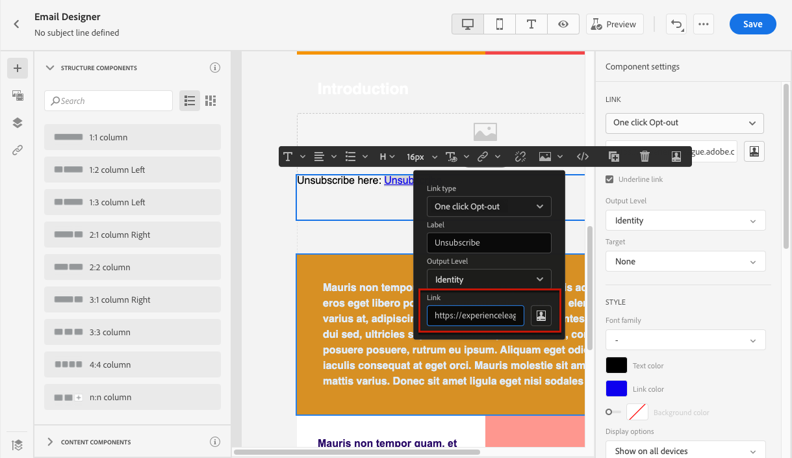
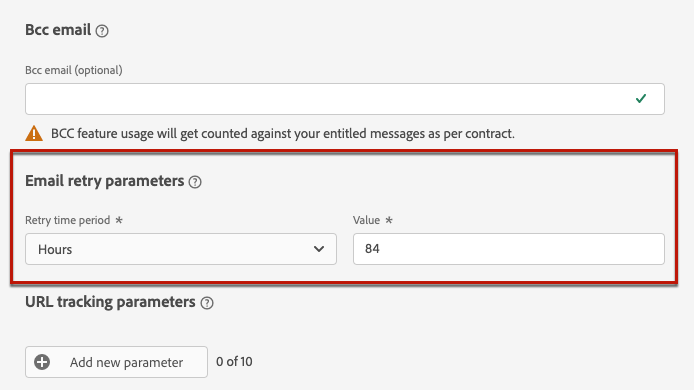

# Skapa meddelandeförinställningar {#message-presets-creation}

Med [!DNL Journey Optimizer]kan du konfigurera meddelandeförinställningar som definierar alla tekniska parametrar som krävs för e-post och push-meddelanden: e-posttyp, avsändarens e-postadress och namn, mobilappar med mera.

>[!CAUTION]
>
> * Konfigurationen av meddelandeförinställningar är begränsad till [Reseadministratörer](../administration/ootb-product-profiles.md#journey-administrator). Om du vill skapa, redigera och ta bort meddelandeförinställningar måste du ha [Hantera meddelandeförinställningar](../administration/high-low-permissions.md#manage-message-presets).
>
> * Du måste utföra [E-postkonfiguration](#configure-email-settings) och [Push-konfiguration](../configuration/push-configuration.md) steg innan du skapar meddelandeförinställningar.

När meddelandeförinställningarna har konfigurerats kan du välja dem när du skapar meddelanden från **[!UICONTROL Presets]** lista.

➡️ [Lär dig hur du skapar och använder e-postförinställningar i den här videon](#video-presets)

## Skapa en meddelandeförinställning {#create-message-preset}

Så här skapar du en meddelandeförinställning:

1. Öppna **[!UICONTROL Channels]** > **[!UICONTROL Branding]** > **[!UICONTROL Message presets]** menyn och klicka sedan på **[!UICONTROL Create Message preset]**.

   

1. Ange ett namn och en beskrivning (valfritt) för förinställningen och välj sedan de kanaler som ska konfigureras.

   

   >[!NOTE]
   >
   > Namn måste börja med en bokstav (A-Z). Det får bara innehålla alfanumeriska tecken. Du kan också använda understreck `_`, punkt`.` och bindestreck `-` tecken.

1. Konfigurera **e-post** inställningar. [Läs mer](#configure-email-settings)

1. Konfigurera **push-meddelande** inställningar. [Läs mer](#configure-push-settings)

   <!--Configure SMS settings. [Learn more](#configure-sms-settings) -->

1. När alla parametrar har konfigurerats klickar du på **[!UICONTROL Submit]** för att bekräfta. Du kan också spara meddelandeförinställningen som utkast och återuppta konfigurationen senare.

   

1. När meddelandeförinställningen har skapats visas den i listan med **[!UICONTROL Processing]** status.

   Under det här steget kommer flera kontroller att utföras för att verifiera att den har konfigurerats korrekt. Bearbetningstiden är ungefär **48h-72h** och kan ta upp till **7-10 arbetsdagar**.

   Dessa kontroller omfattar konfigurations- och tekniska tester som utförs av Adobe-teamet:

   * SPF-validering
   * DKIM-validering
   * MX-postvalidering
   * Kontrollera IP-adresser som blocklist
   * Kontroll av värddator
   * Verifiering av IP-pool
   * A/PTR-post, t/m/res-underdomänverifiering

   >[!NOTE]
   >
   >Om kontrollerna inte lyckas kan du läsa mer om orsakerna till eventuella fel i [det här avsnittet](#monitor-message-presets).

1. När kontrollen är klar får meddelandeförinställningen **[!UICONTROL Active]** status. Den är klar att användas för att leverera meddelanden.

   

## Konfigurera e-postinställningar {#configure-email-settings}

E-postinställningarna definieras i ett dedikerat avsnitt i meddelandeförinställningskonfigurationen.

Konfigurera inställningarna enligt beskrivningen nedan.

### Typ av e-post{#email-type}

I **E-POSTTYP** väljer du den typ av meddelande som ska skickas med förinställningen: **Marknadsföring** eller **Transactional**.

* Välj **Marknadsföring** för kampanjmeddelanden: dessa meddelanden kräver användarens samtycke.

* Välj **Transactional** för icke-kommersiella meddelanden, t.ex. orderbekräftelse, meddelanden om lösenordsåterställning eller leveransinformation.

När [skapa ett meddelande](../messages/get-started-content.md#create-new-message)måste du välja en giltig meddelandeförinställning för den valda kategorin och de valda kanalerna.

>[!CAUTION]
>
>**Transactional** meddelanden kan skickas till profiler som avbeställer marknadskommunikation. Dessa meddelanden kan bara skickas i särskilda sammanhang.

### Underdomän och IP-pool {#subdomains-and-ip-pools}

I **INFORMATION OM UNDERDOMÄN- OCH IP-POOL** måste du

1. Välj den underdomän som ska användas för att skicka e-postmeddelanden. [Läs mer](about-subdomain-delegation.md)

1. Välj den IP-pool som ska associeras med förinställningen. [Läs mer](ip-pools.md)

### List-Unsubscribe {#list-unsubscribe}

Vid [välja en underdomän](#subdomains-and-ip-pools) från listan, **[!UICONTROL Enable List-Unsubscribe]** visas.

Det här alternativet är aktiverat som standard.

Om du låter det vara aktiverat inkluderas en länk för att avbryta prenumerationen automatiskt i e-posthuvudet, till exempel:

Om du inaktiverar det här alternativet visas ingen länk för att avbryta prenumerationen i e-posthuvudet.

Länken för att avbryta prenumerationen består av två element:

* An **avbeställ e-postadress** som alla avbeställningar skickas till.

   I [!DNL Journey Optimizer], är e-postadressen för avanmälan standard **[!UICONTROL Mailto (unsubscribe)]** som visas i meddelandeförinställningen, baserat på [vald underdomän](#subdomains-and-ip-pools).

   

* The **avbeställ URL**, vilket är URL:en till landningssidan där användaren omdirigeras när prenumerationen har upphört.

   Om du lägger till en [länk för avanmälan med ett klick](../messages/consent.md#one-click-opt-out) för ett meddelande som skapas med den här förinställningen blir avanmälnings-URL:en den URL som definierats för länken med ett klick.

   

   >[!NOTE]
   >
   >Om du inte lägger till en länk för avanmälan med ett enda klick i meddelandeinnehållet visas ingen landningssida för användaren.

Läs mer om hur du lägger till en länk för att avbryta prenumerationen i dina meddelanden i [det här avsnittet](../messages/consent.md#unsubscribe-header).

<!--Select the **[!UICONTROL Custom List-Unsubscribe]** option to enter your own Unsubscribe URL and/or your own Unsubscribe email address.(to add later)-->

### URL-spårning{#url-tracking}

För att identifiera var och varför en person klickade på länken kan du lägga till UTM-parametrar för URL-spårning i dialogrutan  **[!UICONTROL URL TRACKING CONFIGURATION (web analytics)]** -avsnitt.

Utifrån de parametrar som du anger används en UTM-kod i slutet av den URL som finns i meddelandeinnehållet. Sedan kan du jämföra resultaten med ett webbanalysverktyg som Google Analytics.

Tre UTM-parametrar är tillgängliga som standard. Du kan lägga till upp till 10 spårningsparametrar. Om du vill lägga till en UTM-parameter väljer du **[!UICONTROL Add new UTM param]** -knappen.

Om du vill konfigurera en UTM-parameter kan du ange önskade värden direkt i **[!UICONTROL Name]** och **[!UICONTROL Value]** eller välj från en lista med fördefinierade värden genom att navigera till följande objekt:

* Reseattribut: Käll-ID, källnamn, källversions-ID
* Meddelandeattribut: Åtgärds-ID, åtgärdsnamn
* Offer decisioning-attribut: Erbjudande-ID, erbjudandenamn

>[!CAUTION]
>
>Välj ingen mapp: Kontrollera att du bläddrar till den mapp som behövs och välj ett profilattribut som ska användas som UTM-värde.

### Huvudparametrar{#email-header}

I **[!UICONTROL HEADER PARAMETERS]** anger du avsändarens namn och e-postadresser som är kopplade till den typ av meddelanden som skickas med den förinställningen.

>[!CAUTION]
>
>E-postadresserna måste använda den valda [delegerad underdomän](about-subdomain-delegation.md).

* **[!UICONTROL Sender name]**: Avsändarens namn, till exempel ditt varumärkes namn.

* **[!UICONTROL Sender email]**: E-postadressen som du vill använda för din kommunikation. Om den delegerade underdomänen till exempel är *marketing.luma.com* kan du använda *contact@marketing.luma.com*.

* **[!UICONTROL Reply to (name)]**: Namnet som ska användas när mottagaren klickar på **Svara** i klientprogramvaran för e-post.

* **[!UICONTROL Reply to (email)]**: E-postadressen som ska användas när mottagaren klickar på **Svara** i klientprogramvaran för e-post. Du måste använda en adress som är definierad för den delegerade underdomänen (till exempel *reply@marketing.luma.com*), annars kommer e-postmeddelandena att tas bort.

* **[!UICONTROL Error email]**: Alla fel som genereras av Internet-leverantörer efter några dagar efter att e-post har levererats (asynkrona studsar) tas emot på den här adressen.

>[!NOTE]
>
>Adresser måste börja med en bokstav (A-Z) och får bara innehålla alfanumeriska tecken. Du kan också använda understreck `_`, punkt`.` och bindestreck `-` tecken.

### Parametrar för återförsök av e-post{#email-retry}

Du kan konfigurera **Parametrar för återförsök av e-post**.

Som standard är [återförsökstid](retries.md#retry-duration) är inställt på 84 timmar, men du kan justera den här inställningen så att den passar dina behov bättre.

Du måste ange ett heltalsvärde (i timmar eller minuter) inom följande intervall:

* För marknadsföringsmeddelanden är den minsta återförsöksperioden 6 timmar.
* För transaktionsmeddelanden är den minsta återförsöksperioden 10 minuter.
* För båda e-posttyperna är den maximala återförsöksperioden 84 timmar (eller 5 040 minuter).

## Konfigurera push-inställningar {#configure-push-settings}

Push-inställningarna definieras i ett dedikerat avsnitt i meddelandeförinställningskonfigurationen.

Följ stegen nedan för att definiera de push-inställningar som är kopplade till meddelandeförinställningen:

1. Välj minst en plattform: **iOS** och/eller **Android**.

1. Välj de mobilprogram som ska användas för varje plattform.

Mer information om hur du konfigurerar miljön för att skicka push-meddelanden finns i [det här avsnittet](../configuration/push-gs.md).

<!--
## Configure SMS settings {#configure-sms-settings}

1. Select the **[!UICONTROL SMS Type]** that will be sent with the preset: **[!UICONTROL Transactional]** or **[!UICONTROL Marketing]**.

    
    
1. Select the **[!UICONTROL SMS configuration]** to associate with the preset.
        
    For more on how to configure your environment to send SMS messages, refer to [this section](sms-configuration.md).

1. Enter the **[!UICONTROL Sender number]** ​you want to use for your communications.
-->

## Övervaka meddelandeförinställningar {#monitor-message-presets}

Alla dina meddelandeförinställningar visas i **[!UICONTROL Channels]** > **[!UICONTROL Message presets]** -menyn. Det finns filter som hjälper dig att bläddra igenom listan (kanaltyp, användare, status).

När meddelandeförinställningarna har skapats kan de ha följande status:

* **[!UICONTROL Draft]**: Meddelandeförinställningen har sparats som ett utkast och har inte skickats ännu. Öppna den för att återuppta konfigurationen.
* **[!UICONTROL Processing]**: Meddelandeförinställningen har skickats och genomgår flera verifieringssteg.
* **[!UICONTROL Active]**: Meddelandeförinställningen har verifierats och kan väljas för att skapa meddelanden.
* **[!UICONTROL Failed]**: En eller flera kontroller misslyckades under verifieringen av meddelandeförinställningen.
* **[!UICONTROL Deactivated]**: Meddelandeförinställningen är inaktiverad. Det kan inte användas för att skapa nya meddelanden.

Om det inte går att skapa en meddelandeförinställning beskrivs informationen för varje möjlig felorsak nedan.

Om något av dessa fel inträffar, kontakta [Adobe kundtjänst](https://helpx.adobe.com/se/enterprise/admin-guide.html/enterprise/using/support-for-experience-cloud.ug.html){target=&quot;_blank&quot;} om du vill ha hjälp.

* **SPF-valideringen misslyckades**: SPF (Sender Policy Framework) är ett autentiseringsprotokoll för e-post som tillåter att auktoriserade IP-adresser kan skicka e-post från en viss underdomän. SPF-valideringsfel innebär att IP-adresserna i SPF-posten inte matchar IP-adresserna som används för att skicka e-post till postlådeprovidern.

* **DKIM-validering misslyckades**: Med DKIM (DomainKeys Identified Mail) kan mottagarservern verifiera att det mottagna meddelandet skickades av den äkta avsändaren av den associerade domänen och att innehållet i det ursprungliga meddelandet inte ändrades. DKIM-valideringsfel innebär att de mottagande e-postservrarna inte kan verifiera meddelandeinnehållets autenticitet och dess koppling till den sändande domänen:

* **MX-postvalideringen misslyckades**: MX-postvalideringsfel (Mail eXchange) innebär att de e-postservrar som ansvarar för att ta emot inkommande e-post för en viss underdomän inte är korrekt konfigurerade.

* **Konfigurationer för slutbarhet misslyckades**: Fel i leveranskonfigurationer kan uppstå på grund av någon av följande orsaker:
   * Blockeringslistning av de tilldelade IP-adresserna
   * Ogiltig `helo` name
   * E-postmeddelanden som skickas från andra IP-adresser än de som anges i IP-poolen för motsvarande förinställning
   * Det går inte att leverera e-postmeddelanden till inkorg hos större internetleverantörer som Gmail och Yahoo

## Redigera en meddelandeförinställning {#edit-message-preset}

Om du vill redigera en meddelandeförinställning följer du stegen nedan.

>[!NOTE]
>
>Du kan inte redigera **[!UICONTROL Push notification settings]**. Om en meddelandeförinställning bara är konfigurerad för push-meddelandekanalen går det inte att redigera den.

1. Öppna en meddelandeförinställning genom att klicka på namnet i listan.

   

1. Redigera egenskaperna efter behov.

   >[!NOTE]
   >
   >Om en meddelandeförinställning har **[!UICONTROL Active]** status, **[!UICONTROL Name]**, **[!UICONTROL Select channel]** och **[!UICONTROL Subdomain]** fält är nedtonade och kan inte redigeras.

1. Klicka **[!UICONTROL Submit]** för att bekräfta dina ändringar.

   

   >[!NOTE]
   >
   >Du kan också spara meddelandeförinställningen som utkast och återuppta uppdateringen senare.

När ändringarna har skickats går meddelandeförinställningen igenom en valideringscykel som liknar den som används när [skapa en förinställning](#create-message-preset).

>[!NOTE]
>
>Om du bara redigerar **[!UICONTROL Description]**, **[!UICONTROL Email type]** och/eller **[!UICONTROL Email retry parameters]** uppdateras uppdateringen omedelbart.

För meddelandeförinställningar som har **[!UICONTROL Active]** status kan du kontrollera uppdateringens information. För att göra detta:

* Klicka på **[!UICONTROL Recent update]** som visas bredvid den aktiva förinställningens namn.

   

* Du kan även komma åt uppdateringsinformationen från en aktiv meddelandeförinställning medan uppdateringen pågår.

   

På **[!UICONTROL Recent update]** visas information som uppdateringsstatus och listan över begärda ändringar.

### Uppdatera status {#update-statuses}

En uppdatering av en meddelandeförinställning kan ha följande status:

* **[!UICONTROL Processing]**: Uppdateringen av meddelandeförinställningen har skickats och genomgår flera verifieringssteg.
* **[!UICONTROL Success]**: Den uppdaterade meddelandeförinställningen har verifierats och kan väljas för att skapa meddelanden.
* **[!UICONTROL Failed]**: En eller flera kontroller misslyckades under verifieringen av uppdateringen av meddelandeförinställningen.

Varje status visas nedan.

### Bearbetar

Flera leveransåtgärder kommer att utföras för att kontrollera att förinställningen har uppdaterats korrekt.

>[!NOTE]
>
>Om du bara redigerar **[!UICONTROL Description]**, **[!UICONTROL Email type]** och/eller **[!UICONTROL Email retry parameters]** uppdateras uppdateringen omedelbart.

Bearbetningstiden är ungefär **48h-72h** och kan ta upp till **7-10 arbetsdagar**. Läs mer om kontroller som utförts under valideringscykeln i [det här avsnittet](#create-message-preset).

Om du redigerar en förinställning som redan var aktiv:

* Dess status kvarstår **[!UICONTROL Active]** när valideringsprocessen pågår.

* The **[!UICONTROL Recent update]** visas bredvid namnet på förinställningen i listan med meddelandeförinställningar.

* Under valideringsprocessen används fortfarande den äldre versionen av förinställningen för meddelanden som konfigurerats med den här förinställningen.

>[!NOTE]
>
>Du kan inte ändra en meddelandeförinställning medan uppdateringen pågår. Du kan fortfarande klicka på namnet, men alla fält är nedtonade. Ändringarna visas inte förrän uppdateringen har slutförts.

### Lyckades {#success}

När valideringsprocessen har slutförts används den nya versionen av förinställningen automatiskt i alla meddelanden som använder den här förinställningen. Du kan dock behöva vänta:
* några minuter innan det konsumeras av enhetsmeddelanden,
* till nästa grupp för att förinställningen ska vara effektiv i gruppmeddelanden.

### Misslyckades {#failed}

Om valideringsprocessen misslyckas kommer den äldre versionen av förinställningen fortfarande att användas.

Läs mer om möjliga felorsaker i [det här avsnittet](#monitor-message-presets).

När uppdateringen misslyckas blir förinställningen redigerbar igen. Du kan klicka på dess namn och uppdatera inställningarna som behöver korrigeras.

## Inaktivera en meddelandeförinställning {#deactivate-preset}

Skapa en **[!UICONTROL Active]** meddelandeförinställningen är inte tillgänglig för att skapa nya meddelanden. Du kan inaktivera den. De publicerade meddelanden som använder den här förinställningen påverkas dock inte och fortsätter att fungera.

>[!NOTE]
>
>Du kan inte inaktivera en meddelandeförinställning medan en uppdatering bearbetas. Du måste vänta tills uppdateringen har slutförts eller misslyckats. Läs mer på [redigera meddelandeförinställningar](#edit-message-preset) och [uppdateringsstatus](#update-statuses).

1. Öppna listan med meddelandeförinställningar.

1. Klicka på **[!UICONTROL More actions]** -knappen.

1. Välj **[!UICONTROL Deactivate]**.

   

>[!NOTE]
>
>Det går inte att ta bort förinställningar för inaktiverade meddelanden för att undvika problem i resor som uppstår när du använder dessa förinställningar för att skicka meddelanden.

Du kan inte redigera en inaktiverad meddelandeförinställning direkt. Du kan dock duplicera den och redigera kopian för att skapa en ny version som du använder för att skapa nya meddelanden. Du kan även aktivera den igen och vänta tills uppdateringen har redigerats.

## Instruktionsvideo{#video-presets}

Lär dig hur du skapar meddelandeförinställningar, hur du använder dem och hur du delegerar en underdomän och skapar en IP-pool.

>[!VIDEO](https://video.tv.adobe.com/v/334343?quality=12)
