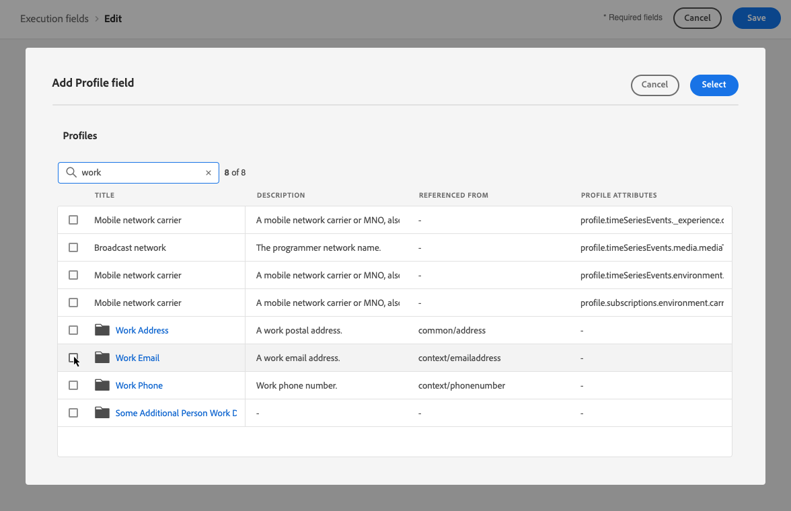

# Ändra primära adresser {#change-primary-email}

>[!CONTEXTUALHELP]
>id="ajo_admin_execution_address"
>title="Ange vilken adress som ska användas"
>abstract="När det finns flera tillgängliga adresser i databasen (personliga, professionella, osv.) kan du välja vilken adress som ska prioriteras för sändning."

När du anger en profil som mål kan det finnas flera e-postadresser i databasen (personlig, professionell e-postadress osv.).

Med [!DNL Journey Optimizer]kan du avgöra vilken e-postadress som ska användas från profiltjänsten och prioritera när flera adresser är tillgängliga. Följ stegen nedan för att göra detta.

1. Gå till **[!UICONTROL Channels]** > **[!UICONTROL General]** > **[!UICONTROL Executions fields]**-menyn.

   

1. Det fält som för närvarande används som standard för att bestämma profilens e-postadresser som visas på den här skärmen. Klicka **[!UICONTROL Edit]** för att ändra det.

   

1. Klicka på det aktuella fältet eller redigeringsikonen för att markera ett nytt fält.

   

1. Listan med tillgängliga XDM-fält av e-posttyp visas. Markera det fält som ska användas.

   

1. Klicka **[!UICONTROL Save]** för att bekräfta ditt val.

   

   Körningsfältet uppdateras och kommer nu att användas som primär adress.

<!--1. You can also select an additional field to use as secondary email address. This allows you to determine which field to use if the primary field is empty for a profile. -->
