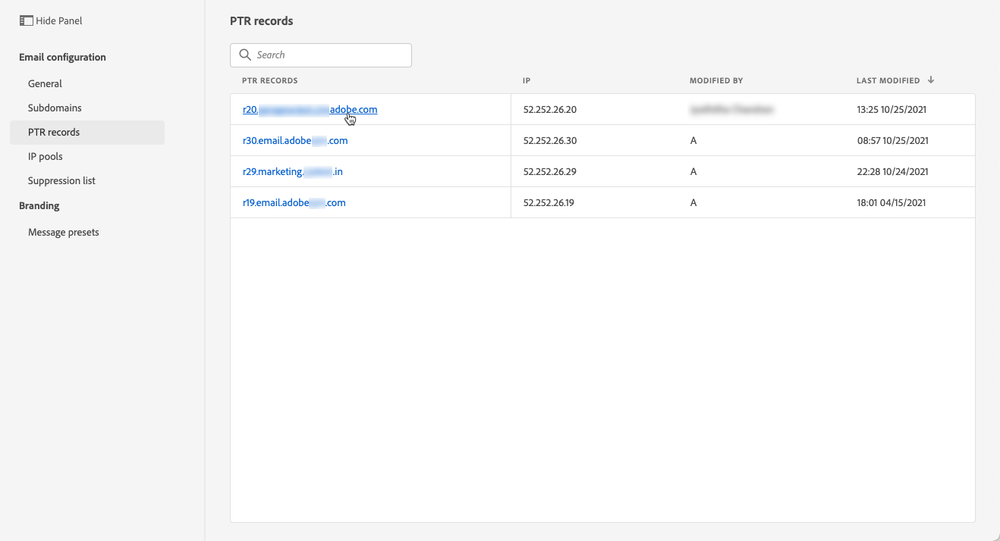

# PTR-poster

## Om PTR-poster

En pekarpost (PTR) är en typ av DNS-post (Domain Name System) som tillhandahåller det domännamn som är länkat till en IP-adress.

Med PTR-poster kan e-postservrar som tar emot e-post kontrollera e-postservrarnas äkthet genom att identifiera om deras IP-adresser motsvarar de namn som servrarna ansluter till.

## Få åtkomst till dina underdomäners PTR-poster

En gång [en underdomän har delegerats](delegate-subdomain.md) i Adobe Journey Optimizer skapas en PTR-post automatiskt och kopplas till den här underdomänen. Du kommer åt den via **[!UICONTROL Channels]** > **[!UICONTROL Email configuration]** > **[!UICONTROL PTR records]** -menyn.

I listan visas de PTR-poster som genererats för varje delegerad underdomän med syntaxen nedan:

* &quot;r&quot; för register,
* &quot;xx&quot; för de två sista siffrorna i IP-adressen,
* underdomännamn.

Du kan öppna en PTR-post från listan för att visa det associerade underdomännamnet och IP-adressen.

## Redigera en PTR-post {#edit-ptr-record}

Du kan ändra en PTR-post om du vill redigera den underdomän som är associerad med en IP-adress.

>[!CAUTION]
>
>Du kan inte ändra en PTR-post som är kopplad till en underdomän som har delegerats till Adobe med [CNAME-metod](delegate-subdomain.md#cname-subdomain-delegation).

1. Öppna en PTR-post genom att klicka på dess namn i listan.

   

1. Redigera underdomänen efter behov.

   

   >[!NOTE]
   >
   >Du kan inte ändra **[!UICONTROL IP]** och **[!UICONTROL PTR record]** fält.

1. Klicka **[!UICONTROL Save]** för att bekräfta dina ändringar.

An **[!UICONTROL Updating]** visas bredvid namnet på PTR-posten i listan.

Om du vill kontrollera uppdateringsinformationen för PTR-posten klickar du på **[!UICONTROL Updating]** eller **[!UICONTROL Recent updates]** ikon.

Du kan se information som uppdateringsstatus och begärda ändringar.

## Uppdatera status

En PTR-postuppdatering kan ha följande status:

* **[!UICONTROL Processing]**: Uppdateringen av PTR-posten har skickats och genomgår en verifieringsprocess.
* **[!UICONTROL Success]**: Den uppdaterade PTR-posten har verifierats och den nya underdomänen är nu associerad med IP-adressen.
* **[!UICONTROL Failed]**: En eller flera kontroller misslyckades under PTR-postuppdateringsverifieringen.

### Bearbetar

Flera leveranskontroller kommer att utföras för att verifiera att den nya underdomänen som ska associeras med IP-adressen är giltig. <!--The processing time is around **48h-72h**, and can take up to **7-10 days**. Learn more on the checks performed during the validation cycle in [this section](#create-message-preset).-->

>[!NOTE]
>
>Du kan inte ändra en PTR-post medan uppdateringen pågår. Du kan fortfarande klicka på namnet, men **[!UICONTROL Subdomain]** fältet är nedtonat. Ändringarna visas inte förrän uppdateringen har slutförts.

Under valideringsprocessen är den gamla underdomänen fortfarande kopplad till IP-adressen.

### Lyckades

När valideringsprocessen har slutförts kopplas den nya underdomänen automatiskt till IP-adressen.

### Misslyckades

Om valideringsprocessen misslyckas visas den äldre PTR-posten. Den giltiga underdomänen som tidigare var associerad med IP-adressen ändras inte.

Följande typer av uppdateringsfel är möjliga:
* Det gick inte att skapa en ny framåtriktad DNS för PTR-posten
* Det gick inte att uppdatera posten
* Det gick inte att ta in tillhörigheterna igen

När uppdateringen misslyckas blir PTR-posten redigerbar igen. Du kan klicka på dess namn och uppdatera underdomänen igen.
