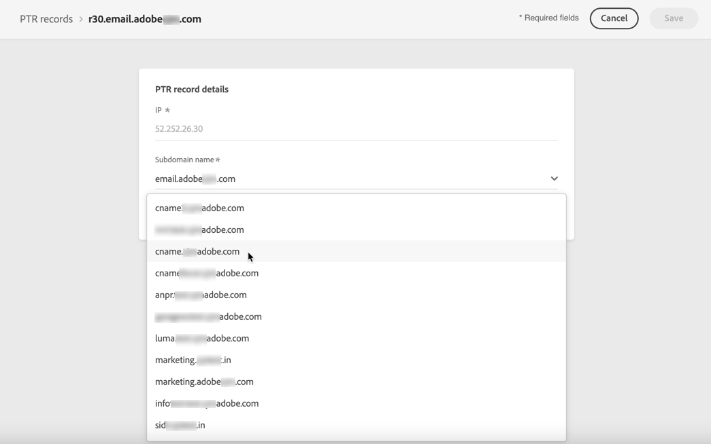
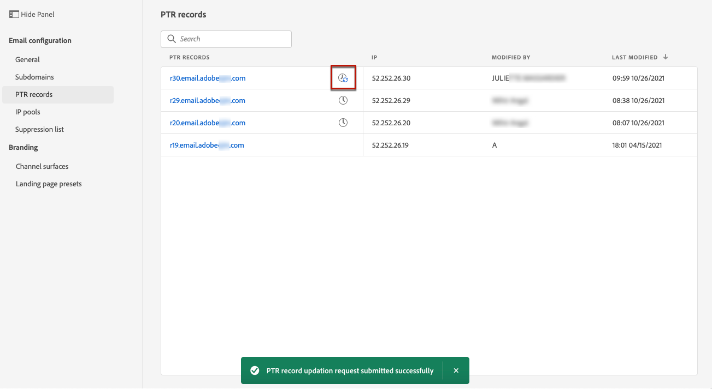

# Skapa och redigera PTR-poster {#ptr-records}

>[!CONTEXTUALHELP]
>id="ajo_admin_ptr_record"
>title="Underdomäners PTR-poster"
>abstract="En pekarpost (PTR) är en typ av DNS-post som tillhandahåller det domännamn som är länkat till en IP-adress, vilket hjälper de mottagande e-postservrarna att verifiera avsändarens IP-adresser. Redigera bara en PTR-post efter vederbörlig hänsyn och diskussion med din produktexpert."

>[!CONTEXTUALHELP]
>id="ajo_admin_ptr_record_header"
>title="Underdomäners PTR-poster"
>abstract="När den första underdomänen har delegerats till Adobe i Journey Optimizer skapas PTR-poster automatiskt."

## Om PTR-poster {#about-ptr-records}

En pekarpost (PTR) är en typ av DNS-post (Domain Name System) som tillhandahåller det domännamn som är länkat till en IP-adress.

Med PTR-poster kan e-postservrar som tar emot e-post kontrollera e-postservrarnas äkthet genom att identifiera om deras IP-adresser motsvarar de namn som servrarna ansluter till.

## Få åtkomst till dina underdomäners PTR-poster {#access-ptr-records}

När du [delegerar](delegate-subdomain.md) din första underdomän till Adobe i [!DNL Journey Optimizer] skapas PTR-poster automatiskt för dina IP-adresser. Du kommer åt dem på menyn **[!UICONTROL Administration]** > **[!UICONTROL Channels]** > **[!UICONTROL Email settings]** > **[!UICONTROL PTR records]**.

I listan visas de PTR-poster som genererats med syntaxen nedan:

* &quot;r&quot; för register,
* &quot;xx&quot; för de två sista siffrorna i IP-adressen,
* underdomännamn.

Du kan öppna en PTR-post från listan för att visa det associerade underdomännamnet och IP-adressen.

## Redigera en PTR-post {#edit-ptr-record}

I [!DNL Journey Optimizer] kan du inte skapa PTR-poster manuellt. När du [delegerar](delegate-subdomain.md) din första underdomän till Adobe skapas PTR-poster automatiskt för dina IP-adresser.

Var och en av dina IP-adresser får en enda PTR-post. Alla PTR-poster har följande format: &#39;rxx.subdomain&#39;, där &#39;subdomain&#39; är den första underdomänen du delegerat i [!DNL Journey Optimizer].

När du skapar ytterligare underdomäner måste du ändra en eller flera PTR-poster och tilldela dem de nya underdomänerna. Följ stegen nedan för att göra det.

>[!CAUTION]
>
>PTR-poster är gemensamma för alla miljöer. Alla ändringar av en PTR-post kommer därför också att påverka produktionssandlådorna.
>
>Fortsätt med extra omsorg när du redigerar PTR-poster. Om du är osäker kan du kontakta en expert på slutprodukter.

### Fullt delegerade underdomäner {#fully-delegated-subdomains}

Om du vill redigera en PTR-post med en underdomän som är [helt delegerad](delegate-subdomain.md#full-subdomain-delegation) till Adobe följer du stegen nedan.

1. Öppna en PTR-post genom att klicka på dess namn i listan.

   

1. Välj en underdomän [som har delegerats ](delegate-subdomain.md#full-subdomain-delegation) till Adobe i listan.

   

1. Klicka på **[!UICONTROL Save]** för att bekräfta ändringarna.

>[!NOTE]
>
>Du kan inte ändra fälten **[!UICONTROL IP]** och **[!UICONTROL PTR record]**.

### Delegerade underdomäner med CNAME-metoden {#edit-ptr-subdomains-cname}

Om du vill redigera en PTR-post med en underdomän som har delegerats till Adobe med metoden [CNAME](delegate-subdomain.md#cname-subdomain-setup) följer du stegen nedan.

1. Öppna en PTR-post genom att klicka på dess namn i listan.

   

1. Välj en underdomän som har delegerats till Adobe med metoden [CNAME](delegate-subdomain.md#cname-subdomain-setup) i listan.

   

1. Du måste skapa en ny framåtriktad DNS-post på din värdplattform. Det gör du genom att kopiera posten som genererats av Adobe. När du är klar markerar du rutan &quot;Jag bekräftar..&quot;.

   

   >[!NOTE]
   >
   >Om du får det här meddelandet:&quot;Skapa en vanlig DNS först och försök sedan igen&quot;, följer du stegen nedan:
   >   * Kontrollera DNS-providern om den vidarebefordrade DNS-posten har skapats.
   >   * Poster i hela DNS kanske inte synkroniseras omedelbart. Vänta några minuter och försök igen.

1. Klicka på **[!UICONTROL Save]** för att bekräfta ändringarna.

>[!NOTE]
>
>Du kan inte ändra fälten **[!UICONTROL IP]** och **[!UICONTROL PTR record]**.

## Kontrollera uppdateringsinformation för PTR-post {#check-ptr-record-update}

När du har bekräftat redigeringen av PTR-posten visas ikonen **[!UICONTROL Processing]** bredvid namnet på PTR-posten i listan.

>[!NOTE]
>
>[Uppdateringsbearbetningen](#processing) kan ta upp till 3 timmar.

Om du vill kontrollera uppdateringsinformationen för PTR-posten klickar du på ikonen bredvid den. Läs mer om statusvärdena som är associerade med de olika ikonerna i [det här avsnittet](#ptr-record-update-statuses).

Du kan se information som uppdateringsstatus och begärda ändringar.

## Uppdateringsstatus för PTR-post {#ptr-record-update-statuses}

En PTR-postuppdatering kan ha följande status:

*  **[!UICONTROL Processing]**: Uppdateringen av PTR-posten har skickats och genomgår en verifieringsprocess.
*  **[!UICONTROL Success]**: Den uppdaterade PTR-posten har verifierats och den nya underdomänen är nu associerad med IP-adressen.
*  **[!UICONTROL Failed]**: En eller flera kontroller misslyckades under PTR-postuppdateringsverifieringen.

### Bearbetar {#processing}

Flera leveranskontroller kommer att utföras för att verifiera att den nya underdomänen som ska associeras med IP-adressen är giltig. Detta kan ta upp till 3 timmar.

>[!NOTE]
>
>Du kan inte ändra en PTR-post medan uppdateringen pågår. Du kan fortfarande klicka på namnet, men fältet **[!UICONTROL Subdomain]** är nedtonat. Ändringarna visas inte förrän uppdateringen har slutförts.

Under valideringsprocessen är den gamla underdomänen fortfarande kopplad till IP-adressen.

### Lyckades {#success}

När valideringsprocessen har slutförts kopplas den nya underdomänen automatiskt till IP-adressen.

### Misslyckades {#failes}

Om valideringsprocessen misslyckas visas den äldre PTR-posten. Den giltiga underdomänen som tidigare var associerad med IP-adressen ändras inte.

Följande typer av uppdateringsfel är möjliga:

* Det gick inte att skapa en ny framåtriktad DNS för PTR-posten
* Det gick inte att uppdatera posten
* Det gick inte att ta in tillhörigheterna på nytt

När uppdateringen misslyckas blir PTR-posten redigerbar igen. Du kan klicka på dess namn och uppdatera underdomänen igen.
