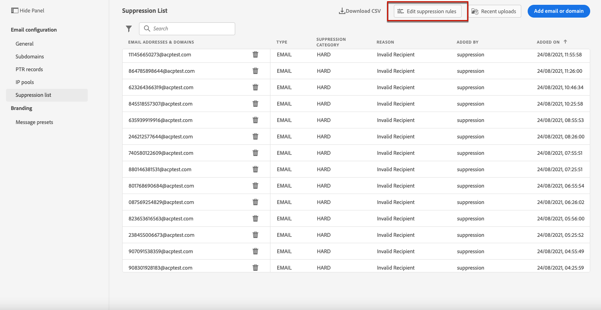
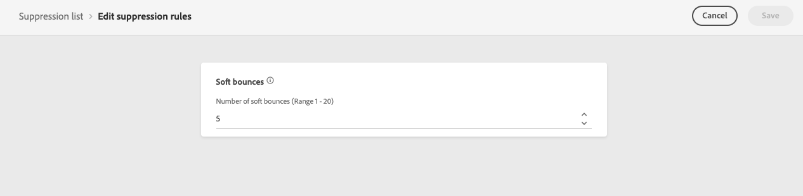

# Återförsök {#retries}

När ett e-postmeddelande misslyckas på grund av ett tillfälligt **Mjuk studsa** fel, flera försök utförs. Varje fel ökar en felräknare. När den här räknaren når gränsvärdet läggs adressen till i listan över spärrade adresser.

>[!NOTE]
>
>Läs mer om olika typer av fel i [Leveransfel](../suppression-list.md#delivery-failures) -avsnitt.

I standardkonfigurationen är tröskelvärdet 5 fel.

* För samma leverans påträffades fel den femte i [återförsökstid](#retry-duration), är adressen undertryckt.

* Om det finns olika leveranser och två fel inträffar med minst 24 timmars mellanrum, ökas felräknaren vid varje fel och adressen visas inte vid det femte försöket.

Om en leverans lyckas efter ett nytt försök initieras adressräknaren på nytt.

Om standardvärdet 5 inte passar dina behov kan du ändra feltröskeln enligt stegen nedan.

1. Gå till **[!UICONTROL Channels]** > **[!UICONTROL Email configuration]** > **[!UICONTROL Suppression list]**.

1. Markera knappen **[!UICONTROL Edit suppression rules]**.

   

1. Redigera det tillåtna antalet på varandra följande mjuka studsar efter dina behov.

   

   Du måste ange ett heltalsvärde mellan 1 och 20, vilket innebär att det minsta antalet försök är 1 och det högsta antalet är 20.

   >[!CAUTION]
   >
   >Värden över 10 kan orsaka problem med leveransens anseende, liksom IP-begränsning eller blockeringslistning från Internet-leverantörer. [Läs mer om leverans](../deliverability.md)

<!---->

<!--The minimum delay between retries and the maximum number of retries to be performed are based on how well an IP is performing, both historically and currently, at a given domain.-->

## Tidsperiod för återförsök {#retry-duration}

The **återförsökstid** är den tidsram inom vilken ett e-postmeddelande om leveransen som påträffade ett tillfälligt fel eller en mjuk avhoppning kommer att skickas igen.

Som standard utförs återförsök för **3,5 dagar** (eller **84 timmar**) när meddelandet lades till i e-postkön.

För att vara säker på att försök inte utförs igen när de inte längre behövs kan du ändra den här inställningen efter behov när du skapar eller redigerar en [meddelandeförinställning](message-presets.md) som används i e-postkanalen.

Du kan t.ex. ange återförsöksperioden till 24 timmar för ett transaktionsmejl som relaterar till lösenordsåterställning och som innehåller en länk som bara är giltig för en dag. På samma sätt kan du vid midnatt-försäljning definiera en återförsöksperiod på 6 timmar.

>[!NOTE]
>
>Återförsöksperioden får inte vara längre än 84 timmar. Den minsta återförsöksperioden är 6 timmar för marknadsföringsmeddelanden och 10 minuter för transaktionsmeddelanden.

Lär dig hur du justerar parametrarna för e-poståterförsök när du skapar en meddelandeförinställning i [det här avsnittet](message-presets.md#create-message-preset).

<!--After 3.5 days, any message in the retry queue will be removed from the queue and sent back as a bounce.-->

<!--Once a message has been in the retry queue for a maximum of 3.5 days and has failed to deliver, it will time out and its status will be updated to Failed??-->
