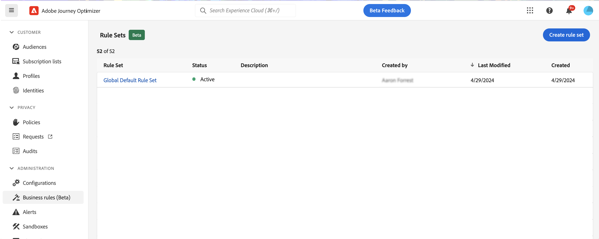
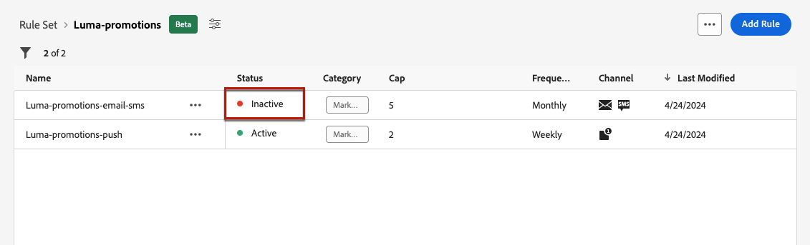
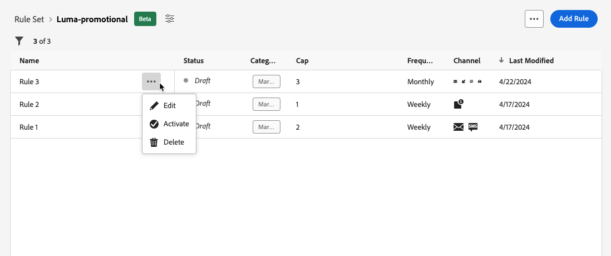

# Arbeta med regeluppsättningar {#rule-sets}

>[!CONTEXTUALHELP]
>id="ajo_business_rules_rule_sets"
>title="Regeluppsättningar"
>abstract="Använd regeluppsättningar för att tillämpa frekvensbegränsning för olika typer av marknadsföringskommunikation. Du kan till exempel skapa en regeluppsättning som begränsar antalet **kampanjkommunikation** skickas till dina kunder och skapar en annan regeluppsättning för att begränsa antalet **nyhetsbrev** skickas till dem. Regeluppsättningar är för närvarande bara tillgängliga som betaversioner för att välja användare."

>[!AVAILABILITY]
>
>Regeluppsättningar är för närvarande endast tillgängliga som betaversioner för valda användare. Kontakta din Adobe-representant för att få delta i betaversionen.

## Vad är regeluppsättningar? {#what}

Förutom globala affärsregler som begränsar antalet gånger som användare får meddelanden i en eller flera kanaler, kan du med regeluppsättningar **gruppera flera regler i regeluppsättningar** och tillämpa dem på valfria kampanjer. Detta ger en förbättrad detaljrikedom som styr hur ofta användarna får ett meddelande beroende på kommunikationstypen.

Du kan till exempel skapa en regeluppsättning som begränsar antalet **kampanjkommunikation** skickas till dina kunder och en annan regeluppsättning för att begränsa antalet **nyhetsbrev** skickas till dem. Beroende på vilken typ av kampanj du skapar kan du sedan välja att använda antingen kampanjkommunikationen eller regeluppsättningen för nyhetsbrev.

## Globala och anpassade regeluppsättningar {#global-custom}

Vid åtkomst av regeluppsättningar för första gången från **[!UICONTROL Administration]** > **[!UICONTROL Business rules (Beta)]** är en standardregeluppsättning redan skapad och aktiv: **Global standardregeluppsättning**.

Den här regeluppsättningen innehåller globala regler som du kan tillämpa för att styra hur ofta användare får meddelanden i en eller flera kanaler, på samma sätt som nuvarande affärsregler fungerar. Alla regler som definieras i den här regeluppsättningen gäller för alla valda kanaler, oavsett om kommunikationen skickas från en resa eller en kampanj. [Lär dig arbeta med affärsregler](frequency-rules.md)

Utöver den här uppsättningen regler för global standardregeluppsättning kan du skapa **anpassad regel** uppsättningar som du kan tillämpa på valfri kampanj för att begränsa antalet meddelanden som skickas inom den kampanjen. [Lär dig skapa anpassade regeluppsättningar](#create)

>[!IMPORTANT]
>
>För tillfället kan anpassade regeluppsättningar användas på **kampanjer** endast. Endast de regler som definieras i regeluppsättningen&quot;Global standardregel&quot; gäller för både resor och kampanjkommunikation.

## Skapa din första anpassade regeluppsättning {#create-rule-set}

### Skapa regeluppsättningen {#create}

Följ stegen nedan för att skapa en regeluppsättning.

>[!NOTE]
>
>Du kan skapa upp till tre anpassade regeluppsättningar.

1. Öppna **[!UICONTROL Rules sets]** lista och klicka sedan på **[!UICONTROL Create rule set]**.

   

1. Definiera regeluppsättningens namn, lägg till en beskrivning om det behövs och klicka på **[!UICONTROL Save]**.

   

   >[!NOTE]
   >
   >Regeluppsättningsnamnet måste vara unikt.

1. Nu kan du [definiera reglerna](#create-new-rule) du vill lägga till i den här regeluppsättningen.

### Lägg till regler i regeluppsättningen {#create-new-rule}

>[!CONTEXTUALHELP]
>id="ajo_rule_sets_category"
>title="Välj meddelanderegelkategori"
>abstract="När det aktiveras och används för ett meddelande, kommer alla frekvensregler som matchar den valda kategorin automatiskt att tillämpas på det här meddelandet. För närvarande är endast marknadsföringskategorin tillgänglig."

>[!CONTEXTUALHELP]
>id="ajo_rule_sets_capping"
>title="Ange begränsning för din regel"
>abstract="Ange det maximala antalet meddelanden som skickas till en kundprofil inom den valda tidsramen. Frekvensgränsen baseras på den valda kalenderperioden och återställs i början av motsvarande tidsram."

>[!CONTEXTUALHELP]
>id="ajo_rule_sets_channel"
>title="Definiera de kanaler som regeln gäller för"
>abstract="Välj minst en kanal. Taket tillämpas över alla kanaler som ett totalt antal."

>[!CONTEXTUALHELP]
>id="ajo_rule_sets_duration"
>title="Välj meddelanderegelkategori"
>abstract="När det aktiveras och används för ett meddelande, kommer alla frekvensregler som matchar den valda kategorin automatiskt att tillämpas på det här meddelandet. För närvarande är endast marknadsföringskategorin tillgänglig."

Följ stegen nedan om du vill lägga till en regel i en regeluppsättning.

1. Från den regeluppsättning du just skapade klickar du på **[!UICONTROL Add rule]**.

   

1. Definiera en unik **Regelnamn**.

1. The **Kategori** -fältet anger vilken meddelandekategori regeln gäller för. För tillfället är det här fältet skrivskyddat som endast **[!UICONTROL Marketing]** finns tillgänglig.

1. Från **[!UICONTROL Duration]** väljer du om du vill att capping ska användas varje månad, vecka eller dag. Frekvensgränsen baseras på den valda kalenderperioden. Den återställs i början av motsvarande tidsram.

   

   Räknaren för varje period har följande förfallodatum:

   * **[!UICONTROL Monthly]**: Frekvensbegränsningen gäller till den sista dagen i månaden vid 23:59:59 UTC. Månadsförfallodatumet för januari är till exempel 01-31 23:59:59 UTC.

   * **[!UICONTROL Weekly]**: Frekvensbegränsningen gäller till lördag 23:59:59 UTC den veckan då kalenderveckan börjar på söndag. Utgångsdatumet är oberoende av hur regeln skapas. Om regeln till exempel skapas på torsdag gäller den till lördag den 23:59:59.

   * **[!UICONTROL Daily]**: Den dagliga frekvensen gäller för dagen till 23:59:59 UTC och återställer till 0 i början av nästa dag.

     >[!CAUTION]
     >
     >För att säkerställa exaktheten i de dagliga reglerna för frekvensbegränsning bör man använda [strömningssegmentering](https://experienceleague.adobe.com/docs/experience-platform/segmentation/ui/streaming-segmentation.html){target="_blank"} är obligatoriskt. Läs mer om metoder för målgruppsutvärdering i [det här avsnittet](../audience/about-audiences.md#evaluation-method-in-journey-optimizer).

   Observera att profilräknarvärdet uppdateras när kommunikationen har skickats. Tänk på det här när du skickar stora mängder kommunikation eftersom dataflödet kan resultera i att mottagaren får e-postminuterna eller till och med timmar efter att kommunikationen har startats (om du skickar miljontals meddelanden samtidigt).

   Detta gäller om en mottagare får två kommunikationer nära ihop. Vi föreslår att kommunikationen ska hållas isär med minst två timmar om det är möjligt, så att mottagaren får tillräckligt med tid för att kunna ta emot kommunikationen och räknarvärdet för att kunna uppdatera.

1. Ange begränsningen för din regel, vilket innebär det maximala antalet meddelanden som kan skickas till en enskild användarprofil varje månad, vecka eller dag enligt vad du väljer ovan.

1. Markera kanalen som du vill använda för den här regeln: **[!UICONTROL Email]**, **[!UICONTROL SMS]**, **[!UICONTROL Push notification]** eller **[!UICONTROL Direct mail]**.

   

   >[!NOTE]
   >
   >Du måste välja minst en kanal för att kunna skapa regeln.

1. Markera flera kanaler om du vill tillämpa begränsning för alla markerade kanaler som ett totalt antal.

   Ange till exempel 5 som capping och markera både e-postkanalen och sms-kanalen. Om en profil redan har fått 3 marknadsföringsmeddelanden och 2 marknadsföringsmeddelanden för den valda perioden, kommer profilen att uteslutas från nästa leverans av marknadsföringsmeddelanden eller sms.

1. Klicka **[!UICONTROL Save]** för att bekräfta att regeln har skapats. Meddelandet läggs till i regeluppsättningen med **[!UICONTROL Draft]** status.

   

1. Upprepa stegen ovan om du vill lägga till så många regler som behövs i regeluppsättningen.

Nu måste du aktivera varje regel innan den kan tillämpas på alla meddelanden. [Läs mer](#activate-rule)

### Aktivera reglerna och regeluppsättningen {#activate-rule}

När en regel skapas har den **[!UICONTROL Draft]** status och påverkar ännu inte något meddelande. Om du vill aktivera den klickar du på **[!UICONTROL More actions]** knapp bredvid regeln och markera **[!UICONTROL Activate]**.

Du måste också aktivera regeluppsättningen för att kunna komma åt den i kampanjer/resor och använda den i dina meddelanden.

>[!NOTE]
>
>Det kan ta upp till 10 minuter för en regel eller regeluppsättning att aktiveras fullständigt. Du behöver inte ändra meddelanden eller publicera om resor för att en regel ska börja gälla.

<!--Currently, once a rule set is activated, no more rules can be added to that rule set.-->

Om du vill inaktivera en regel eller en regeluppsättning klickar du på **[!UICONTROL More actions]** intill önskat objekt och markera **[!UICONTROL Deactivate]**.

Dess status ändras till **[!UICONTROL Inactive]** och regeln gäller inte för framtida meddelandekörningar. Meddelanden som körs just nu påverkas inte.

>[!NOTE]
>
>När du inaktiverar en regel eller regeluppsättning påverkas eller återställs inte antalet enskilda profiler.

## Få åtkomst till och hantera regeluppsättningar {#access-rule-sets}

Alla skapade regeluppsättningar visas i **[!UICONTROL Administration]** > **[!UICONTROL Business rules (Beta)]** -menyn. De sorteras efter senaste ändringsdatum.

Klicka på ett regeluppsättningsnamn om du vill visa och redigera innehållet. Alla regler i den regeluppsättningen visas. Med snabbmenyn uppe till höger kan du:

* Redigera regeluppsättningens namn och beskrivning
* Aktivera regeluppsättningen - [läs mer](#activate-rule)
* Ta bort regeluppsättningen

För varje regel i regeluppsättningen **[!UICONTROL More actions]** Med knappen kan du:

* Redigera regeln
* Aktivera regeln [läs mer](#activate-rule)
* Ta bort regeln

<!--### Permissions{#permissions-frequency-rules}

To access, create, edit or delete message frequency rules, you must have the **[!UICONTROL Manage frequency rules]** permission. 

Users with the **[!UICONTROL View frequency rules]** permission are able to view rules, but not to modify or delete them.

Learn more about permissions in [this section](../administration/high-low-permissions.md).-->

## Använda en regeluppsättning i ett meddelande {#apply-frequency-rule}

Följ stegen nedan för att tillämpa en affärsregel på ett meddelande.

1. När en [kampanj](../campaigns/create-campaign.md)markerar du en av de kanaler som du har definierat för regeluppsättningen och redigerar innehållet i meddelandet.

1. På skärmen för innehållsutgåvan klickar du på **[!UICONTROL Add Business Rule]** -knappen.

1. Välj [regeluppsättning som du har skapat](#create-rule-set).

   

   >[!NOTE]
   >
   >Endast [aktiverad](#activate-rule) regeluppsättningar visas i listan.

   <!--Messages where the category selected is **[!UICONTROL Transactional]** will not be evaluated against business rules.-->

1. Innan du aktiverar kampanjen måste du schemalägga att den ska köras minst 10 minuter framåt.

   Detta ger tillräckligt med tid för att fylla i räknarvärdena för profilen för affärsregeln som du har valt. Om du aktiverar kampanjen direkt fylls inte regeluppsättningens räknarvärden i mottagarnas profiler och meddelandet räknas inte mot deras regler för frekvensbegränsning för anpassade regeluppsättningar.

   

1. Du kan visa antalet profiler som har uteslutits från leverans i [Global rapport](../reports/global-report.md)och i [Live-rapport](../reports/live-report.md), där frekvensreglerna listas som en möjlig orsak för användare som inte får leverera.

>[!NOTE]
>
>Flera regler kan gälla för samma kanal, men när den nedre gränsen har nåtts utesluts profilen från nästa leverans.

<!--
## Example: combine several rules {#frequency-rule-example}

You can combine several message frequency rules, such as described in the example below.

1. [Create a rule](#create-new-rule) called *Overall Marketing Capping*:

   * Select all channels.
   * Set capping to 12 monthly.

   

1. To further restrict the number of marketing-based push notifications that a user is sent, create a second rule called *Push Marketing Cap*:

   * Select Push channel.
   * Set capping to 4 monthly.

   

1. Save and [activate](#activate-rule) the rule.

1. [Create a message](../building-journeys/journeys-message.md) for every channel you want to communicate through and select the **[!UICONTROL Marketing]** category for each message. [Learn how to apply a frequency rule](#apply-frequency-rule)

   

In this scenario, an individual profile:
* can receive up to 12 marketing messages per month;
* but will be excluded from marketing push notifications after they have received 4 push notifications.-->

När du testar frekvensregler bör du använda en ny [testprofil](../audience/creating-test-profiles.md)eftersom det inte finns något sätt att återställa räknaren förrän nästa punkt i en profils frekvensbegränsning har nåtts. Om du inaktiverar en regel kan mappade profiler ta emot meddelanden, men inga räknarsteg tas bort eller tas bort.
