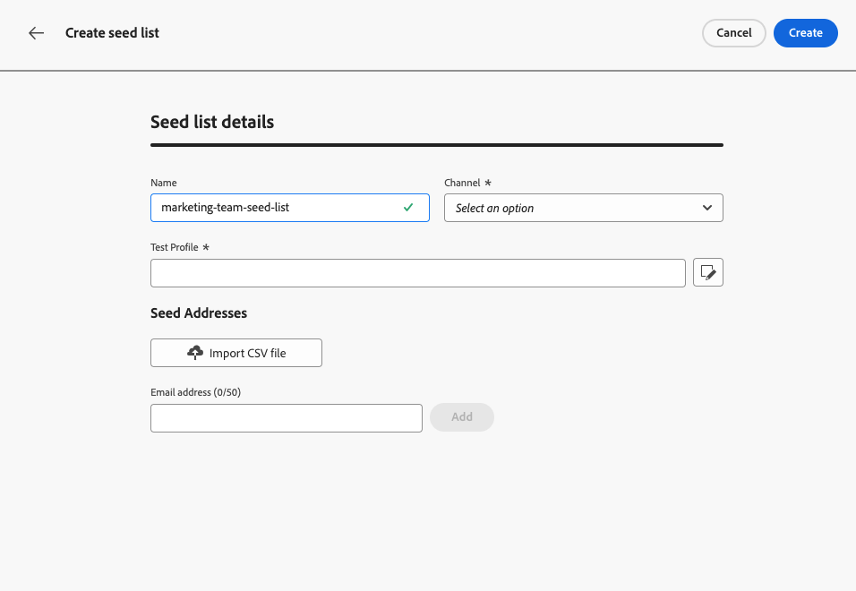
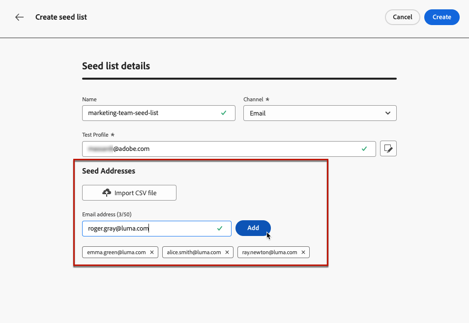

# Använd dirigerade listor {#seed-lists}

Med hjälp av dirigeringslistor i [!DNL Journey Optimizer] kan du automatiskt inkludera specifika dirigeringsadresser i dina leveranser.

>[!CAUTION]
>
>Den här funktionen gäller för närvarande bara för e-postkanalen.

Fröadresser används för mottagare i målgruppen som inte matchar dess definierade villkor. På så sätt kan mottagare som ligger utanför leveransomfånget ta emot leveransen, precis som andra målmottagare gör.

Seed-adresser är inte riktiga profiler eller testprofiler eftersom de inte innehåller någon profilinformation. De är bara mottagare som tillhör interna intressenter som lagras i systemet. När de väljs ut i en viss kampanj eller resa inkluderas de vid leveranstillfället, vilket innebär att de får en kopia av leveransen i försäkringssyfte.

* Genom att ta emot leveranser samtidigt och under samma förhållanden som era kunder kan ni med hjälp av utsädeslistor övervaka de e-postkopior som skickas ut för att säkerställa att alla visningsformat, bilder och länkar är korrekta samt hålla reda på de faktiska meddelanden som skickas till mottagarna.

  Exempel:

  +++ Om du är marknadschef:

  Ni vill att alla teammedlemmar ska få kopior av skickade meddelanden samtidigt som era kunder. På så sätt kan teamet se till att meddelanden skickas ut med den förväntade layouten, aktiva URL:er, korrekt text och bilder - allt som planerat före körningen.

  +++

  +++ Om du är produktägare:

  Ni måste hålla reda på faktiska meddelanden som skickas till kunderna. Ert team och ert ledarskap kan vara intresserade av vissa kampanjer och behöver läggas till på ad hoc-basis för att kunna ta emot kopior av meddelanden vid leveranstillfället.

  +++

* En annan orsak till att du använder listor med startsidor är att du skyddar din sändlista. Genom att infoga dirigerade adresser i din e-postlista kan du lägga märke till om de används av en tredje part, eftersom de dirigerade adresserna som finns där kommer att få leveranserna som skickas till din e-postlista.

>[!NOTE]
>
>Varianter stöds, inklusive flerspråkiga varianter och experimentella varianter. Varje startadress får en kopia av varje variant av samma meddelande, t.ex. olika versioner från ett [innehållsexperiment](../content-management/get-started-experiment.md). Observera att separata e-postmeddelanden inte skickas för villkorligt innehåll.

## Åtkomst till startlistor {#access-seed-lists}

Gå till **[!UICONTROL Administration]** > **[!UICONTROL Channels]** > **[!UICONTROL Email settings]** och välj **[!UICONTROL Seed list]** om du vill komma åt de startlistor som redan har skapats.

<!--
>[!CAUTION]
>
>Permissions to view, export and manage the seed lists are restricted to [Journey Administrators](../administration/ootb-product-profiles.md#journey-administrator). Learn more about managing [!DNL Journey Optimizer] users' access rights in [this section](../administration/permissions-overview.md).-->

>[!CAUTION]
>
>Om du vill kunna visa, redigera och hantera dirigerade listor måste du ha behörigheten **[!UICONTROL Manage Seedlist]**.

Du kan söka efter dirigerade listor efter namn och/eller filtrera den användare som skapade listan eller på det datum listan skapades. När du har valt det här alternativet kan du rensa filtret som visas högst upp i listan.

Använd knappen **[!UICONTROL Delete]** om du vill ta bort en post permanent.

>[!CAUTION]
>
>Det går inte att ta bort en startvärdeslista som används i en aktiv [kampanj](../campaigns/review-activate-campaign.md) eller [resa](../building-journeys/publish-journey.md). Du måste inaktivera kampanjen/resan eller redigera den för att använda en annan konfiguration som inte har startvärdeslistan markerad. [Läs mer om hur du använder en startvärdeslista](#use-seed-list)

Du kan klicka på ett namn på en startlista om du vill redigera den. <!--Use the **[!UICONTROL Edit]** button to edit a seed list.-->

## Skapa en startvärdeslista {#create-seed-list}

>[!CONTEXTUALHELP]
>id="ajo_seed_list_details"
>title="Definiera en startvärdeslista"
>abstract="Använd en lista för att automatiskt lägga till specifika interna adresser till era leveransgrupper för att försäkra er. Med hjälp av dirigerade listor kan du övervaka utskickade meddelandekopior för att säkerställa att alla visningselement är korrekta och för att skydda din sändningslista. Den här funktionen gäller för närvarande bara för e-postkanalen."
>additional-url="https://experienceleague.adobe.com/docs/journey-optimizer/using/configuration/seed-lists.html?lang=sv-SE#use-seed-list" text="Vad är utsädeslistor?"

>[!CONTEXTUALHELP]
>id="ajo_seed_addresses"
>title="Fyll i startvärdeslistan"
>abstract="Välj de adresser som ska inkluderas vid leveranskörningen och få en exakt kopia av meddelandet. Du kan antingen importera en CSV-fil eller ange e-postadresser manuellt."

Följ stegen nedan för att skapa en startvärdeslista.

1. Gå till menyn **[!UICONTROL Administration]** > **[!UICONTROL Channels]** > **[!UICONTROL Email settings]** > **[!UICONTROL Seed list]**.

1. Markera knappen **[!UICONTROL Create seed list]**.

   <!---->

1. Fyll i detaljerna. Börja med att lägga till ett namn.

   

   >[!NOTE]
   >
   >Namn måste börja med en bokstav (A-Z) och endast innehålla alfanumeriska tecken eller specialtecken ( _, ., -).

1. Markera kanalen. För närvarande är endast e-postkanalen tillgänglig.

1. Välj en testprofil. Eftersom dirigerade adresser inte innehåller någon profilinformation, kommer den här testprofilen endast att användas för att visa personaliseringsdata i det meddelande som skickas till dirigerade adresser.

   >[!NOTE]
   >
   >Det går bara att välja en testprofil åt gången.

1. Lägg till de dirigerade adresser som du vill skicka leveranser till. Du kan antingen importera en CSV-fil eller ange e-postadresser manuellt.

   

   >[!NOTE]
   >
   >Du kan kombinera båda alternativen, men det totala antalet adresser i en startvärdeslista får inte överstiga 300.

1. Bekräfta genom att klicka på **[!UICONTROL Create]**. Den nyskapade startvärdeslistan visas på skärmen [Startlista](#access-seed-lists).

## Använd en startlista i en kampanj eller resa {#use-seed-list}

Nu när din startlista har skapats kan du använda den i alla kampanjer och under alla resor för att inkludera motsvarande startadresser i leveranserna. Följ stegen nedan för att göra det.

>[!CAUTION]
>
>Meddelanden som skickas till dirigerade adresser ingår inte i rese- eller kampanjrapporter.

1. Skapa en konfiguration och välj kanalen **[!UICONTROL Email]**. [Läs mer](../email/email-settings.md)

1. Välj önskad startvärdeslista i [motsvarande avsnitt](../email/email-settings.md#seed-list).

   >[!NOTE]
   >
   >Det går bara att välja en startvärdeslista åt gången.

   

1. Skicka konfigurationen.

1. Skapa en [kampanj](../campaigns/create-campaign.md) eller en [resa](../building-journeys/journey-gs.md).

1. Välj åtgärden **[!UICONTROL Email]** och välj [konfiguration](channel-surfaces.md) med den startvärdeslista som är relevant för dig.

   

1. Aktivera din [kampanj](../campaigns/review-activate-campaign.md) eller publicera din [resa](../building-journeys/publish-journey.md).

Varje gång ett e-postmeddelande skickas till kunderna via kampanjen eller resan får e-postadresserna på den valda startlistan också det på samma villkor, vid samma tidpunkt och med samma innehåll som målmottagarna.

>[!NOTE]
>
>[Testläge](../building-journeys/testing-the-journey.md) resor skickar inte e-post till startlistan. Om du vill kontrollera ditt e-postinnehåll använder du funktionen [förhandsgranska och testa](../content-management/preview-test.md) innan du skickar meddelandet.
>
>För återkommande resor skickas e-postleveransen till dirigerade adresser vid varje körning, förutsatt att minst en profil når e-postnoden.
