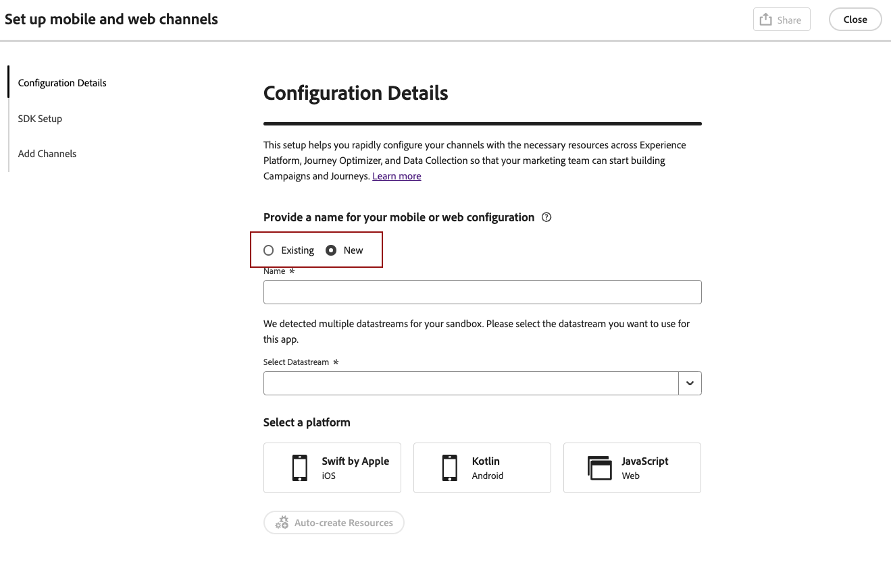
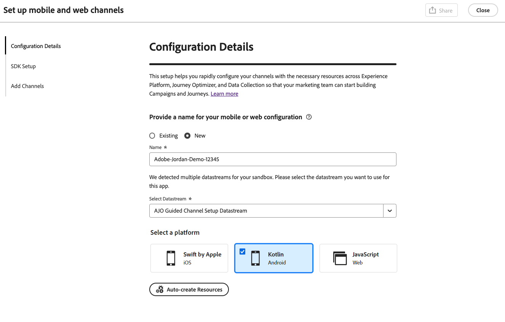
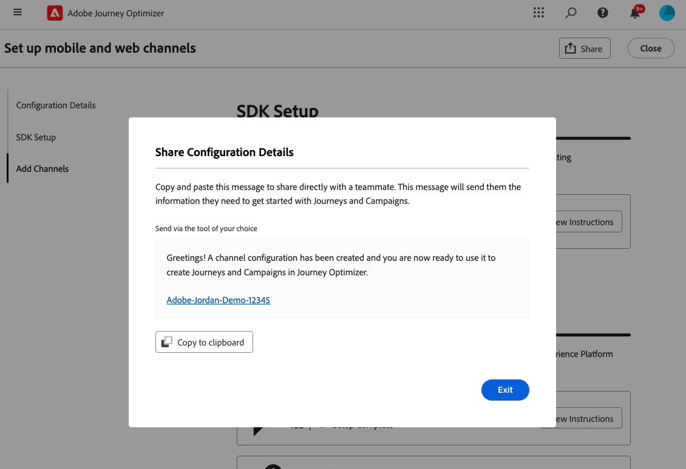
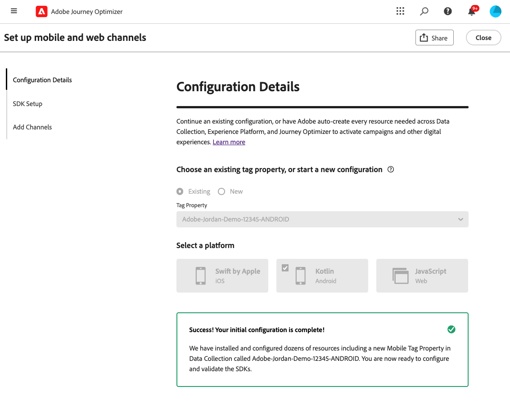

# Konfigurera Android mobilkonfiguration {#set-mobile-android}

>[!IMPORTANT]
>
>För att säkerställa kompatibilitet och optimala prestanda bör du använda följande SDK-versioner:
>
> * Core 3.1.0 eller senare
> * Meddelanden 3.1.0 eller senare

Denna Android-installation effektiviserar den snabba konfigurationen av marknadsföringskanaler och ser till att alla nödvändiga resurser är lättillgängliga i apparna Experience Platform, Journey Optimizer och Data Collection. På så sätt kan marknadsföringsteamet snabbt börja skapa kampanjer och resor.

## Skapa en ny Android-konfiguration {#new-setup-android}

1. På Journey Optimizer hemsida klickar du på **[!UICONTROL Begin]** från **[!UICONTROL Set up mobile and web channels]**-kortet.

   

1. Skapa en **[!UICONTROL New]**-konfiguration.

   Om du redan har befintliga konfigurationer kan du välja en eller skapa en ny konfiguration.

   

1. Ange **[!UICONTROL Name]** som ny konfiguration och välj eller skapa **[!UICONTROL Datastream]**. **[!UICONTROL Name]** kommer att användas för alla automatiskt skapade resurser.

1. Om din organisation har flera datastreams väljer du ett av de befintliga alternativen. Om du inte har någon dataström skapas en automatiskt.

1. Välj den Android-plattform som du vill konfigurera och klicka på **[!UICONTROL Auto-create resources]**.

   

1. För att effektivisera installationsprocessen skapas de resurser som behövs automatiskt så att du kan komma igång. Detta inkluderar skapande av en ny **[!UICONTROL Mobile Tag Property]** och installation av tillägg.

   Nedan finns en omfattande lista över alla resurser som genereras automatiskt:

+++ Skapade resurser

   <table>
    <thead>
    <tr>
    <th><strong>Lösning</strong></th>
    <th><strong>Automatiskt skapade resurser</strong></th>
    </tr>
    </thead>
    <tbody>
    <tr>
    <td>
    
Journey Optimizer

    </td>
    <td>
    <ul>
    <li>Kanalkonfiguration</li>
    <li>Push-referens (endast push-meddelanden för mobilen)</li>
    </ul>
    </td>
    </tr>
    <tr>
    <td>
    
Taggar

    </td>
    <td>
    <ul>
    <li>Egenskapen Mobile-tagg</li>
    <li>Regler</li>
    <li>Dataelement</li>
    <li>Bibliotek</li>
    <li>Miljö (staging, produktion, utveckling)</li>
    </ul>
    </td>
    </tr>
    <tr>
    <td>
    
Tagg Extensions

    </td>
    <td>
    <ul>
    <li>Adobe Experience Platform Edge Network</li>
    <li>Adobe Journey Optimizer</li>
    <li>AEP Assurance</li>
    <li>Godkännande (med standardprinciper för samtycke aktiverat)</li>
    <li>Identitet (med standard-ECID, med standardregler för sammanfogning)</li>
    <li>Mobile Core</li>
    </ul>
    </td>
    </tr>
    <tr>
    <td>
    
Säkerhet

    </td>
    <td>
    
Assurance-session

    </td>
    </tr>
    <tr>
    <td>
    
Dataströmmar

    </td>
    <td>
    
Datastream med tjänster

    </td>
    </tr>
    <tr>
    <td>
    
Experience Platform

    </td>
    <td>
    <ul>
    <li>Datauppsättning</li>
    <li>Schema</li>
    </ul>
    </td>
    </tr>
    </tbody>
    </table>

+++

1. När resursgenereringen är klar klickar du på **[!UICONTROL Set up]** för att börja konfigurera SDK:n.

   

1. Du måste först lägga till och importera beroenden enligt beskrivningen i användargränssnittet. [Läs mer](https://experienceleague.adobe.com/en/docs/platform-learn/implement-mobile-sdk/app-implementation/install-sdks).

1. Kopiera och klistra in följande kod i programmets onCreate()-metod.

1. Om du vill validera ditt SDK direkt i ditt mobilprogram öppnar du bara ditt mobilprogram och tillåter åtkomst till [Adobe Assurance](https://experienceleague.adobe.com/en/docs/experience-platform/assurance/home). Assurance är ett kraftfullt verktyg som gör att du kan testa och validera implementeringen noggrant och se till att allt fungerar som det ska.

   När enheten är ansluten identifieras den automatiskt och visas i listrutan **[!UICONTROL Available Device]**, vilket gör att du kan övervaka och felsöka konfigurationen i realtid.

   

1. Klicka på **[!UICONTROL Connect]**.

1. Du kan nu konfigurera dina [In-app](#inapp-channel)- och/eller [push](#push-channel)-kanaler.

1. När du är klar med konfigurationen delar du den automatiskt genererade **[!UICONTROL Channel Configuration]** med teammedlemmarna som ansvarar för att skapa resor och kampanjer.

   Det ska finnas referenser till **[!UICONTROL Channel Configuration]** i gränssnittet Campaigns eller Journeys, vilket möjliggör en smidig koppling mellan konfigurationen och körningen av riktade resor och kampanjer för er målgrupp.

   

## Ändra en befintlig konfiguration {#reconnect}

När du har skapat konfigurationen kan du enkelt gå tillbaka till den när som helst och lägga till ytterligare kanaler eller göra ytterligare justeringar som passar dina behov

1. På Journey Optimizer hemsida klickar du på **[!UICONTROL Begin]** från **[!UICONTROL Set up mobile and web channels]**-kortet.

   

1. Välj **[!UICONTROL Existing]** och välj din befintliga **[!UICONTROL Tag property]** i listrutan.

   

1. När du använder din befintliga konfiguration måste du återansluta till Adobe Assurance. Klicka på **[!UICONTROL Reconnect]** på menyn SDK-inställningar.

1. Välj din enhet i listrutan **[!UICONTROL Available devices]** och klicka på **[!UICONTROL Connect]**.

1. Du kan nu uppdatera konfigurationen efter behov.

## Konfigurera kanal i appen {#inapp-channel}

<!--
>[!CONTEXTUALHELP]
>id="ajo_mobile_web_setup_inapp_tag_property"
>title="Choose your tag property"
>abstract="TBC"
-->

Kanalen i appen kräver ingen ytterligare konfiguration. För att verifiera att konfigurationen är korrekt kan du enkelt skicka ett testmeddelande med hjälp av funktionen Säkerhet. Detta ger omedelbar feedback om systemets beredskap att leverera meddelanden i appen effektivt.

Klicka bara på **[!UICONTROL Display In-app message]** om du vill göra det.

För att effektivisera installationsprocessen skapas de resurser som behövs automatiskt så att du kan komma igång. Detta innefattar att skapa en kanalkonfiguration.

Du kan nu skicka meddelanden i appen med den tidigare konfigurerade **[!UICONTROL Channel Configuration]**. [Lär dig hur du skapar meddelanden i appen](../in-app/create-in-app.md)

## Konfigurera push-kanal {#push-channel}

>[!CONTEXTUALHELP]
>id="ajo_mobile_web_setup_push_token"
>title="Hämta enhetstoken"
>abstract="För att säkerställa att enhetens push-token är korrekt synkroniserad med din Adobe Experience Platform-profil måste du inkludera följande kod i ditt program. Den här integreringen är nödvändig för att upprätthålla aktuella kommunikationsfunktioner och säkerställa en smidig användarupplevelse."

>[!CONTEXTUALHELP]
>id="ajo_mobile_web_setup_push_xcode"
>title="Starta programmet från Xcode"
>abstract="Starta programmet med Xcode om du vill hämta din push-token. När programmet har startats startar du om det för att kontrollera att valideringsprocessen har slutförts. Adobe kommer sedan att tillhandahålla din push-token som en del av valideringsresultaten. Denna token är väsentlig för att aktivera push-meddelanden och kommer att visas när konfigurationen har validerats."

>[!CONTEXTUALHELP]
>id="ajo_mobile_web_push_certificate_fcm"
>title="Ange ett push-certifikat"
>abstract="Dra och släpp .json-filen för privat nyckel. Den här filen innehåller autentiseringsinformation som krävs för säker integrering och kommunikation mellan programmet och servern."

1. När din mobila SDK har konfigurerats klickar du på **[!UICONTROL Add]** på push-meddelandekortet.

1. Hämta enhetstoken genom att infoga angiven kod i callback-funktionen `FireBaseMessaging.getInstance.getToken ()` i användargränssnittet.

1. Registrera meddelandetjänsten genom att lägga till den angivna koden i användargränssnittet i `AndroidManifest.xml`-filen.

1. Dra och släpp .json-filen för privat nyckel.

1. För att verifiera att konfigurationen är korrekt kan du enkelt skicka ett testmeddelande med hjälp av funktionen Säkerhet. Detta ger omedelbar feedback på systemets beredskap att leverera push-meddelanden effektivt.

   Klicka bara på **[!UICONTROL Send push message]** om du vill göra det.

För att effektivisera installationsprocessen skapas de resurser som behövs automatiskt så att du kan komma igång. Detta inkluderar skapande av en **[!UICONTROL Channel Configuration]** och **[!UICONTROL Push Credential]**.

Du kan nu skicka push-meddelanden med den tidigare konfigurerade **[!UICONTROL Channel Configuration]**. [Lär dig skapa push-meddelanden](../push/create-push.md)
