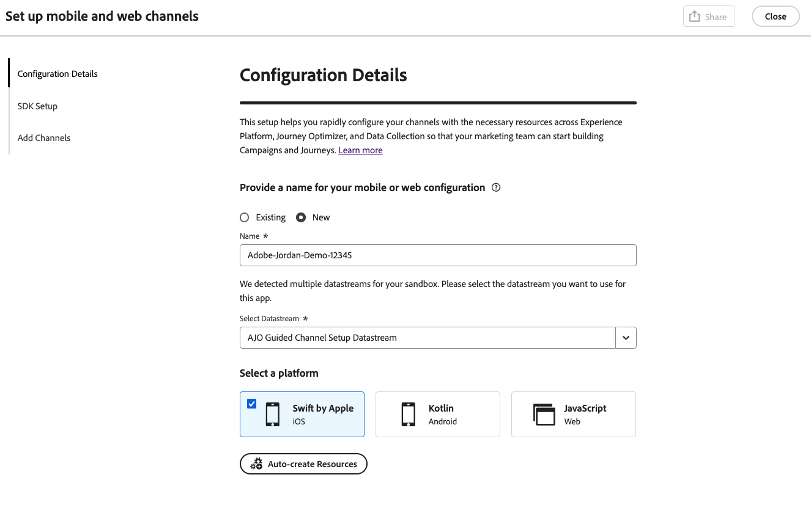
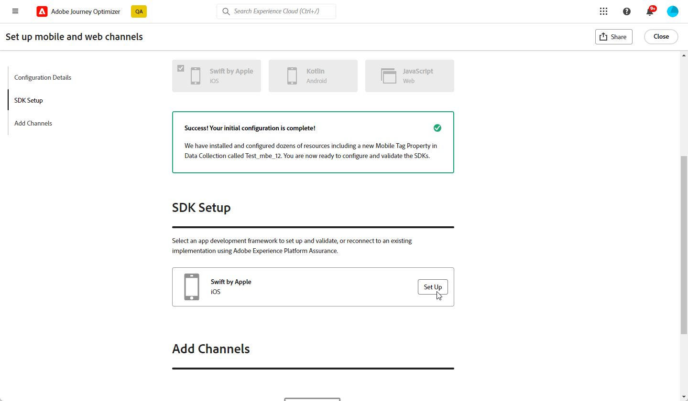
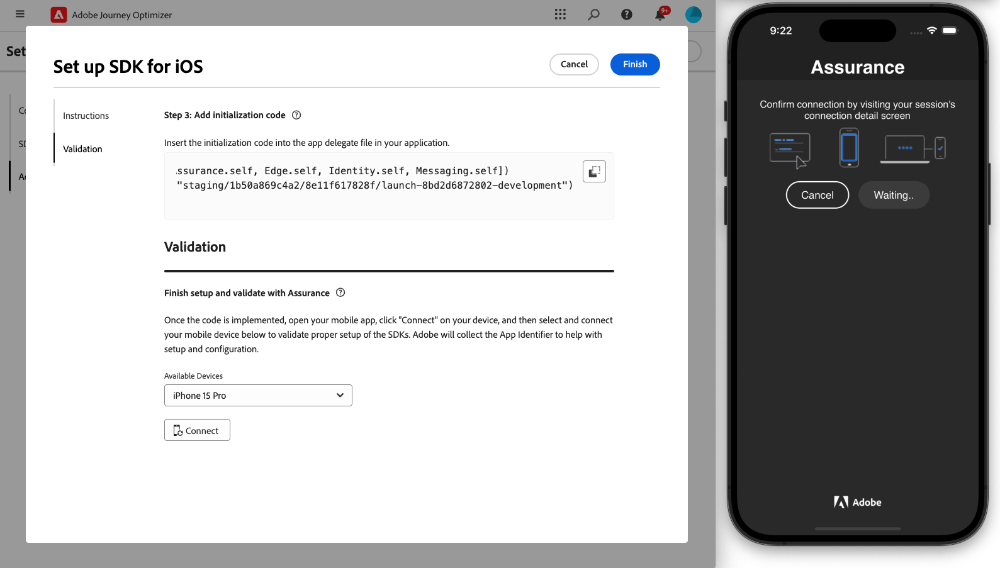
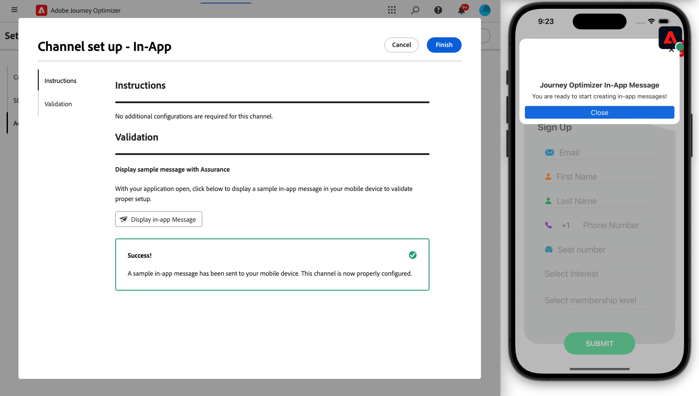

# Konfigurera iOS mobilkonfiguration {#set-mobile-ios}

>[!IMPORTANT]
>
>För att säkerställa kompatibilitet och optimala prestanda bör du använda följande SDK-versioner:
>
> * Core SDK: 5.2.0 eller senare
> * SDK för meddelanden: 5.1.1 eller senare

Den här iOS-installationen förenklar den snabba konfigurationen av marknadsföringskanaler och gör alla viktiga resurser tillgängliga i apparna Experience Platform, Journey Optimizer och Data Collection. På så sätt kan marknadsföringsteamet snabbt börja skapa kampanjer och resor.

## Skapa en ny iOS-konfiguration {#new-setup-ios}

>[!CONTEXTUALHELP]
>id="ajo_mobile_web_setup_swift_dependencies_add"
>title="Lägg till beroenden"
>abstract="I Xcode lägger du till paketet Assurance för att inspektera, verifiera, simulera och validera datainsamling och upplevelser i din app. Lägg också till AEP Messaging för att skicka push-meddelandetokens och klickbar feedback till Adobe Experience Platform."
>additional-url="https://experienceleague.adobe.com/en/docs/platform-learn/implement-mobile-sdk/app-implementation/install-sdks#swift-package-manager" text="Se dokumentationen för datainsamling"

>[!CONTEXTUALHELP]
>id="ajo_mobile_web_setup_swift_initialization_code"
>title="Lägg till initieringskod"
>abstract="TBC"

>[!CONTEXTUALHELP]
>id="ajo_mobile_web_setup_swift_dependencies_import"
>title="Importera beroenden"
>abstract="I programmets **AppDelegate**-klass importerar du följande beroenden: AEPCore, AEPAssurance, AEPEdge, AEPEdgeIdentity och AEPMessaging."
>additional-url="https://experienceleague.adobe.com/en/docs/platform-learn/implement-mobile-sdk/app-implementation/install-sdks#import-extensions" text="Se dokumentationen för datainsamling"

1. På Journey Optimizer hemsida klickar du på **[!UICONTROL Begin]** från **[!UICONTROL Set up mobile and web channels]**-kortet.

   

1. Skapa en **[!UICONTROL New]**-konfiguration.

   Om du redan har befintliga konfigurationer kan du välja en eller skapa en ny konfiguration.

   

1. Ange **[!UICONTROL Name]** som ny konfiguration och välj eller skapa **[!UICONTROL Datastream]**. **[!UICONTROL Name]** kommer att användas för alla automatiskt skapade resurser.

1. Om din organisation har flera datastreams väljer du ett av de befintliga alternativen. Om du inte har någon dataström skapas en automatiskt.

1. Markera iOS-plattformen och klicka på **[!UICONTROL Auto-create resources]**.

   

1. För att effektivisera installationsprocessen skapas de resurser som behövs automatiskt så att du kan komma igång. Detta inkluderar skapande av en ny **[!UICONTROL Mobile Tag Property]** och installation av tillägg.

   Nedan finns en omfattande lista över alla resurser som genereras automatiskt:

+++ Skapade resurser

   <table>
    <thead>
    <tr>
    <th><strong>Lösning</strong></th>
    <th><strong>Automatiskt skapade resurser</strong></th>
    </tr>
    </thead>
    <tbody>
    <tr>
    <td>
    <p>Journey Optimizer</p>
    </td>
    <td>
    <ul>
    <li>Kanalkonfiguration</li>
    <li>Push-referens (endast push-meddelanden för mobilen)</li>
    </ul>
    </td>
    </tr>
    <tr>
    <td>
    <p>Taggar</p>
    </td>
    <td>
    <ul>
    <li>Egenskapen Mobile-tagg</li>
    <li>Regler</li>
    <li>Dataelement</li>
    <li>Bibliotek</li>
    <li>Miljö (staging, produktion, utveckling)</li>
    </ul>
    </td>
    </tr>
    <tr>
    <td>
    <p>Tagg Extensions</p>
    </td>
    <td>
    <ul>
    <li>Adobe Experience Platform Edge Network</li>
    <li>Adobe Journey Optimizer</li>
    <li>AEP Assurance</li>
    <li>Godkännande (med standardprinciper för samtycke aktiverat)</li>
    <li>Identitet (med standard-ECID, med standardregler för sammanfogning)</li>
    <li>Mobile Core</li>
    </ul>
    </td>
    </tr>
    <tr>
    <td>
    <p>Säkerhet</p>
    </td>
    <td>
    <p>Assurance-session</p>
    </td>
    </tr>
    <tr>
    <td>
    <p>Dataströmmar</p>
    </td>
    <td>
    <p>Datastream med tjänster</p>
    </td>
    </tr>
    <tr>
    <td>
    <p>Experience Platform</p>
    </td>
    <td>
    <ul>
    <li>Datauppsättning</li>
    <li>Schema</li>
    </ul>
    </td>
    </tr>
    </tbody>
    </table>

+++

1. När resursgenereringen är klar klickar du på **[!UICONTROL Set up]** för att börja konfigurera SDK:n.

   

1. Du måste först lägga till och importera beroenden enligt beskrivningen i användargränssnittet. [Läs mer](https://experienceleague.adobe.com/en/docs/platform-learn/implement-mobile-sdk/app-implementation/install-sdks).

1. Infoga initieringskoden i programmets `onCreate()`-metod. Med den här testkoden kan du ansluta till Assurance och validera appkonfigurationen innan du går till produktion.

   {zoomable="yes"}

1. Om du vill validera ditt SDK direkt i ditt mobilprogram öppnar du bara ditt mobilprogram och tillåter åtkomst till [Adobe Assurance](https://experienceleague.adobe.com/en/docs/experience-platform/assurance/home). Assurance är ett kraftfullt verktyg som gör att du kan testa och validera implementeringen noggrant och se till att allt fungerar som det ska.

   När enheten är ansluten identifieras den automatiskt och visas i listrutan **[!UICONTROL Available Device]**, vilket gör att du kan övervaka och felsöka konfigurationen i realtid.

   {zoomable="yes"}

1. Klicka på **[!UICONTROL Connect]**.

   {zoomable="yes"}

1. Du kan nu konfigurera dina [In-app](#inapp-channel)- och/eller [push](#push-channel)-kanaler.

1. När du är klar med konfigurationen delar du den automatiskt genererade **[!UICONTROL Channel Configuration]** med teammedlemmarna som ansvarar för att skapa resor och kampanjer.

   Det ska finnas referenser till **[!UICONTROL Channel Configuration]** i gränssnittet Campaigns eller Journeys, vilket möjliggör en smidig koppling mellan konfigurationen och körningen av riktade resor och kampanjer för er målgrupp.

   {zoomable="yes"}

## Ändra en befintlig konfiguration {#reconnect}

När du har skapat konfigurationen kan du enkelt gå tillbaka till den när som helst och lägga till ytterligare kanaler eller göra ytterligare justeringar som passar dina behov

1. På Journey Optimizer hemsida klickar du på **[!UICONTROL Begin]** från **[!UICONTROL Set up mobile and web channels]**-kortet.

   

1. Välj **[!UICONTROL Existing]** och välj din befintliga **[!UICONTROL Tag property]** i listrutan.

   

1. När du använder din befintliga konfiguration måste du återansluta till Adobe Assurance. Klicka på **[!UICONTROL Reconnect]** på menyn SDK-inställningar.

   

1. Välj din enhet i listrutan **[!UICONTROL Available devices]** och klicka på **[!UICONTROL Connect]**.

   {zoomable="yes"}

1. Du kan nu uppdatera konfigurationen efter behov.

## Konfigurera kanal i appen {#inapp-channel}

Kanalen i appen kräver ingen ytterligare konfiguration. För att verifiera att konfigurationen är korrekt kan du enkelt skicka ett testmeddelande med hjälp av funktionen Säkerhet. Detta ger omedelbar feedback om systemets beredskap att leverera meddelanden i appen effektivt.

Klicka bara på **[!UICONTROL Display In-app message]** om du vill göra det.

{zoomable="yes"}

För att effektivisera installationsprocessen skapas de resurser som behövs automatiskt så att du kan komma igång. Detta innefattar att skapa en kanalkonfiguration.

Du kan nu skicka meddelanden i appen med den tidigare konfigurerade **[!UICONTROL Channel Configuration]**. [Lär dig hur du skapar meddelanden i appen](../in-app/create-in-app.md)

## Konfigurera push-kanal {#push-channel}

>[!CONTEXTUALHELP]
>id="ajo_mobile_web_setup_push_certificate"
>title="Ange ett push-certifikat"
>abstract="Nyckelfilen .p8 innehåller en privat nyckel som används för att autentisera din app med Apple-servrar för säkra push-meddelanden. Du kan hämta den här nyckeln från sidan Certifikat, Identifierare och Profiler på ditt utvecklarkonto."

>[!CONTEXTUALHELP]
>id="ajo_mobile_web_setup_push_key_id"
>title="Nyckel-ID"
>abstract="Nyckel-ID, en sträng på 10 tecken som tilldelats när autentiseringsnyckeln p8 skapades, finns på fliken **Tangenter** på sidan Certifikat, Identifierare och Profiler i ditt utvecklarkonto."

>[!CONTEXTUALHELP]
>id="ajo_mobile_web_setup_push_team_id"
>title="Team-ID"
>abstract="Team-ID:t, som är ett strängvärde som används för att identifiera ditt team, finns på fliken **Medlemskap** i ditt utvecklarkonto."

1. När din mobila SDK har konfigurerats klickar du på **[!UICONTROL Add]** på push-meddelandekortet.

1. Lägg först till följande kod i metoden `didRegisterForRemoteNotificationsWithDeviceToken` för din `AppDelegate` för att synkronisera enhetens push-token med din Adobe Experience Platform-profil.

   ```
   MobileCore.setPushIdentifier(deviceToken)
   ```

1. Dra och släpp .p8-filen Apple Push Notification Authentication Key. Nyckeln kan hämtas från sidan Certifikat, Identifierare och profiler.

1. Ange följande information:

   * Nyckel-ID: en sträng på 10 tecken som tilldelats när autentiseringsnyckeln p8 skapades. Den finns på fliken Nycklar på sidan Certifikat, Identifierare och profiler.

   * Team-ID: Ett strängvärde som finns på fliken Medlemskap.

   {zoomable="yes"}

1. För att verifiera att konfigurationen är korrekt kan du enkelt skicka ett testmeddelande med hjälp av funktionen Säkerhet. Detta ger omedelbar feedback på systemets beredskap att leverera push-meddelanden effektivt.

   Klicka bara på **[!UICONTROL Send push message]** om du vill göra det.

   {zoomable="yes"}

För att effektivisera installationsprocessen skapas de resurser som behövs automatiskt så att du kan komma igång. Detta inkluderar skapande av en **[!UICONTROL Channel Configuration]** och **[!UICONTROL Push Credential]**.

Du kan nu skicka push-meddelanden med den tidigare konfigurerade **[!UICONTROL Channel Configuration]**. [Lär dig skapa push-meddelanden](../push/create-push.md)
