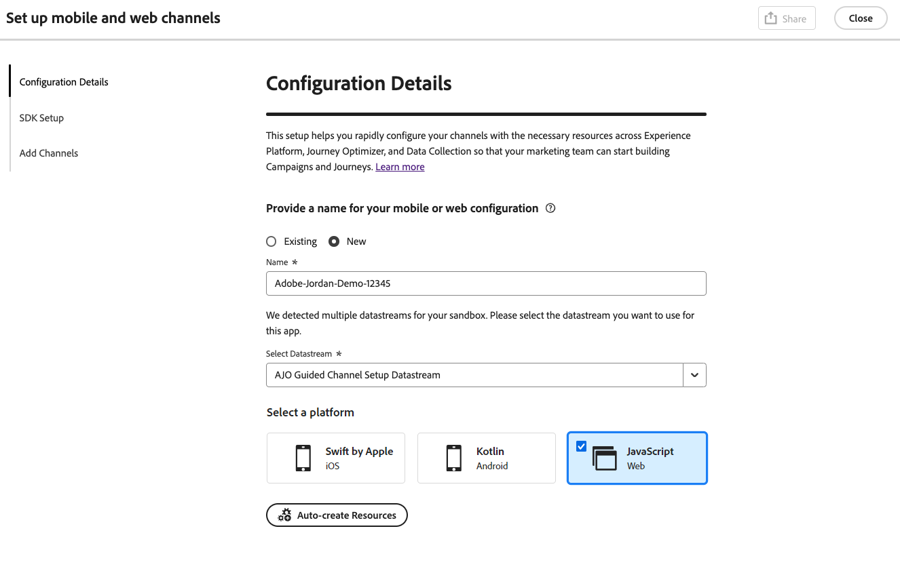
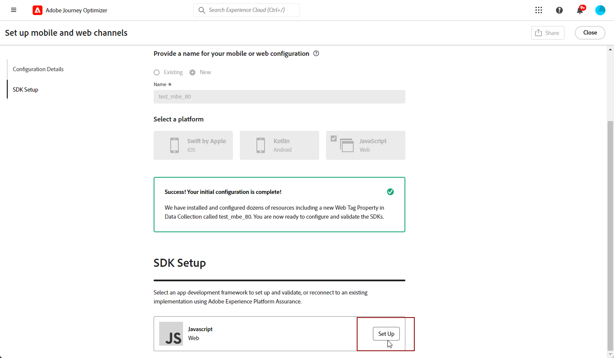
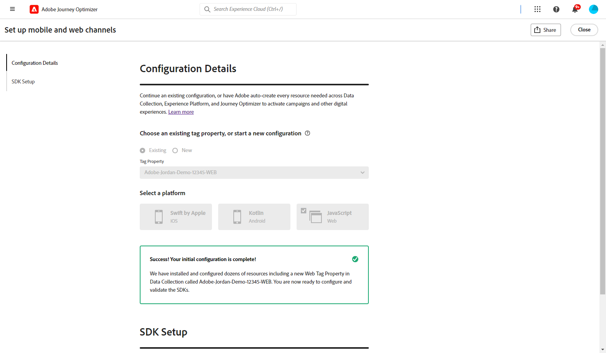

# Konfigurera webbkonfiguration {#set-mobile-web}

>[!CONTEXTUALHELP]
>id="ajo_mobile_web_setup_javascript_code"
>title="Javascript-kod"
>abstract="TBC"

>[!CONTEXTUALHELP]
>id="ajo_mobile_web_setup_javascript_site"
>title="Starta webbplatsen och validera"
>abstract="TBC"

Denna installation underlättar snabb konfigurering av marknadsföringskanaler och säkerställer att alla nödvändiga resurser finns tillgängliga i Experience Platform, Journey Optimizer och Data Collection. På så sätt kan marknadsföringsteamet omedelbart börja med att skapa kampanjer och resor.

## Skapa en ny webbkonfiguration {#new-setup}

1. På Journey Optimizer hemsida klickar du på **[!UICONTROL Begin]** från **[!UICONTROL Set up mobile and web channels]**-kortet.

   

1. Skapa en **[!UICONTROL New]**-konfiguration.

   Om du redan har befintliga konfigurationer kan du välja en eller skapa en ny konfiguration.

   

1. Ange **[!UICONTROL Name]** som ny konfiguration och välj eller skapa **[!UICONTROL Datastream]**. **[!UICONTROL Name]** kommer att användas för alla automatiskt skapade resurser.

1. Om din organisation har flera datastreams väljer du ett av de befintliga alternativen. Om du inte har någon dataström skapas en automatiskt.

1. Välj webbplattformen och klicka på **[!UICONTROL Auto-create resources]**.

   

1. För att effektivisera installationsprocessen skapas de resurser som behövs automatiskt så att du kan komma igång.

   Nedan finns en omfattande lista över alla resurser som genereras automatiskt:

+++ Skapade resurser

   <table>
    <thead>
    <tr>
    <th><strong>Lösning</strong></th>
    <th><strong>Automatiskt skapade resurser</strong></th>
    </tr>
    </thead>
    <tbody>
    <tr>
    </tr>
    <tr>
    <td>
    
Taggar

    </td>
    <td>
    <ul>
    <li>Egenskapen Mobile-tagg</li>
    <li>Regler</li>
    <li>Dataelement</li>
    <li>Bibliotek</li>
    <li>Miljö (staging, produktion, utveckling)</li>
    </ul>
    </td>
    </tr>
    <tr>
    <td>
    
Tagg Extensions

    </td>
    <td>
    <ul>
    <li>Adobe Experience Platform Edge Network</li>
    <li>Adobe Journey Optimizer</li>
    <li>AEP Assurance</li>
    <li>Godkännande (med standardprinciper för samtycke aktiverat)</li>
    <li>Identitet (med standard-ECID, med standardregler för sammanfogning)</li>
    <li>Mobile Core</li>
    </ul>
    </td>
    </tr>
    <tr>
    <td>
    
Säkerhet

    </td>
    <td>
    
Assurance-session

    </td>
    </tr>
    <tr>
    <td>
    
Dataströmmar

    </td>
    <td>
    
Datastream med tjänster

    </td>
    </tr>
    <tr>
    <td>
    
Experience Platform

    </td>
    <td>
    <ul>
    <li>Datauppsättning</li>
    <li>Schema</li>
    </ul>
    </td>
    </tr>
    </tbody>
    </table>

+++

1. När resursgenereringen är klar klickar du på **[!UICONTROL Set up]** för att börja konfigurera SDK:n.

   

1. Klistra in koden som visas på skärmen i taggen `<head>` i dokumentet.

   {zoomable="yes"}

1. Klistra in din bas-URL för att validera din SDK direkt i ditt mobilprogram.

   {zoomable="yes"}

1. Välj **[!UICONTROL Launch site & validate]** om du vill ansluta till webbplatsen.

   {zoomable="yes"}

1. När du är klar med konfigurationen delar du den automatiskt genererade **[!UICONTROL Mobile Web Property]** med teammedlemmarna som ansvarar för att skapa resor och kampanjer.

   Det ska finnas referenser till **[!UICONTROL Mobile Web Property]** i gränssnittet Campaigns eller Journeys, vilket möjliggör en smidig koppling mellan konfigurationen och körningen av riktade resor och kampanjer för er målgrupp.

   

Du kan nu skapa webbsidor med den tidigare konfigurerade **[!UICONTROL Mobile Web Property]**. [Lär dig hur du skapar en webbsida](../web/create-web.md)

## Ändra en befintlig konfiguration {#reconnect}

När du har skapat konfigurationen kan du enkelt gå tillbaka till den när som helst och lägga till ytterligare kanaler eller göra ytterligare justeringar som passar dina behov

1. På Journey Optimizer hemsida klickar du på **[!UICONTROL Begin]** från **[!UICONTROL Set up mobile and web channels]**-kortet.

   

1. Välj **[!UICONTROL Existing]** och välj din befintliga **[!UICONTROL Tag property]** i listrutan.

   

1. Du kan nu uppdatera konfigurationen efter behov.
